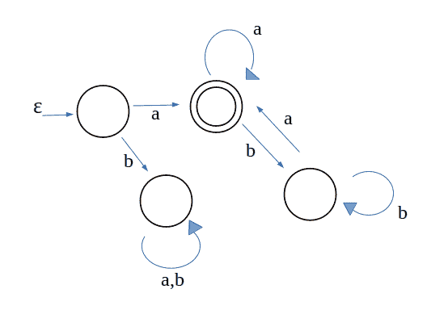

# 构建以输入(a，b)

中的‘a’开始和结束的 DFA 的程序

> 原文:[https://www . geesforgeks . org/program-build-DFA-starts-end-input-b/](https://www.geeksforgeeks.org/program-build-dfa-starts-end-input-b/)

**DFA(确定性有限自动机或接受者)**是接受或拒绝符号串的有限状态机。如果字符串达到最终状态，DFA 接受它，否则拒绝它。
现在的问题是，提供一个字符串作为输入字符，我们必须检查该字符串是否以“a”开头和结尾。我们只能存储当前字符，因为没有内存的概念，因此 DFA 不能存储提供的字符串。否则，我们可以检查这个问题的第一个和最后一个字符。这个问题的输入集是(a，b)。
我们不能存储任何接受当前字符的东西，这使得这个程序比其他字符串相关的问题有点不同和棘手。

示例:

```
Input :  a b a b a
Output : Yes
Explanation : (a b a b a) starts and 
end with 'a'

Input :  a b a b b
Output : No
Explanation : (a b a b b) starts with 
'a' but doesn't end with 'a'   
```

我们首先针对这个问题构建一个 DFA。制作 DFA 就像为这个程序制作流程图，然后用任何语言实现。你应该有 DFA 和有限自动机的知识。

给定问题的 DFA 是:



## C++

```
// C++ Program to DFA that accept strings
// which starts and end with 'a' over input(a, b)
#include <iostream>
#include <time.h>
using namespace std;

int main()
{
    // for producing different random
    // numbers every time.
    srand(time(0));

    // random length of string from 1 - 16
    // we are taking input from input stream,
    // we can take delimiter to end the string
    int max = 1 + rand() % 15;

    // generating random string and processing it
    int i = 0;
    while (i < max) {

        // producing random character over
        // input alphabet (a, b)
        char c = 'a' + rand() % 2;
        cout << c << " ";
        i++;

        // first character is 'a'
        if (c == 'a') {

            // if there is only 1 character
            // i.e. 'a'
            if (i == max)
                cout << "YES\n";

            while (i < max) {
                c = 'a' + rand() % 2;
                cout << c << " ";
                i++;

                // if character is 'a' and it
                // is the last character
                if (c == 'a' && i == max) {
                    cout << "\nYES\n";
                }

                // if character is 'b' and it
                // is the last character
                else if (i == max) {
                    cout << "\nNO\n";
                }
            }
        }

        // first character is 'b' so no matter
        // what the string is, it is not going
        // to be accepted
        else {
            while (i < max) {
                c = 'a' + rand() % 2;
                cout << c << " ";
                i++;
            }
            cout << "\nNO\n";
        }
    }

    return 0;
}
```

## Java 语言(一种计算机语言，尤用于创建网站)

```
// JAVA Program to DFA that accept Strings
// which starts and end with 'a' over input(a, b)
import java.util.*;

class GFG
{

public static void main(String[] args)
{
    // for producing different random
    // numbers every time.
    Random r = new Random();

    // random length of String from 1 - 16
    // we are taking input from input stream,
    // we can take delimiter to end the String
    int max = 1 + r.nextInt()*10 % 15;

    // generating random String and processing it
    int i = 0;
    while (i < max)
    {

        // producing random character over
        // input alphabet (a, b)
        char c = (char) ('a' + r.nextInt()*10 % 2);
        System.out.print(c+ " ");
        i++;

        // first character is 'a'
        if (c == 'a')
        {

            // if there is only 1 character
            // i.e. 'a'
            if (i == max)
                System.out.print("YES\n");

            while (i < max)
            {
                c = (char) ('a' + r.nextInt()*10 % 2);
                System.out.print(c+ " ");
                i++;

                // if character is 'a' and it
                // is the last character
                if (c == 'a' && i == max)
                {
                    System.out.print("\nYES\n");
                }

                // if character is 'b' and it
                // is the last character
                else if (i == max)
                {
                    System.out.print("\nNO\n");
                }
            }
        }

        // first character is 'b' so no matter
        // what the String is, it is not going
        // to be accepted
        else
        {
            while (i < max)
            {
                c = (char) ('a' + r.nextInt()*10 % 2);
                System.out.print(c+ " ");
                i++;
            }
            System.out.print("\nNO\n");
        }
    }
}
}

// This code is contributed by PrinciRaj1992
```

## C#

```
// C# Program to DFA that accept Strings
// which starts and end with 'a' over i.Add(a, b)
using System;

class GFG
{

static void Main(String[] args)
{

    // random length of String from 1 - 16
    // we are taking input from input stream,
    // we can take delimiter to end the String
    int max = 1 + new Random().Next()*10 % 15;

    // generating random String and processing it
    int i = 0;
    while (i < max)
    {

        // producing random character over
        // input alphabet (a, b)
        char c = (char) ('a' + new Random().Next()*10 % 2);
        Console.Write(c + " ");
        i++;

        // first character is 'a'
        if (c == 'a')
        {

            // if there is only 1 character
            // i.e. 'a'
            if (i == max)
                Console.Write("YES\n");

            while (i < max)
            {
                c = (char) ('a' + new Random().Next()*10 % 2);
                Console.Write(c + " ");
                i++;

                // if character is 'a' and it
                // is the last character
                if (c == 'a' && i == max)
                {
                    Console.Write("\nYES\n");
                }

                // if character is 'b' and it
                // is the last character
                else if (i == max)
                {
                    Console.Write("\nNO\n");
                }
            }
        }

        // first character is 'b' so no matter
        // what the String is, it is not going
        // to be accepted
        else
        {
            while (i < max)
            {
                c = (char) ('a' + new Random().Next()*10 % 2);
                Console.Write(c + " ");
                i++;
            }
            Console.Write("\nNO\n");
        }
    }
}
}

// This code is contributed by 29AjayKumar
```

## java 描述语言

```
<script>

// Javascript program to DFA that accept strings
// which starts and end with 'a' over input(a, b)

// Random length of String from 1 - 16
// we are taking input from input stream,
// we can take delimiter to end the String
let max = 1 + Math.floor(Math.random() * 10 % 15);

// Generating random String and processing it
let i = 0;
while (i < max)
{

    // Producing random character over
    // input alphabet (a, b)
    let c = String.fromCharCode(
        'a'.charCodeAt(0) +
        Math.floor(Math.random() * 10) % 2);

    document.write(c + " ");
    i++;

    // First character is 'a'
    if (c == 'a')
    {

        // If there is only 1 character
        // i.e. 'a'
        if (i == max)
            document.write("YES<br>");

        while (i < max)
        {
            c = String.fromCharCode(
                'a'.charCodeAt(0) + 
                Math.floor(Math.random() * 10) % 2);

            document.write(c + " ");
            i++;

            // If character is 'a' and it
            // is the last character
            if (c == 'a' && i == max)
            {
                document.write("<br>YES<br>");
            }

            // If character is 'b' and it
            // is the last character
            else if (i == max)
            {
                document.write("<br>NO<br>");
            }
        }
    }

    // First character is 'b' so no matter
    // what the String is, it is not going
    // to be accepted
    else
    {
        while (i < max)
        {
            c = String.fromCharCode(
                'a'.charCodeAt(0) + 
                Math.floor(Math.random() * 10) % 2);

            document.write(c + " ");
            i++;
        }
        document.write("<br>NO<br>");
    }
}

// This code is contributed by rag2127

</script>
```

**输出:**

```
a a b a a 
YES
```