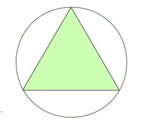

# 计算等边三角形外接圆面积的程序

> 原文:[https://www . geesforgeks . org/program-compute-area-外接圆-等边三角形/](https://www.geeksforgeeks.org/program-calculate-area-circumcircle-equilateral-triangle/)

给定等边三角形的边长。我们需要写一个程序来求给定等边三角形外接圆的面积。
示例:

```
Input : side = 6
Output : Area of circumscribed circle is: 37.69

Input : side = 9
Output : Area of circumscribed circle is: 84.82 
```

等边三角形的三条边都等长，三个内角都是 60 度。
**外接圆的属性如下:**

*   外接圆的中心是等边三角形的中点相交的点。
*   等边三角形的外接圆是由等边三角形的三个顶点构成的。
*   等边三角形外接圆的半径等于(a / √3)，其中‘a’是等边三角形边的长度。

下图显示了一个有外接圆的等边三角形:



外接圆面积的计算公式为:

```
(π*a<sup>2)/3</sup>
```

其中 **a** 是给定等边三角形边的长度。

**这个公式是如何工作的？**

我们知道[圆的面积](https://www.geeksforgeeks.org/c-program-find-area-circle/) = π*r <sup>2</sup> ，其中 r 是给定圆的半径。
我们还知道等边三角形的外接圆半径=(等边三角形的边)/ √3。
因此面积= π*r <sup>2</sup> = π*a <sup>2</sup> /3。

## C++

```
// C++ program to find the area of Circumscribed
// circle of equilateral triangle
#include <iostream>
#include <math.h>
const double pi = 3.14159265358979323846;

using namespace std;

// function to calculate the area of circumcircle
// of equilateral triangle
float area_circumscribed(float a)
{
    return (a * a * (pi / 3));
}
// Driver code
int main()
{
    float a, Area;
    a = 6;

    // function calling
    Area = area_circumscribed(a);
    // displaying the area
    cout << "Area of CircumCircle :" << Area;
    return 0;
}
```

## C

```
// C program to find the area of Circumscribed
// circle of equilateral triangle
#include <stdio.h>
#define PI 3.14159265

// function to find area of
// circumscribed circle
float area_circumscribed(float a)
{
    return (a * a * (PI / 3));
}

// Driver code
int main()
{
    float a = 6;
    printf("Area of circumscribed circle is :%f",
            area_circumscribed(a));
    return 0;
}
```

## Java 语言(一种计算机语言，尤用于创建网站)

```
// Java code to find the area of circumscribed
// circle of equilateral triangle
import java.lang.*;

class GFG {

    static double PI = 3.14159265;

    // function to find the area of
    // circumscribed circle
    public static double area_cicumscribed(double a)
    {
        return (a * a * (PI / 3));
    }

    // Driver code
    public static void main(String[] args)
    {
        double a = 6.0;
        System.out.println("Area of circumscribed circle is :"
                            + area_cicumscribed(a));
    }
}
```

## 蟒蛇 3

```
# Python3 code to find the area of circumscribed
# circle of equilateral triangle
PI = 3.14159265

# Function to find the area of
# circumscribed circle
def area_cicumscribed(a):
    return (a * a * (PI / 3))

# Driver code
a = 6.0
print("Area of circumscribed circle is :%f"
                        %area_cicumscribed(a))

# This code is contributed by Anant Agarwal.
```

## C#

```
// C# code to find the area of
// circumscribed circle
// of equilateral triangle
using System;

class GFG {
    static double PI = 3.14159265;

    // function to find the area of
    // circumscribed circle
    public static double area_cicumscribed(double a)
    {
        return (a * a * (PI / 3));
    }

    // Driver code
    public static void Main()
    {
        double a = 6.0;
        Console.Write("Area of circumscribed circle is :" +
                       area_cicumscribed(a));
    }
}

// This code is contributed by nitin mittal.
```

## 服务器端编程语言（Professional Hypertext Preprocessor 的缩写）

```
<?php
// PHP program to find the
// area of Circumscribed
// circle of equilateral triangle
$PI = 3.14159265;

// function to find area of
// circumscribed circle
function area_circumscribed($a)
{
    global $PI;
    return ($a * $a * ($PI / 3));
}

// Driver code
$a = 6;
echo("Area of circumscribed circle is :");
echo(area_circumscribed($a));

// This code is contributed by Ajit.
?>
```

## java 描述语言

```
<script>

// javascript program to find the area of Circumscribed
// circle of equilateral triangle

let pi = 3.14159265358979323846;

// function to calculate the area of circumcircle
// of equilateral triangle
function area_circumscribed( a)
{
    return (a * a * (pi / 3));
}
// Driver code

    let a, Area;
    a = 6;

    // function calling
    Area = area_circumscribed(a);
    // displaying the area
   document.write("Area of CircumCircle :" + Area.toFixed(7));

// This code is contributed by todaysgaurav

</script>
```

**Output:** 

```
Area of circumscribed circle is :37.6991118
```