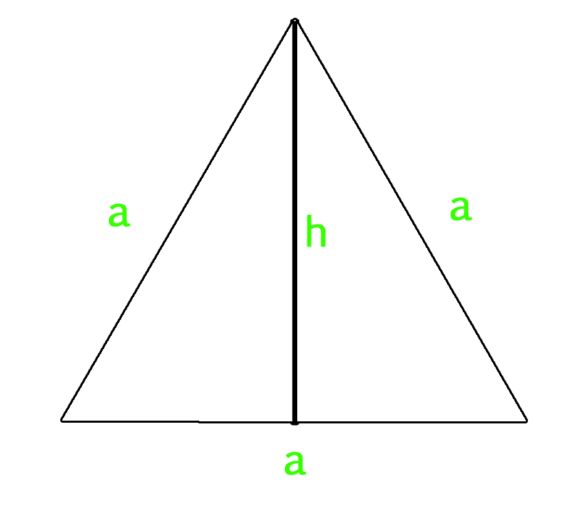

# 计算等边三角形面积和周长的程序

> 原文:[https://www . geesforgeks . org/program-compute-area-周长-等边三角形/](https://www.geeksforgeeks.org/program-calculate-area-perimeter-equilateral-triangle/)

等边三角形是三条边和角度都相等的三角形。等边三角形的三个内角都是 60 度。

**Area of Equilateral triangle :**

*   如果我们知道等边三角形每条边的长度，那么我们就可以用下面提到的公式来计算等边三角形的面积。

    ```
    Area of Equilateral Triangle = (sqrt(3)/4) * a * a    
    ```

    *   If we know the length of altitude of equilateral triangle along with the length of side, then we can use below mentioned formula to calculate it’s area.

    ```
    Area of Equilateral Triangle = (1/2) x Side x Altitude
    ```

    **等边三角形周长:**

    ```
    Perimeter of Equilateral Triangle :  3 X a
    ```

    **面积公式是如何工作的？**
    我们来看看下图。我们知道三角形的 1/2 *底*高。h 的值为 sqrt(a<sup>2</sup>–(a/2)<sup>2</sup>)= sqrt(3)* a/2。所以面积变成了 1/2 * a *(sqrt(3)* a/2)=(sqrt(3)/4)* a * a
    

    **示例:**

    ```
    Input : side = 4
    Output : Area of Equilateral Triangle: 6.9282
             Perimeter of Equilateral Triangle: 12

    Input : side = 12
    Output : Area of Equilateral Triangle: 62.3538
             Perimeter of Equilateral Triangle: 36

    ```

    ## C++

    ```
    // CPP program to find area
    // and perimeter of equilateral triangle
    #include <bits/stdc++.h>
    using namespace std;

    // Function to calculate Area 
    // of equilateral triangle
    float area_equi_triangle(float side)
    {
        return sqrt(3) / 4 * side * side;
    }

    // Function to calculate Perimeter 
    // of equilateral triangle
    float peri_equi_triangle(float side)
    {
        return 3 * side;
    }

    // Driver Code
    int main()
    {
        float side = 4;
        cout << "Area of Equilateral Triangle: "
             << area_equi_triangle(side) << endl;
        cout << "Perimeter of Equilateral Triangle: "
             << peri_equi_triangle(side);
        return 0;
    }
    ```

    ## Java 语言(一种计算机语言，尤用于创建网站)

    ```
    // Java Program to find area and
    // perimeter of equilateral triangle
    import java.io.*;

    class GFG 
    {
        // Function to calculate 
        // Area of equilateral triangle
        static float area_equi_triangle(float side)
        {

            return (float)(((Math.sqrt(3)) / 4) *
                             side * side);
        }

        // Function to calculate 
        // Perimeter of equilateral
        // triangle
        static float peri_equi_triangle(float side)
        {
            return 3 * side;
        }

        // Driver Code
        public static void main(String arg[])
        {
            float side = 4;
            System.out.print("Area of Equilateral Triangle:");
            System.out.println(area_equi_triangle(side));
            System.out.print("Perimeter of Equilateral Triangle:");
            System.out.println(peri_equi_triangle(side));
        }
    }

    // This code is contributed 
    // by Anant Agarwal.
    ```

    ## 计算机编程语言

    ```
    # Python3 program to calculate Area and 
    # Perimeter of equilateral Triangle

    # Importing Math library for sqrt
    from math import *

    # Function to calculate Area 
    # of equilateral triangle
    def area_equilateral( side ):
        area = (sqrt(3) / 4) * side * side
        print ("Area of Equilateral Triangle: % f"% area)

    # Function to calculate Perimeter
    # of equilateral triangle 
    def perimeter( side ):
        perimeter = 3 * side
        print ("Perimeter of Equilateral Triangle: % f"% perimeter)

    # Driver code
    side = 4
    area_equilateral( side )
    perimeter( side )
    ```

    ## C#

    ```
    // C# Program to find area and
    // perimeter of equilateral triangle
    using System;

    class GFG 
    {
        // Function to calculate 
        // Area of equilateral triangle
        static float area_equi_triangle(float side)
        {

            return (float)(((Math.Sqrt(3)) / 4) * 
                             side * side);
        }

        // Function to calculate 
        // Perimeter of equilateral
        // triangle
        static float peri_equi_triangle(float side)
        {
            return 3 * side;
        }

        // Driver Code
        public static void Main()
        {
            float side = 4;
            Console.Write("Area of Equilateral Triangle:");
            Console.WriteLine(area_equi_triangle(side));
            Console.Write("Perimeter of Equilateral Triangle:");
            Console.WriteLine(peri_equi_triangle(side));
        }
    }

    // This code is contributed 
    // by vt_m.
    ```

    ## 服务器端编程语言（Professional Hypertext Preprocessor 的缩写）

    ```
    <?php
    // PHP program to find area
    // and perimeter of equilateral triangle

    // Function to calculate Area 
    // of equilateral  triangle
    function area_equi_triangle( $side)
    {
        return sqrt(3) / 4 * $side * $side;
    }

    // Function to calculate Perimeter 
    // of equilateral  triangle
    function peri_equi_triangle( $side)
    {
        return 3 * $side;
    }

    // Driver Code

    $side = 4;
    echo("Area of Equilateral Triangle: ");
    echo(area_equi_triangle($side));
    echo("\n");
    echo("Perimeter of Equilateral Triangle: ");
    echo( peri_equi_triangle($side));

    // This code is contributed 
    // by vt_m.
    ?>
    ```

    **Output :**

    ```
    Area of Equilateral Triangle: 6.9282
    Perimeter of Equilateral Triangle: 12
    ```