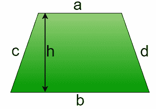

# 梯形面积和周长计算程序

> 原文:[https://www . geesforgeks . org/program-calculate-area-周长-梯形/](https://www.geeksforgeeks.org/program-calculate-area-perimeter-trapezium/)

梯形是至少有一对平行边的四边形，其他两边可能不平行。平行的边称为梯形的底部，另外两边称为它的腿。平行边之间的垂直距离称为梯形的高度。



**公式:**

```
Area of Trapezium : 0.5 * (a + b) * h
Perimeter of Trapezium : a + b + c + d
```

示例:

```
Input :  a = 5, b = 6, c = 4, d = 3, h = 8
Output : Area of Trapezium : 44
         Perimeter of Trapezium : 18

Input :  a = 10, b = 15, c = 14, d = 11, h = 21
Output : Area of Trapezium: 262.5
         Perimeter of Trapezium: 50
```

下面是上面公式的实现:

## C++

```
// CPP program to find area
// and perimeter of trapezium
#include <bits/stdc++.h>
using namespace std;

// Function to calculate Area of trapezium
float areaTrapezium(float a, float b, float h)
{
    return (1.0 / 2 * (a + b) * h);
}

// Function to calculate perimeter of trapezium
float perimeterTrapezium(float a, float b, float c,
                                           float d)
{
    return (a + b + c + d);
}

// Driver function
int main()
{
    float a = 5, b = 15, c = 11, d = 4, h = 20;
    cout << "Area of Trapezium = " <<
                areaTrapezium(a, b, h) << endl;
    cout << "Perimeter of Trapezium = " <<
                perimeterTrapezium(a, b, c, d);
    return 0;
}
```

## Java 语言(一种计算机语言，尤用于创建网站)

```
// Java program to calculate area
// and perimeter  of Trapezium

public class GFG {

    // Function to calculate area of Trapezium
    public static float areaTrapezium (float a,
                                float b, float h)
    {
        return ((a + b) * h) / 2;
    }

    // Function to perimeter of Trapezium
    public static float perimeterTrapezium (float a,
                            float b, float c, float d)
    {
        return (a + b + c + d);
    }

// Driver function
public static void main(String args[])
{

    // a, b, c, d are four sides of Trapezium
    // and h is height between two parallel sides.
    float a = 5;
    float b = 15;
    float c = 11;
    float d = 4;
    float h = 20;

    // Printing value of  area.
    System.out.print("Area Of Trapezium : ");
    System.out.println(areaTrapezium (a, b, h));

    // Printing value of  Perimeter.
    System.out.print("Perimeter Of Trapezium : ");
    System.out.println(perimeterTrapezium (a, b, c, d));
}

}

// This code is contributed by "akanshgupta"
```

## 蟒蛇 3

```
# Python3 code to find area
# and perimeter of trapezium

# Function to calculate
# Area of trapezium
def areaTrapezium (a, b, h):
    return (1.0 / 2 * (a + b) * h)

# Function to calculate
# perimeter of trapezium
def perimeterTrapezium (a, b, c, d):
    return (a + b + c + d)

# Driver function
a = 5
b = 15
c = 11
d = 4
h = 20
print("Area of Trapezium =",
      areaTrapezium(a, b, h))

print("Perimeter of Trapezium =",
      perimeterTrapezium(a, b, c, d))

# This code is contributed by "Sharad_Bhardwaj"
```

## C#

```
// C# program to calculate area
// and perimeter of Trapezium
using System;

class GFG {

    // Function to calculate area of Trapezium
    public static float areaTrapezium (float a,
                                 float b, float h)
    {
        return ((a + b) * h) / 2;
    }

    // Function to perimeter of Trapezium
    public static float perimeterTrapezium (float a,
                            float b, float c, float d)
    {
        return (a + b + c + d);
    }

    // Driver function
    public static void Main()
    {

        // a, b, c, d are four sides of Trapezium
        // and h is height between two parallel sides.
        float a = 5;
        float b = 15;
        float c = 11;
        float d = 4;
        float h = 20;

        // Printing value of area.
        Console.Write("Area Of Trapezium : ");
        Console.WriteLine(areaTrapezium (a, b, h));

        // Printing value of Perimeter.
        Console.Write("Perimeter Of Trapezium : ");
        Console.WriteLine(perimeterTrapezium (a, b, c, d));
    }

}

// This code is contributed by "vt_m"
```

## 服务器端编程语言（Professional Hypertext Preprocessor 的缩写）

```
<?php
// PHP program to find area
// and perimeter of trapezium

// Function to calculate
// Area of trapezium
function areaTrapezium($a, $b, $h)
{
    return (1.0 / 2 * ($a + $b) * $h);
}

// Function to calculate
// perimeter of trapezium
function perimeterTrapezium($a, $b,
                            $c, $d)
{
    return ($a + $b + $c + $d);
}

// Driver Code
$a = 5; $b = 15;$c = 11;
$d = 4; $h = 20;
echo ("Area of Trapezium = ");
echo(areaTrapezium($a, $b, $h));
echo("\n");
echo( "Perimeter of Trapezium = ");
echo(perimeterTrapezium($a, $b, $c, $d));

// This code is contributed by vt_m.
?>
```

## java 描述语言

```
<script>

// Javascript program to find area
// and perimeter of trapezium

// Function to calculate Area of trapezium
function areaTrapezium(a, b, h)
{
    return (1.0 / 2 * (a + b) * h);
}

// Function to calculate perimeter of trapezium
function perimeterTrapezium(a, b, c, d)
{
    return (a + b + c + d);
}

// Driver function
var a = 5, b = 15, c = 11, d = 4, h = 20;
document.write("Area of Trapezium = " + areaTrapezium(a, b, h)+"<br>");
document.write("Perimeter of Trapezium = " + perimeterTrapezium(a, b, c, d));

</script>
```

**输出:**

```
Area of Trapezium = 200
Perimeter of Trapezium = 35
```