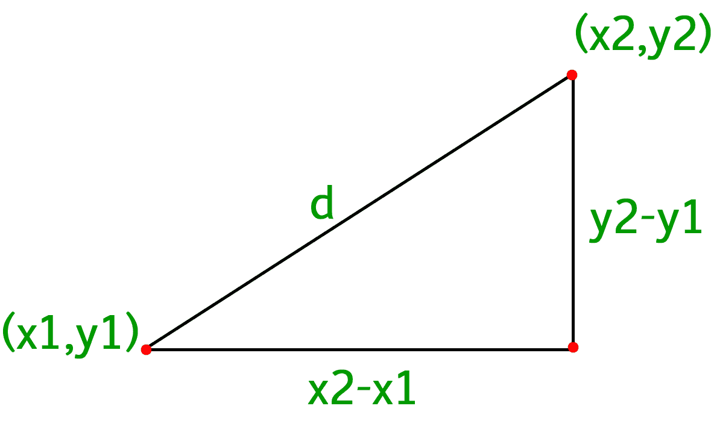

# 计算两点间距离的程序

> 原文:[https://www . geesforgeks . org/program-calculate-distance-two-points/](https://www.geeksforgeeks.org/program-calculate-distance-two-points/)

给你一个二维图形的两个坐标(x1，y1)和(x2，y2)。找出它们之间的距离。
示例:

```
Input : x1, y1 = (3, 4)
        x2, y2 = (7, 7)
Output : 5

Input : x1, y1 = (3, 4) 
        x2, y2 = (4, 3)
Output : 1.41421
```

我们将使用从毕达哥拉斯定理导出的距离公式。两点(x1，y1)和(x2，y2)之间的距离公式为
距离= 
简单应用[毕达哥拉斯定理](https://en.wikipedia.org/wiki/Pythagorean_theorem)
即可得到上述公式



以下是上述想法的实现。

## C++

```
#include <bits/stdc++.h>
using namespace std;

// Function to calculate distance
float distance(int x1, int y1, int x2, int y2)
{
    // Calculating distance
    return sqrt(pow(x2 - x1, 2) +
                pow(y2 - y1, 2) * 1.0);
}

// Drivers Code
int main()
{
    cout << distance(3, 4, 4, 3);
    return 0;
}
```

## Java 语言(一种计算机语言，尤用于创建网站)

```
// Java code to compute distance

class GFG
{
    // Function to calculate distance
static double distance(int x1, int y1, int x2, int y2)
{
    // Calculating distance
    return Math.sqrt(Math.pow(x2 - x1, 2) +
                Math.pow(y2 - y1, 2) * 1.0);
}
    //Driver code
    public static void main (String[] args)
    {
        System.out.println(Math.round(distance(3, 4, 4, 3)*100000.0)/100000.0);
    }
}

// This code is contributed by
// Anant Agarwal.
```

## 蟒蛇 3

```
# Python3 program to calculate
# distance between two points

import math

# Function to calculate distance
def distance(x1 , y1 , x2 , y2):

    # Calculating distance
    return math.sqrt(math.pow(x2 - x1, 2) +
                math.pow(y2 - y1, 2) * 1.0)

# Drivers Code
print("%.6f"%distance(3, 4, 4, 3))

# This code is contributed by "Sharad_Bhardwaj".
```

## C#

```
// C# code to compute distance
using System;

class GFG
{
    // Function to calculate distance
    static double distance(int x1, int y1, int x2, int y2)
    {
        // Calculating distance
        return Math.Sqrt(Math.Pow(x2 - x1, 2) +
                      Math.Pow(y2 - y1, 2) * 1.0);
    }

    // Driver code
    public static void Main ()
    {
        Console.WriteLine(Math.Round(distance(3, 4, 4, 3)
                                   * 100000.0)/100000.0);
    }
}

// This code is contributed by
// vt_m.
```

## 服务器端编程语言（Professional Hypertext Preprocessor 的缩写）

```
<?php
// PHP code to compute distance

// Function to calculate distance
function distance($x1, $y1, $x2, $y2)
{

    // Calculating distance
    return sqrt(pow($x2 - $x1, 2) +
                pow($y2 - $y1, 2) * 1.0);
}

// Driver Code
echo(distance(3, 4, 4, 3));

// This code is contributed by Ajit.
?>
```

## java 描述语言

```
<script>

// Function to calculate distance
function distance(x1, y1, x2,  y2)
{
    // Calculating distance
    return Math.sqrt(Math.pow(x2 - x1, 2) +
                Math.pow(y2 - y1, 2) * 1.0);
}

// Drivers Code
document.write(distance(3, 4, 4, 3));

// This code is contributed by noob2000.
</script>
```

输出:

```
1.41421
```