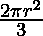

# 计算半球体积和表面积的程序

> 原文:[https://www . geesforgeks . org/program-compute-volume-surface-area-半球/](https://www.geeksforgeeks.org/program-calculate-volume-surface-area-hemisphere/)

计算半球的体积和表面积。
**半球:**
在几何学上，它是球体的精确的一半。我们可以找到许多现实生活中的半球例子，比如我们的星球地球可以分为两个半球南&北半球。


**半球的体积:**一个半球的体积无非是半球所占据的空间量。它也被定义为被半球边界包围的三维空间的量。
**表面积:**正好覆盖一个半球表面的平方单位数。
**表面积=** 
**体积=** 
例:

```
Input :  Radius = 7
Output : Volume = 718.378
         Surface Area = 307.876

Input :  Radius = 11
Output : Volume = 2787.64
         Surface Area = 760.265
```

## C++

```
// CPP Program to calculate volume and
// and surface area of a Hemisphere.
#include <bits/stdc++.h>
using namespace std;
// Initializing value of pi
#define pi 3.141592653589793

// Function to calculate volume
void volume(float r)
{
    float volume = float(2 * pi * pow(r, 3)) / float(3);
    cout << "Volume = " << volume << endl;
}
// Function to calculate surface area
void surface_area(float r)
{
    float s_area = 2 * pi * pow(r, 2);
    cout << "Surface Area = " << s_area << endl;
}

// Driver program
int main()
{
    float r = 11;
    volume(r);
    surface_area(r);
    return 0;
}
```

## Java 语言(一种计算机语言，尤用于创建网站)

```
// Java Program to calculate volume and
// and surface area of a Hemisphere.
import java.util.*;
import java.lang.*;

public class GfG{

    // Initializing value of pi
    private static final float pi = (float) 3.141592653589793;

    // Function to calculate volume
    public static void volume(float r)
    {
        float volume = (float)(2 * pi *(float) Math.pow(r, 3))
                                                    / (float)(3);
        System.out.println("Volume = " + volume);
    }
    // Function to calculate surface area
    public static void surface_area(float r)
    {
        float s_area = (float)2 * pi * (float)Math.pow(r, 2);
        System.out.println("Surface Area = " + s_area);
    }

    // Driver function
    public static void main(String argc[]){
        float r = 11;
        volume(r);
        surface_area(r);
    }

}
/* This code is contributed by Sagar Shukla */
```

## 计算机编程语言

```
# Python code Program to calculate volume and
# and surface area of a Hemisphere.
import math

# Function to calculate volume
def volume(r):
    volume = 2 * math.pi * math.pow(r, 3) / 3
    print("Volume = ", '%.4f' %volume)

# Function to calculate surface area
def surface_area(r):
    s_area = 2 * math.pi * math.pow(r, 2)
    print("Surface Area = ", '%.4f' %s_area)

# Driver code
r = 11
volume(r)
surface_area(r)
```

## C#

```
// C# Program to calculate volume and
// and surface area of a Hemisphere.
using System;

public class GfG{

    // Initializing value of pi
    private static float pi = (float) 3.141592653589793;

    // Function to calculate volume
    public static void volume(float r)
    {
        float volume = (float)(2 * pi *(float) Math.Pow(r, 3))
                                                / (float)(3);
        Console.WriteLine("Volume = " + volume);
    }

    // Function to calculate surface area
    public static void surface_area(float r)
    {
        float s_area = (float)2 * pi * (float)Math.Pow(r, 2);
        Console.WriteLine("Surface Area = " + s_area);
    }

    // Driver function
    public static void Main()
    {
        float r = 11;
        volume(r);
        surface_area(r);
    }

}

/* This code is contributed by vt_m */
```

## 服务器端编程语言（Professional Hypertext Preprocessor 的缩写）

```
<?php
// PHP Program to calculate volume and
// and surface area of a Hemisphere.

// Initializing value of pi &
// Function to calculate volume
function volume($r)
{
    $pi =3.141592653589793;
    $volume = (2 * $pi *
               pow($r, 3)) /(3);
    echo("Volume = " );
    echo($volume);
    echo("\n");
}

// Function to calculate
// surface area
function surface_area($r)
{
    $pi = 3.141592653589793;
    $s_area = 2 * $pi * pow($r, 2);
    echo( "Surface Area = ");
    echo($s_area) ;
}

// Driver code
$r = 11;
volume($r);
surface_area($r);

// This code is contributed by vt_m
?>
```

## java 描述语言

```
<script>
// javascript Program to calculate volume and
// and surface area of a Hemisphere.

// Initializing value of pi
const pi = 3.141592653589793;

// Function to calculate volume
function volume(r)
{
    let volume = (2 * pi * Math.pow(r, 3)) / (3);
     document.write("Volume = " + volume.toFixed(2)+ "<br/>");
}

// Function to calculate surface area
function surface_area(r)
{
    let s_area = 2 * pi * Math.pow(r, 2);
     document.write("Surface Area = " + s_area.toFixed(3) +"<br/>");
}

// Driver program
   let r = 11;
    volume(r);
    surface_area(r);

// This code is contributed by aashish1995

</script>
```

**Output**

```
Volume = 2787.64
Surface Area = 760.265
```