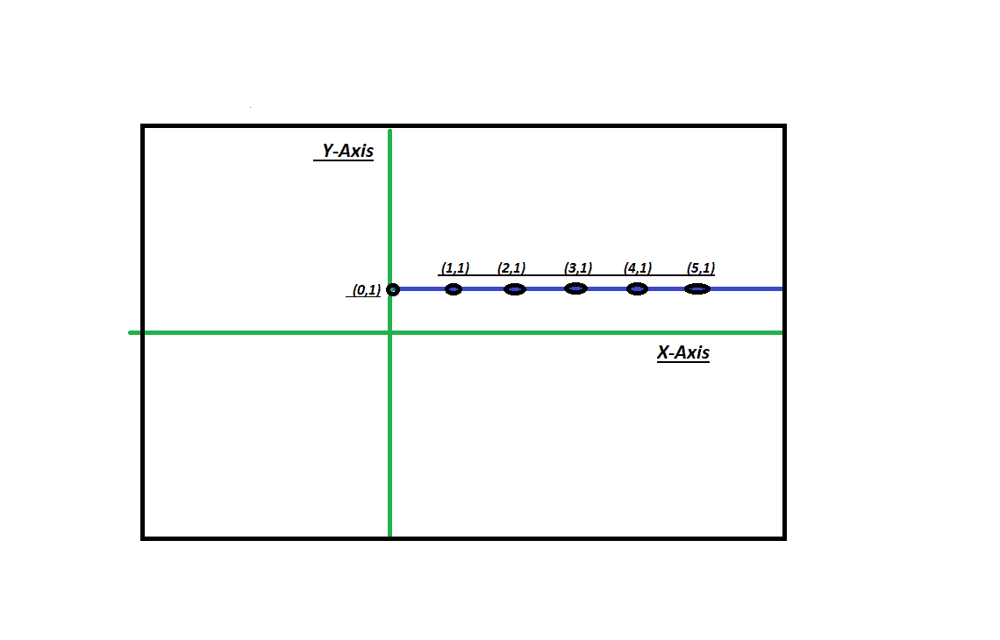

# 程序检查点是平行于 X 轴还是 Y 轴

> 原文:[https://www . geesforgeks . org/program-check-points-parallel-x 轴-y 轴/](https://www.geeksforgeeks.org/program-check-points-parallel-x-axis-y-axis/)

给定 n 个点，我们需要检查这 n 个点是平行于 X 轴还是 Y 轴，或者是平行于无轴。

**示例:**

```
Input : x[] = {0, 0, 0, 0, 0|
        y[] = {9, 2, 1, 3, 4}
Output : Parallel to Y Axis

Input : x[] = {1, 2, 3|
        y[] = {9, 2, 1}
Output : Not Parallel to X or Y Axis
```

**接近**

> 要找到平行于 X 轴或 Y 轴的点，只需检查任意轴上的点是否相同。如果 X 轴上的所有点都相同，那么这条线平行于 Y 轴。如果 Y 轴上的所有点都相同，那么直线平行于 X 轴。如果这些情况都不成立，那么它就不平行于任何轴。
> 输入数值 n，然后在
> 中输入点的数值



## C++

```
// CPP program to check for parallel
// to X and Y Axis
#include <bits/stdc++.h>
using namespace std;

// To check for parallel line
void parallel(int n, int a[][2])
{
    bool x = true, y = true;

    // checking for parallel to X and Y
    // axis condition
    for (int i = 0; i < n - 1; i++) {
        if (a[i][0] != a[i + 1][0])
            x = false;
        if (a[i][1] != a[i + 1][1])
            y = false;
    }

    // To display the output
    if (x)
        cout << "parallel to Y Axis" << endl;
    else if (y)
        cout << "parallel to X Axis" << endl;
    else
        cout << "Not parallel to X"
             << " and Y Axis" << endl;
}

// Driver's Code
int main()
{
    int a[][2] = { { 1, 2 },
                   { 1, 4 },
                   { 1, 6 },
                   { 1, 0 } };

    int n = sizeof(a) / sizeof(a[0]);
    parallel(n, a);
    return 0;
}
```

## Java 语言(一种计算机语言，尤用于创建网站)

```
// Java program to illustrate..
// To check for parallel
// To X and Y Axis

import java.io.*;
import java.util.*;

class GFG {

    // To check for parallel line
    static void parallel(int a[][])
    {
        boolean x = true, y = true;

        // checking for parallel to X and Y
        // axis condition
        for (int i = 0; i < a.length - 1; i++) {
            if (a[i][0] != a[i + 1][0])
                x = false;
            if (a[i][1] != a[i + 1][1])
                y = false;
        }

        // To display the output
        if (x)
            System.out.println("Parallel to Y Axis");
        else if (y)
            System.out.println("Parallel to X Axis");
        else
            System.out.println("Not parallel to X"
                               + " and Y axis");
    }

    public static void main(String[] args)
    {
        int a[][] = { { 1, 2 },
                      { 1, 4 },
                      { 1, 6 },
                      { 1, 0 } };
        parallel(a);
    }
}
```

## 蟒蛇 3

```
# Python3 program to check for parallel
# to X and Y Axis

# To check for parallel line
def parallel(n, a):
    x = True;
    y = True;

    # checking for parallel
    # to X and Y axis condition
    for i in range(n - 1):
            if (a[i][0] != a[i + 1][0]):
                x = False;
            if (a[i][1] != a[i + 1][1]):
                y = False;

    # To display the output
    if (x):
        print("Parallel to Y Axis");
    elif (y):
        print("Parallel to X Axis");
    else:
        print("Not Parallel to X and Y Axis");

# Driver's Code
a = [[1, 2], [1, 4],
     [1, 6], [1, 0]];

n = len(a);
parallel(n, a);

# This code is contributed by mits
```

## C#

```
// C# program to illustrate..
// To check for parallel
// To X and Y Axis

class GFG {

    // To check for parallel line
    static void parallel(int[, ] a)
    {
        bool x = true, y = true;

        // checking for parallel to X and Y
        // axis condition
        for (int i = 0; i < a.Rank - 1; i++) {
            if (a[i, 0] != a[i + 1, 0])
                x = false;
            if (a[i, 1] != a[i + 1, 1])
                y = false;
        }

        // To display the output
        if (x)
            System.Console.WriteLine("Parallel to Y Axis");
        else if (y)
            System.Console.WriteLine("Parallel to X Axis");
        else
            System.Console.WriteLine("Not parallel to X"
                                     + " and Y axis");
    }

    public static void Main()
    {
        int[, ] a = { { 1, 2 },
                      { 1, 4 },
                      { 1, 6 },
                      { 1, 0 } };
        parallel(a);
    }
}
// This code is contributed by mits
```

## 服务器端编程语言（Professional Hypertext Preprocessor 的缩写）

```
<?php
// PHP program to check for parallel
// to X and Y Axis

// To check for parallel line
function parallel($n, $a)
{
    $x = true; $y = true;

    // checking for parallel
    // to X and Y axis condition
    for ($i = 0; $i < $n - 1; $i++)
    {
            if ($a[$i][0] != $a[$i + 1][0])
                $x = false;
            if ($a[$i][1] != $a[$i + 1][1])
                $y = false;
    }

    // To display the output
    if ($x)
        echo "parallel to Y Axis" ;
    else if (y)
        echo "parallel to X Axis" ;
    else
        echo "Not parallel to X", " and Y Axis";
}

    // Driver's Code
    $a = array(array(1, 2),
               array(1, 4),
               array(1, 6),
               array(1, 0));

    $n = count($a);
    parallel($n, $a);

//This code is contributed by anuj_67
?>
```

## java 描述语言

```
<script>

// Javascript program to check for parallel
// to X and Y Axis

// To check for parallel line
function parallel(n, a)
{
    let x = true, y = true;

    // Checking for parallel to X and Y
    // axis condition
    for(let i = 0; i < n - 1; i++)
    {
        if (a[i][0] != a[i + 1][0])
            x = false;
        if (a[i][1] != a[i + 1][1])
            y = false;
    }

    // To display the output
    if (x)
        document.write("parallel to Y Axis" + "</br>");
    else if (y)
        document.write("parallel to X Axis" + "</br>");
    else
        document.write("Not parallel to X" +
                       " and Y Axis" + "</br>");
}

// Driver code
let a = [ [ 1, 2 ],
          [ 1, 4 ],
          [ 1, 6 ],
          [ 1, 0 ] ];
let n = a.length;

parallel(n, a);

// This code is contributed by jana_sayantan

</script>
```

**Output:** 

```
Parallel to Y Axis
```