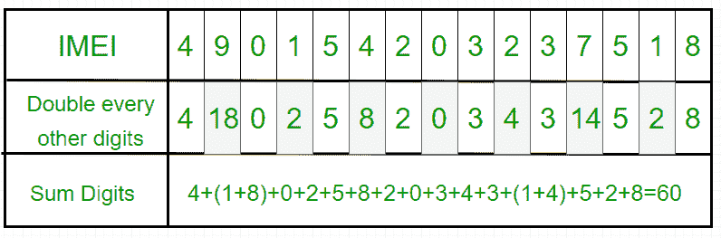

# 检查有效 IMEI 号码的程序

> 原文:[https://www . geesforgeks . org/program-check-valid-imei-number/](https://www.geeksforgeeks.org/program-check-valid-imei-number/)

**国际移动设备标识(IMEI)** 是一个数字，通常是唯一的，用来识别手机，以及一些卫星电话。它通常打印在手机的电池盒内，但也可以通过在拨号键盘上输入*#06#显示在大多数手机的屏幕上，或者在智能手机操作系统的设置菜单中与其他系统信息一起显示。全球移动通信系统网络使用 IMEI 号码来识别有效设备，因此可以用来阻止被盗电话访问该网络。
来源:[维基百科](https://en.wikipedia.org/wiki/International_Mobile_Equipment_Identity)
IMEI(15 位小数:14 位加一个校验位)包括设备的产地、型号和序列号等信息。
**IMEI 通过以下步骤验证:**

1.  从最右边的数字开始，每隔一个数字加倍(例如，7 变成 14)。
2.  如果一个数字的加倍导致两位数，即大于 9(如 7 × 2 = 14)，那么将乘积的位数相加(如 14: 1 + 4 = 5)，得到一个单位数。
3.  现在取所有数字的总和。
4.  检查总和是否能被 10 整除(即总模 10 等于 0)，则 IMEI 数有效；否则无效。

**示例:**

```
Input IMEI : 490154203237518
```



```
Output : Since, 60 is divisible by 10, hence the given IMEI number is Valid.
```

## C++

```
// C++ program to check whether the
// given EMEI number is valid or not.
#include<bits/stdc++.h>
using namespace std;

// Function for finding and returning
// sum of digits of a number
int sumDig(int n)
{
    int a = 0;
    while (n > 0)
    {
        a = a + n % 10;
        n = n / 10;
    }
    return a;
}

bool isValidIMEI(long n)
{

    // Converting the number into 
    // String for finding length
    string s = to_string(n);
    int len = s.length();

    if (len != 15)
        return false;

    int sum = 0;
    for(int i = len; i >= 1; i--)
    {
       int d = (int)(n % 10);

       // Doubling every alternate digit
       if (i % 2 == 0)
           d = 2 * d;

       // Finding sum of the digits
       sum += sumDig(d);
       n = n / 10;
    }

    return (sum % 10 == 0);
}

// Driver code
int main()
{
    // 15 digits cannot be stored
    // in 'int' data type
    long n = 490154203237518L;

    if (isValidIMEI(n))
        cout << "Valid IMEI Code";
    else
        cout << "Invalid IMEI Code";

    return 0;
}

// This code is contributed by Yash_R
```

## Java 语言(一种计算机语言，尤用于创建网站)

```
// Java program to check whether the
// given EMEI number is valid or not.
import java.io.*;
class IMEI
{
    // Function for finding and returning
    // sum of digits of a number
    static int sumDig(int n)
    {
        int a = 0;
        while (n > 0)
        {
            a = a + n % 10;
            n = n / 10;
        }
        return a;
    }

    static boolean isValidIMEI(long n)
    {
        // Converting the number into String
        // for finding length
        String s = Long.toString(n);
        int len = s.length();

        if (len != 15)
            return false;

        int sum = 0;
        for (int i = len; i >= 1; i--)
        {
            int d = (int)(n % 10);

            // Doubling every alternate digit
            if (i % 2 == 0)
                d = 2 * d;

            // Finding sum of the digits
            sum += sumDig(d);
            n = n / 10;
        }

        return (sum % 10 == 0);
    }

    // Driver code
    public static void main(String args[]) throws IOException
    {
        // 15 digits cannot be stored in 'int' data type
        long n = 490154203237518L;

        if (isValidIMEI(n))
            System.out.println("Valid IMEI Code");
        else
            System.out.println("Invalid IMEI Code");

    }
}
```

## 蟒蛇 3

```
# Python3 code to check whether the
# given EMEI number is valid or not

# Function for finding and returning
# sum of digits of a number
def sumDig( n ):
    a = 0
    while n > 0:
        a = a + n % 10
        n = int(n / 10)

    return a

# Returns True if n is valid EMEI
def isValidEMEI(n):

    # Converting the number into
    # Sting for finding length
    s = str(n)
    l = len(s)

    # If length is not 15 then IMEI is Invalid
    if l != 15:
        return False

    d = 0
    sum = 0
    for i in range(15, 0, -1):
        d = (int)(n % 10)
        if i % 2 == 0:

            # Doubling every alternate digit
            d = 2 * d

        # Finding sum of the digits
        sum = sum + sumDig(d)
        n = n / 10
    return (sum % 10 == 0)

# Driver code
n = 490154203237518
if isValidEMEI(n):
    print("Valid IMEI Code")
else:
    print("Invalid IMEI Code")

# This code is contributed by "Sharad_Bhardwaj".
```

## C#

```
// C# program to check whether the
// given EMEI number is valid or not.
using System;

class GFG {

    // Function for finding and
    // returning sum of digits
    // of a number
    static int sumDig(int n)
    {
        int a = 0;
        while (n > 0)
        {
            a = a + n % 10;
            n = n / 10;
        }

        return a;
    }

    static Boolean isValidIMEI(long n)
    {

        // Converting the number into
        // String for finding length
        String s = n.ToString();
        int len = s.Length;

        if (len != 15)
            return false;

        int sum = 0;
        for (int i = len; i >= 1; i--)
        {
            int d = (int)(n % 10);

            // Doubling every alternate
            // digit
            if (i % 2 == 0)
                d = 2 * d;

            // Finding sum of the digits
            sum += sumDig(d);
            n = n / 10;
        }

        return (sum % 10 == 0);
    }

    // Driver code
    public static void Main()
    {

        // 15 digits cannot be stored in
        // 'int' data type
        long n = 490154203237518L;

        if (isValidIMEI(n))
            Console.Write("Valid IMEI Code");
        else
            Console.Write("Invalid IMEI Code");

    }
}

// This code is contributed by parashar.
```

## java 描述语言

```
<script>
    // javascript program to check whether the
    // given EMEI number is valid or not.

    // Function for finding and returning
    // sum of digits of a number
    function sumDig(n)
    {
        let a = 0;
        while (n > 0)
        {
            a = a + n % 10;
            n = parseInt(n / 10, 10);
        }
        return a;
    }

    function isValidIMEI(n)
    {

        // Converting the number into
        // String for finding length
        let s = n.toString();
        let len = s.length;

        if (len != 15)
            return false;

        let sum = 0;
        for(let i = len; i >= 1; i--)
        {
          let d = (n % 10);

          // Doubling every alternate digit
          if (i % 2 == 0)
              d = 2 * d;

          // Finding sum of the digits
          sum += sumDig(d);
          n = parseInt(n / 10, 10);
        }

        return (sum % 10 == 0);
    }

    // 15 digits cannot be stored
    // in 'int' data type
    let n = 490154203237518;

    if (isValidIMEI(n))
        document.write("Valid IMEI Code");
    else
        document.write("Invalid IMEI Code");

// This code is contributed by vaibhavrabadiya117.
</script>
```

**输出:**

```
Valid IMEI Code 
```