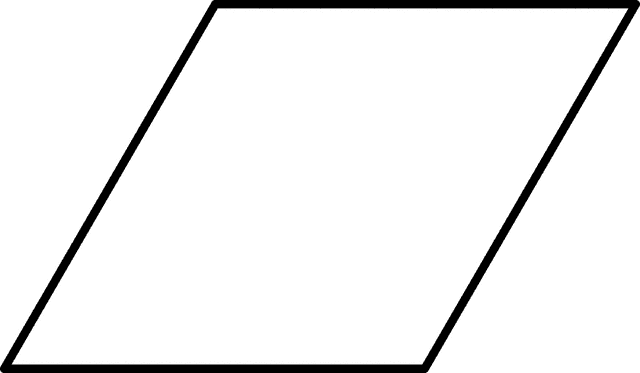

# 平行四边形周长程序

> 原文:[https://www . geesforgeks . org/program-周长-平行四边形/](https://www.geeksforgeeks.org/program-circumference-parallelogram/)

给定平行四边形的边，然后计算周长。
**例:**

```
Input: a = 10, b = 8
Output: 36.00

Input: a = 25.12, b = 20.4
Output: 91.04
```

平行四边形的对边长度相等且平行。角度成对相等，但不一定是 90 度。平行四边形的周长可以用两个相邻边之和乘以 2 来计算。



> 计算平行四边形周长的公式:
> (2*a)+(2*b)

## C++

```
// C Program to calculate the
// Circumference of a Parallelogram.
#include <stdio.h>

float circumferenceparallelogram(float a, float b)
{
    return ((2 * a) + (2 * b));
}

int main()
{
    float a = 10, b = 8;
    printf("Circumference of a given Parallelogram is : %.2f",
           circumferenceparallelogram(a, b));
    return 0;
}
```

## Java 语言(一种计算机语言，尤用于创建网站)

```
// Java Program To Calculate
// Circumference of a Parallelogram
import java.io.*;

class GFG
{
    static float circumferenceparallelogram(float a, float b)
    {
    return ((2 * a) + (2 * b));
    }

    // Driver code
    public static void main(String arg[])
    {
        float a = 10, b = 8;
        System.out.print("Circumference of a given Parallelogram is :");
        System.out.println(circumferenceparallelogram(a, b));
    }
}

// This code is contributed by Anant Agarwal.
```

## 蟒蛇 3

```
# Python3 Program to calculate the
# Circumference of a Parallelogram

# Utility Function
def circumferenceparallelogram(a,b):
    return ((2 * a) + (2 * b))

# Driver Function
a = 10
b = 8

print("Circumference of a given Parallelogram is :",
         round(circumferenceparallelogram(a, b),4))

# This code is contributed
# by Azkia Anam.
```

## C#

```
// C# Program To Calculate
// Circumference of a Parallelogram
using System;

class GFG
{
    static float circumferenceparallelogram(float a,
                                            float b)
    {
    return ((2 * a) + (2 * b));
    }

    // Driver code
    public static void Main()
    {
        float a = 10, b = 8;
        Console.Write("Circumference of a" +
                       "given Parallelogram is :");

        Console.Write(circumferenceparallelogram(a, b));
    }
}

// This code is contributed by vt_m.
```

## 服务器端编程语言（Professional Hypertext Preprocessor 的缩写）

```
<?php
// PHP Program to calculate
// the Circumference of a
// Parallelogram.

function circumferenceparallelogram( $a, $b)
{
    return ((2 * $a) + (2 * $b));
}

$a = 10; $b = 8;

echo "Circumference of a ".
     "given Parallelogram is : ",
     circumferenceparallelogram($a, $b);

// This code is contributed by anuuj_67.
?>
```

## java 描述语言

```
<script>

// Javascript Program to calculate the
// Circumference of a Parallelogram.
function circumferenceparallelogram(a, b)
{
    return ((2 * a) + (2 * b));
}

 // Driver code
let a = 10, b = 8;
document.write("Circumference of a given Parallelogram is : ",
        circumferenceparallelogram(a, b));

// This code is contributed by Manoj

</script>
```

**输出:**

```
Circumference of a given parallelogram is : 36.00
```