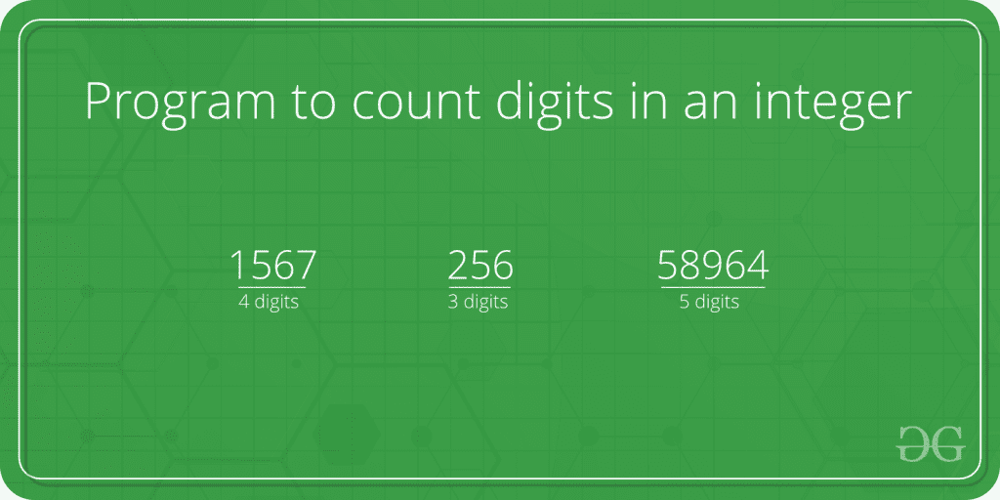

# 整数位数计数程序(4 种不同方法)

> 原文:[https://www . geesforgeks . org/program-count-digits-integer-3-differential-methods/](https://www.geeksforgeeks.org/program-count-digits-integer-3-different-methods/)

计算用户输入的长整数的位数。



**简单迭代解**
用户输入的整数存储在变量 n 中，然后 while 循环迭代，直到测试表达式 n！= 0 被评估为 0(假)。

1.  第一次迭代后，n 的值将为 345，计数将增加到 1。
2.  第二次迭代后，n 的值将为 34，计数增加到 2。
3.  第三次迭代后，n 的值将为 3，计数增加到 3。
4.  在第四次迭代开始时，n 的值将为 0，循环终止。

然后测试表达式被评估为假，循环终止。

## C++

```
// Iterative C++ program to count
// number of digits in a number
#include <bits/stdc++.h>
using namespace std;

int countDigit(long long n)
{
    int count = 0;
    while (n != 0)
    {
        n = n / 10;
        ++count;
    }
    return count;
}

// Driver code
int main(void)
{
    long long n = 345289467;
    cout << "Number of digits : " << countDigit(n);
    return 0;
}

// This code is contributed
// by Akanksha Rai
```

## C

```
// Iterative C program to count number of
// digits in a number
#include <stdio.h>

int countDigit(long long n)
{
    int count = 0;
    while (n != 0)
    {
        n = n / 10;
        ++count;
    }
    return count;
}

// Driver code
int main(void)
{
    long long n = 345289467;
    printf("Number of digits : %d", countDigit(n));
    return 0;
}
```

## Java 语言(一种计算机语言，尤用于创建网站)

```
// JAVA Code to count number of
// digits in an integer
class GFG {

    static int countDigit(long n)
    {
        int count = 0;
        while (n != 0) {
            n = n / 10;
            ++count;
        }
        return count;
    }

    /* Driver code */
    public static void main(String[] args)
    {
        long n = 345289467;
        System.out.print("Number of digits : "
                         + countDigit(n));
    }
}
// This code is contributed by Arnav Kr. Mandal.
```

## 蟒蛇 3

```
# Iterative Python program to count
# number of digits in a number

def countDigit(n):
    count = 0
    while n != 0:
        n //= 10
        count += 1
    return count

# Driver Code
n = 345289467
print("Number of digits : % d" % (countDigit(n)))

# This code is contributed by Shreyanshi Arun
```

## C#

```
// C# Code to count number of
// digits in an integer
using System;

class GFG {

    static int countDigit(long n)
    {
        int count = 0;
        while (n != 0)
        {
            n = n / 10;
            ++count;
        }
        return count;
    }

    /* Driver code */
    public static void Main()
    {
        long n = 345289467;
        Console.WriteLine("Number of"
                          + " digits : " + countDigit(n));
    }
}

// This code is contributed by anuj_67.
```

## 服务器端编程语言（Professional Hypertext Preprocessor 的缩写）

```
<?php
// Iterative PHP program to count
// number of digits in a number

function countDigit($n)
{
    $count = 0;
    while ($n != 0)
    {
        $n = round($n / 10);
        ++$count;
    }
    return $count;
}

// Driver code
$n = 345289467;
echo "Number of digits : "
        . countDigit($n);

//This code is contributed by mits
?>
```

## java 描述语言

```
<script>

// Iterative Javascript program to count
// number of digits in a number

function countDigit(n)
{
    let count = 0;
    while (n != 0)
    {
        n = Math.floor(n / 10);
        ++count;
    }
    return count;
}

// Driver code

    n = 345289467;
    document.write("Number of digits : "+ countDigit(n));

// This code is contributed by Mayank Tyagi

</script>
```

**Output**

```
Number of digits : 9
```

**递归解:**

## C++

```
// Recursive C++ program to count number of
// digits in a number
#include <bits/stdc++.h>
using namespace std;

int countDigit(long long n)
{
    if (n/10 == 0)
        return 1;
    return 1 + countDigit(n / 10);
}

// Driver code
int main(void)
{
    long long n = 345289467;
    cout << "Number of digits :" << countDigit(n);
    return 0;
}
// This code is contributed by Mukul Singh.
```

## C

```
// Recursive C program to count number of
// digits in a number
#include <stdio.h>

int countDigit(long long n)
{
    if (n/10 == 0)
        return 1;
    return 1 + countDigit(n / 10);
}

// Driver code
int main(void)
{
    long long n = 345289467;
    printf("Number of digits : %d", countDigit(n));
    return 0;
}
```

## Java 语言(一种计算机语言，尤用于创建网站)

```
// JAVA Code to count number of
// digits in an integer
import java.util.*;

class GFG {

    static int countDigit(long n)
    {
        if (n/10 == 0)
            return 1;
        return 1 + countDigit(n / 10);
    }

    /* Driver code */
    public static void main(String[] args)
    {
        long n = 345289467;
        System.out.print("Number of digits : "
                         + countDigit(n));
    }
}

// This code is contributed by Arnav Kr. Mandal.
```

## 蟒蛇 3

```
# Recursive Python program to count
# number of digits in a number

def countDigit(n):
    if n/10 == 0:
        return 1
    return 1 + countDigit(n // 10)

# Driver Code
n = 345289467
print("Number of digits : % d" % (countDigit(n)))

# This code is contributed by Shreyanshi Arun
```

## C#

```
// C# Code to count number of
// digits in an integer
using System;

class GFG {

    static int countDigit(long n)
    {
        if (n/10 == 0)
            return 1;
        return 1 + countDigit(n / 10);
    }

    /* Driver Code */
    public static void Main()
    {
        long n = 345289467;
        Console.WriteLine("Number of "
                          + "digits : "
                          + countDigit(n));
    }
}

// This code is contributed by anuj_67.
```

## 服务器端编程语言（Professional Hypertext Preprocessor 的缩写）

```
<?php
// Recursive PHP program to count
// number of digits in a number

function countDigit($n)
{
    if ($n/10 == 0)
        return 1;
    return 1 + countDigit((int)($n / 10));
}

// Driver Code
$n = 345289467;
print ("Number of digits : " .
            (countDigit($n)));

// This code is contributed by mits
?>
```

## java 描述语言

```
<script>

// Recursive Javascript program to count number of
// digits in a number

function countDigit(n)
{
    if (n/10 == 0)
        return 1;
    return 1 + countDigit(parseInt(n / 10));
}

// Driver code
var n = 345289467;
document.write("Number of digits :" + countDigit(n));

</script>
```

**Output**

```
Number of digits :9
```

**基于对数的解决方案:**
我们可以用对数 10(以 10 为底的对数)来计算正数的位数(对数不是为负数定义的)。
T4 数 N =对数 10(N) 的上限。

## C++

```
// Log based C++ program to count number of
// digits in a number
#include <bits/stdc++.h>
using namespace std;

int countDigit(long long n) {
  return floor(log10(n) + 1);
}

// Driver code
int main(void)
{
    long long n = 345289467;
    cout << "Number of digits : "
         << countDigit(n);
    return 0;
}

// This code is contributed by shivanisinghss2110
```

## C

```
// Log based C program to count number of
// digits in a number
#include <math.h>
#include <stdio.h>

int countDigit(long long n) {
  return floor(log10(n) + 1);
}

// Driver code
int main(void)
{
    long long n = 345289467;
    printf("Number of digits : %d", countDigit(n));
    return 0;
}
```

## Java 语言(一种计算机语言，尤用于创建网站)

```
// JAVA Code to count number of
// digits in an integer
import java.util.*;

class GFG {

    static int countDigit(long n)
    {
        return (int)Math.floor(Math.log10(n) + 1);
    }

    /* Driver code */
    public static void main(String[] args)
    {
        long n = 345289467;
        System.out.print("Number of digits : "
                         + countDigit(n));
    }
}
// This code is contributed by Arnav Kr. Mandal.
```

## 蟒蛇 3

```
# Log based Python program to count number of
# digits in a number

# function to import ceil and log
import math

def countDigit(n):
    return math.floor(math.log10(n)+1)

# Driver Code
n = 345289467
print("Number of digits : % d" % (countDigit(n)))

# This code is contributed by Shreyanshi Arun
```

## C#

```
// C# Code to count number of
// digits in an integer
using System;

class GFG {

    static int countDigit(long n)
    {
        return (int)Math.Floor(Math.Log10(n) + 1);
    }

    /* Driver code */
    public static void Main()
    {
        long n = 345289467;
        Console.WriteLine("Number of digits : "
                          + countDigit(n));
    }
}

// This code is contributed by anuj_67..
```

## 服务器端编程语言（Professional Hypertext Preprocessor 的缩写）

```
<?php
// Log based php program to
// count number of digits
// in a number

function countDigit($n)
{
    return floor(log10($n)+1);
}

// Driver code
$n = 345289467;
echo "Number of digits : ",
    countDigit($n);

// This code is contributed by ajit
?>
```

## java 描述语言

```
<script>

// Log based Javascript program to count number of
// digits in a number
function countDigit(n)
{
    return Math.floor(Math.log10(n) + 1);
}

// Driver code
var n = 345289467;
document.write("Number of digits : "  +
               countDigit(n));

// This code is contributed by noob2000

</script>
```

**Output**

```
Number of digits : 9
```

**方法四:**
我们可以把数字转换成字符串，然后求出字符串的长度，得到原数字中的位数。

## C++

```
#include <bits/stdc++.h>
using namespace std;

// To count the no. of digits in a number
void count_digits(int n)
{
    // converting number to string using
    // to_string in C++
    string num = to_string(n);

    // calculate the size of string
    cout << num.size() << endl;
}
//Driver Code
int main()
{
    // number
    int n = 345;
    count_digits(n);
    return 0;
}

// This code is contributed by Shashank Pathak
```

## Java 语言(一种计算机语言，尤用于创建网站)

```
import java.util.*;
public class GFG {

    // To count the no. of digits in a number
    static void count_digits(int n)
    {
        // converting number to string using
        // to_string in C++
        String num = Integer.toString(n);

        // calculate the size of string

        System.out.println(+num.length());
    }
    // Driver code
    public static void main(String args[])
    {
        // number
        int n = 345;
        count_digits(n);
    }
}
// Code is contributed by shivanisinghss2110
```

## 蟒蛇 3

```
# Python3 implementation of the approach
def count_digits(n):
    n = str(n)
    return len(n)

# Driver code
n = 456533457776
print(count_digits(n))
```

## C#

```
// C# implementation of the above approach
using System;
using System.Collections.Generic;

class GFG {

    // To count the no. of digits in a number
    static void count_digits(int n)
    {
        // converting number to string using
        // to_string in C#

        string num = Convert.ToString(n);

        // calculate the size of string
        Console.WriteLine(+num.Length);
    }

    // Driver Code
    public static void Main(string[] args)
    {
        // number
        int n = 345;
        count_digits(n);
    }
}

// This code is contributed by shivanisinghss2110
```

## java 描述语言

```
<script>
    // Javascript implementation of the above approach

    // To count the no. of digits in a number
    function count_digits(n)
    {
        // converting number to string using
        // to_string in javascript

        let num = n.toString();

        // calculate the size of string
        document.write(num.length);
    }

    // number
    let n = 345;
    count_digits(n);

</script>
```

**Output**

```
3
```

本文由**维沙尔·库马尔·古普塔**供稿。如果你喜欢 GeeksforGeeks 并想投稿，你也可以使用[contribute.geeksforgeeks.org](http://www.contribute.geeksforgeeks.org)写一篇文章或者把你的文章邮寄到 review-team@geeksforgeeks.org。看到你的文章出现在极客博客主页上，帮助其他极客。
如果你发现任何不正确的地方，或者你想分享更多关于上面讨论的话题的信息，请写评论。