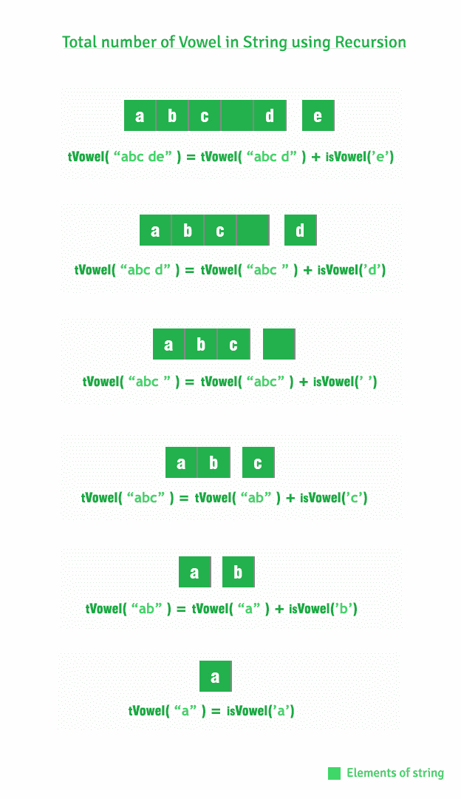

# 计算字符串中元音的程序(迭代和递归)

> 原文:[https://www . geesforgeks . org/program-count-元音-字符串-迭代-递归/](https://www.geeksforgeeks.org/program-count-vowels-string-iterative-recursive/)

给定一个字符串，计算其中元音的总数(a，e，I，o，u)。有两种方法可以计算一个字符串中元音的总数。
1。迭代
2。
递归**示例:**T5】

```
Input : abc de
Output : 2

Input : geeksforgeeks portal
Output : 7
```

**1。迭代方法**
下面是实现:

## C++

```
// C++ program to count vowels in a string
#include<iostream>
using namespace std;

// Function to check the Vowel
bool isVowel(char ch)
{
    ch = toupper(ch);
    return (ch=='A' || ch=='E' || ch=='I' ||
                       ch=='O' || ch=='U');
}

// Returns count of vowels in str
int countVowels(string str)
{
    int count = 0;
    for (int i=0; i<str.length(); i++)
        if (isVowel(str[i])) // Check for vowel
            ++count;
    return count;
}

// Main Calling Function
int main()
{
    //string object
    string str = "abc de";

    // Total numbers of Vowel
    cout << countVowels(str) << endl;
    return 0;
}
```

## Java 语言(一种计算机语言，尤用于创建网站)

```
// Java program to count vowels in a string
public class GFG {

    // Function to check the Vowel
    static boolean isVowel(char ch)
    {
        ch = Character.toUpperCase(ch);
        return (ch=='A' || ch=='E' || ch=='I' ||
                           ch=='O' || ch=='U');
    }

    // Returns count of vowels in str
    static int countVowels(String str)
    {
        int count = 0;
        for (int i = 0; i < str.length(); i++)
            if (isVowel(str.charAt(i))) // Check for vowel
                ++count;
        return count;
    }

    // Driver code
    public static void main(String args[])
    {
        //string object
        String str = "abc de";

        // Total numbers of Vowel
        System.out.println(countVowels(str));
    }
}
// This code is contributed by Sumit Ghosh
```

## 蟒蛇 3

```
# Python3 program to count vowels
# in a string

# Function to check the Vowel
def isVowel(ch):
    return ch.upper() in ['A', 'E', 'I', 'O', 'U']

# Returns count of vowels in str
def countVowels(str):
    count = 0
    for i in range(len(str)):

        # Check for vowel
        if isVowel(str[i]):
            count += 1
    return count

# Driver Code

# string object
str = 'abc de'

# Total number of Vowels
print(countVowels(str))

# This code is contributed
# by SamyuktaSHegde
```

## C#

```
// C# program to count vowels in a string
using System;

class GFG
{

    // Function to check the Vowel
    public static bool isVowel(char ch)
    {
        ch = char.ToUpper(ch);
        return (ch == 'A' || ch == 'E' ||
                ch == 'I' || ch == 'O' ||
                              ch == 'U');
    }

    // Returns count of vowels in str
    public static int countVowels(string str)
    {
        int count = 0;
        for (int i = 0; i < str.Length; i++)
        {

            // Check for vowel
            if (isVowel(str[i]))
            {
                ++count;
            }
        }
        return count;
    }

    // Driver code
    public static void Main(string[] args)
    {

        //string object
        string str = "abc de";

        // Total numbers of Vowel
        Console.WriteLine(countVowels(str));
    }
}

// This code is contributed by Shrikant13
```

## 服务器端编程语言（Professional Hypertext Preprocessor 的缩写）

```
<?php
// PHP program to count vowels in a string

// Function to check the Vowel
function isVowel($ch)
{
    $ch = strtoupper($ch);
    return ($ch =='A' || $ch =='E' ||
            $ch =='I' || $ch =='O' ||
            $ch =='U');
}

// Returns count of vowels in str
function countVowels($str)
{
    $count = 0;
    for ($i = 0; $i < strlen($str); $i++)
        if (isVowel($str[$i])) // Check for vowel
            ++$count;
    return $count;
}

// Driver Code

//string object
$str = "abc de";

// Total numbers of Vowel
echo countVowels($str) . "\n";

// This code is contributed
// by Akanksha Rai
?>
```

## java 描述语言

```
<script>
      // JavaScript program to count vowels in a string

      // Function to check the Vowel
      function isVowel(ch) {
        ch = ch.toUpperCase();
        return ch == "A" || ch == "E" || ch == "I" || ch == "O" || ch == "U";
      }

      // Returns count of vowels in str
      function countVowels(str)
      {
        var count = 0;
        for (var i = 0; i < str.length; i++)
          if (isVowel(str[i]))

            // Check for vowel
            ++count;
        return count;
      }

      // Main Calling Function

      // string object
      var str = "abc de";

      // Total numbers of Vowel
      document.write(countVowels(str));
      document.write("<br>");

      // This code is contributed by rdtank.
    </script>
```

**输出:**

```
2
```

**2。递归方法**
下面是实现:

## C++

```
// Recursive C++ program to count the total
// number of vowels using recursion
#include<iostream>
using namespace std;

// Function to check the Vowel
bool isVowel(char ch)
{
    ch = toupper(ch);
    return (ch=='A' || ch=='E' || ch=='I' ||
                        ch=='O' || ch=='U');
}

// to count total number of vowel from 0 to n
int countVovels(string str, int n)
{
    if (n == 1)
        return isVowel(str[n-1]);

    return countVovels(str, n-1) + isVowel(str[n-1]);
}

// Main Calling Function
int main()
{
    // string object
    string str = "abc de";

    // Total numbers of Vowel
    cout << countVovels(str, str.length()) << endl;
    return 0;
}
```

## Java 语言(一种计算机语言，尤用于创建网站)

```
// Recursive Java program to count the total
// number of vowels using recursion
public class GFG {

    // Function to check the Vowel
    static int isVowel(char ch)
    {
        ch = Character.toUpperCase(ch);
       if(ch=='A' || ch=='E' || ch=='I' ||
            ch=='O' || ch=='U')
           return 1;
       else return 0;
    }

    // to count total number of vowel from 0 to n
    static int countVowels(String str, int n)
    {
        if (n == 1)
            return isVowel(str.charAt(n - 1));

        return countVowels(str, n-1) + isVowel(str.charAt(n - 1));
    }

    // Main Calling Function
    public static void main(String args[])
    {
        //string object
        String str = "abc de";

        // Total numbers of Vowel
        System.out.println(countVowels(str,str.length()));
    }
}
// This code is contributed by Sumit Ghosh
```

## 蟒蛇 3

```
# Recursive Python 3 program to count the
# total number of vowels using recursion

# Function to check the Vowel
def isVowel(ch):
    return ch.upper() in ['A', 'E', 'I', 'O', 'U']

# to count total number of
# vowel from 0 to n
def countVovels(str, n):
    if (n == 1):
        return isVowel(str[n - 1]);

    return (countVovels(str, n - 1) +
                isVowel(str[n - 1]));

# Driver Code

# string object
str = "abc de";

# Total numbers of Vowel
print(countVovels(str, len(str)))

# This code is contributed
# by Akanksha Rai
```

## C#

```
using System;

// Recursive C# program to count the total
// number of vowels using recursion
public class GFG
{

    // Function to check the Vowel
    public static int isVowel(char ch)
    {
        ch = char.ToUpper(ch);
       if (ch == 'A' || ch == 'E' || ch == 'I' || ch == 'O' || ch == 'U')
       {
           return 1;
       }
       else
       {
           return 0;
       }
    }

    // to count total number of vowel from 0 to n
    public static int countVowels(string str, int n)
    {
        if (n == 1)
        {
            return isVowel(str[n - 1]);
        }

        return countVowels(str, n - 1) + isVowel(str[n - 1]);
    }

    // Main Calling Function
    public static void Main(string[] args)
    {
        //string object
        string str = "abc de";

        // Total numbers of Vowel
        Console.WriteLine(countVowels(str,str.Length));
    }
}

// This code is contributed by Shrikant13
```

## 服务器端编程语言（Professional Hypertext Preprocessor 的缩写）

```
<?php
// Recursive PHP program to count the total
// number of vowels using recursion

// Function to check the Vowel
function isVowel($ch)
{
    $ch = strtoupper($ch);
    return ($ch == 'A' || $ch == 'E' ||
            $ch == 'I' || $ch == 'O' ||
            $ch == 'U');
}

// to count total number of
// vowel from 0 to n
function countVovels($str, $n)
{
    if ($n == 1)
        return isVowel($str[$n - 1]);

    return countVovels($str, $n - 1) +
               isVowel($str[$n - 1]);
}

// Driver Code

// string object
$str = "abc de";

// Total numbers of Vowel
echo countVovels($str, strlen($str)) . "\n";

// This code is contributed
// by Akanksha Rai
?>
```

**输出:**

```
2
```

**递归代码如何工作..**



本文由 [**普拉哈尔·阿格沃尔**](http://prakhar.info) 供稿。如果你喜欢 GeeksforGeeks 并想投稿，你也可以使用[contribute.geeksforgeeks.org](http://contribute.geeksforgeeks.org)写一篇文章或者把你的文章邮寄到 contribute@geeksforgeeks.org。看到你的文章出现在极客博客主页上，帮助其他极客。
如果发现有不正确的地方，或者想分享更多关于上述话题的信息，请写评论。