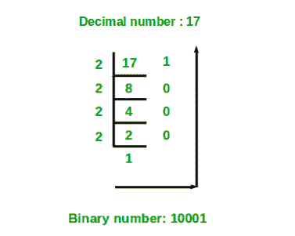

# 十进制到二进制转换程序

> 原文:[https://www . geesforgeks . org/program-十进制-二进制-转换/](https://www.geeksforgeeks.org/program-decimal-binary-conversion/)

给定一个十进制数作为输入，我们需要编写一个程序，将给定的十进制数转换成等价的二进制数。

**示例:**

```

Input : 7
Output : 111

Input : 10
Output : 1010

Input: 33
Output: 100001
```

**算法**:

1.  当数组中的数字被 2 除时，存储余数。
2.  把这个数除以 2
3.  重复以上两个步骤，直到数字大于零。
4.  现在以相反的顺序打印数组。

例如:
如果十进制数是 10。
**第一步**:10 除以 2 的余数为零。因此，arr[0] = 0。
**第二步**:10 除以 2。新数字是 10/2 = 5。
**第三步**:5 除以 2 的余数为 1。因此，arr[1] = 1。
**第四步**:5 除 2。新数字是 5/2 = 2。
**第五步**:2 除以 2 的余数为零。因此，arr[2] = 0。
**第六步**:2 除 2。新数字是 2/2 = 1。
**第七步**:1 除以 2 的余数为 1。因此，arr[3] = 1。
**第八步**:1 除以 2。新数字是 1/2 = 0。
**第九步**:因为数字变成= 0。以相反的顺序打印数组。因此等效的二进制数是 1010。

下图显示了将十进制数 17 转换为等效二进制数的示例。



以下是上述想法的实现。

## C++

```
// C++ program to convert a decimal
// number to binary number

#include <iostream>
using namespace std;

// function to convert decimal to binary
void decToBinary(int n)
{
    // array to store binary number
    int binaryNum[32];

    // counter for binary array
    int i = 0;
    while (n > 0) {

        // storing remainder in binary array
        binaryNum[i] = n % 2;
        n = n / 2;
        i++;
    }

    // printing binary array in reverse order
    for (int j = i - 1; j >= 0; j--)
        cout << binaryNum[j];
}

// Driver program to test above function
int main()
{
    int n = 17;
    decToBinary(n);
    return 0;
}
```

## Java 语言(一种计算机语言，尤用于创建网站)

```
// Java program to convert a decimal
// number to binary number
import java.io.*;

class GFG {
    // function to convert decimal to binary
    static void decToBinary(int n)
    {
        // array to store binary number
        int[] binaryNum = new int[32];

        // counter for binary array
        int i = 0;
        while (n > 0) {
            // storing remainder in binary array
            binaryNum[i] = n % 2;
            n = n / 2;
            i++;
        }

        // printing binary array in reverse order
        for (int j = i - 1; j >= 0; j--)
            System.out.print(binaryNum[j]);
    }

    // driver program
    public static void main(String[] args)
    {
        int n = 17;
        decToBinary(n);
    }
}

// Contributed by Pramod Kumar
```

## 蟒蛇 3

```
# Python3 program to convert a
# decimal number to binary number

# function to convert
# decimal to binary
def decToBinary(n):

    # array to store
    # binary number
    binaryNum = [0] * n;

    # counter for binary array
    i = 0;
    while (n > 0):

        # storing remainder
        # in binary array
        binaryNum[i] = n % 2;
        n = int(n / 2);
        i += 1;

    # printing binary array
    # in reverse order
    for j in range(i - 1, -1, -1):
        print(binaryNum[j], end = "");

# Driver Code
n = 17;
decToBinary(n);

# This code is contributed by mits
```

## C#

```
// C# program to convert a decimal
// number to binary number
using System;

public class GFG {

    // function to convert decimal
    // to binary
    static void decToBinary(int n)
    {
        // array to store binary number
        int[] binaryNum = new int[32];

        // counter for binary array
        int i = 0;
        while (n > 0) {
            // storing remainder in
            // binary array
            binaryNum[i] = n % 2;
            n = n / 2;
            i++;
        }

        // printing binary array
        // in reverse order
        for (int j = i - 1; j >= 0; j--)
            Console.Write(binaryNum[j]);
    }

    // Driver Code
    public static void Main()
    {
        int n = 17;
        decToBinary(n);
    }
}

// This code is contributed by Sam007.
```

## 服务器端编程语言（Professional Hypertext Preprocessor 的缩写）

```
<?php
// PHP program to convert a decimal
// number to binary number

// function to convert
// decimal to binary
function decToBinary($n)
{
    // array to store
    // binary number
    $binaryNum;

    // counter for binary array
    $i = 0;
    while ($n > 0)
    {

        // storing remainder
        // in binary array
        $binaryNum[$i] = $n % 2;
        $n = (int)($n / 2);
        $i++;
    }

    // printing binary array
    // in reverse order
    for ($j = $i - 1; $j >= 0; $j--)
        echo $binaryNum[$j];
}

// Driver Code
$n = 17;
decToBinary($n);

// This code is contributed by m_kit
?>
```

## java 描述语言

```
<script>

// Javascript program to convert a decimal
// number to binary number

// function to convert decimal to binary
function decToBinary(n)
{
    // array to store binary number
    let binaryNum = new Array(32);

    // counter for binary array
    let i = 0;
    while (n > 0) {

        // storing remainder in binary array
        binaryNum[i] = n % 2;
        n = Math.floor(n / 2);
        i++;
    }

    // printing binary array in reverse order
    for (let j = i - 1; j >= 0; j--)
        document.write(binaryNum[j]);
}

// Driver program to test above function
    let n = 17;
    decToBinary(n);

// This code is contributed by Mayank Tyagi

</script>
```

**输出:**

```
10001
```

我们可以使用按位运算符来完成上述工作。请注意，按位运算符比上面使用的算术运算符工作得更快。

## C++

```
// CPP program to Decimal to binary conversion
// using bitwise operator
// Size of an integer is assumed to be 32 bits
#include <iostream>
using namespace std;

// Function that convert Decimal to binary
int decToBinary(int n)
{
    // Size of an integer is assumed to be 32 bits
    for (int i = 31; i >= 0; i--) {
        int k = n >> i;
        if (k & 1)
            cout << "1";
        else
            cout << "0";
    }
}

// driver code
int main()
{
    int n = 32;
    decToBinary(n);
}
```

## Java 语言(一种计算机语言，尤用于创建网站)

```
// Java program to Decimal to binary conversion
// using bitwise operator
// Size of an integer is assumed to be 32 bits

class gfg {
    // Function that convert Decimal to binary
    public void decToBinary(int n)
    {
        // Size of an integer is assumed to be 32 bits
        for (int i = 31; i >= 0; i--) {
            int k = n >> i;
            if ((k & 1) > 0)
                System.out.print("1");
            else
                System.out.print("0");
        }
    }
}

class geek {
    // driver code
    public static void main(String[] args)
    {
        gfg g = new gfg();
        int n = 32;
        g.decToBinary(n);
    }
}
// This code is contributed by mits
```

## 蟒蛇 3

```
# Python3 program to Decimal
# to binary conversion using
# bitwise operator

# Size of an integer is 
# assumed to be 32 bits

# Function that convert
# Decimal to binary
def decToBinary(n):

    # Size of an integer is
    # assumed to be 32 bits
    for i in range(31, -1, -1):
        k = n >> i;
        if (k & 1):
            print("1", end = "");
        else:
            print("0", end = "");

# Driver Code
n = 32;
decToBinary(n);

# This code is contributed by mits
```

## C#

```
// C# program to Decimal to binary conversion
// using bitwise operator
// Size of an integer is assumed to be 32 bits
using System;
class gfg {
    // Function that convert Decimal to binary
    public void decToBinary(int n)
    {
        // Size of an integer is assumed to be 32 bits
        for (int i = 31; i >= 0; i--) {
            int k = n >> i;
            if ((k & 1) > 0)
                Console.Write("1");
            else
                Console.Write("0");
        }
    }
}

class geek {
    // driver code
    public static int Main()
    {
        gfg g = new gfg();
        int n = 32;
        g.decToBinary(n);
        return 0;
    }
}
```

## 服务器端编程语言（Professional Hypertext Preprocessor 的缩写）

```
<?php
// PHP program to Decimal to binary conversion
// using bitwise operator

// Size of an integer is assumed
// to be 32 bits

// Function that convert Decimal to binary
function decToBinary($n)
{

    // Size of an integer is
    // assumed to be 32 bits
    for ( $i = 31; $i >= 0; $i--)
    {
        $k = $n >> $i;
        if ($k & 1)
            echo "1";
        else
            echo "0";
    }
}

    // Driver Code
    $n = 32;
    decToBinary($n);

// This code is contributed by aj_36
?>
```

## java 描述语言

```
<script>

// javascript program to Decimal to binary conversion
// using bitwise operator
// Size of an integer is assumed to be 32 bits

    // Function that convert Decimal to binary
    function decToBinary(n)
    {
        // Size of an integer is assumed to be 32 bits
        for (i = 31; i >= 0; i--) {
            var k = n >> i;
            if ((k & 1) > 0)
                document.write("1");
            else
                document.write("0");
        }
    }

    // driver code
    var n = 32;
    decToBinary(n);

// This code contributed by Princi Singh

</script>
```

**输出:**

```
00000000000000000000000000100000
```

感谢[aja 0007](https://auth.geeksforgeeks.org/user/ajay0007/articles)提出上述解决方案。

十进制到二进制的转换也可以在不使用数组的情况下完成。

## C++

```
// C++ implementation of the approach
#include <cmath>
#include <iostream>
using namespace std;

#define ull unsigned long long int

// Function to return the binary
// equivalent of decimal value N
int decimalToBinary(int N)
{

    // To store the binary number
    ull B_Number = 0;
    int cnt = 0;
    while (N != 0) {
        int rem = N % 2;
        ull c = pow(10, cnt);
        B_Number += rem * c;
        N /= 2;

        // Count used to store exponent value
        cnt++;
    }

    return B_Number;
}

// Driver code
int main()
{

    int N = 17;

    cout << decimalToBinary(N);

    return 0;
}
```

## Java 语言(一种计算机语言，尤用于创建网站)

```
// Java implementation of the approach
import java.io.*;

class GFG
{

// Function to return the binary
// equivalent of decimal value N
static int decimalToBinary(int N)
{

    // To store the binary number
    int B_Number = 0;
    int cnt = 0;
    while (N != 0)
    {
        int rem = N % 2;
        double c = Math.pow(10, cnt);
        B_Number += rem * c;
        N /= 2;

        // Count used to store exponent value
        cnt++;
    }

    return B_Number;
}

// Driver code
public static void main (String[] args)
{

    int N = 17;
    System.out.println (decimalToBinary(N));

}
}

// This code is contributed by ajit.
```

## 蟒蛇 3

```
# Python3 implementation of the approach

# Function to return the binary
# equivalent of decimal value N
def decimalToBinary(N):

    # To store the binary number
    B_Number = 0
    cnt = 0
    while (N != 0):
        rem = N % 2
        c = pow(10, cnt)
        B_Number += rem * c
        N //= 2

        # Count used to store exponent value
        cnt += 1

    return B_Number

# Driver code
N = 17
print(decimalToBinary(N))

# This code is contributed by
# SHUBHAMSINGH10
```

## C#

```
// C# implementation of the approach
using System;

class GFG
{

// Function to return the binary
// equivalent of decimal value N
static int decimalToBinary(int N)
{

    // To store the binary number
    int B_Number = 0;
    int cnt = 0;
    while (N != 0)
    {
        int rem = N % 2;
        int c = (int)Math.Pow(10, cnt);
        B_Number += rem * c;
        N /= 2;

        // Count used to store exponent value
        cnt++;
    }

    return B_Number;
}

// Driver code
static public void Main ()
{
    int N = 17;
    Console.Write(decimalToBinary(N));
}
}

// This code is contributed by Tushil.
```

## java 描述语言

```
<script>

// javascript implementation of the approach

// Function to return the binary
// equivalent of decimal value N
function decimalToBinary(N)
{

    // To store the binary number
    var B_Number = 0;
    var cnt = 0;
    while (N != 0)
    {
        var rem = N % 2;
        var c = Math.pow(10, cnt);
        B_Number += rem * c;
        N = parseInt(N/2);

        // Count used to store exponent value
        cnt++;
    }
    return B_Number;
}

// Driver code
var N = 17;
document.write(decimalToBinary(N));

// This code is contributed by Princi Singh
</script>
```

**输出:**

```
10001
```

请注意，这种方法类似于我们在[帖子](https://www.geeksforgeeks.org/program-binary-decimal-conversion/)中讨论的将二进制转换为十进制的方法。
还有一种方法可以将任何十进制数转换成二进制形式。想法是使用 [**位组**](https://www.geeksforgeeks.org/c-bitset-and-its-application/) 。

下面是上述方法的实现。

## C++

```
//C++ program to convert a decimal number
//to its binary form.

//including header file
#include <bits/stdc++.h>
using namespace std;

//Function to convert a decimal number
//to its binary form
string decimalToBinary(int n)
{
    //finding the binary form of the number and
    //converting it to string.
    string s = bitset<64> (n).to_string();

    //Finding the first occurrence of "1"
    //to strip off the leading zeroes.
    const auto loc1 = s.find('1');

    if(loc1 != string::npos)
        return s.substr(loc1);

    return "0";
}

//Driver Code
int main()
{
    int n = 17;

    //Function call
    cout << decimalToBinary(n);

    return 0;
}

//This code is contributed by yashbeersingh42
```

**输出:**

```
10001
```

本文由 [**哈什·阿加瓦尔**](https://www.facebook.com/harsh.agarwal.16752) 供稿。如果你喜欢 GeeksforGeeks 并想投稿，你也可以使用[write.geeksforgeeks.org](https://write.geeksforgeeks.org)写一篇文章或者把你的文章邮寄到 review-team@geeksforgeeks.org。看到你的文章出现在极客博客主页上，帮助其他极客。
如果发现有不正确的地方，或者想分享更多关于上述话题的信息，请写评论。