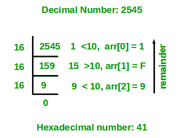

# 十进制到十六进制转换程序

> 原文:[https://www . geesforgeks . org/program-十进制-十六进制-转换/](https://www.geeksforgeeks.org/program-decimal-hexadecimal-conversion/)

给定一个十进制数作为输入，我们需要编写一个程序，将给定的十进制数转换成等价的十六进制数。即将基值为 10 的数字转换为基值 16。

十六进制数字使用 16 个值来表示一个数字。从**开始的数字 0-9 用数字 0-9 表示，10-15 用从 A–f 开始的字符表示。**

**示例:**

```
Input : 116
Output: 74

Input : 10
Output: A

Input : 33
Output: 21
```

**算法**:

1.  将数字除以 16 后的余数存储在临时变量 temp 中。如果 temp 小于 10，则在字符数组中插入(48 + temp)，否则如果 temp 大于或等于 10，则在字符数组中插入(55 + temp)。
2.  现在把这个数除以 16
3.  重复以上两个步骤，直到数字不等于 0。
4.  现在以相反的顺序打印数组。

**例**

如果给定的十进制数是 2545。

**第一步**:2545 除以 16 等于 1 时计算余数。因此，temp = 1。因为温度低于 10 度。所以，arr[0] = 48 + 1 = 49 = '1 '。
**第二步**:2545 除以 16。新号码是 2545/16 = 159。
**第三步**:159 除以 16 等于 15 时计算余数。因此，temp = 15。因为温度大于 10。所以，arr[1] = 55 + 15 = 70 = 'F '。
**第四步**:159 除以 16。新数字是 159/16 = 9。
**第五步**:9 除以 16 等于 9 时计算余数。因此，temp = 9。因为温度低于 10 度。所以，arr[2] = 48 + 9 = 57 = '9 '。
**第六步**:9 除以 16。新数字是 9/16 = 0。
**第七步**:因为数字变成= 0。停止重复步骤，并以相反的顺序打印数组。因此，等效的十六进制数是 9F1。

下图显示了将十进制数 2545 转换为等效十六进制数的示例。



以下是上述想法的实现。

## C++

```
// C++ program to convert a decimal
// number to hexadecimal number

#include <iostream>
using namespace std;

// function to convert decimal to hexadecimal
void decToHexa(int n)
{
    // char array to store hexadecimal number
    char hexaDeciNum[100];

    // counter for hexadecimal number array
    int i = 0;
    while (n != 0) {
        // temporary variable to store remainder
        int temp = 0;

        // storing remainder in temp variable.
        temp = n % 16;

        // check if temp < 10
        if (temp < 10) {
            hexaDeciNum[i] = temp + 48;
            i++;
        }
        else {
            hexaDeciNum[i] = temp + 55;
            i++;
        }

        n = n / 16;
    }

    // printing hexadecimal number array in reverse order
    for (int j = i - 1; j >= 0; j--)
        cout << hexaDeciNum[j];
}

// Driver program to test above function
int main()
{
    int n = 2545;

    decToHexa(n);

    return 0;
}
```

## Java 语言(一种计算机语言，尤用于创建网站)

```
// Java program to convert a decimal
// number to hexadecimal number
import java.io.*;

class GFG {
    // function to convert decimal to hexadecimal
    static void decToHexa(int n)
    {
        // char array to store hexadecimal number
        char[] hexaDeciNum = new char[100];

        // counter for hexadecimal number array
        int i = 0;
        while (n != 0) {
            // temporary variable to store remainder
            int temp = 0;

            // storing remainder in temp variable.
            temp = n % 16;

            // check if temp < 10
            if (temp < 10) {
                hexaDeciNum[i] = (char)(temp + 48);
                i++;
            }
            else {
                hexaDeciNum[i] = (char)(temp + 55);
                i++;
            }

            n = n / 16;
        }

        // printing hexadecimal number array in reverse
        // order
        for (int j = i - 1; j >= 0; j--)
            System.out.print(hexaDeciNum[j]);
    }

    // driver program
    public static void main(String[] args)
    {
        int n = 2545;
        decToHexa(n);
    }
}

// Contributed by Pramod Kumar
```

## 蟒蛇 3

```
# Python3 program to
# convert a decimal
# number to hexadecimal
# number

# function to convert
# decimal to hexadecimal

def decToHexa(n):

    # char array to store
    # hexadecimal number
    hexaDeciNum = ['0'] * 100

    # counter for hexadecimal
    # number array
    i = 0
    while(n != 0):

        # temporary variable
        # to store remainder
        temp = 0

        # storing remainder
        # in temp variable.
        temp = n % 16

        # check if temp < 10
        if(temp < 10):
            hexaDeciNum[i] = chr(temp + 48)
            i = i + 1
        else:
            hexaDeciNum[i] = chr(temp + 55)
            i = i + 1
        n = int(n / 16)

    # printing hexadecimal number
    # array in reverse order
    j = i - 1
    while(j >= 0):
        print((hexaDeciNum[j]), end="")
        j = j - 1

# Driver Code
n = 2545
decToHexa(n)

# This code is contributed
# by mits.
```

## C#

```
// C# program to convert a decimal
// number to hexadecimal number
using System;

class GFG {
    // function to convert decimal
    // to hexadecimal
    static void decToHexa(int n)
    {
        // char array to store
        // hexadecimal number
        char[] hexaDeciNum = new char[100];

        // counter for hexadecimal number array
        int i = 0;
        while (n != 0) {
            // temporary variable to
            // store remainder
            int temp = 0;

            // storing remainder in temp
            // variable.
            temp = n % 16;

            // check if temp < 10
            if (temp < 10) {
                hexaDeciNum[i] = (char)(temp + 48);
                i++;
            }
            else {
                hexaDeciNum[i] = (char)(temp + 55);
                i++;
            }

            n = n / 16;
        }

        // printing hexadecimal number
        // array in reverse order
        for (int j = i - 1; j >= 0; j--)
            Console.Write(hexaDeciNum[j]);
    }

    // Driver Code
    public static void Main(String[] args)
    {
        int n = 2545;
        decToHexa(n);
    }
}

// This code is contributed by Nitin Mittal.
```

## 服务器端编程语言（Professional Hypertext Preprocessor 的缩写）

```
<?php
// PHP program to convert
// a decimal number to
// hexadecimal number

// function to convert
// decimal to hexadecimal
function decToHexa($n)
{
    // char array to store
    // hexadecimal number
    $hexaDeciNum;

    // counter for hexadecimal
    // number array
    $i = 0;
    while($n != 0)
    {
        // temporary variable
        // to store remainder
        $temp = 0;

        // storing remainder
        // in temp variable.
        $temp = $n % 16;

        // check if temp < 10
        if($temp < 10)
        {
            $hexaDeciNum[$i] = chr($temp + 48);
            $i++;
        }
        else
        {
            $hexaDeciNum[$i] = chr($temp + 55);
            $i++;
        }

        $n = (int)($n / 16);
    }

    // printing hexadecimal number
    // array in reverse order
    for($j = $i - 1; $j >= 0; $j--)
        echo $hexaDeciNum[$j];
}

// Driver Code
$n = 2545;
decToHexa($n);

// This code is contributed
// by mits.
?>
```

## java 描述语言

```
<script>

// Javascript program to convert a decimal
// number to hexadecimal number

// function to convert decimal to hexadecimal
function decToHexa(n)
{
    // char array to store hexadecimal number
    var hexaDeciNum = Array.from({length: 100},
                      (_, i) => 0);

    // counter for hexadecimal number array
    var i = 0;
    while (n != 0) {
        // temporary variable to store remainder
        var temp = 0;

        // storing remainder in temp variable.
        temp = n % 16;

        // check if temp < 10
        if (temp < 10) {
            hexaDeciNum[i] =
            String.fromCharCode(temp + 48);
            i++;
        }
        else {
            hexaDeciNum[i] =
            String.fromCharCode(temp + 55);
            i++;
        }

        n = parseInt(n / 16);
    }

    // printing hexadecimal number array in reverse
    // order
    for (j = i - 1; j >= 0; j--)
        document.write(hexaDeciNum[j]);
}

// driver program
var n = 2545;
decToHexa(n);

// This code contributed by shikhasingrajput

</script>
```

**Output**

```
9F1
```

**使用预定义功能**

## Java 语言(一种计算机语言，尤用于创建网站)

```
// Java program to convert a decimal
// number to hexadecimal number
import java.io.*;

class GFG {
    public static void decToHexa(int n)
    {
        System.out.println(Integer.toHexString(n));
    }
    public static void main(String[] args)
    {

        int n = 2545;
        decToHexa(n);
    }
}
```

## 蟒蛇 3

```
# Python program to convert a decimal
# number to hexadecimal number

# function to convert decimal number
# to equivalent hexadecimal number
def decToHexa(n):
  return hex(n).replace("0x","")

# Driver Code
n = 2545
print(decToHexa(n))

# This code is contributed by shahidedu7.
```

## C#

```
// C# program to convert a decimal
// number to hexadecimal number
using System;

class GFG {
    public static void decToHexa(int n)
    {
        Console.Write(Convert.ToString(n));
    }
    public static void Main(String[] args)
    {

        int n = 2545;
        decToHexa(n);
    }
}

// This code is contributed by shivanisinghss2110
```

**Output**

```
9f1
```

本文由 [**哈什·阿加瓦尔**](https://www.facebook.com/harsh.agarwal.16752) 供稿。如果你喜欢 GeeksforGeeks 并想投稿，你也可以使用[write.geeksforgeeks.org](https://write.geeksforgeeks.org)写一篇文章或者把你的文章邮寄到 review-team@geeksforgeeks.org。看到你的文章出现在极客博客主页上，帮助其他极客。

如果你发现任何不正确的地方，或者你想分享更多关于上面讨论的话题的信息，请写评论。