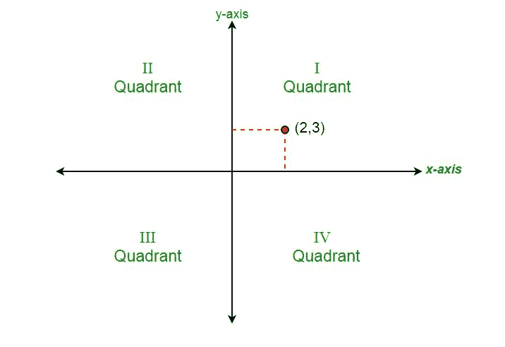

# 确定笛卡尔平面象限的程序

> 原文:[https://www . geesforgeks . org/program-decision-quadrant-cartesian-plane/](https://www.geeksforgeeks.org/program-determine-quadrant-cartesian-plane/)

给定坐标(x，y)，确定笛卡尔平面的象限。



image _ source:[wikipedia.org](https://en.wikipedia.org/wiki/Cartesian_coordinate_system)T2【示例:

```
Input : x = 1, y = 1 
Output : lies in 1st quadrant

Input : x = 0, y = 0 
Output : lies at origin
```

有 9 个条件需要检查，以确定点位于何处–

```
If in first quadrant then,    x > 0 and y > 0 
If in second quadrant then,   x < 0 and y > 0 
If in third quadrant then,    x < 0 and y < 0 
If in fourth quadrant then,   x > 0 and y < 0 
If in positive x-axis then,   y = 0 and x > 0
If in negative x-axis then,   y = 0 and x < 0  
If in positive y-axis then,   x = 0 and y > 0
If in negative y-axis then,   x = 0 and y < 0  
If at origin then,            x = 0 and y = 0 
```

以下是上述方法的实现:

## C++

```
// CPP program to check quadrant
#include <bits/stdc++.h>
using namespace std;

// Function to check quadrant
void quadrant(int x, int y)
{

    if (x > 0 and y > 0)
        cout << "lies in First quadrant";

    else if (x < 0 and y > 0)
        cout << "lies in Second quadrant";

    else if (x < 0 and y < 0)
        cout << "lies in Third quadrant";

    else if (x > 0 and y < 0)
        cout << "lies in Fourth quadrant";

    else if (x == 0 and y > 0)
        cout << "lies at positive y axis";

    else if (x == 0 and y < 0)
        cout << "lies at negative y axis";

    else if (y == 0 and x < 0)
        cout << "lies at negative x axis";

    else if (y == 0 and x > 0)
        cout << "lies at positive x axis";

    else
        cout << "lies at origin";
}

// Driver code
int main()
{
    int x = 1, y = 1;
    // Function call
    quadrant(x, y);
    return 0;
}
```

## Java 语言(一种计算机语言，尤用于创建网站)

```
// Java program to check quadrant
import java.io.*;

class GFG {

    // Function to check quadrant
    static void quadrant(int x, int y)
    {
        if (x > 0 && y > 0)
            System.out.println("lies in First quadrant");

        else if (x < 0 && y > 0)
            System.out.println("lies in Second quadrant");

        else if (x < 0 && y < 0)
            System.out.println("lies in Third quadrant");

        else if (x > 0 && y < 0)
            System.out.println("lies in Fourth quadrant");

        else if (x == 0 && y > 0)
            System.out.println("lies at positive y axis");

        else if (x == 0 && y < 0)
            System.out.println("lies at negative y axis");

        else if (y == 0 && x < 0)
            System.out.println("lies at negative x axis");

        else if (y == 0 && x > 0)
            System.out.println("lies at positive x axis");

        else
            System.out.println("lies at origin");
    }

    // Driver Code
    public static void main(String[] args)
    {
        int x = 1, y = 1;
        // Function Calling
        quadrant(x, y);
    }
}
```

## 计算机编程语言

```
''' Python program to check quadrant'''

# Function to check quadrant
def quadrant(x, y):
    if (x > 0 and y > 0):
        print ("lies in First quadrant")

    elif (x < 0 and y > 0):
        print ("lies in Second quadrant")

    elif (x < 0 and y < 0):
        print ("lies in Third quadrant")

    elif (x > 0 and y < 0):
        print ("lies in Fourth quadrant")

    elif (x == 0 and y > 0):
        print ("lies at positive y axis")

    elif (x == 0 and y < 0):
        print ("lies at negative y axis")

    elif (y == 0 and x < 0):
        print ("lies at negative x axis")

    elif (y == 0 and x > 0):
        print ("lies at positive x axis")

    else:
        print ("lies at origin")

# Driver code    
x = 1
y = 1
quadrant(x, y)
```

## C#

```
// C# program to check quadrant
using System;

class GFG {

    // Function to check quadrant
    static void quadrant(int x, int y)
    {
        if (x > 0 && y > 0)
            Console.WriteLine("lies in First quadrant");

        else if (x < 0 && y > 0)
            Console.WriteLine("lies in Second quadrant");

        else if (x < 0 && y < 0)
            Console.WriteLine("lies in Third quadrant");

        else if (x > 0 && y < 0)
            Console.WriteLine("lies in Fourth quadrant");

        else if (x == 0 && y > 0)
            Console.WriteLine("lies at positive y axis");

        else if (x == 0 && y < 0)
            Console.WriteLine("lies at negative y axis");

        else if (y == 0 && x < 0)
            Console.WriteLine("lies at negative x axis");

        else if (y == 0 && x > 0)
            Console.WriteLine("lies at positive x axis");

        else
            Console.WriteLine("lies at origin");
    }

    // Driver Code
    public static void Main()
    {
        int x = 1, y = 1;

        // Function Calling
        quadrant(x, y);
    }
}

// This code is contributed by vt_m.
```

## 服务器端编程语言（Professional Hypertext Preprocessor 的缩写）

```
<?php
// PHP program to check quadrant

// Function to check quadrant
function quadrant($x, $y)
{

    if ($x > 0 and $y > 0)
        echo("lies in First quadrant");

    else if ($x < 0 and $y > 0)
        echo("lies in Second quadrant");

    else if ($x < 0 and $y < 0)
        echo("lies in Third quadrant");

    else if ($x > 0 and $y < 0)
        echo("lies in Fourth quadrant");

    else if ($x == 0 and $y > 0)
        echo("lies at positive y axis");

    else if ($x == 0 and $y < 0)
        echo("lies at negative y axis");

    else if ($y == 0 and $x < 0)
        echo("lies at negative x axis");

    else if ($y == 0 and $x > 0)
        echo("lies at positive x axis");
    else
        echo("lies at origin");
}

// Driver code
$x = 1; $y = 1;

// Function call
quadrant($x, $y);

// This code is contributed by Ajit.
?>
```

## java 描述语言

```
<script>
// javascript program to check quadrant

    // Function to check quadrant
    function quadrant(x, y)
    {
        if (x > 0 && y > 0)
            document.write("lies in First quadrant");

        else if (x < 0 && y > 0)
            document.write("lies in Second quadrant");

        else if (x < 0 && y < 0)
            document.write("lies in Third quadrant");

        else if (x > 0 && y < 0)
            document.write("lies in Fourth quadrant");

        else if (x == 0 && y > 0)
            document.write("lies at positive y axis");

        else if (x == 0 && y < 0)
            document.write("lies at negative y axis");

        else if (y == 0 && x < 0)
            document.write("lies at negative x axis");

        else if (y == 0 && x > 0)
            document.write("lies at positive x axis");

        else
            document.write("lies at origin");
    }

// Driver code

    let x = 1, y = 1;

        // Function Calling
        quadrant(x, y);

    // This code is contributed by sanjoy_62.
</script>
```

输出:

```
lies in First quadrant
```