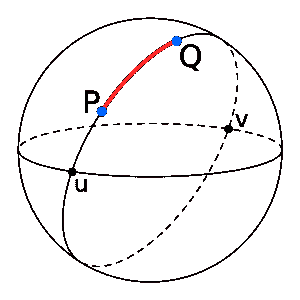

# 地球两点间距离程序

> 原文:[https://www . geesforgeks . org/program-distance-两点-earth/](https://www.geeksforgeeks.org/program-distance-two-points-earth/)

给定纬度和经度的度数，求地球上两点之间的距离。



图片来源:[维基百科](https://en.wikipedia.org/wiki/Great-circle_distance#/media/File:Illustration_of_great-circle_distance.svg)
**示例:**

```
Input : Latitude 1: 53.32055555555556
        Latitude 2: 53.31861111111111
        Longitude 1: -1.7297222222222221
        Longitude 2: -1.6997222222222223
Output: Distance is: 2.0043678382716137 Kilometers
```

**问题可以用哈弗辛公式解决:**

大圆距离或**正交**距离是球体(或地球表面)上两点之间的最短距离。为了使用这种方法，我们需要有 A 点和 B 点的坐标。大圆法比其他方法更受欢迎。
首先，将经纬度值从十进制度转换为弧度。为此，将两个点的经度和纬度值除以 180/pi。圆周率的值是 22/7。180/pi 的值约为 57.29577951。如果我们想以英里为单位计算两个地方之间的距离，使用值 3，963，这是地球的半径。如果我们想以公里为单位计算两个地方之间的距离，使用值 6，378.8，这是地球的半径。

> 求纬度的弧度值:
> 纬度的弧度值，lat =纬度/ (180/pi) OR
> 纬度的弧度值，lat =纬度/ 57.29577951
> 求经度的弧度值:
> 经度的弧度值，long =经度/ (180/pi) OR
> 经度的弧度值，long =经度/ 57.29577951

根据经纬度得到 A 点的坐标。使用上述转换方法，以弧度为单位转换纬度和经度的值。我称之为 lat1 和 long1。对 B 点的坐标做同样的操作，得到 lat2 和 long2。
现在，要获得 A 点和 B 点之间的距离，请使用以下公式:

> 距离，d = 3963.0 *弧[(sin(lat1)* sin(lat2))+cos(lat1)* cos(lat2)* cos(long 2–long 1)]

获得的距离 d 以英里为单位。如果你希望你的值以公里为单位，用 1.609344 乘以 d。
d 以公里为单位= 1.609344 * d 以英里为单位
这样你就可以用大圆距离法得到地球上两个地方之间最短的距离。

## C++

```
// C++ program to calculate Distance
// Between Two Points on Earth
#include <bits/stdc++.h>
using namespace std;

// Utility function for
// converting degrees to radians
long double toRadians(const long double °ree)
{
    // cmath library in C++
    // defines the constant
    // M_PI as the value of
    // pi accurate to 1e-30
    long double one_deg = (M_PI) / 180;
    return (one_deg * degree);
}

long double distance(long double lat1, long double long1,
                     long double lat2, long double long2)
{
    // Convert the latitudes
    // and longitudes
    // from degree to radians.
    lat1 = toRadians(lat1);
    long1 = toRadians(long1);
    lat2 = toRadians(lat2);
    long2 = toRadians(long2);

    // Haversine Formula
    long double dlong = long2 - long1;
    long double dlat = lat2 - lat1;

    long double ans = pow(sin(dlat / 2), 2) +
                          cos(lat1) * cos(lat2) *
                          pow(sin(dlong / 2), 2);

    ans = 2 * asin(sqrt(ans));

    // Radius of Earth in
    // Kilometers, R = 6371
    // Use R = 3956 for miles
    long double R = 6371;

    // Calculate the result
    ans = ans * R;

    return ans;
}

// Driver Code
int main()
{
    long double lat1 = 53.32055555555556;
    long double long1 = -1.7297222222222221;
    long double lat2 = 53.31861111111111;
    long double long2 = -1.6997222222222223;

    // call the distance function
    cout << setprecision(15) << fixed;
    cout << distance(lat1, long1,
                     lat2, long2) << " K.M";

    return 0;
}

// This code is contributed
// by Aayush Chaturvedi
```

## Java 语言(一种计算机语言，尤用于创建网站)

```
// Java program to calculate Distance Between
// Two Points on Earth
import java.util.*;
import java.lang.*;

class GFG {

    public static double distance(double lat1,
                     double lat2, double lon1,
                                  double lon2)
    {

        // The math module contains a function
        // named toRadians which converts from
        // degrees to radians.
        lon1 = Math.toRadians(lon1);
        lon2 = Math.toRadians(lon2);
        lat1 = Math.toRadians(lat1);
        lat2 = Math.toRadians(lat2);

        // Haversine formula
        double dlon = lon2 - lon1;
        double dlat = lat2 - lat1;
        double a = Math.pow(Math.sin(dlat / 2), 2)
                 + Math.cos(lat1) * Math.cos(lat2)
                 * Math.pow(Math.sin(dlon / 2),2);

        double c = 2 * Math.asin(Math.sqrt(a));

        // Radius of earth in kilometers. Use 3956
        // for miles
        double r = 6371;

        // calculate the result
        return(c * r);
    }

    // driver code
    public static void main(String[] args)
    {
        double lat1 = 53.32055555555556;
        double lat2 = 53.31861111111111;
        double lon1 = -1.7297222222222221;
        double lon2 = -1.6997222222222223;
        System.out.println(distance(lat1, lat2,
                           lon1, lon2) + " K.M");
    }
}

// This code is contributed by Prasad Kshirsagar
```

## 蟒蛇 3

```
# Python 3 program to calculate Distance Between Two Points on Earth
from math import radians, cos, sin, asin, sqrt
def distance(lat1, lat2, lon1, lon2):

    # The math module contains a function named
    # radians which converts from degrees to radians.
    lon1 = radians(lon1)
    lon2 = radians(lon2)
    lat1 = radians(lat1)
    lat2 = radians(lat2)

    # Haversine formula
    dlon = lon2 - lon1
    dlat = lat2 - lat1
    a = sin(dlat / 2)**2 + cos(lat1) * cos(lat2) * sin(dlon / 2)**2

    c = 2 * asin(sqrt(a))

    # Radius of earth in kilometers. Use 3956 for miles
    r = 6371

    # calculate the result
    return(c * r)

# driver code
lat1 = 53.32055555555556
lat2 = 53.31861111111111
lon1 = -1.7297222222222221
lon2 =  -1.6997222222222223
print(distance(lat1, lat2, lon1, lon2), "K.M")
```

## C#

```
// C# program to calculate
// Distance Between Two
// Points on Earth
using System;

class GFG
{
    static double toRadians(
           double angleIn10thofaDegree)
    {
        // Angle in 10th
        // of a degree
        return (angleIn10thofaDegree * 
                       Math.PI) / 180;
    }
    static double distance(double lat1,
                           double lat2,
                           double lon1,
                           double lon2)
    {

        // The math module contains
        // a function named toRadians
        // which converts from degrees
        // to radians.
        lon1 = toRadians(lon1);
        lon2 = toRadians(lon2);
        lat1 = toRadians(lat1);
        lat2 = toRadians(lat2);

        // Haversine formula
        double dlon = lon2 - lon1;
        double dlat = lat2 - lat1;
        double a = Math.Pow(Math.Sin(dlat / 2), 2) +
                   Math.Cos(lat1) * Math.Cos(lat2) *
                   Math.Pow(Math.Sin(dlon / 2),2);

        double c = 2 * Math.Asin(Math.Sqrt(a));

        // Radius of earth in
        // kilometers. Use 3956
        // for miles
        double r = 6371;

        // calculate the result
        return (c * r);
    }

    // Driver code
    static void Main()
    {
        double lat1 = 53.32055555555556;
        double lat2 = 53.31861111111111;
        double lon1 = -1.7297222222222221;
        double lon2 = -1.6997222222222223;
        Console.WriteLine(distance(lat1, lat2,
                          lon1, lon2) + " K.M");
    }
}

// This code is contributed by
// Manish Shaw(manishshaw1)
```

## 服务器端编程语言（Professional Hypertext Preprocessor 的缩写）

```
<?php

      function twopoints_on_earth($latitudeFrom, $longitudeFrom,
                                    $latitudeTo,  $longitudeTo)
      {
           $long1 = deg2rad($longitudeFrom);
           $long2 = deg2rad($longitudeTo);
           $lat1 = deg2rad($latitudeFrom);
           $lat2 = deg2rad($latitudeTo);

           //Haversine Formula
           $dlong = $long2 - $long1;
           $dlati = $lat2 - $lat1;

           $val = pow(sin($dlati/2),2)+cos($lat1)*cos($lat2)*pow(sin($dlong/2),2);

           $res = 2 * asin(sqrt($val));

           $radius = 3958.756;

           return ($res*$radius);
      }

      // latitude and longitude of Two Points
      $latitudeFrom = 19.017656 ;
      $longitudeFrom = 72.856178;
      $latitudeTo = 40.7127;
      $longitudeTo = -74.0059;

      // Distance between Mumbai and New York
      print_r(twopoints_on_earth( $latitudeFrom, $longitudeFrom,
                    $latitudeTo,  $longitudeTo).' '.'miles');

// This code is contributed by akash1295
// https://auth.geeksforgeeks.org/user/akash1295/articles
?>
```

## java 描述语言

```
<script>

// JavaScript program to calculate Distance Between
// Two Points on Earth

    function distance(lat1,
                     lat2, lon1, lon2)
    {

        // The math module contains a function
        // named toRadians which converts from
        // degrees to radians.
        lon1 =  lon1 * Math.PI / 180;
        lon2 = lon2 * Math.PI / 180;
        lat1 = lat1 * Math.PI / 180;
        lat2 = lat2 * Math.PI / 180;

        // Haversine formula
        let dlon = lon2 - lon1;
        let dlat = lat2 - lat1;
        let a = Math.pow(Math.sin(dlat / 2), 2)
                 + Math.cos(lat1) * Math.cos(lat2)
                 * Math.pow(Math.sin(dlon / 2),2);

        let c = 2 * Math.asin(Math.sqrt(a));

        // Radius of earth in kilometers. Use 3956
        // for miles
        let r = 6371;

        // calculate the result
        return(c * r);
    }

// Driver code   

        let lat1 = 53.32055555555556;
        let lat2 = 53.31861111111111;
        let lon1 = -1.7297222222222221;
        let lon2 = -1.6997222222222223;
        document.write(distance(lat1, lat2,
                           lon1, lon2) + " K.M");

</script>
```

**输出:**

```
2.0043678382716137 K.M
```

参考:[维基百科](https://en.wikipedia.org/wiki/Haversine_formula)