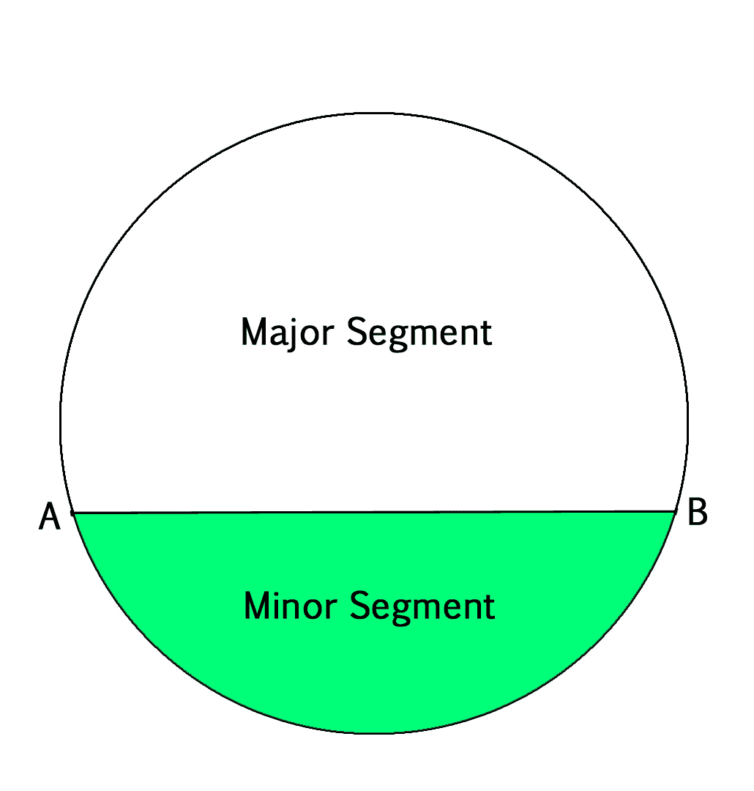
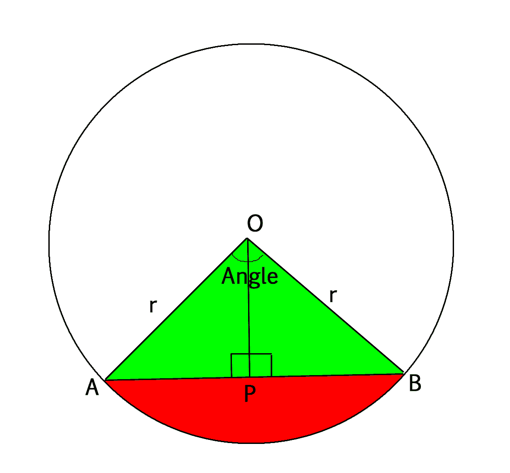
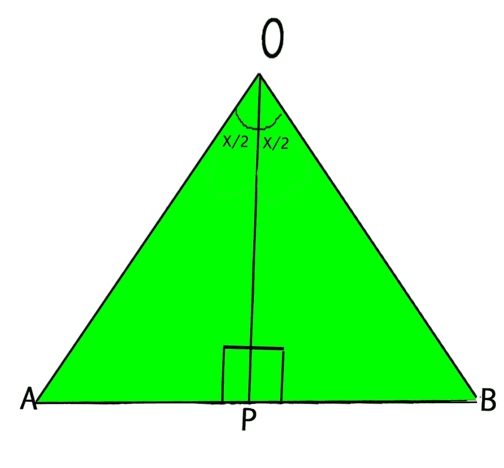

# 寻找圆形线段面积的程序

> 原文:[https://www . geesforgeks . org/program-find-area-circular-segment/](https://www.geeksforgeeks.org/program-find-area-circular-segment/)

在一个圆中，如果画了一个弦，那么这个弦将整个圆分成两部分。圆的这两部分称为圆的线段。较小的区域称为**小段**，较大的区域称为**大段**。
下图中，和弦 AB 将圆分为小段和大段。



给我们圆的半径和形成小段的角度。我们需要找到两段的区域。
示例:

```
Input : 
radius = 21.0
angle = 120.0
Output :
Area of minor segment 270.855
Area of major segment 1114.59

Input :
radius = 10.0
angle = 90.0
Output : 
Area of minor segment 28.5397
Area of major segment 285.619
```

#### **线段面积:**

为此，我们将弦的端点与圆心连接起来，形成一个扇形，在圆心处对着某个“角度”。从弦 AB 上的圆心画一条垂线。通过三角形的同余，我们得到≈AOP =≈BOP = 1/2(角)。



**线段面积公式:**

```
Area of Segment = Area of sector - Area of Triangle OAB 
                = pi * r2 * (angle/360) -
                  Area of Triangle OAB
```

扇形面积公式详见[https://www.geeksforgeeks.org/area-of-a-sector/](https://www.geeksforgeeks.org/area-of-a-sector/)。



```
In the figure above, assume angle made by sector = X,
so ∠ AOP = ∠ BOP = X/2

Area of Triangle AOB = 1/2 * base * height
                     = 1/2 * AB * OP

Now in Triangle AOP, By trigonometry
Cos(X/2) = OP/AO  i.e. OP = AO * Cos(X/2) 
                       OP = r * Cos(X/2)
Sin(X/2) = AP/AO  i.e. AP = AO * Sin(X/2) 
                       AP = r * Sin(X/2)

So,
Base = AB = AP + PB
          = 2 * AP
          = 2 * r * Sin(X/2)

Height = OP = r * Cos(X/2)

Area of triangle = 1/2 * (2 * r * Sin(X/2)) * (r * Cos(X/2))
                    = 1/2 * r2 * Sin(X) 
                      [Using identity 2 * Sin(A) * Cos(A)]
                    = Sin(2 * A))

Hence Area of Segment =  pi * r2 * (angle/360) - 1/2 * r2 * Sin(angle)
```

## C++

```
// C++ Program to
// find area of
// segment of a
// circle
#include <bits/stdc++.h>
using namespace std;

float pi = 3.14159;

// Function to find
// area of segment
float area_of_segment(float radius,
                      float angle)
{
    // Calculating area of sector
    float area_of_sector = pi *
                           (radius * radius)
                           *(angle / 360);

    // Calculating area of triangle
    float area_of_triangle = (float)1 / 2 *
                             (radius * radius) *
                             sin((angle * pi) / 180);

    return area_of_sector - area_of_triangle;
}

// Driver Code
int main()
{
    float radius = 10.0, angle = 90.0;
    cout << "Area of minor segment = "
        << area_of_segment(radius, angle) << endl;

    cout << "Area of major segment = "
        << area_of_segment(radius, (360 - angle));
}
```

## Java 语言(一种计算机语言，尤用于创建网站)

```
// Java Program to find area of
// segment of a circle
class GFG {
static float pi = 3.14159f;

static float area_of_segment(float radius,
                              float angle)
{
    // Calculating area of sector
    float area_of_sector = pi *
   (radius * radius) * (angle / 360);

    // Calculating area of triangle
    float area_of_triangle =
        (float)1 / 2 * (radius * radius) *
        (float)Math.sin((angle * pi) / 180);

    return area_of_sector - area_of_triangle;
}

// Driver Function
public static void main(String[] args)
{
    float radius = 10.0f, angle = 90.0f;
    System.out.println("Area of minor segment = " +
                    area_of_segment(radius, angle));

    System.out.println("Area of major segment = " +
                    area_of_segment(radius, (360 - angle)));
}
}

// This code is contributed by Anant Agarwal.
```

## 计算机编程语言

```
# Python3 Program
# to find area of
# segment of a
# circle
import math

pi = 3.14159

# Function to find
# area of segment
def area_of_segment(radius, angle):
    # Calculating area of sector
    area_of_sector = pi *
                     (radius * radius)
                     * (angle / 360)

    # Calculating area of triangle
    area_of_triangle = 1 / 2 *
                       (radius * radius) *
                       math.sin((angle * pi) / 180)

    return area_of_sector - area_of_triangle;

# Driver Code
radius = 10.0
angle = 90.0
print("Area of minor segment =",
       area_of_segment(radius, angle))
print("Area of major segment =",
      area_of_segment(radius, (360 - angle)))

# This code is contributed by Smitha Dinesh Semwal
```

## C#

```
// C# Program to find area
// of segment of a circle
using System;

class GFG {
      static float pi = 3.14159f;

      static float area_of_segment(float radius,
                                   float angle)
{
    // Calculating area of sector
    float area_of_sector = pi * (radius * radius)
                             * (angle / 360);

    // Calculating area of triangle
    float area_of_triangle =(float)1 / 2 * (radius * radius)
                            *(float)Math.Sin((angle * pi) / 180);

    return area_of_sector - area_of_triangle;
}

    // Driver Function
    public static void Main()
{
    float radius = 10.0f, angle = 90.0f;
    Console.WriteLine("Area of minor segment = " +
                        area_of_segment(radius, angle));

    Console.WriteLine("Area of major segment = " +
                       area_of_segment(radius, (360 - angle)));
}
}

// This code is contributed by vt_m.
```

## 服务器端编程语言（Professional Hypertext Preprocessor 的缩写）

```
<?php
// PHP Program to
// find area of
// segment of a
// circle

// Function to find
// area of segment
function area_of_segment($radius,
                          $angle)

{
    $pi = 3.14159;

    // Calculating area of sector
    $area_of_sector = $pi * ($radius * $radius) *
                                   ($angle / 360);

    // Calculating area of triangle
    $area_of_triangle = 1 / 2 *    ($radius * $radius)
                              * sin(($angle * $pi) / 180);

    return $area_of_sector - $area_of_triangle;
}

    // Driver Code
    $radius = 10.0;
    $angle = 90.0;
    echo ("Area of minor segment = ");
    echo( area_of_segment($radius, $angle));
    echo("\n");

    echo("Area of major segment = ");
    echo(area_of_segment($radius, (360 - $angle)));

// This code is contributed by vt_m.
?>
```

## java 描述语言

```
<script>

// javascript program to find area of
// segment of a circle
let pi = 3.14159;

function area_of_segment(radius,
                              angle)
{
    // Calculating area of sector
    let area_of_sector = pi *
   (radius * radius) * (angle / 360);

    // Calculating area of triangle
    let area_of_triangle =
        1 / 2 * (radius * radius) *
        Math.sin((angle * pi) / 180);

    return area_of_sector - area_of_triangle;
}

// Driver Function

         let radius = 10.0, angle = 90.0;
    document.write("Area of minor segment = " +
                    area_of_segment(radius, angle) + "<br/>");

    document.write("Area of major segment = " +
                    area_of_segment(radius, (360 - angle)));

    // This code is contributed by jana_sayantan.
</script>
```

输出:

```
Area of minor segment = 28.5397
Area of major segment = 285.619
```