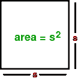

# 计算正方形面积的程序

> 原文:[https://www.geeksforgeeks.org/program-find-area-square/](https://www.geeksforgeeks.org/program-find-area-square/)

什么是正方形？
**正方形是**一个平面上的平面形状，由四个角上的四个点定义。正方形有四条等长的边和四个直角(90 度角)。正方形是一种长方形，但是所有的边都是相等的。



**公式:**

示例:

```
Input : 4
Output :16

Input :8
Output :64
```

## 卡片打印处理机（Card Print Processor 的缩写）

```
// CPP program to find the area of a square
#include <iostream>
using namespace std;

// function to find the area
int area_fun(int side)
{
int area = side * side;
return area;
}

// Driver program
int main()
{
int side = 4;
int area = area_fun(side);
cout << area;
return 0;
}
```

## Java 语言(一种计算机语言，尤用于创建网站)

```
// Java program to find
// the area of a square

class GFG
{

// function to find the area
static int area_fun(int side)
{
int area = side * side;
return area;
}

// Driver code
public static void main(String arg[])
{
    int side = 4;
    int area = area_fun(side);
    System.out.println(area);
}
}

// This code is contributed
// by Anant Agarwal.
```

## 蟒蛇 3

```
# Python program to find
# the area of a square

# function to find the area
def area_fun(side):
    area = side * side
    return area

# Driver program
side = 4
area = area_fun(side)
print (area)

# This Code is Contributed
# by Azkia Anam.
```

## C#

```
// C# program to find
// the area of a square
using System;

class GFG {

    // function to find the area
    static int area_fun(int side)
    {
        int area = side * side;
        return area;
    }

    // Driver code
    public static void Main()
    {
        int side = 4;
        int area = area_fun(side);
        Console.WriteLine(area);
    }
}

// This code is contributed by vt_m.
```

## 服务器端编程语言（Professional Hypertext Preprocessor 的缩写）

```
<?php
// PHP program to find the
// area of a square

// function to find the area
function area_fun($side)
{
    $area = $side * $side;
    return $area;
}

// Driver program
$side = 4;
$area = area_fun($side);
echo( $area);

// This code is contributed
// by vt_m.
?>
```

## java 描述语言

```
<script>

// Javascript program to find the area of a square

// function to find the area
function area_fun(side)
{
  let area = side * side;
  return area;
}

// Driver program
let side = 4;
let area = area_fun(side);
document.write(area);

// This code is contributed by Mayank Tyagi
</script>
```

输出:

```
16
```

本文由 **Ajay Puri** 供稿。如果你喜欢 GeeksforGeeks 并想投稿，你也可以使用[contribute.geeksforgeeks.org](http://www.contribute.geeksforgeeks.org)写一篇文章或者把你的文章邮寄到 contribute@geeksforgeeks.org。看到你的文章出现在极客博客主页上，帮助其他极客。
如果你发现任何不正确的地方，或者你想分享更多关于上述话题的信息，请写评论..