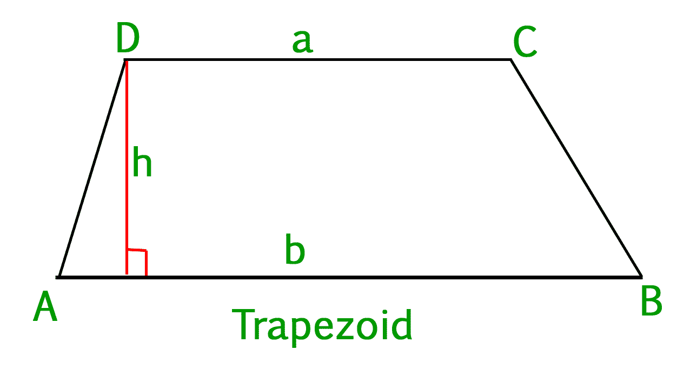
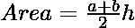

# 计算梯形面积的程序

> 原文:[https://www.geeksforgeeks.org/program-find-area-trapezoid/](https://www.geeksforgeeks.org/program-find-area-trapezoid/)

**梯形的定义:**
梯形是至少有一对平行边的凸四边形。平行的边称为梯形的底边，其他不平行的边称为边。也可以有两对碱基。



在上图中，CD || AB，所以它们形成了底座，另外两个侧面，即 AD 和 BC 形成了腿。
梯形的面积可以用这个简单的公式求:

### 

**a =基地**
**b =基地**
**h =高度**
**例:**

```
Input : base1 = 8, base2 = 10, height = 6
Output : Area is: 54.0

Input :base1 = 4, base2 = 20, height = 7
Output :Area is: 84.0
```

## C++

```
// C++ program to calculate
// area of a trapezoid
#include<bits/stdc++.h>
using namespace std;

// Function for the area
double Area(int b1, int b2,
                    int h)
{
    return ((b1 + b2) / 2) * h;
}

// Driver Code
int main()
{
    int base1 = 8, base2 = 10,
                height = 6;
    double area = Area(base1, base2,
                            height);
    cout << "Area is: " << area;
    return 0;
}

// This code is contributed by shivanisinghss2110
```

## C

```
// CPP program to calculate
// area of a trapezoid
#include <stdio.h>

// Function for the area
double Area(int b1, int b2,
                    int h)
{
    return ((b1 + b2) / 2) * h;
}

// Driver Code
int main()
{
    int base1 = 8, base2 = 10,
                   height = 6;
    double area = Area(base1, base2,
                              height);
    printf("Area is: %.1lf", area);
    return 0;
}
```

## Java 语言(一种计算机语言，尤用于创建网站)

```
// Java program to calculate
// area of a trapezoid
import java.io.*;

class GFG
{

    // Function for the area
    static double Area(int b1,
                       int b2,
                       int h)
    {
        return ((b1 + b2) / 2) * h;
    }

    // Driver Code
    public static void main (String[] args)
    {
        int base1 = 8, base2 = 10,
                       height = 6;
        double area = Area(base1, base2,
                                  height);
        System.out.println("Area is: " + area);
    }
}
```

## 蟒蛇 3

```
# Python program to calculate
# area of a trapezoid

# Function for the area
def Area(b1, b2, h):
    return ((b1 + b2) / 2) * h

# Driver Code
base1 = 8; base2 = 10; height = 6
area = Area(base1, base2, height)
print("Area is:", area)
```

## C#

```
// C# program to calculate
// area of a trapezoid
using System;

class GFG
{

    // Function for the area
    static double Area(int b1,
                       int b2,
                       int h)
    {
        return ((b1 + b2) / 2) * h;
    }

    // Driver Code
    public static void Main ()
    {
        int base1 = 8, base2 = 10,
                       height = 6;
        double area = Area(base1, base2,
                                  height);
        Console.WriteLine("Area is: " + area);
    }
}

// This code is contributed by vt_m
```

## 服务器端编程语言（Professional Hypertext Preprocessor 的缩写）

```
<?php
// PHP program to calculate
// area of a trapezoid

// Function for the area
function Area( $b1, $b2, $h)
{
    return (($b1 + $b2) / 2) * $h;
}

// Driver Code

    $base1 = 8; $base2 = 10;
    $height = 6;
    $area = Area($base1, $base2, $height);
    echo("Area is: ");
    echo($area);

// This code is contributed by vt_m.
?>
```

## java 描述语言

```
<script>

// Javascript program to calculate
// area of a trapezoid

// Function for the area
function Area(b1, b2, h)
{
    return ((b1 + b2) / 2) * h;
}

// Driver Code
    let base1 = 8, base2 = 10,
                height = 6;
    let area = Area(base1, base2,
                            height);
    document.write("Area is: " + area);

// This code is contributed by Mayank Tyagi
</script>
```

**输出:**

```
Area is: 54.0
```