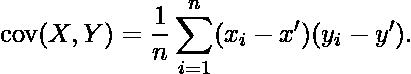

# 计算协方差的程序

> 原文:[https://www.geeksforgeeks.org/program-find-covariance/](https://www.geeksforgeeks.org/program-find-covariance/)

给定两组随机变量，求协方差。协方差是衡量两个随机变量一起变化的程度。这类似于方差，但方差告诉你单个变量如何变化，协方差告诉你两个变量如何一起变化。协方差可以用公式

计算，其中 x’和 y’是两个给定集合的平均值。

示例:

```
Input : arr1[] = {65.21, 64.75, 65.26, 65.76, 65.96}
        arr2[] = {67.25, 66.39, 66.12, 65.70, 66.64}
Output : -0.0580511

Input : arr1[] = {5, 20, 40, 80, 100}
        arr2[] = {10, 24, 33, 54, 10}
Output : 187.75
```

## C++

```
// C++ Program to find
// covariance of two set.
#include<bits/stdc++.h>
using namespace std;

// Function to find mean.
float mean(float arr[], int n)
{
    float sum = 0;
    for(int i = 0; i < n; i++)
        sum = sum + arr[i];
    return sum / n;
}

// Function to find covariance.
float covariance(float arr1[], float arr2[], int n)
{
    float sum = 0;
      float mean_arr1 = mean(arr1,n);
      float mean_arr2 = mean(arr2,n);
    for(int i = 0; i < n; i++)
        sum = sum + (arr1[i] - mean_arr1) *
                    (arr2[i] - mean_arr2);
    return sum / (n - 1);
}

// Driver function.
int main()
{
    float arr1[] = {65.21, 64.75, 65.26, 65.76, 65.96};
    int n = sizeof(arr1) / sizeof(arr1[0]);

    float arr2[] = {67.25, 66.39, 66.12, 65.70, 66.64};
    int m = sizeof(arr2) / sizeof(arr2[0]);

    if (m == n)
        cout << covariance(arr1, arr2, m);
    return 0;
}
```

## Java 语言(一种计算机语言，尤用于创建网站)

```
// Java Program to find
// covariance of two set.
import java.io.*;

class GFG {

// Function to find mean.
static float mean(float arr[], int n)
{
    float sum = 0;

    for(int i = 0; i < n; i++)
        sum = sum + arr[i];

    return sum / n;
}

// Function to find covariance.
static float covariance(float arr1[],
                    float arr2[], int n)
{
    float sum = 0;
       float mean_arr1 = mean(arr1,n);
      float mean_arr2 = mean(arr2,n);

    for(int i = 0; i < n; i++)
        sum = sum + (arr1[i] - mean_arr1) *
                        (arr2[i] - mean_arr2);
    return sum / (n - 1);
}

// Driver code
    public static void main (String[] args) {

    float arr1[] = {65.21f, 64.75f,
               65.26f, 65.76f, 65.96f};
    int n = arr1.length;

    float arr2[] = {67.25f, 66.39f,
                66.12f, 65.70f, 66.64f};

    int m = arr2.length;

    if (m == n)

    System.out.println(covariance(arr1, arr2, m));

    }
}

// This code is contributed by Gitanjali.
```

## 蟒蛇 3

```
# Python3 Program to find
# covariance of two set.
import math

# Function to find mean.

def mean(arr, n):

    sum = 0
    for i in range(0, n):
        sum = sum + arr[i]

    return sum / n

# Function to find covariance.

def covariance(arr1, arr2, n):

    sum = 0
    mean_arr1 = mean(arr1, n)
    mean_arr2 = mean(arr2, n)
    for i in range(0, n):
        sum = (sum + (arr1[i] - mean_arr1) *
               (arr2[i] - mean_arr2))

    return sum / (n - 1)

# Driver method
arr1 = [65.21, 64.75, 65.26, 65.76, 65.96]
n = len(arr1)

arr2 = [67.25, 66.39, 66.12, 65.70, 66.64]
m = len(arr2)

if (m == n):
    print(covariance(arr1, arr2, m))

# This code is contributed by Gitanjali.
```

## C#

```
// C# Program to find
// covariance of two set.
using System;

class GFG {

    // Function to find mean.
    static float mean(float []arr, int n)
    {
        float sum = 0;

        for(int i = 0; i < n; i++)
            sum = sum + arr[i];

        return sum / n;
    }

    // Function to find covariance.
    static float covariance(float []arr1,
                        float []arr2, int n)
    {
        float sum = 0;
          float mean_arr1 = mean(arr1,n);
          float mean_arr2 = mean(arr2,n);   
        for(int i = 0; i < n; i++)
            sum = sum + (arr1[i] - mean_arr1) *
                            (arr2[i] - mean_arr2);
        return sum / (n - 1);
    }

    // Driver code
    public static void Main () {

        float []arr1 = {65.21f, 64.75f,
                65.26f, 65.76f, 65.96f};
        int n = arr1.Length;

        float []arr2 = {67.25f, 66.39f,
                    66.12f, 65.70f, 66.64f};

        int m = arr2.Length;

        if (m == n)

        Console.WriteLine(covariance(arr1, arr2, m));

    }
}

// This code is contributed by vt_m.
```

## 服务器端编程语言（Professional Hypertext Preprocessor 的缩写）

```
<?php
// PHP Program to find
// covariance of two set.

// Function to find mean.
function mean( $arr, $n)
{
    $sum = 0;
    for( $i = 0; $i < $n; $i++)
        $sum = $sum + $arr[$i];
    return $sum / $n;
}

// Function to find covariance.
function covariance( $arr1, $arr2, $n)
{
    $sum = 0;
    $mean_arr1 = mean($arr1,$n);
      $mean_arr2 = mean($arr2,$n);
    for( $i = 0; $i < $n; $i++)
        $sum = $sum + ($arr1[$i] -
                 $mean_arr1) *
                      ($arr2[$i] -
                  $mean_arr2);
    return $sum / ($n - 1);
}

// Driver function.
$arr1 = array(65.21, 64.75, 65.26,
                        65.76, 65.96);
$n = count($arr1);

$arr2 = array(67.25, 66.39, 66.12,
                        65.70, 66.64);
$m =count($arr2);

if ($m == $n)
    echo covariance($arr1, $arr2, $m);

// This code is contributed by anuj_67.
?>
```

## java 描述语言

```
<script>

// Javascript program to find
// covariance of two set.

// Function to find mean.
function mean(arr, n)
{
    let sum = 0;
    for(let i = 0; i < n; i++)
        sum = sum + arr[i];

    return sum / n;
}

// Function to find covariance.
function covariance(arr1, arr2, n)
{
    let sum = 0;
     let mean_arr1 = mean(arr1, n);
    let mean_arr2 = mean(arr2, n);
    for(let i = 0; i < n; i++)
        sum = sum + (arr1[i] - mean_arr1) *
                    (arr2[i] - mean_arr2);

    return sum / (n - 1);
}

// Driver code
let arr1 = [ 65.21, 64.75, 65.26, 65.76, 65.96 ];
let n = arr1.length;

let arr2 = [ 67.25, 66.39, 66.12, 65.70, 66.64 ];
let m = arr2.length;

if (m == n)
    document.write(covariance(arr1, arr2, m));

// This code is contributed by souravmahato348

</script>
```

**输出:**

```
-0.0580511
```

**时间复杂度:**O(N)
T3】辅助空间: O(1)