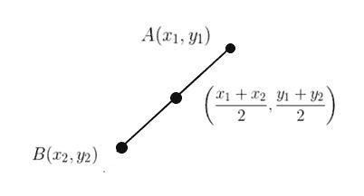

# 程序寻找一条线的中点

> 原文:[https://www.geeksforgeeks.org/program-find-mid-point-line/](https://www.geeksforgeeks.org/program-find-mid-point-line/)

给定一条线的两个坐标，起点是(x1，y1)，终点是(x2，y2)，找出这条线的中点。
**例:**

```
Input  : x1 = –1, y1 = 2, 
         x2 = 3, y2 = –6
Output : 1,–2

Input  : x1 = 6.4, y1 = 3 
         x2 = –10.7, y2 = 4
Output : –2.15, 3.5
```



**中点公式:**两点的中点，(x1，y2)和(x2，y2)是由以下公式求出的 M 点:**M =((x<sub>1</sub>+x<sub>2</sub>)/2、(y<sub>1</sub>+y<sub>2</sub>)/2)**

## C++

```
// C++ program to find
// the midpoint of a line
#include<iostream>
using namespace std;

// function to find the
// midpoint of a line
void midpoint(int x1, int x2,
                int y1, int y2)
{
    cout << (float)(x1+x2)/2 <<
            " , "<< (float)(y1+y2)/2 ;
}

// Driver Function to test above
int main()
{
    int x1 =-1, y1 = 2  ;
    int x2 = 3, y2 = -6 ;   
    midpoint(x1, x2, y1, y2);   
    return 0;
}
```

## Java 语言(一种计算机语言，尤用于创建网站)

```
// Java program to find
// the midpoint of a line
import java.io.*;

class GFG
{
    // function to find the
    // midpoint of a line
    static void midpoint(int x1, int x2,
                          int y1, int y2)
    {
        System.out.print((x1 + x2) / 2 +
                        " , " + (y1 + y2) / 2) ;
    }

    // Driver code
    public static void main (String[] args)
    {
        int x1 =-1, y1 = 2 ;
        int x2 = 3, y2 = -6 ;
        midpoint(x1, x2, y1, y2);

    }
}

// This code is contributed by vt_m.
```

## 蟒蛇 3

```
# Python3 program to find
# the midpoint of a line

# Function to find the
# midpoint of a line
def midpoint(x1, x2, y1, y2):

    print((x1 + x2) // 2, " , ",
                 (y1 + y2) // 2)

# Driver Code
x1, y1, x2, y2 = -1, 2, 3, -6
midpoint(x1, x2, y1, y2)

# This code is contributed by Anant Agarwal.
```

## C#

```
// C# program to find
// the midpoint of a line
using System;

class GFG
{
    // function to find the
    // midpoint of a line
    static void midpoint(int x1, int x2,
                        int y1, int y2)
    {
        Console.WriteLine((x1 + x2) / 2 +
                        " , " + (y1 + y2) / 2) ;
    }

    // Driver code
    public static void Main ()
    {
        int x1 =-1, y1 = 2 ;
        int x2 = 3, y2 = -6 ;

        midpoint(x1, x2, y1, y2);

    }
}

// This code is contributed by vt_m.
```

## 服务器端编程语言（Professional Hypertext Preprocessor 的缩写）

```
<?php
// PHP program to find
// the midpoint of a line

// function to find the
// midpoint of a line
function midpoint($x1, $x2, $y1, $y2)
{
    echo((float)($x1 + $x2)/2 . " , " .
                (float)($y1 + $y2)/2) ;
}

// Driver Code
$x1 = -1; $y1 = 2 ;
$x2 = 3; $y2 = -6 ;    
midpoint($x1, $x2, $y1, $y2);

// This code is contributed by Ajit.
?>
```

## java 描述语言

```
<script>

// JavaScript program to find
// the midpoint of a line

// function to find the
    // midpoint of a line
    function midpoint(x1, x2,
                          y1, y2)
    {
        document.write((x1 + x2) / 2 +
                        " , " + (y1 + y2) / 2) ;
    }

// Driver code

        let x1 =-1, y1 = 2 ;
        let x2 = 3, y2 = -6 ;
        midpoint(x1, x2, y1, y2);

</script>
```

**输出:**

```
1 , -2
```