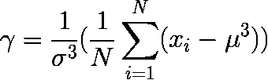

# 统计数据的偏斜度

> 原文:[https://www . geesforgeks . org/program-find-skew ness-statistical-data/](https://www.geeksforgeeks.org/program-find-skewness-statistical-data/)

给定数组中的数据。找出数据分布的偏斜度。
**偏斜度**是对数据分布不对称性的度量。偏斜度是统计分布中的一种不对称，其中曲线向左或向右扭曲或歪斜。偏斜度可以被量化来定义一个分布不同于正态分布的程度。偏斜度可计算为



```
Where gamma is called skewness
      sigma is called standard deviation and sigma square can be calculated as

```


```
      N is number of population and
      mu is called mean of data.  
```

**例:**

```
Input : arr[] = {2.5, 3.7, 6.6, 9.1, 9.5, 10.7, 11.9, 21.5, 22.6, 25.2}
Output : 0.777001

Input : arr[] = {5, 20, 40, 80, 100}
Output : 0.0980392
```

更多关于偏斜度
[【https://en.wikipedia.org/wiki/Skewness】](https://en.wikipedia.org/wiki/Skewness)
[的信息](https://www.universalclass.com/articles/math/statistics/skewness-in-statistical-terms.htm)

## C++

```
// CPP code to find skewness
// of statistical data.

#include<bits/stdc++.h>
using namespace std;

// Function to calculate
// mean of data.
float mean(float arr[], int n)
{
    float sum = 0;
    for (int i = 0; i < n; i++)
        sum = sum + arr[i];       
    return sum / n;
}

// Function to calculate standard
// deviation of data.
float standardDeviation(float arr[],
                        int n)
{
    float sum = 0;

    // find standard deviation
    // deviation of data.
    for (int i = 0; i < n; i++)
        sum = (arr[i] - mean(arr, n)) *
              (arr[i] - mean(arr, n));

    return sqrt(sum / n);
}

// Function to calculate skewness.
float skewness(float arr[], int n)
{  
    // Find skewness using above formula
    float sum = 0;
    for (int i = 0; i < n; i++)
        sum = (arr[i] - mean(arr, n)) *
              (arr[i] - mean(arr, n)) *
              (arr[i] - mean(arr, n));             
    return sum / (n * standardDeviation(arr, n) *
                 standardDeviation(arr, n) *
                 standardDeviation(arr, n) *
                 standardDeviation(arr, n));
}

// Driver function
int main()
{
    float arr[] = {2.5, 3.7, 6.6, 9.1,
                   9.5, 10.7, 11.9, 21.5,
                   22.6, 25.2};

    // calculate size of array.
    int n = sizeof(arr)/sizeof(arr[0]);

    // skewness Function call
    cout << skewness(arr, n);

    return 0;
}
```

## Java 语言(一种计算机语言，尤用于创建网站)

```
// java code to find skewness
// of statistical data.
import java.io.*;

class GFG {

    // Function to calculate
    // mean of data.
    static double mean(double arr[], int n)
    {
        double sum = 0;

        for (int i = 0; i < n; i++)
            sum = sum + arr[i];

        return sum / n;
    }

    // Function to calculate standard
    // deviation of data.
    static double standardDeviation(double arr[],
                                            int n)
    {

        double sum = 0 ;

        // find standard deviation
        // deviation of data.
        for (int i = 0; i < n; i++)
            sum = (arr[i] - mean(arr, n)) *
                        (arr[i] - mean(arr, n));

        return Math.sqrt(sum / n);
    }

    // Function to calculate skewness.
    static double skewness(double arr[], int n)
    {
        // Find skewness using
        // above formula
        double sum = 0;

        for (int i = 0; i < n; i++)
            sum = (arr[i] - mean(arr, n)) *
                    (arr[i] - mean(arr, n)) *
                        (arr[i] - mean(arr, n));            

        return sum / (n * standardDeviation(arr, n) *
                          standardDeviation(arr, n) *
                          standardDeviation(arr, n) *
                          standardDeviation(arr, n));
    }

    // Driver function
    public static void main (String[] args)
    {
        double arr[] = { 2.5, 3.7, 6.6, 9.1,
                        9.5, 10.7, 11.9, 21.5,
                                   22.6, 25.2 };

        // calculate size of array.
        int n = arr.length;

        // skewness Function call
        System.out.println(skewness(arr, n));
    }
}

//This code is contributed by vt_m
```

## 蟒蛇 3

```
# Python3 code to find skewness
# of statistical data.
from math import sqrt

# Function to calculate
# mean of data.
def mean(arr, n):

    summ = 0
    for i in range(n):
        summ = summ + arr[i]    
    return summ / n

# Function to calculate standard
# deviation of data.
def standardDeviation(arr,n):

    summ = 0

    # find standard deviation
    # deviation of data.
    for i in range(n):
        summ = (arr[i] - mean(arr, n)) *(arr[i] - mean(arr, n))

    return sqrt(summ / n)

# Function to calculate skewness.
def skewness(arr, n):

    # Find skewness using above formula
    summ = 0
    for i in range(n):
        summ = (arr[i] - mean(arr, n))*(arr[i] - mean(arr, n))*(arr[i] - mean(arr, n))
    return summ / (n * standardDeviation(arr, n) *standardDeviation(arr, n) *standardDeviation(arr, n) * standardDeviation(arr, n))

# Driver function

arr = [2.5, 3.7, 6.6, 9.1,9.5, 10.7, 11.9, 21.5,22.6, 25.2]

# calculate size of array.
n = len(arr)

# skewness Function call
print('%.6f'%skewness(arr, n))

# This code is contributed by shubhamsingh10
```

## C#

```
// C# code to find skewness
// of statistical data.
using System;

class GFG {

    // Function to calculate
    // mean of data.
    static float mean(double []arr, int n)
    {
        double sum = 0;

        for (int i = 0; i < n; i++)
            sum = sum + arr[i];

        return (float)sum / n;
    }

    // Function to calculate standard
    // deviation of data.
    static float standardDeviation(double []arr,
                                            int n)
    {

        double sum = 0 ;

        // find standard deviation
        // deviation of data.
        for (int i = 0; i < n; i++)
            sum = (arr[i] - mean(arr, n)) *
                  (arr[i] - mean(arr, n));

        return (float)Math.Sqrt(sum / n);
    }

    // Function to calculate skewness.
    static float skewness(double []arr, int n)
    {
        // Find skewness using
        // above formula
        double sum = 0;

        for (int i = 0; i < n; i++)
            sum = (arr[i] - mean(arr, n)) *
                  (arr[i] - mean(arr, n)) *
                  (arr[i] - mean(arr, n));            

        return (float)sum / (n * standardDeviation(arr, n) *
                        standardDeviation(arr, n) *
                        standardDeviation(arr, n) *
                        standardDeviation(arr, n));
    }

    // Driver function
    public static void Main ()
    {
        double []arr = { 2.5, 3.7, 6.6, 9.1,
                        9.5, 10.7, 11.9, 21.5,
                                22.6, 25.2 };

        // calculate size of array.
        int n = arr.Length;

        // skewness Function call
        Console.WriteLine(skewness(arr, n));
    }
}

// This code is contributed by vt_m
```

## 服务器端编程语言（Professional Hypertext Preprocessor 的缩写）

```
<?php
// PHP code to find skewness
// of statistical data.

// Function to calculate
// mean of data.
function mean( $arr, $n)
{
    $sum = 0;
    for ($i = 0; $i < $n; $i++)
        $sum = $sum + $arr[$i];
    return $sum / $n;
}

// Function to calculate standard
// deviation of data.
function standardDeviation($arr, $n)
{
    $sum = 0;

    // find standard deviation
    // deviation of data.
    for ($i = 0; $i < $n; $i++)
        $sum = ($arr[$i] - mean($arr, $n)) *
               ($arr[$i] - mean($arr, $n));

    return sqrt($sum / $n);
}

// Function to calculate skewness.
function skewness($arr, $n)
{
    // Find skewness using above formula
    $sum = 0;
    for ($i = 0; $i < $n; $i++)
        $sum = ($arr[$i] - mean($arr, $n)) *
               ($arr[$i] - mean($arr, $n)) *
               ($arr[$i] - mean($arr, $n));            
    return $sum / ($n * standardDeviation($arr, $n) *
                        standardDeviation($arr, $n) *
                        standardDeviation($arr, $n) *
                        standardDeviation($arr, $n));
}

// Driver Code
$arr = array(2.5, 3.7, 6.6, 9.1, 9.5,
             10.7, 11.9, 21.5, 22.6, 25.2);

// calculate size of array.
$n = count($arr);

// skewness Function call
echo skewness($arr, $n);

// This code is contributed by vt_m
?>
```

## java 描述语言

```
<script>

    // JavaScript code to find skewness
    // of statistical data.

    // Function to calculate
    // mean of data.
    function mean(arr, n)
    {
        let sum = 0;

        for (let i = 0; i < n; i++)
            sum = sum + arr[i];

        return sum / n;
    }

    // Function to calculate standard
    // deviation of data.
    function standardDeviation(arr, n)
    {

        let sum = 0 ;

        // find standard deviation
        // deviation of data.
        for (let i = 0; i < n; i++)
            sum = (arr[i] - mean(arr, n)) *
                  (arr[i] - mean(arr, n));

        return Math.sqrt(sum / n);
    }

    // Function to calculate skewness.
    function skewness(arr, n)
    {
        // Find skewness using
        // above formula
        let sum = 0;

        for (let i = 0; i < n; i++)
            sum = (arr[i] - mean(arr, n)) *
                  (arr[i] - mean(arr, n)) *
                  (arr[i] - mean(arr, n));            

        return sum / (n * standardDeviation(arr, n) *
                        standardDeviation(arr, n) *
                        standardDeviation(arr, n) *
                        standardDeviation(arr, n));
    }

    let arr =
    [ 2.5, 3.7, 6.6, 9.1, 9.5, 10.7, 11.9, 21.5, 22.6, 25.2 ];

    // calculate size of array.
    let n = arr.length;

    // skewness Function call
    document.write(skewness(arr, n).toFixed(6));

</script>
```

**输出:**

```
0.777001
```