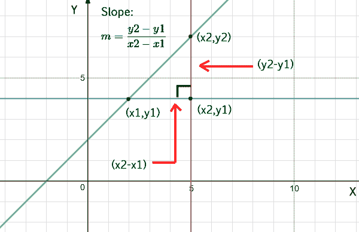

# 求直线斜率的程序

> 原文:[https://www.geeksforgeeks.org/program-find-slope-line/](https://www.geeksforgeeks.org/program-find-slope-line/)

给定两个坐标，求直线的[斜率](https://en.wikipedia.org/wiki/Slope)。

示例:

```
Input  : x1 = 4, y1 = 2, 
         x2 = 2, y2 = 5 
Output : Slope is -1.5
```

**方法:**要计算一条线的斜率，只需要该线的两点，(x1，y1)和(x2，y2)。用于从两点计算斜率的方程是:



*以下是上述方法的实现:*

## C++

```
// C++ program for slope of line
#include <bits/stdc++.h>
using namespace std;

// function to find the slope of a straight line
float slope(float x1, float y1, float x2, float y2)
{
    return (y2 - y1) / (x2 - x1);
}

// driver code to check the above function
int main()
{
    float x1 = 4, y1 = 2;
    float x2 = 2, y2 = 5;
    cout << "Slope is: "
         << slope(x1, y1, x2, y2);
    return 0;
}
```

## Java 语言(一种计算机语言，尤用于创建网站)

```
// Java program for slope of line
import java.io.*;

class GFG {
    static float slope(float x1, float y1,
                       float x2, float y2)
    {
        return (y2 - y1) / (x2 - x1);
    }
    public static void main(String[] args)
    {
        float x1 = 4, y1 = 2;
        float x2 = 2, y2 = 5;
        System.out.println("Slope is " +
                    slope(x1, y1, x2, y2));
    }
}
```

## 计算机编程语言

```
# Python program for slope of line
def slope(x1, y1, x2, y2):
    return (float)(y2-y1)/(x2-x1)

# driver code   
x1 = 4
y1 = 2
x2 = 2
y2 = 5
print "Slope is :", slope(x1, y1, x2, y2)
```

## C#

```
// C# program for slope of line
using System;

class GFG
{
    static float slope(float x1, float y1,
                       float x2, float y2)
    {
        return (y2 - y1) / (x2 - x1);
    }

    // Driver code
    public static void Main()
    {
        float x1 = 4, y1 = 2;
        float x2 = 2, y2 = 5;
        Console.WriteLine("Slope is " +
                    slope(x1, y1, x2, y2));
    }
}

// This code is contributed by vt_m.
```

## 服务器端编程语言（Professional Hypertext Preprocessor 的缩写）

```
<?php
// PHP program for
// slope of line

// function to find the
// slope of a straight line
function slope($x1, $y1, $x2, $y2)
{
    return ($y2 - $y1) /
           ($x2 - $x1);
}

    // Driver Code
    $x1 = 4;
    $y1 = 2;
    $x2 = 2;
    $y2 = 5;
    echo "Slope is: "
         , slope($x1, $y1,
                 $x2, $y2);

// This code is contributed by anuj_67.
?>
```

## java 描述语言

```
<script>
// javascript program for slope of line

    function slope(x1, y1,
                       x2, y2)
    {
        return (y2 - y1) / (x2 - x1);
    }

// Driver code
         let x1 = 4, y1 = 2;
        let x2 = 2, y2 = 5;
        document.write("Slope is " +
                    slope(x1, y1, x2, y2));

   // This code is contributed by susmitakundugoaldanga.
</script>
```

**Output**

```
Slope is: -1.5
```

**时间复杂度:** O(1)

**辅助空间:** O(1)

**<u>特例:</u>** 当 int 函数 x1 等于 x2 (x1==x2)时，上面的代码会抛出一个运行时错误。在这种情况下，我们的分母将变成零(0)。为了避免这种情况，我们将在斜率函数中添加一个条件。

## C++

```
// C++ program for slope of line
#include <bits/stdc++.h>
using namespace std;

// function to find the slope of a straight line
float slope(float x1, float y1, float x2, float y2)
{
    if(x1 == x2)
        return INT_MAX;
    return (y2 - y1) / (x2 - x1);
}

// driver code to check the above function
int main()
{
    float x1 = 4, y1 = 2;
    float x2 = 2, y2 = 5;
    cout << "Slope is: "
         << slope(x1, y1, x2, y2);
    return 0;
}
```

## Java 语言(一种计算机语言，尤用于创建网站)

```
// Java program for slope of line

import java.util.*;

class GFG {

    // function to find the slope of a straight line
    static float slope(float x1, float y1, float x2, float y2) {
        if (x1 == x2)
            return Integer.MAX_VALUE;
        return (y2 - y1) / (x2 - x1);
    }

    // driver code to check the above function
    public static void main(String[] args) {
        float x1 = 4, y1 = 2;
        float x2 = 2, y2 = 5;
        System.out.print("Slope is: " + slope(x1, y1, x2, y2));
    }
}

// This code contributed by Rajput-Ji
```

## 蟒蛇 3

```
# Python3 program to find slope
import sys

# Function to find the slope of a straight line
def slope(x1, y1, x2, y2):

    if x1 == x2:
        return (sys.maxsize)

    return ((y2 - y1) / (x2 - x1))

# Driver code
x1 = 4
y1 = 2
x2 = 2
y2 = 5

print("Slope is :", slope(4, 2, 2, 5))

# This code is contributed by vaishaligoyal878
```

## C#

```
// C# program for slope of line
using System;
class GFG {

    // function to find the slope of a straight line
    static float slope(float x1, float y1, float x2, float y2) {
        if (x1 == x2)
            return 1000000000;
        return (y2 - y1) / (x2 - x1);
    }

    // driver code to check the above function
    public static void Main(string[] args) {
        float x1 = 4, y1 = 2;
        float x2 = 2, y2 = 5;
        Console.Write("Slope is: " + slope(x1, y1, x2, y2));
    }
}

// This code is contributed by famously.
```

## java 描述语言

```
<script>
// javascript program for slope of line
// function to find the slope of a straight line
    function slope(x1 , y1 , x2 , y2) {
        if (x1 == x2)
            return Number.MAX_VALUE;
        return (y2 - y1) / (x2 - x1);
    }

    // driver code to check the above function   
        var x1 = 4, y1 = 2;
        var x2 = 2, y2 = 5;
        document.write("Slope is: " + slope(x1, y1, x2, y2));

// This code is contributed by Rajput-Ji
</script>
```

**Output**

```
Slope is: -1.5
```

**时间复杂度:** O(1)

**辅助空间:** O(1)