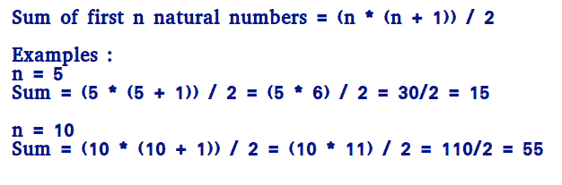

# 求前 n 个自然数之和的程序

> 原文:[https://www . geesforgeks . org/program-find-sum-first-n-natural-numbers/](https://www.geeksforgeeks.org/program-find-sum-first-n-natural-numbers/)

给定一个数 n，求第一个自然数的和。


**示例:**

```
Input : n = 3
Output : 6
Explanation :
Note that 1 + 2 + 3 = 6

Input  : 5
Output : 15 
Explanation :
Note that 1 + 2 + 3 + 4 + 5 = 15
```

一个**简单的解决方法**就是做以下几点。

```
1) Initialize : sum = 0
2) Run a loop from x = 1 to n and 
   do following in loop.
     sum = sum + x 
```

## C++

```
// CPP program to find sum of first
// n natural numbers.
#include<iostream>
using namespace std;

// Returns sum of first n natural
// numbers
int findSum(int n)
{
   int sum = 0;
   for (int x=1; x<=n; x++)
     sum = sum + x;
   return sum;
}

// Driver code
int main()
{
  int n = 5;
  cout << findSum(n);
  return 0;
}
```

## Java 语言(一种计算机语言，尤用于创建网站)

```
// JAVA program to find sum of first
// n natural numbers.
import java.io.*;

class GFG{

    // Returns sum of first n natural
    // numbers
    static int findSum(int n)
    {
        int sum = 0;
        for (int x = 1; x <= n; x++)
            sum = sum + x;
        return sum;
    }

    // Driver code
    public static void main(String args[])
    {
        int n = 5;
        System.out.println(findSum(n));
    }
}

// This code is contributed by Nikita Tiwari.
```

## 计算机编程语言

```
# PYTHON program to find sum of first
# n natural numbers.

# Returns sum of first n natural
# numbers
def findSum(n) :
    sum = 0
    x = 1
    while x <=n :
        sum = sum + x
        x = x + 1
    return sum

# Driver code

n = 5
print findSum(n)

# This code is contributed by Nikita Tiwari.
```

## C#

```
// C# program to find sum of first
// n natural numbers.
using System;

class GFG{

    // Returns sum of first n natural
    // numbers
    static int findSum(int n)
    {
        int sum = 0;
        for (int x = 1; x <= n; x++)
            sum = sum + x;
        return sum;
    }

    // Driver code
    public static void Main()
    {
        int n = 5;
        Console.Write(findSum(n));
    }
}

// This code is contributed by vt_m.
```

## 服务器端编程语言（Professional Hypertext Preprocessor 的缩写）

```
<?php
// PHP program to find sum of first
// n natural numbers.

// Returns sum of first n natural
// numbers
function findSum($n)
{
$sum = 0;
for ($x = 1; $x <= $n; $x++)
    $sum = $sum + $x;
return $sum;
}

// Driver code
$n = 5;
echo findSum($n);

// This code is contributed by Sam007
?>
```

## java 描述语言

```
<script>
// Javascript program to find sum of first
// n natural numbers.

// Returns sum of first n natural
// numbers
function findSum(n)
{
   let sum = 0;
   for (let x = 1; x <= n; x++)
     sum = sum + x;
   return sum;
}

// Driver code
let n = 5;
document.write(findSum(n));

// This code is contributed by rishavmahato348.
</script>
```

**输出:**

```
15
```

***时间复杂度:** O(n)*

***辅助空间:** O(1)*
一个**高效的解决方案**就是用下面的公式。



**这是如何工作的？**

```
We can prove this formula using induction.

It is true for n = 1 and n = 2
For n = 1, sum = 1 * (1 + 1)/2 = 1
For n = 2, sum = 2 * (2 + 1)/2 = 3

Let it be true for k = n-1.

Sum of k numbers = (k * (k+1))/2
Putting k = n-1, we get
Sum of k numbers = ((n-1) * (n-1+1))/2
                 = (n - 1) * n / 2

If we add n, we get,
Sum of n numbers = n + (n - 1) * n / 2
                 = (2n + n2 - n)/2
                 = n * (n + 1)/2
```

## C++

```
// Efficient CPP program to find sum of first
// n natural numbers.
#include<iostream>
using namespace std;

// Returns sum of first n natural
// numbers
int findSum(int n)
{
   return n * (n + 1) / 2;
}

// Driver code
int main()
{
  int n = 5;
  cout << findSum(n);
  return 0;
}
```

## Java 语言(一种计算机语言，尤用于创建网站)

```
// Efficient JAVA program to find sum
// of first n natural numbers.
import java.io.*;

class GFG{

    // Returns sum of first n natural
    // numbers
    static int findSum(int n)
    {
        return n * (n + 1) / 2;
    }

    // Driver code
    public static void main(String args[])
    {
        int n = 5;
        System.out.println(findSum(n));
    }
}

// This code is contributed by Nikita Tiwari.
```

## 计算机编程语言

```
# Efficient CPP program to find sum
# of first n natural numbers.

# Returns sum of first n natural
# numbers
def findSum(n) :
    return n * (n + 1) / 2

# Driver code
n = 5
print findSum(n)

# This code is contributed by Nikita Tiwari.
```

## C#

```
// Efficient C# program to find sum
// of first n natural numbers.
using System;

class GFG{

    // Returns sum of first n natural
    // numbers
    static int findSum(int n)
    {
        return n * (n + 1) / 2;
    }

    // Driver code
    public static void Main()
    {
        int n = 5;
        Console.Write(findSum(n));
    }
}

// This code is contributed by vt_m.
```

## 服务器端编程语言（Professional Hypertext Preprocessor 的缩写）

```
<?php
// Efficient PHP program to find sum
// of first n natural numbers.

// Returns sum of first n natural
// numbers
function findSum($n)
{
    return ($n * ($n + 1) / 2);
}

// Driver code
$n = 5;
echo findSum($n);

// This code is contributed by Sam007
?>
```

## java 描述语言

```
<script>
// javascript Program to find the average
// of sum of first n natural numbers

// Return the average of sum
// of first n even numbers
function findSum(n)
{
    return n * (n + 1) / 2;
}
var n = 5;
document.write(findSum(n));

// This code is contributed by sravan kumar
</script>
```

**输出:**

```
15
```

***时间复杂度:** O(1)*

***辅助空间:** O(1)*
**以上程序导致溢出，即使结果没有超出整数限制**。我们可以通过先做除法在一定程度上避免溢出。

## C++

```
// Efficient CPP program to find sum of first
// n natural numbers that avoids overflow if
// result is going to be within limits.
#include<iostream>
using namespace std;

// Returns sum of first n natural
// numbers
int findSum(int n)
{
   if (n % 2 == 0)
      return (n/2) * (n+1);

   // If n is odd, (n+1) must be even
   else
      return  ((n + 1) / 2) * n;
}

// Driver code
int main()
{
  int n = 5;
  cout << findSum(n);
  return 0;
}
```

## Java 语言(一种计算机语言，尤用于创建网站)

```
// Efficient JAVA program to find sum of first
// n natural numbers that avoids overflow if
// result is going to be within limits.
import java.io.*;

class GFG{

    // Returns sum of first n natural
    // numbers
    static int findSum(int n)
    {
        if (n % 2 == 0)
            return (n / 2) * (n + 1);

        // If n is odd, (n+1) must be even
        else
            return ((n + 1) / 2) * n;
    }

    // Driver code
    public static void main(String args[])
    {
        int n = 5;
        System.out.println(findSum(n));
    }
}

//This code is contributed by Nikita Tiwari.
```

## 计算机编程语言

```
# Efficient Python program to find the sum 
# of first n natural numbers that avoid
# overflow if the result is going to be
# within limits.

# Returns sum of first n natural
# numbers
def findSum(n) :
    if (n % 2 == 0) :
        return (n / 2) * (n + 1)

   # If n is odd, (n+1) must be even
    else :
       return  ((n + 1) / 2) * n

# Driver code
n = 5
print findSum(n)

# This code is contributed by Nikita Tiwari.
```

## C#

```
// Efficient C# program to find the sum of first
// n natural numbers that avoid overflow if
// result is going to be within limits.
using System;

class GFG{

    // Returns sum of first n natural
    // numbers
    static int findSum(int n)
    {
        if (n % 2 == 0)
            return (n / 2) * (n + 1);

        // If n is odd, (n+1) must be even
        else
            return ((n + 1) / 2) * n;
    }

    // Driver code
    public static void Main()
    {
        int n = 5;
        Console.Write(findSum(n));
    }
}

// This code is contributed by vt_m.
```

## 服务器端编程语言（Professional Hypertext Preprocessor 的缩写）

```
<?php
// Efficient php program to find sum of first
// n natural numbers that avoids overflow if
// result is going to be within limits.

// Returns sum of first n natural
// numbers
function findSum($n)
{
    if ($n % 2 == 0)
        return ($n / 2) *
               ($n + 1);

    // If n is odd, (n+1) must be even
    else
        return (($n + 1) / 2) * $n;
}

// Driver code
$n = 5;
echo findSum($n);

// This code is contributed by Sam007
?>
```

## java 描述语言

```
<script>
//efficient approach using  javascript to find the average
// of sum of first n natural numbers

// Return the average of sum
// of first n even numbers
function findSum(n)
{
    if (n % 2 == 0)
        return (n / 2) * (n + 1)

// If n is odd, (n+1) must be even
    else
    return ((n + 1) / 2) * n

}
var n = 5;
document.write(findSum(n));

// This code is contributed by sravan kumar
</script>
```

**输出:**

```
15
```

***时间复杂度:** O(1)*

***辅助空间:** O(1)*
本文由**卡里克**供稿。如果你喜欢 GeeksforGeeks 并想投稿，你也可以使用[contribute.geeksforgeeks.org](http://www.contribute.geeksforgeeks.org)写一篇文章或者把你的文章邮寄到 contribute@geeksforgeeks.org。看到你的文章出现在极客博客主页上，帮助其他极客。
如果发现有不正确的地方，或者想分享更多关于上述话题的信息，请写评论。