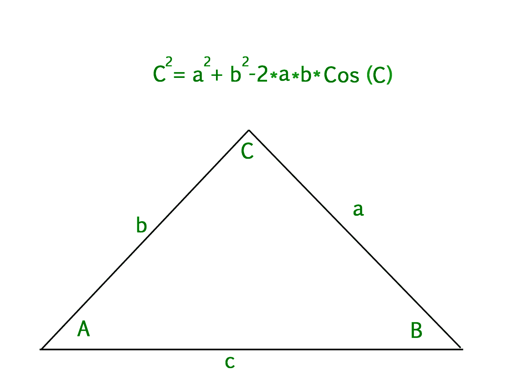

# 利用余弦定律求三角形第三边的程序

> 原文:[https://www . geesforgeks . org/program-find-第三边-三角形-使用定律-余弦/](https://www.geeksforgeeks.org/program-find-third-side-triangle-using-law-cosines/)

给定两条边 A，B 和角 c，用余弦定律找出三角形的第三条边。
**例:**

```
Input : a = 5, b = 8, c = 49 
Output : 6.04339 
```

特别是，当你知道三角形的两条边的长度和它们之间的角度时，余弦定律可以用来找到三角形第三条边的长度。参见[这里](https://www.geeksforgeeks.org/c-program-calculate-value-sinx-cosx/)学习如何求 cos 的值。
让我们假设 a，b，c 是三角形的边，其中 c 是与角 c 相交的边。然后，

```
c^2 = a^2 + b^2 - 2*a*b*cos(c) 
OR
c = sqrt(a^2 + b^2 - 2*a*b*cos(c))
```



## C++

```
// CPP program to find third
// side of triangle using
// law of cosines

#include <bits/stdc++.h>
using namespace std;

// Function to calculate cos value of angle c
float cal_cos(float n)
{
    float accuracy = 0.0001, x1, denominator, cosx, cosval;

    // Converting degrees to radian
    n = n * (3.142 / 180.0);

    x1 = 1;

    // Maps the sum along the series
    cosx = x1;

    // Holds the actual value of sin(n)
    cosval = cos(n);
    int i = 1;
    do {
        denominator = 2 * i * (2 * i - 1);
        x1 = -x1 * n * n / denominator;
        cosx = cosx + x1;
        i = i + 1;
    } while (accuracy <= fabs(cosval - cosx));

    return cosx;
}

// Function to find third side
float third_side(int a, int b, float c)
{
    float angle = cal_cos(c);
    return sqrt((a * a) + (b * b) - 2 * a * b * angle);
}
// Driver program to check the above function
int main()
{
    float c = 49;
    int a = 5, b = 8;
    // function call
    cout << third_side(a, b, c);

    return 0;
}
```

## Java 语言(一种计算机语言，尤用于创建网站)

```
// Java program to find third
// side of triangle using
// law of cosines
class GFG
{
    // Function to calculate
    // cos value of angle c
    static float cal_cos(float n)
    {
        float accuracy = 0.0001f, x1;
        float denominator, cosx, cosval;

        // Converting degrees to radian
        n = n * (3.142f / 180.0f);

        x1 = 1;

        // Maps the sum along the series
        cosx = x1;

        // Holds the actual value of sin(n)
        cosval = (float)Math.cos(n);
        int i = 1;
        do {
            denominator = 2 * i * (2 * i - 1);
            x1 = -x1 * n * n / denominator;
            cosx = cosx + x1;
            i = i + 1;
        } while (accuracy <=
               Math.abs(cosval - cosx));

        return cosx;
    }

    // Function to find third side
    static float third_side(int a,
                    int b, float c)
    {
        float angle = cal_cos(c);

        return (float)Math.sqrt((a * a) +
            (b * b) - 2 * a * b * angle);
}

// Driver code
public static void main (String[] args)
{
    float c = 49;
    int a = 5, b = 8;

    // function call
    System.out.print(Math.round(third_side(a,
                    b, c)*100000.0)/100000.0);
}
}

// This code is contributed by Anant Agarwal.
```

## 蟒蛇 3

```
# Python3 program to find third side
# of triangle using law of cosines
import math as mt

# Function to calculate cos
# value of angle c
def cal_cos(n):

    accuracy = 0.0001
    x1, denominator, cosx, cosval = 0, 0, 0, 0

    # Converting degrees to radian
    n = n * (3.142 / 180.0)

    x1 = 1

    # Maps the sum along the series
    cosx = x1

    # Holds the actual value of sin(n)
    cosval = mt.cos(n)
    i = 1
    while (accuracy <= abs(cosval - cosx)):

        denominator = 2 * i * (2 * i - 1)
        x1 = -x1 * n * n / denominator
        cosx = cosx + x1
        i = i + 1

    return cosx

# Function to find third side
def third_side(a, b, c):
    angle = cal_cos(c)
    return mt.sqrt((a * a) +
                   (b * b) - 2 * a * b * angle)

# Driver Code
c = 49
a, b = 5, 8
print(third_side(a, b, c))

# This code is contributed by mohit kumar
```

## C#

```
// C# program to find third
// side of triangle using
// law of cosines
using System;

class GFG
{
    // Function to calculate
    // cos value of angle c
    static float cal_cos(float n)
    {
        float accuracy = 0.0001f, x1;
        float denominator, cosx, cosval;

        // Converting degrees to radian
        n = n * (3.142f / 180.0f);

        x1 = 1;

        // Maps the sum along the series
        cosx = x1;

        // Holds the actual value of sin(n)
        cosval = (float)Math.Cos(n);
        int i = 1;
        do {
            denominator = 2 * i * (2 * i - 1);
            x1 = -x1 * n * n / denominator;
            cosx = cosx + x1;
            i = i + 1;
        } while (accuracy <=
                Math.Abs(cosval - cosx));

        return cosx;
    }

    // Function to find third side
    static float third_side(int a,
                    int b, float c)
    {
        float angle = cal_cos(c);

        return (float)Math.Sqrt((a * a) +
               (b * b) - 2 * a * b * angle);
    }

    // Driver code
    public static void Main ()
    {
        float c = 49;
        int a = 5, b = 8;

        // function call
        Console.WriteLine(Math.Round(third_side(a,
                        b, c)*100000.0)/100000.0);
    }
}

// This code is contributed by vt_m.
```

## 服务器端编程语言（Professional Hypertext Preprocessor 的缩写）

```
<?php
// PHP program to find third
// side of triangle using
// law of cosines

// Function to calculate
// cos value of angle c
function cal_cos( $n )
{
    $accuracy = 0.0001;
    $x1; $denominator;
    $cosx; $cosval;

    // Converting degrees
    // to radian
    $n = $n * (3.142 / 180.0);

    $x1 = 1;

    // Maps the sum
    // along the series
    $cosx = $x1;

    // Holds the actual
    // value of sin(n)
    $cosval = cos($n);
    $i = 1;
    do
    {
        $denominator = 2 * $i *
                      (2 * $i - 1);
        $x1 = -$x1 * $n * $n /
               $denominator;
        $cosx = $cosx + $x1;
        $i = $i + 1;
    } while ($accuracy <= ($cosval -
                           $cosx));

    return $cosx;
}

// Function to find third side
function third_side($a, $b, $c)
{
    $angle = cal_cos($c);
    return sqrt(($a * $a) +
                ($b * $b) - 2 *
                 $a * $b * $angle);
}

// Driver Code
$c = 49;
$a = 5;
$b = 8;

// function call
echo third_side($a, $b, $c);

// This code is contributed
// by ajit
?>
```

## java 描述语言

```
<script>
// Javascript program to find third
// side of triangle using
// law of cosines

    // Function to calculate
    // cos value of angle c
    function cal_cos( n) {
        let accuracy = 0.0001, x1;
        let denominator, cosx, cosval;

        // Converting degrees to radian
        n = n * (3.142 / 180.0);

        x1 = 1;

        // Maps the sum alet the series
        cosx = x1;

        // Holds the actual value of sin(n)
        cosval =  Math.cos(n);
        let i = 1;
        do {
            denominator = 2 * i * (2 * i - 1);
            x1 = -x1 * n * n / denominator;
            cosx = cosx + x1;
            i = i + 1;
        } while (accuracy <= Math.abs(cosval - cosx));

        return cosx;
    }

    // Function to find third side
    function third_side( a, b, c) {
        let angle = cal_cos(c);

        return  Math.sqrt((a * a) + (b * b) - 2 * a * b * angle);
    }

    // Driver code

        let c = 49;
        let a = 5, b = 8;

        // function call
        document.write(Math.round(third_side(a, b, c) * 100000.0) / 100000.0);

// This code is contributed by Rajput-Ji
</script>
```

**输出:**

```
6.04339
```