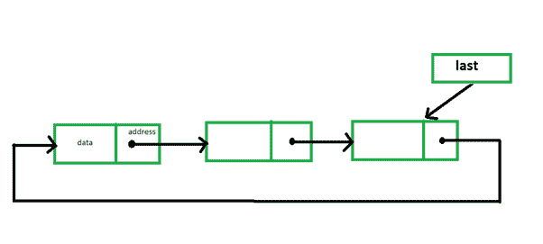
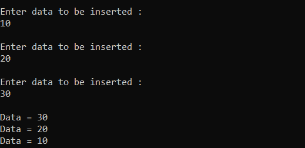
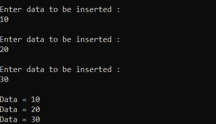
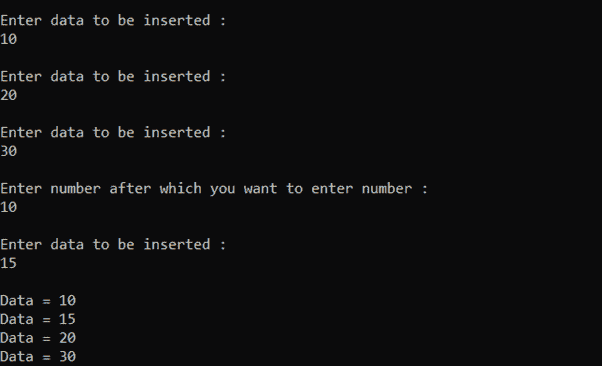
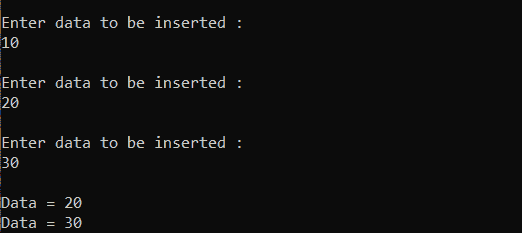
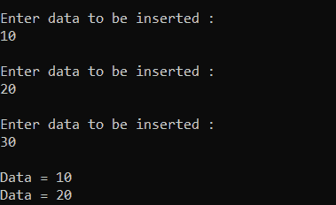
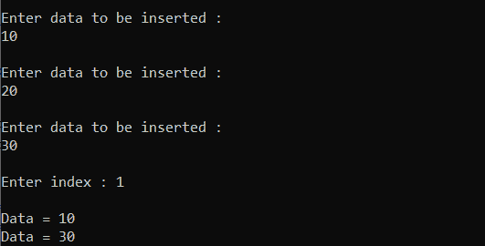

# C 中循环链表所有操作的程序

> 原文:[https://www . geesforgeks . org/program-for-all-operations-on-circular-link-list-in-c/](https://www.geeksforgeeks.org/program-for-all-operations-on-circular-linked-list-in-c/)

在[循环链表](https://www.geeksforgeeks.org/circular-linked-list/)中，每个元素都有一个到序列中下一个元素的链接，最后一个元素有一个到第一个元素的链接。循环链表类似于单链表，只是最后一个节点指向第一个节点。下图说明了同样的情况:

[](https://media.geeksforgeeks.org/wp-content/uploads/20210103214158/1.png)

循环链表的一些常见操作实现如下:

**<u>开头插入</u> :** 插入一个新节点作为第一个节点。最后一个的下一个指针将指向这个节点，这个新节点将指向前一个第一个节点。

## C

```
// C program for the above operation
#include <stdio.h>
#include <stdlib.h>

// Structure of a linked list node
struct node {
    int info;
    struct node* next;
};

// Pointer to last node in the list
struct node* last = NULL;

// Function to insert a node in the
// starting of the list
void insertAtFront()
{
    // Stores the number to be inserted
    int data;

    // Initialize a new node
    struct node* temp;
    temp = (struct node*)malloc(sizeof(struct node));

    // Input data
    printf("\nEnter data to be "
           "inserted: \n");
    scanf("%d", &data);

    // If the new node is the only
    // node in the list
    if (last == NULL) {
        temp->info = data;
        temp->next = temp;
        last = temp;
    }

    // Else last node contains the
    // reference of the new node and
    // new node contains the reference
    // of the previous first node
    else {
        temp->info = data;
        temp->next = last->next;

        // last node now has reference
        // of the new node temp
        last->next = temp;
    }
}

// Function to print the list
void viewList()
{
    // If list is empty
    if (last == NULL)
        printf("\nList is empty\n");

    // Else print the list
    else {
        struct node* temp;
        temp = last->next;

        // While first node is not
        // reached again, print,
        // since the list is circular
        do {
            printf("\nData = %d", temp->info);
            temp = temp->next;
        } while (temp != last->next);
    }
}

// Driver Code
int main()
{
    // Function Call
    insertAtFront();
    insertAtFront();
    insertAtFront();

    // Print list
    viewList();

    return 0;
}
```

**输出:**



**<u>末端插入</u> :** 插入一个新节点作为最后一个节点。最后一个的下一个指针将指向这个节点，这个新节点将指向第一个节点。

## C

```
// C program for the above operation
#include <stdio.h>
#include <stdlib.h>

// Structure of a linked list node
struct node {
    int info;
    struct node* next;
};

// Pointer to last node in the list
struct node* last = NULL;

// Function to add a new node at the
// end of the list
void addatlast()
{
    // Stores number to be inserted
    int data;

    // Initialize a new node
    struct node* temp;
    temp = (struct node*)malloc(sizeof(struct node));

    // Input data
    printf("\nEnter data to be "
           "inserted : \n");
    scanf("%d", &data);

    // If the new node is the
    // only node in the list
    if (last == NULL) {
        temp->info = data;
        temp->next = temp;
        last = temp;
    }

    // Else the new node will be the
    // last node and will contain
    // the reference of head node
    else {
        temp->info = data;
        temp->next = last->next;
        last->next = temp;
        last = temp;
    }
}

// Function to print the list
void viewList()
{
    // If list is empty
    if (last == NULL)
        printf("\nList is empty\n");

    // Else print the list
    else {
        struct node* temp;
        temp = last->next;
        do {
            printf("\nData = %d",
                   temp->info);
            temp = temp->next;
        } while (temp != last->next);
    }
}

// Driver Code
int main()
{
    // Function Call
    addatlast();
    addatlast();
    addatlast();

    // Print list
    viewList();

    return 0;
}
```

**输出:**



**<u>特定元素后插入</u> :** 下面是在链表中指定节点后插入节点的程序。

## C

```
// C program for the above operation
#include <stdio.h>
#include <stdlib.h>

// Structure of a linked list node
struct node {
    int info;
    struct node* next;
};

// Pointer to last node in list
struct node* last = NULL;

// Function to add a new node
// at the end of the list
void addatlast()
{
    // Stores number to be inserted
    int data;

    // Initialize a new node
    struct node* temp;
    temp = (struct node*)malloc(sizeof(struct node));

    // Input data
    printf("\nEnter data to be inserted : \n");
    scanf("%d", &data);

    // If the new node is the
    // only node in the list
    if (last == NULL) {
        temp->info = data;
        temp->next = temp;
        last = temp;
    }

    // Else the new node will be the
    // last node and will contain
    // the reference of head node
    else {
        temp->info = data;
        temp->next = last->next;
        last->next = temp;
        last = temp;
    }
}

// Function to insert after any
// specified element
void insertafter()
{
    // Stores data and element after
    // which new node is to be inserted
    int data, value;

    // Initialize a new node
    struct node *temp, *n;

    // Input data
    printf("\nEnter number after which"
           " you want to enter number: \n");
    scanf("%d", &value);
    temp = last->next;

    do {

        // Element after which node is
        // to be inserted is found
        if (temp->info == value) {
            n = (struct node*)malloc(sizeof(struct node));

            // Input Data
            printf("\nEnter data to be"
                   " inserted : \n");
            scanf("%d", &data);
            n->info = data;
            n->next = temp->next;
            temp->next = n;

            // If temp is the last node
            // so now n will become the
            // last node
            if (temp == last)
                last = n;
            break;
        }
        else
            temp = temp->next;
    } while (temp != last->next);
}

// Function to print the list
void viewList()
{
    // If list is empty
    if (last == NULL)
        printf("\nList is empty\n");

    // Else print the list
    else {
        struct node* temp;
        temp = last->next;
        do {
            printf("\nData = %d",
                   temp->info);
            temp = temp->next;
        } while (temp != last->next);
    }
}

// Driver Code
int main()
{
    // Initialize the list
    addatlast();
    addatlast();
    addatlast();

    // Function Call
    insertafter();

    // Print list
    viewList();

    return 0;
}
```

**输出:**



**<u>删除第一个元素</u> :** 删除链表的第一个节点。为此，最后的下一个指针将指向链表的第二个节点。下面是同样的程序:

## C

```
// C program for the above operation
#include <stdio.h>
#include <stdlib.h>

// Structure of a linked list node
struct node {
    int info;
    struct node* next;
};

// Pointer to last node in list
struct node* last = NULL;

// Function to add a new node
// at the end of the list
void addatlast()
{
    // Stores number to be inserted
    int data;

    // Initialize a new node
    struct node* temp;
    temp = (struct node*)malloc(sizeof(struct node));

    // Input data
    printf("\nEnter data to be"
           " inserted: \n");
    scanf("%d", &data);

    // If the new node is the only
    // node in the list
    if (last == NULL) {
        temp->info = data;
        temp->next = temp;
        last = temp;
    }

    // Else the new node will be the
    // last node and will contain
    // the reference of head node
    else {
        temp->info = data;
        temp->next = last->next;
        last->next = temp;
        last = temp;
    }
}

// Function to delete the first
// element of the list
void deletefirst()
{
    struct node* temp;

    // If list is empty
    if (last == NULL)
        printf("\nList is empty.\n");

    // Else last node now contains
    // reference of the second node
    // in the list because the
    // list is circular
    else {
        temp = last->next;
        last->next = temp->next;
        free(temp);
    }
}

// Function to print the list
void viewList()
{
    // If list is empty
    if (last == NULL)
        printf("\nList is empty\n");

    // Else print the list
    else {
        struct node* temp;
        temp = last->next;
        do {
            printf("\nData = %d",
                   temp->info);
            temp = temp->next;
        } while (temp != last->next);
    }
}

// Driver Code
int main()
{
    // Initialize the list
    addatlast();
    addatlast();
    addatlast();

    // Function Call
    deletefirst();

    // Print list
    viewList();

    return 0;
}
```

**输出:**



**<u>删除最后一个元素</u> :** 删除链表的最后一个节点。为此，倒数第二个节点将指向列表的第一个节点。下面是同样的程序:

## C

```
// C program for the above operation
#include <stdio.h>
#include <stdlib.h>

// Structure of a linked list node
struct node {
    int info;
    struct node* next;
};

// Pointer to last node in list
struct node* last = NULL;

// Function to add a new node
// at the end of the list
void addatlast()
{
    // Stores number to be inserted
    int data;

    // Initialize a new node
    struct node* temp;
    temp = (struct node*)malloc(sizeof(struct node));

    // Input data
    printf("\nEnter data to be inserted : \n");
    scanf("%d", &data);

    // If the new node is the only
    // node in the list
    if (last == NULL) {
        temp->info = data;
        temp->next = temp;
        last = temp;
    }

    // Else the new node will be
    // last node and will contain
    // the reference of head node
    else {
        temp->info = data;
        temp->next = last->next;
        last->next = temp;
        last = temp;
    }
}

// Function to delete the last node
// in the list
void deletelast()
{
    struct node* temp;

    // If list is empty
    if (last == NULL)
        printf("\nList is empty.\n");

    temp = last->next;

    // Traverse the list till
    // the second last node
    while (temp->next != last)
        temp = temp->next;

    // Second last node now contains
    // the reference of the first
    // node in the list
    temp->next = last->next;
    last = temp;
}

// Function to print the list
void viewList()
{
    // If list is empty
    if (last == NULL)
        printf("\nList is empty\n");

    // Else print the list
    else {
        struct node* temp;
        temp = last->next;
        do {
            printf("\nData = %d",
                   temp->info);
            temp = temp->next;
        } while (temp != last->next);
    }
}

// Driver Code
int main()
{
    // Initialize the list
    addatlast();
    addatlast();
    addatlast();

    // Function Call
    deletelast();

    // Print the list
    viewList();

    return 0;
}
```

**输出:**



**<u>在给定位置删除</u> :** 从链表中的指定位置删除一个元素。下面是同样的程序:

## C

```
// C program for the above operation
#include <stdio.h>
#include <stdlib.h>

// Structure of a linked list node
struct node {
    int info;
    struct node* next;
};

// Pointer to last node in list
struct node* last = NULL;

// Function to add a new node
// at the end of the list
void addatlast()
{
    // Stores number to be inserted
    int data;

    // Initialize a new node
    struct node* temp;
    temp = (struct node*)malloc(sizeof(struct node));

    // Input data
    printf("\nEnter data to be inserted : \n");
    scanf("%d", &data);

    // If the new node is the
    // only node in the list
    if (last == NULL) {
        temp->info = data;
        temp->next = temp;
        last = temp;
    }

    // Else the new node will be
    // last node and will contain
    // the reference of head node
    else {
        temp->info = data;
        temp->next = last->next;
        last->next = temp;
        last = temp;
    }
}

// Function to delete an element
// at a specified index in the list
void deleteAtIndex()
{
    // Stores the index at which
    // the element is to be deleted
    int pos, i = 1;
    struct node *temp, *position;
    temp = last->next;

    // If list is empty
    if (last == NULL)
        printf("\nList is empty.\n");

    // Else
    else {

        // Input Data
        printf("\nEnter index : ");
        scanf("%d", &pos);

        // Traverse till the node to
        // be deleted is reached
        while (i <= pos - 1) {
            temp = temp->next;
            i++;
        }

        // After the loop ends, temp
        // points at a node just before
        // the node to be deleted

        // Reassigning links
        position = temp->next;
        temp->next = position->next;

        free(position);
    }
}

// Function to print the list
void viewList()
{
    // If list is empty
    if (last == NULL)
        printf("\nList is empty\n");

    // Else print the list
    else {
        struct node* temp;
        temp = last->next;
        do {
            printf("\nData = %d", temp->info);
            temp = temp->next;
        } while (temp != last->next);
    }
}

// Driver Code
int main()
{
    // Initialize the list
    addatlast();
    addatlast();
    addatlast();

    // Function Call
    deleteAtIndex();

    // Print the list
    viewList();

    return 0;
}
```

**输出:**

