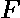

# 第 N 次折叠后正方形面积的程序

> 原文:[https://www . geesforgeks . org/第 n 次折叠后正方形面积的程序/](https://www.geeksforgeeks.org/program-for-area-of-square-after-n-th-fold/)

正方形是一个平面上的平面形状，由四个角上的四个点定义。正方形有四条等长的边和四个直角(90 度角)。正方形是一种长方形。
给定正方形的边和折叠数。任务是找到 **F-th** 褶皱后的正方形面积。
方块的折叠如下:

1.  在第一次折叠时，将正方形从左向右折叠成三角形。
2.  在第二次折叠中，将正方形从上向下折叠。
3.  在第三次折叠时，再次从左向右折叠正方形。

**例:**

```
Input : N = 4, F = 2
Output : 2
Explanation: 
Initially square side is 4 x 4
After 1st folding, square side becomes 4 x 2
After 2nd folding, square side becomes 2 x 2
Thus area equals 2 x 2 = 4.

Input : N = 100, F = 6
Output : 156.25
```

**接近** :

*   折叠前先计算正方形的面积。
*   每次折叠后，正方形的面积减少一半。即**面积=面积/2** 。
*   所以，我们最终用次方(2，F)来划分正方形的面积

以下是上述方法的实现:

## C++

```
// CPP program to find
// the area of the square
#include <bits/stdc++.h>
using namespace std;

// Function to calculate area of square after
// given number of folds
double areaSquare(double side, double fold)
{
    double area = side * side;

    return area * 1.0 / pow(2, fold);
}

// Driver Code
int main()
{
    double side = 4, fold = 2;

    cout << areaSquare(side, fold);

    return 0;
}
```

## Java 语言(一种计算机语言，尤用于创建网站)

```
// Java program to find the area of the square
class GFG
{

    // Function to calculate area of square
    // after given number of folds
    static double areaSquare(double side,
                            double fold)
    {
        double area = side * side;

        return area * 1.0 / Math.pow(2, fold);
    }

    // Driver Code
    public static void main(String []args)
    {
        double side = 4, fold = 2;

        System.out.println(areaSquare(side, fold));
    }
}

// This code is contributed
// by aishwarya.27
```

## 蟒蛇 3

```
# Python3 program to find the area
# of the square

# Function to calculate area of
# square after given number of folds
def areaSquare(side, fold) :
        area = side * side
        ans = area / pow(2, fold)
        return ans

# Driver Code
if __name__ == "__main__" :

    side = 4
    fold = 2
    print(areaSquare(side, fold))

# This code is contributed by Ryuga
```

## C#

```
// C# program to find the area of the square
using System;

class GFG
{

// Function to calculate area of square
// after given number of folds
static double areaSquare(double side,
                         double fold)
{
    double area = side * side;

    return area * 1.0 / Math.Pow(2, fold);
}

// Driver Code
public static void Main()
{
    double side = 4, fold = 2;

    Console.Write(areaSquare(side, fold));
}
}

// This code is contributed
// by Akanksha Rai
```

## 服务器端编程语言（Professional Hypertext Preprocessor 的缩写）

```
<?php
// PHP program to find the area of the square

// Function to calculate area of square
// after given number of folds
function areaSquare($side, $fold)
{
    $area = $side * $side;

    return $area * 1.0 / pow(2, $fold);
}

// Driver Code
$side = 4;
$fold = 2;
echo areaSquare($side, $fold);

// This code is contributed by ajit
?>
```

## java 描述语言

```
<script>
// Javascript program to find
// the area of the square

// Function to calculate area of square after
// given number of folds
function areaSquare( side,  fold)
{
    var area = side * side;

    return (area * 1.0 )/ (Math.pow(2, fold));
}

// Driver Code
var side = 4, fold = 2;

    document.write(areaSquare(side, fold));

// This code is contributed by akshitsaxenaa09.
</script>
```

**Output:** 

```
4
```