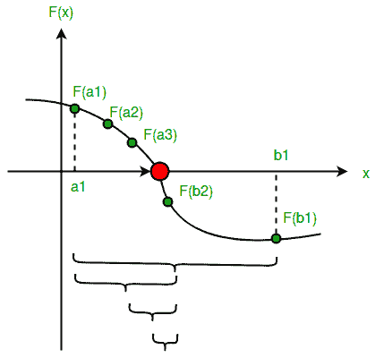

# 等分法程序

> 原文:[https://www.geeksforgeeks.org/program-for-bisection-method/](https://www.geeksforgeeks.org/program-for-bisection-method/)

给定浮点数 x 上的函数 f(x)和两个数字‘a’和‘b’，使得 f(a)*f(b) < 0 and f(x) is continuous in [a, b]. Here f(x) represents algebraic or transcendental equation. Find root of function in interval [a, b] (Or find a value of x such that f(x) is 0). 
**示例:**

```
Input: A function of x, for example x3 - x2 + 2\.     
       And two values: a = -200 and b = 300 such that
       f(a)*f(b) < 0, i.e., f(a) and f(b) have
       opposite signs.
Output: The value of root is : -1.0025
        OR any other value with allowed
        deviation from root.
```

**什么是代数函数和超越函数？**
代数函数是可以用多项式形式表示的函数，如 f(x)= a<sub>1</sub>x<sup>3</sup>+a<sub>2</sub>x<sup>2</sup>+…..+ e 其中 aa <sub>1</sub> ，a <sub>2</sub> ，…为常数，x 为变量。
超越函数是非代数函数，例如 f(x)= sin(x)* x–3 或 f(x) = e <sup>x</sup> + x <sup>2</sup> 或 f(x)= ln(x)+x……。
**什么是等分法？**
该方法也称为区间减半法、二分搜索法法或二分法。这种方法用于在给定的区间内寻找方程的根，该区间的值为 f(x) = 0 的“x”。
该方法基于**中值定理**，该定理说明如果 f(x)是连续函数，且有两个实数 a 和 b 使得 f(a)*f(b) 0 和 f(b) < 0，则保证其之间至少有一个根。
**假设:**

1.  f(x)是区间[a，b]中的连续函数
2.  f(a) * f(b) < 0

**步骤:**

1.  求中点 **c** = (a + b)/2。
2.  **如果** f(c) == 0，那么 c 就是解的根。
3.  **否则** f(c)！= 0
    1.  **如果**值 f(a)*f(c) < 0，那么根位于 a 和 c 之间。所以我们重复 a 和 c
    2.  **否则如果** f(b)*f(c) < 0，那么根位于 b 和 c 之间。所以我们重复 b 和 c
    3.  **否则**给定的函数不遵循其中一个假设。

由于根可能是一个浮点数，当 a 和 b 之间的差值小于一个值时，我们重复上述步骤？(非常小的值)。



下面是上述步骤的实现。

## C++

```
// C++ program for implementation of Bisection Method for
// solving equations
#include<bits/stdc++.h>
using namespace std;
#define EPSILON 0.01

// An example function whose solution is determined using
// Bisection Method. The function is x^3 - x^2  + 2
double func(double x)
{
    return x*x*x - x*x + 2;
}

// Prints root of func(x) with error of EPSILON
void bisection(double a, double b)
{
    if (func(a) * func(b) >= 0)
    {
        cout << "You have not assumed right a and b\n";
        return;
    }

    double c = a;
    while ((b-a) >= EPSILON)
    {
        // Find middle point
        c = (a+b)/2;

        // Check if middle point is root
        if (func(c) == 0.0)
            break;

        // Decide the side to repeat the steps
        else if (func(c)*func(a) < 0)
            b = c;
        else
            a = c;
    }
    cout << "The value of root is : " << c;
}

// Driver program to test above function
int main()
{
    // Initial values assumed
    double a =-200, b = 300;
    bisection(a, b);
    return 0;
}
```

## Java 语言(一种计算机语言，尤用于创建网站)

```
// Java program for implementation of Bisection Method
// for solving equations
class GFG{
    static final float EPSILON = (float)0.01;

    // An example function whose solution is determined using
    // Bisection Method. The function is x^3 - x^2  + 2
    static double func(double x)
    {
        return x*x*x - x*x + 2;
    }

    // Prints root of func(x) with error of EPSILON
    static void bisection(double a, double b)
    {
        if (func(a) * func(b) >= 0)
        {
            System.out.println("You have not assumed"
                        + " right a and b");
            return;
        }

        double c = a;
        while ((b-a) >= EPSILON)
        {
            // Find middle point
            c = (a+b)/2;

            // Check if middle point is root
            if (func(c) == 0.0)
                break;

            // Decide the side to repeat the steps
            else if (func(c)*func(a) < 0)
                b = c;
            else
                a = c;
        }
                //prints value of c upto 4 decimal places
        System.out.printf("The value of root is : %.4f"
                        ,c);
    }

    // Driver program to test above function
    public static void main(String[] args)
    {
        // Initial values assumed
        double a =-200, b = 300;
        bisection(a, b);
    }
    // This code is contributed by Nirmal Patel
}
```

## 蟒蛇 3

```
# Python program for implementation
# of Bisection Method for
# solving equations

# An example function whose
# solution is determined using
# Bisection Method.
# The function is x^3 - x^2  + 2
def func(x):
    return x*x*x - x*x + 2

# Prints root of func(x)
# with error of EPSILON
def bisection(a,b):

    if (func(a) * func(b) >= 0):
        print("You have not assumed right a and b\n")
        return

    c = a
    while ((b-a) >= 0.01):

        # Find middle point
        c = (a+b)/2

        # Check if middle point is root
        if (func(c) == 0.0):
            break

        # Decide the side to repeat the steps
        if (func(c)*func(a) < 0):
            b = c
        else:
            a = c

    print("The value of root is : ","%.4f"%c)

# Driver code
# Initial values assumed
a =-200
b = 300
bisection(a, b)

# This code is contributed
# by Anant Agarwal.
```

## C#

```
// C# program for implementation
// of Bisection Method for
// solving equations
using System;

class GFG
{
static float EPSILON = (float)0.01;

// An example function whose
// solution is determined using
// Bisection Method. The function
// is x^3 - x^2 + 2
static double func(double x)
{
    return x * x * x -
           x * x + 2;
}

// Prints root of func(x)
// with error of EPSILON
static void bisection(double a,
                      double b)
{
    if (func(a) * func(b) >= 0)
    {
        Console.WriteLine("You have not assumed" +
                                " right a and b");
        return;
    }

    double c = a;
    while ((b - a) >= EPSILON)
    {
        // Find middle point
        c = (a + b) / 2;

        // Check if middle
        // point is root
        if (func(c) == 0.0)
            break;

        // Decide the side
        // to repeat the steps
        else if (func(c) * func(a) < 0)
            b = c;
        else
            a = c;
    }

    // prints value of c
    // upto 4 decimal places
    Console.WriteLine("The value of " +
                      "root is : "+ c);
}

// Driver Code
static public void Main ()
{
    // Initial values assumed
    double a = -200, b = 300;
    bisection(a, b);
}
}

// This code is contributed by ajit
```

## 服务器端编程语言（Professional Hypertext Preprocessor 的缩写）

```
<?php
// PHP program for implementation
// of Bisection Method for solving
// equations
$EPSILON = 0.01;

// An example function whose
// solution is determined
// using Bisection Method.
// The function is x^3 - x^2 + 2
function func($x)
{
    return $x * $x * $x -
           $x * $x + 2;
}

// Prints root of func(x)
// with error of EPSILON
function bisection($a, $b)
{
    global $EPSILON;
    if (func($a) *
        func($b) >= 0)
    {
        echo "You have not assumed " .
                 "right a and b","\n";
        return;
    }

    $c = $a;
    while (($b - $a) >= $EPSILON)
    {
        // Find middle point
        $c = ($a + $b) / 2;

        // Check if middle
        // point is root
        if (func($c) == 0.0)
            break;

        // Decide the side to
        // repeat the steps
        else if (func($c) * func($a) < 0)
            $b = $c;
        else
            $a = $c;
    }
    echo "The value of root is : " , $c;
}

// Driver Code

// Initial values assumed
$a =-200;
$b = 300;
bisection($a, $b);

// This code is contributed by ajit
?>
```

## java 描述语言

```
<script>

// JavaScript program for implementation
// of Bisection Method for
// solving equations

let EPSILON = 0.01;

    // An example function whose solution is determined using
    // Bisection Method. The function is x^3 - x^2  + 2
    function func(x)
    {
        return x*x*x - x*x + 2;
    }

    // Prints root of func(x) with error of EPSILON
    function bisection(a, b)
    {
        if (func(a) * func(b) >= 0)
        {
            document.write("You have not assumed"
                        + " right a and b");
            return;
        }

        let c = a;
        while ((b-a) >= EPSILON)
        {
            // Find middle point
            c = (a+b)/2;

            // Check if middle point is root
            if (func(c) == 0.0)
                break;

            // Decide the side to repeat the steps
            else if (func(c)*func(a) < 0)
                b = c;
            else
                a = c;
        }
                //prints value of c upto 4 decimal places
        document.write("The value of " +
                      "root is : "+ c.toFixed(4));
    }

// Driver program

        // Initial values assumed
        let a =-200, b = 300;
        bisection(a, b);

        // This code is contributed by susmitakundugoaldanga.
</script>
```

**输出:**

```
The value of root is : -1.0025
```

**时间复杂度:-** 该方法的时间复杂度取决于假设值和函数。
T3】有哪些利弊？
等分法的优点是保证收敛。二分法的缺点是不能检测多个根。
一般情况下，采用二分法得到解的初始粗略近似。然后使用更快的收敛方法来寻找解。
我们很快将讨论求解代数方程和超越方程的其他方法
**参考文献:**
[s . s .萨斯特里的数值分析入门方法](http://www.flipkart.com/introductory-methods-numerical-analysis-english-5th/p/itmdwu92fzutjczw?pid=9788120345928&affid=sandeepgfg)
[**https://en.wikipedia.org/wiki/Bisection_method**](https://en.wikipedia.org/wiki/Bisection_method)
本文由**阿比拉奇·斯密特**供稿。如果您发现任何不正确的地方，请写评论，或者您想分享更多关于上面讨论的主题的信息