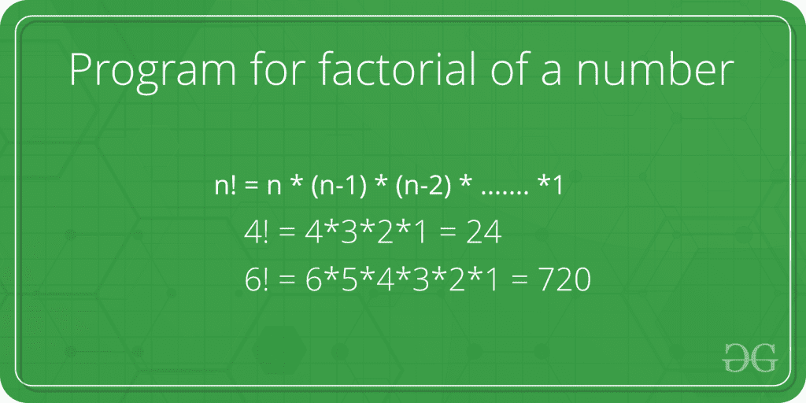

# 数字阶乘程序

> 原文:[https://www . geeksforgeeks . org/数字阶乘程序/](https://www.geeksforgeeks.org/program-for-factorial-of-a-number/)

非负整数的阶乘，是所有小于或等于 n 的整数的乘积。例如，6 的阶乘是 6*5*4*3*2*1，等于 720。



**递归解:**
阶乘可以用以下递归公式计算。

```
  n! = n * (n-1)!
  n! = 1 if n = 0 or n = 1
```

下面是阶乘的实现。

## C++

```
// C++ program to find factorial of given number
#include <iostream>
using namespace std;

// function to find factorial of given number
unsigned int factorial(unsigned int n)
{
    if (n == 0)
        return 1;
    return n * factorial(n - 1);
}

// Driver code
int main()
{
    int num = 5;
    cout << "Factorial of "
         << num << " is " << factorial(num) << endl;
    return 0;
}

// This code is contributed by Shivi_Aggarwal
```

## C

```
// C program to find factorial of given number
#include <stdio.h

// function to find factorial of given number
unsigned int factorial(unsigned int n)
{
    if (n == 0)
        return 1;
    return n * factorial(n - 1);
}

int main()
{
    int num = 5;
    printf("Factorial of %d is %d", num, factorial(num));
    return 0;
}
```

## Java 语言(一种计算机语言，尤用于创建网站)

```
// Java program to find factorial of given number
class Test {
    // method to find factorial of given number
    static int factorial(int n)
    {
        if (n == 0)
            return 1;

        return n * factorial(n - 1);
    }

    // Driver method
    public static void main(String[] args)
    {
        int num = 5;
        System.out.println("Factorial of " + num
                           + " is " + factorial(5));
    }
}
```

## 蟒蛇 3

```
# Python 3 program to find
# factorial of given number

# Function to find factorial of given number
def factorial(n):

    if n == 0:
        return 1

    return n * factorial(n-1)

# Driver Code
num = 5;
print("Factorial of", num, "is",
factorial(num))

# This code is contributed by Smitha Dinesh Semwal
```

## C#

```
// C# program to find factorial
// of given number
using System;

class Test {
    // method to find factorial
    // of given number
    static int factorial(int n)
    {
        if (n == 0)
            return 1;

        return n * factorial(n - 1);
    }

    // Driver method
    public static void Main()
    {
        int num = 5;
        Console.WriteLine("Factorial of "
                          + num + " is " + factorial(5));
    }
}

// This code is contributed by vt_m
```

## 服务器端编程语言（Professional Hypertext Preprocessor 的缩写）

```
<?php
// PHP program to find factorial
// of given number

// function to find factorial
// of given number
function factorial($n)
{
    if ($n == 0)
        return 1;
    return $n * factorial($n - 1);
}

    // Driver Code
    $num = 5;
    echo "Factorial of ", $num, " is ", factorial($num);

// This code is contributed by m_kit
?>
```

## java 描述语言

```
<script>
// Javascript to find factorial
// of given number

// function to find factorial
// of given number
function factorial(n) {
  if (n == 0) return 1;
  return n * factorial(n - 1);
}

// Driver Code
let num = 5;
document.write("Factorial of " + num + " is " + factorial(num));

// This code is contributed by Saurabh Jaiswal

</script>
```

输出:

```
Factorial of 5 is 120
```

**迭代解:**
阶乘也可以迭代计算，因为递归对于大数来说成本很高。这里我们展示了使用 for 和 while 循环的迭代方法。
**<u>使用 For 循环</u>**

## C++

```
// C++ program for factorial of a number
#include <iostream>
using namespace std;

// function to find factorial of given number
unsigned int factorial(unsigned int n)
{
    int res = 1, i;
    for (i = 2; i <= n; i++)
        res *= i;
    return res;
}

// Driver code
int main()
{
    int num = 5;
    cout << "Factorial of "
         << num << " is "
         << factorial(num) << endl;
    return 0;
}

// This code is contributed by Shivi_Aggarwal
```

## C

```
#include <stdio.h>

// function to find factorial of given number
unsigned int factorial(unsigned int n)
{
    int res = 1, i;
    for (i = 2; i <= n; i++)
        res *= i;
    return res;
}

int main()
{
    int num = 5;
    printf(
        "Factorial of %d is %d", num, factorial(num));
    return 0;
}
```

## Java 语言(一种计算机语言，尤用于创建网站)

```
// Java program to find factorial of given number
class Test {

    // Method to find factorial of the given number
    static int factorial(int n)
    {
        int res = 1, i;
        for (i = 2; i <= n; i++)
            res *= i;
        return res;
    }

    // Driver method
    public static void main(String[] args)
    {
        int num = 5;
        System.out.println(
            "Factorial of " + num
            + " is " + factorial(5));
    }
}
```

## 蟒蛇 3

```
# Python 3 program to find
# factorial of given number

# Function to find factorial of given number
def factorial(n):

    res = 1

    for i in range(2, n+1):
        res *= i
    return res

# Driver Code
num = 5;
print("Factorial of", num, "is",
factorial(num))

# This code is contributed by Smitha Dinesh Semwal
```

## C#

```
// C# program to find
// factorial of given number
using System;

class Test {
    // Method to find factorial
    // of given number
    static int factorial(int n)
    {
        int res = 1, i;

        for (i = 2; i <= n; i++)
            res *= i;
        return res;
    }

    // Driver method
    public static void Main()
    {
        int num = 5;
        Console.WriteLine(
            "Factorial of " + num
            + " is " + factorial(5));
    }
}

// This code is contributed by vt_m
```

## 服务器端编程语言（Professional Hypertext Preprocessor 的缩写）

```
<?php

// function to find factorial
// of given number
function factorial( $n)
{
    $res = 1; $i;
    for ($i = 2; $i <= $n; $i++)
        $res *= $i;
    return $res;
}

// Driver Code
$num = 5;
echo "Factorial of ", $num, " is ",
                    factorial($num);

// This code is contributed
// by anuj_67.
?>
```

## java 描述语言

```
<script>
// JavaScript program to find factorial of given number

    // Method to find factorial of the given number
    function factorial(n)
    {
        var res = 1, i;
        for (i = 2; i <= n; i++)
            res *= i;
        return res;
    }

    // Driver method

        var num = 5;
        document.write("Factorial of " + num + " is " + factorial(5));

// This code is contributed by shivanisinghss2110.

</script>
```

**输出:**

```
Factorial of 5 is 120
```

**<u>使用 While 循环</u>**

## C

```
// C program for factorial of a number
#include <stdio.h>

// function to find factorial of given number
unsigned int factorial(unsigned int n)
{
     if(n == 0)
          return 1;
    int i = n, fact = 1;
    while (n / i != n) {
        fact = fact * i;
        i--;
    }
    return fact;
}

int main()
{
    int num = 5;
    printf("Factorial of %d is %d", num, factorial(num));
    return 0;
}
```

## C++

```
// C++ program for factorial of a number
#include <iostream>
using namespace std;

// function to find factorial of given
// number using while loop
unsigned int factorial(unsigned int n)
{
    if(n == 0)
          return 1;
    int i = n, fact = 1;
    while (n / i != n) {
        fact = fact * i;
        i--;
    }
    return fact;
}

// Driver code
int main()
{
    int num = 5;
    cout << "Factorial of "
         << num << " is "
         << factorial(num) << endl;
    return 0;
}
// This code is contributed by Shivi_Aggarwal
```

## Java 语言(一种计算机语言，尤用于创建网站)

```
// Java program to find factorial of given number

class Test {

    // Method to find factorial of the given number
    static int factorial(int n)
    {
        if(n == 0)
           return 1;
        int i = n, fact = 1;
        while (n / i != n) {
            fact = fact * i;
            i--;
        }
        return fact;
    }

    // Driver method
    public static void main(String[] args)
    {
        int num = 5;
        System.out.println(
            "Factorial of " + num
            + " is " + factorial(5));
    }
}
```

## 蟒蛇 3

```
# Python 3 program to find
# factorial of given number

# Function to find factorial of given number
def factorial(n):
    if(n == 0):
       return 1
    i = n
    fact = 1

    while(n / i != n):
        fact = fact * i
        i -= 1

    return fact

# Driver Code
num = 5;
print("Factorial of", num, "is",
factorial(num))

# This code is contributed by Smitha Dinesh Semwal
```

## C#

```
// C# program to find
// factorial of given number
using System;

class Test {
    // Method to find factorial
    // of given number
    static int factorial(int n)
    {
        if(n == 0)
            return 1;
        int i = n, fact = 1;
        while (n / i != n) {
            fact = fact * i;
            i--;
        }
        return fact;
    }

    // Driver method
    public static void Main()
    {
        int num = 5;
        Console.WriteLine(
            "Factorial of " + num
            + " is " + factorial(5));
    }
}
```

## java 描述语言

```
<script>
        // JavaScript Program to implement
        // the above approach
        // function to find factorial of given
        // number using while loop
        function factorial(n) {
            if (n == 0)
                return 1;
            let i = n, fact = 1;
            while (Math.floor(n / i) != n) {
                fact = fact * i;
                i--;
            }
            return fact;
        }

        // Driver code
        let num = 5;
        document.write("Factorial of "
            + num + " is "
            + factorial(num) + "<br>");

// This code is contributed by Potta Lokesh

    </script>
```

**输出:**

```
Factorial of 5 is 120
```

上述迭代解的时间复杂度为 O(n)。
**单线解(使用三元运算符):**

## C++

```
// C++ program to find factorial of given number
#include <iostream>
using namespace std;

int factorial(int n)
{
    // single line to find factorial
    return (n == 1 || n == 0) ? 1 : n * factorial(n - 1);
}

// Driver Code
int main()
{
    int num = 5;
    cout << "Factorial of " << num << " is "<< factorial(num);
    return 0;
}

// This code is contributed by shivanisinghss2110
```

## C

```
// C++ program to find factorial of given number
#include <stdio.h>

int factorial(int n)
{
    // single line to find factorial
    return (n == 1 || n == 0) ? 1 : n * factorial(n - 1);
}

// Driver Code
int main()
{
    int num = 5;
    printf("Factorial of %d is %d", num, factorial(num));
    return 0;
}

// This code is contributed by  Rithika palaniswamy.
```

## Java 语言(一种计算机语言，尤用于创建网站)

```
// Java program to find factorial
// of given number
class Factorial {

    int factorial(int n)
    {

        // single line to find factorial
        return (n == 1 || n == 0) ? 1 : n * factorial(n - 1);
    }

    // Driver Code
    public static void main(String args[])
    {
        Factorial obj = new Factorial();
        int num = 5;
        System.out.println(
            "Factorial of " + num
            + " is " + obj.factorial(num));
    }
}

// This code is contributed by Anshika Goyal.
```

## 蟒蛇 3

```
# Python 3 program to find
# factorial of given number

def factorial(n):

    # single line to find factorial
    return 1 if (n == 1 or n == 0) else n * factorial(n - 1)

# Driver Code
num = 5
print ("Factorial of", num, "is",
      factorial(num))

# This code is contributed
# by Smitha Dinesh Semwal.
```

## C#

```
// C# program to find factorial
// of the given number
using System;

class Factorial {

    int factorial(int n)
    {

        // single line to find factorial
        return (n == 1 || n == 0) ? 1 : n * factorial(n - 1);
    }

    // Driver Code
    public static void Main()
    {
        Factorial obj = new Factorial();
        int num = 5;

        Console.WriteLine(
            "Factorial of " + num
            + " is " + obj.factorial(num));
    }
}

// This code is contributed by vt_m.
```

## 服务器端编程语言（Professional Hypertext Preprocessor 的缩写）

```
<?php
// PHP program to find factorial
// of given number

function factorial( $n)
{

    // single line to find factorial
    return ($n == 1 || $n == 0) ? 1:
             $n * factorial($n - 1);
}

    // Driver Code
    $num = 5;
    echo "Factorial of ", $num, " is ", factorial($num);

// This code is contributed by anuj_67.
?>
```

## java 描述语言

```
<script>

// JavaScript program to find factorial of given number
function factorial(n)
{
    // single line to find factorial
    return (n == 1 || n == 0) ? 1 : n * factorial(n - 1);
}

// Driver Code

    var num = 5;
    document.write("Factorial of " +num +" is " + factorial(num));

// This code is contributed by shivanisinghss2110.

</script>
```

**输出:**

```
Factorial of 5 is 120
```

上述解决方案会导致大量溢出。适用于大数的解请参考[大数阶乘](https://www.geeksforgeeks.org/factorial-large-number/)。
如发现上述代码/算法有任何 bug，请写评论，或寻找其他方法解决同样的问题。