# 利用布尔规则求给定函数积分的程序

> 原文:[https://www . geeksforgeeks . org/program-for-find-the-integer-of-function-use-booles-rule/](https://www.geeksforgeeks.org/program-for-finding-the-integral-of-a-given-function-using-booles-rule/)

给定一个函数， **f(x)** ，在点处列表

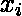

等间距

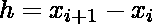

使得

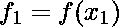 [Tex]f_2=f(x_2)[/Tex]

*   …..等等

上下限 **a，b** 对应需要求积分，任务是求给定方程 **f(x)** 的积分值。
**例:**

> **输入:** a = 0，b = 4，
> 
> 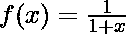
> 
> **输出:** 1.6178
> **说明:**
> 的(1 / (1 + x))积分为<sup>4</sup>ln(| 1+x |)<sub>0</sub>+c .
> 在代入极限时，ln(|5|) + ln(|1|) = 1.6178。
> **输入:** a = 0.2，b = 0.6，
> 
> 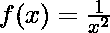
> 
> **输出:** 0.3430

**方法:**本文讨论了用[布尔规则](https://en.wikipedia.org/wiki/Boole%27s_rule)计算给定函数 f(x)的近似整数值。
布尔规则是一种求积分近似值的数值积分技术。它以自学成才的数学家、哲学家和逻辑学家乔治·布尔的名字命名。布尔技术的思想是在一些等间距的值(给定图像中的 h)下，使用“f <sub>k</sub> 的值来近似积分。下图显示了如何考虑各种 f<sub>k</sub>:

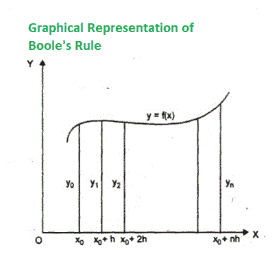

布尔规则的整数值由公式给出:

> 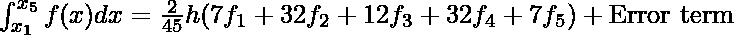

*   在上面的公式中，当积分为 6 阶时，会出现一个误差项。误差项是

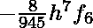 [Tex]f_1，f_2，f_3，f_4，f_5，[/Tex]

*   是 f(x)在各自的 x 间隔上的值。
*   因此，可以遵循以下步骤来计算区间(a，b)中某个函数 f(x)的积分:
    1.  n=6 的值，它是区间被划分的部分的数量。
    2.  计算宽度，h =(b–a)/4。
    3.  将 x <sub>1</sub> 到 x <sub>5</sub> 的值计算为

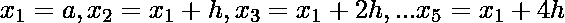

*   考虑 y = f(x)。现在找到值

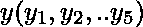

*   对于相应的

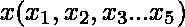

*   价值观。
*   用布尔规则中的所有值替换来计算整数值。

以下是上述方法的实现:

## C++

```
// C++ program to implement Boole's Rule
// on the given function
#include <bits/stdc++.h>
using namespace std;

// In order to represent the implementation,
// a function f(x) = 1/(1 + x) is considered
// in this program

// Function to return the value of f(x)
// for the given value of x
float y(float x)
{
    return (1 / (1 + x));
}

// Function to computes the integrand of y
// at the given intervals of x with
// step size h and the initial limit a
// and final limit b
float BooleRule(float a, float b)
{

    // Number of intervals
    int n = 4;
    int h;

    // Computing the step size
    h = ((b - a) / n);
    float sum = 0;

    // Substituing a = 0, b = 4 and h = 1
    float bl = ((7 * y(a) +
                32 * y(a + h) +
                12 * y(a + 2 * h) +
                32 * y(a + 3 * h) +
                 7 * y(a + 4 * h)) *
                 2 * h / 45);

    sum = sum + bl;
    return sum;
}

// Driver code
int main()
{
    float lowlimit = 0;
    float upplimit = 4;

    cout << fixed << setprecision(4) <<
        "f(x) = " << BooleRule(0, 4);

    return 0;
}

// This code is contributed by shivanisinghss2110
```

## C

```
// C program to implement Boole's Rule
// on the given function

#include <math.h>
#include <stdio.h>

// In order to represent the implementation,
// a function f(x) = 1/(1 + x) is considered
// in this program

// Function to return the value of f(x)
// for the given value of x
float y(float x)
{
    return (1 / (1 + x));
}

// Function to computes the integrand of y
// at the given intervals of x with
// step size h and the initial limit a
// and final limit b
float BooleRule(float a, float b)
{
    // Number of intervals

    int n = 4;
    int h;

    // Computing the step size
    h = ((b - a) / n);
    float sum = 0;

    // Substituing a = 0, b = 4 and h = 1
    float bl = (7 * y(a) + 32 * y(a + h)
                + 12 * y(a + 2 * h)
                + 32 * y(a + 3 * h)
                + 7 * y(a + 4 * h))
               * 2 * h / 45;

    sum = sum + bl;
    return sum;
}

// Driver code
int main()
{
    float lowlimit = 0;
    float upplimit = 4;
    printf("f(x) = %.4f",
           BooleRule(0, 4));
    return 0;
}
```

## Java 语言(一种计算机语言，尤用于创建网站)

```
// Java program to implement Boole's Rule
// on the given function
class GFG{

// In order to represent the implementation,
// a function f(x) = 1/(1 + x) is considered
// in this program

// Function to return the value of f(x)
// for the given value of x
static float y(float x)
{
    return (1 / (1 + x));
}

// Function to computes the integrand of y
// at the given intervals of x with
// step size h and the initial limit a
// and final limit b
static float BooleRule(float a, float b)
{
    // Number of intervals

    int n = 4;
    int h;

    // Computing the step size
    h = (int) ((b - a) / n);
    float sum = 0;

    // Substituing a = 0, b = 4 and h = 1
    float bl = (7 * y(a) + 32 * y(a + h)
                + 12 * y(a + 2 * h)
                + 32 * y(a + 3 * h)
                + 7 * y(a + 4 * h))
               * 2 * h / 45;

    sum = sum + bl;
    return sum;
}

// Driver code
public static void main(String[] args)
{
    System.out.printf(("f(x) = %.4f"),
           BooleRule(0, 4));
}
}

// This code is contributed by 29AjayKumar
```

## 蟒蛇 3

```
# Python3 program to implement Boole's Rule
# on the given function

# In order to represent the implementation,
# a function f(x) = 1/(1 + x) is considered
# in this program

# Function to return the value of f(x)
# for the given value of x
def y(x):
    return (1 / (1 + x))

# Function to computes the integrand of y
# at the given intervals of x with
# step size h and the initial limit a
# and final limit b
def BooleRule(a, b):

    # Number of intervals
    n = 4

    # Computing the step size
    h = ((b - a) / n)
    sum = 0

    # Substituing a = 0, b = 4 and h = 1
    bl = (7 * y(a) + 32 * y(a + h) + 12 *
        y(a + 2 * h)+32 * y(a + 3 * h)+7 *
        y(a + 4 * h))* 2 * h / 45

    sum = sum + bl
    return sum

# Driver code
if __name__ == '__main__':
    lowlimit = 0
    upplimit = 4
    print("f(x) =",round(BooleRule(0, 4),4))

# This code is contributed by Surendra_Gangwar
```

## C#

```
// C# program to implement Boole's
// Rule on the given function
using System;
class GFG{

// In order to represent the
// implementation, a function
// f(x) = 1/(1 + x) is considered
// in this program

// Function to return the value of
// f(x) for the given value of x
static float y(float x)
{
  return (1 / (1 + x));
}

// Function to computes the integrand
// of y at the given intervals of x
// with step size h and the initial
// limit a and final limit b
static float BooleRule(float a,
                       float b)
{
  // Number of intervals
  int n = 4;
  int h;

  // Computing the step size
  h = (int)((b - a) / n);
  float sum = 0;

  // Substituing a = 0, b = 4
  // and h = 1
  float bl = (7 * y(a) + 32 *
              y(a + h) + 12 *
              y(a + 2 * h) +
              32 * y(a + 3 *
              h) + 7 * y(a +
              4 * h)) * 2 * 
              h / 45;

  sum = sum + bl;
  return sum;
}

// Driver code
public static void Main(string[] args)
{
  Console.Write(("f(x) = " +
                  System.Math.Round(
                  BooleRule(0, 4), 4)));
}
}

// This code is contributed by Chitranayal
```

## java 描述语言

```
<script>

// JavaScript program to implement Boole's Rule
// on the given function

// In order to represent the implementation,
// a function f(x) = 1/(1 + x) is considered
// in this program

// Function to return the value of f(x)
// for the given value of x
function y(x)
{
    return (1 / (1 + x));
}

// Function to computes the integrand of y
// at the given intervals of x with
// step size h and the initial limit a
// and final limit b
function BooleRule(a, b)
{
    // Number of intervals

    let n = 4;
    let h;

    // Computing the step size
    h =  ((b - a) / n);
    let sum = 0;

    // Substituing a = 0, b = 4 and h = 1
    let bl = (7 * y(a) + 32 * y(a + h)
                + 12 * y(a + 2 * h)
                + 32 * y(a + 3 * h)
                + 7 * y(a + 4 * h))
               * 2 * h / 45;

    sum = sum + bl;
    return sum;
}

// Driver Code

    document.write("f(x) = " +
    BooleRule(0, 4).toFixed(4));

</script>
```

**Output:** 

```
f(x) = 1.6178
```