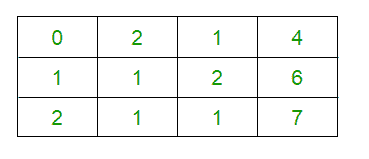
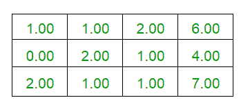
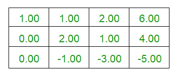
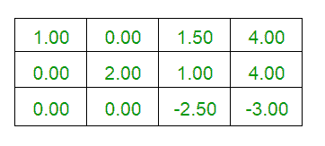
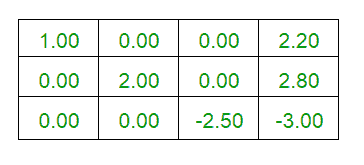
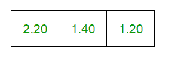

# 高斯-乔丹消去法程序

> 原文:[https://www . geesforgeks . org/program-for-gauss-Jordan-消元法/](https://www.geeksforgeeks.org/program-for-gauss-jordan-elimination-method/)

**先决条件:** [高斯消元求解线性方程组](https://www.geeksforgeeks.org/gaussian-elimination/)
**简介:**高斯-约当消元法，又称高斯-约当消元法，用于求解一个线性方程组，是[高斯消元法](https://www.geeksforgeeks.org/gaussian-elimination/)的修正版。
类似于高斯消元法，也比高斯消元法更简单，因为我们在高斯消元法中要进行 2 个不同的过程，即
1)上三角矩阵的形成，
2)回代
但是在高斯-乔丹消元法的情况下，我们只需要形成一个约简的行梯次形式(对角矩阵)。下面是高斯-乔丹消去法的流程图。
**高斯-乔丹消元法流程图:**


**例:**

```
Input :  2y + z = 4
         x + y + 2z = 6
         2x + y + z = 7

Output :
Final Augmented Matrix is : 
1 0 0 2.2 
0 2 0 2.8 
0 0 -2.5 -3 

Result is : 2.2 1.4 1.2 
```

**解释:**下面给出的是上面例子的解释。

*   输入扩充矩阵是:



*   交换 R1 和 R2，我们得到



*   执行行操作 R3



*   执行行操作 R1



*   表演 R1



*   独特的解决方案有:



## C++

```
// C++ Implementation for Gauss-Jordan
// Elimination Method
#include <bits/stdc++.h>
using namespace std;

#define M 10

// Function to print the matrix
void PrintMatrix(float a[][M], int n)
{
    for (int i = 0; i < n; i++) {
        for (int j = 0; j <= n; j++)
          cout << a[i][j] << " ";
        cout << endl;
    }
}

// function to reduce matrix to reduced
// row echelon form.
int PerformOperation(float a[][M], int n)
{
    int i, j, k = 0, c, flag = 0, m = 0;
    float pro = 0;

    // Performing elementary operations
    for (i = 0; i < n; i++)
    {
        if (a[i][i] == 0)
        {
            c = 1;
            while ((i + c) < n && a[i + c][i] == 0)
                c++;           
            if ((i + c) == n) {
                flag = 1;
                break;
            }
            for (j = i, k = 0; k <= n; k++)
                swap(a[j][k], a[j+c][k]);
        }

        for (j = 0; j < n; j++) {

            // Excluding all i == j
            if (i != j) {

                // Converting Matrix to reduced row
                // echelon form(diagonal matrix)
                float pro = a[j][i] / a[i][i];

                for (k = 0; k <= n; k++)                
                    a[j][k] = a[j][k] - (a[i][k]) * pro;               
            }
        }
    }
    return flag;
}

// Function to print the desired result
// if unique solutions exists, otherwise
// prints no solution or infinite solutions
// depending upon the input given.
void PrintResult(float a[][M], int n, int flag)
{
    cout << "Result is : ";

    if (flag == 2)    
      cout << "Infinite Solutions Exists" << endl;   
    else if (flag == 3)    
      cout << "No Solution Exists" << endl;

    // Printing the solution by dividing constants by
    // their respective diagonal elements
    else {
        for (int i = 0; i < n; i++)        
            cout << a[i][n] / a[i][i] << " ";       
    }
}

// To check whether infinite solutions
// exists or no solution exists
int CheckConsistency(float a[][M], int n, int flag)
{
    int i, j;
    float sum;

    // flag == 2 for infinite solution
    // flag == 3 for No solution
    flag = 3;
    for (i = 0; i < n; i++)
    {
        sum = 0;
        for (j = 0; j < n; j++)       
            sum = sum + a[i][j];
        if (sum == a[i][j])
            flag = 2;       
    }
    return flag;
}

// Driver code
int main()
{
    float a[M][M] = {{ 0, 2, 1, 4 },
                     { 1, 1, 2, 6 },
                     { 2, 1, 1, 7 }};

    // Order of Matrix(n)
    int n = 3, flag = 0;

    // Performing Matrix transformation
    flag = PerformOperation(a, n);

    if (flag == 1)    
        flag = CheckConsistency(a, n, flag);   

    // Printing Final Matrix
    cout << "Final Augmented Matrix is : " << endl;
    PrintMatrix(a, n);
    cout << endl;

    // Printing Solutions(if exist)
    PrintResult(a, n, flag);

    return 0;
}
```

## Java 语言(一种计算机语言，尤用于创建网站)

```
// Java Implementation for Gauss-Jordan
// Elimination Method
class GFG {

static int M = 10;

// Function to print the matrix
static void PrintMatrix(float a[][], int n)
{
    for (int i = 0; i < n; i++)
    {
        for (int j = 0; j <= n; j++)
            System.out.print(a[i][j] + " ");
        System.out.println();
    }
}

// function to reduce matrix to reduced
// row echelon form.
static int PerformOperation(float a[][], int n)
{
    int i, j, k = 0, c, flag = 0, m = 0;
    float pro = 0;

    // Performing elementary operations
    for (i = 0; i < n; i++)
    {
        if (a[i][i] == 0)
        {
            c = 1;
            while ((i + c) < n && a[i + c][i] == 0)
                c++;        
            if ((i + c) == n)
            {
                flag = 1;
                break;
            }
            for (j = i, k = 0; k <= n; k++)
            {
                float temp =a[j][k];
                a[j][k] = a[j+c][k];
                a[j+c][k] = temp;
            }
        }

        for (j = 0; j < n; j++)
        {

            // Excluding all i == j
            if (i != j)
            {

                // Converting Matrix to reduced row
                // echelon form(diagonal matrix)
                float p = a[j][i] / a[i][i];

                for (k = 0; k <= n; k++)                
                    a[j][k] = a[j][k] - (a[i][k]) * p;            
            }
        }
    }
    return flag;
}

// Function to print the desired result
// if unique solutions exists, otherwise
// prints no solution or infinite solutions
// depending upon the input given.
static void PrintResult(float a[][], int n, int flag)
{
    System.out.print("Result is : ");

    if (flag == 2)    
    System.out.println("Infinite Solutions Exists");
    else if (flag == 3)    
    System.out.println("No Solution Exists");

    // Printing the solution by dividing constants by
    // their respective diagonal elements
    else {
        for (int i = 0; i < n; i++)        
            System.out.print(a[i][n] / a[i][i] +" ");    
    }
}

// To check whether infinite solutions
// exists or no solution exists
static int CheckConsistency(float a[][], int n, int flag)
{
    int i, j;
    float sum;

    // flag == 2 for infinite solution
    // flag == 3 for No solution
    flag = 3;
    for (i = 0; i < n; i++)
    {
        sum = 0;
        for (j = 0; j < n; j++)    
            sum = sum + a[i][j];
        if (sum == a[i][j])
            flag = 2;    
    }
    return flag;
}

// Driver code
public static void main(String[] args)
{
    float a[][] = {{ 0, 2, 1, 4 },
                    { 1, 1, 2, 6 },
                    { 2, 1, 1, 7 }};

    // Order of Matrix(n)
    int n = 3, flag = 0;

    // Performing Matrix transformation
    flag = PerformOperation(a, n);

    if (flag == 1)    
        flag = CheckConsistency(a, n, flag);

    // Printing Final Matrix
    System.out.println("Final Augmented Matrix is : ");
    PrintMatrix(a, n);
    System.out.println("");

    // Printing Solutions(if exist)
    PrintResult(a, n, flag);
}
}

/* This code contributed by PrinciRaj1992 */
```

## C#

```
// C# Implementation for Gauss-Jordan
// Elimination Method
using System;
using System.Collections.Generic;

class GFG
{
static int M = 10;

// Function to print the matrix
static void PrintMatrix(float [,]a, int n)
{
    for (int i = 0; i < n; i++)
    {
        for (int j = 0; j <= n; j++)
            Console.Write(a[i, j] + " ");
        Console.WriteLine();
    }
}

// function to reduce matrix to reduced
// row echelon form.
static int PerformOperation(float [,]a, int n)
{
    int i, j, k = 0, c, flag = 0;

    // Performing elementary operations
    for (i = 0; i < n; i++)
    {
        if (a[i, i] == 0)
        {
            c = 1;
            while ((i + c) < n && a[i + c, i] == 0)
                c++;        
            if ((i + c) == n)
            {
                flag = 1;
                break;
            }
            for (j = i, k = 0; k <= n; k++)
            {
                float temp = a[j, k];
                a[j, k] = a[j + c, k];
                a[j + c, k] = temp;
            }
        }

        for (j = 0; j < n; j++)
        {

            // Excluding all i == j
            if (i != j)
            {

                // Converting Matrix to reduced row
                // echelon form(diagonal matrix)
                float p = a[j, i] / a[i, i];

                for (k = 0; k <= n; k++)                
                    a[j, k] = a[j, k] - (a[i, k]) * p;            
            }
        }
    }
    return flag;
}

// Function to print the desired result
// if unique solutions exists, otherwise
// prints no solution or infinite solutions
// depending upon the input given.
static void PrintResult(float [,]a,
                        int n, int flag)
{
    Console.Write("Result is : ");

    if (flag == 2)    
    Console.WriteLine("Infinite Solutions Exists");
    else if (flag == 3)    
    Console.WriteLine("No Solution Exists");

    // Printing the solution by dividing
    // constants by their respective
    // diagonal elements
    else
    {
        for (int i = 0; i < n; i++)        
            Console.Write(a[i, n] / a[i, i] + " ");    
    }
}

// To check whether infinite solutions
// exists or no solution exists
static int CheckConsistency(float [,]a,
                            int n, int flag)
{
    int i, j;
    float sum;

    // flag == 2 for infinite solution
    // flag == 3 for No solution
    flag = 3;
    for (i = 0; i < n; i++)
    {
        sum = 0;
        for (j = 0; j < n; j++)    
            sum = sum + a[i, j];
        if (sum == a[i, j])
            flag = 2;    
    }
    return flag;
}

// Driver code
public static void Main(String[] args)
{
    float [,]a = {{ 0, 2, 1, 4 },
                  { 1, 1, 2, 6 },
                  { 2, 1, 1, 7 }};

    // Order of Matrix(n)
    int n = 3, flag = 0;

    // Performing Matrix transformation
    flag = PerformOperation(a, n);

    if (flag == 1)    
        flag = CheckConsistency(a, n, flag);

    // Printing Final Matrix
    Console.WriteLine("Final Augmented Matrix is : ");
    PrintMatrix(a, n);
    Console.WriteLine("");

    // Printing Solutions(if exist)
    PrintResult(a, n, flag);
}
}

// This code is contributed by 29AjayKumar
```

## java 描述语言

```
<script>

// JavaScript Implementation for Gauss-Jordan
// Elimination Method

let M = 10;

// Function to print the matrix
function PrintMatrix(a,n)
{
    for (let i = 0; i < n; i++)
    {
        for (let j = 0; j <= n; j++)
            document.write(a[i][j] + " ");
        document.write("<br>");
    }
}

// function to reduce matrix to reduced
// row echelon form.
function PerformOperation(a,n)
{
    let i, j, k = 0, c, flag = 0, m = 0;
    let pro = 0;

    // Performing elementary operations
    for (i = 0; i < n; i++)
    {
        if (a[i][i] == 0)
        {
            c = 1;
            while ((i + c) < n && a[i + c][i] == 0)
                c++;        
            if ((i + c) == n)
            {
                flag = 1;
                break;
            }
            for (j = i, k = 0; k <= n; k++)
            {
                let temp =a[j][k];
                a[j][k] = a[j+c][k];
                a[j+c][k] = temp;
            }
        }

        for (j = 0; j < n; j++)
        {

            // Excluding all i == j
            if (i != j)
            {

                // Converting Matrix to reduced row
                // echelon form(diagonal matrix)
                let p = a[j][i] / a[i][i];

                for (k = 0; k <= n; k++)                
                    a[j][k] = a[j][k] - (a[i][k]) * p;            
            }
        }
    }
    return flag;
}

// Function to print the desired result
// if unique solutions exists, otherwise
// prints no solution or infinite solutions
// depending upon the input given.
function PrintResult(a,n,flag)
{
    document.write("Result is : ");

    if (flag == 2)    
        document.write("Infinite Solutions Exists<br>");
    else if (flag == 3)    
        document.write("No Solution Exists<br>");

    // Printing the solution by dividing constants by
    // their respective diagonal elements
    else {
        for (let i = 0; i < n; i++)        
            document.write(a[i][n] / a[i][i] +" ");    
    }
}

// To check whether infinite solutions
// exists or no solution exists
function CheckConsistency(a,n,flag)
{
    let i, j;
    let sum;

    // flag == 2 for infinite solution
    // flag == 3 for No solution
    flag = 3;
    for (i = 0; i < n; i++)
    {
        sum = 0;
        for (j = 0; j < n; j++)    
            sum = sum + a[i][j];
        if (sum == a[i][j])
            flag = 2;    
    }
    return flag;
}

// Driver code
let a=[[ 0, 2, 1, 4 ],
                    [ 1, 1, 2, 6 ],
                    [ 2, 1, 1, 7 ]];
// Order of Matrix(n)
let n = 3, flag = 0;

// Performing Matrix transformation
flag = PerformOperation(a, n);

if (flag == 1)    
    flag = CheckConsistency(a, n, flag);

// Printing Final Matrix
document.write("Final Augmented Matrix is : <br>");
PrintMatrix(a, n);
document.write("<br>");

// Printing Solutions(if exist)
PrintResult(a, n, flag);

// This code is contributed by rag2127

</script>
```

**Output**

```
Final Augmented Matrix is : 
1 0 0 2.2 
0 2 0 2.8 
0 0 -2.5 -3 

Result is : 2.2 1.4 1.2 
```

**应用:**

*   **求解线性方程组:**高斯-约当消元法可以用来求一个线性方程组的解，这个方法在整个数学中都有应用。
*   **求行列式:**为了求矩阵的行列式，可以对正方形矩阵应用高斯消去法。
*   **求矩阵的逆:**高斯-约当消元法可用于确定方阵的逆。
*   **求秩和基:**利用约化行梯次形式，可以用高斯消元法计算方阵的秩和基。