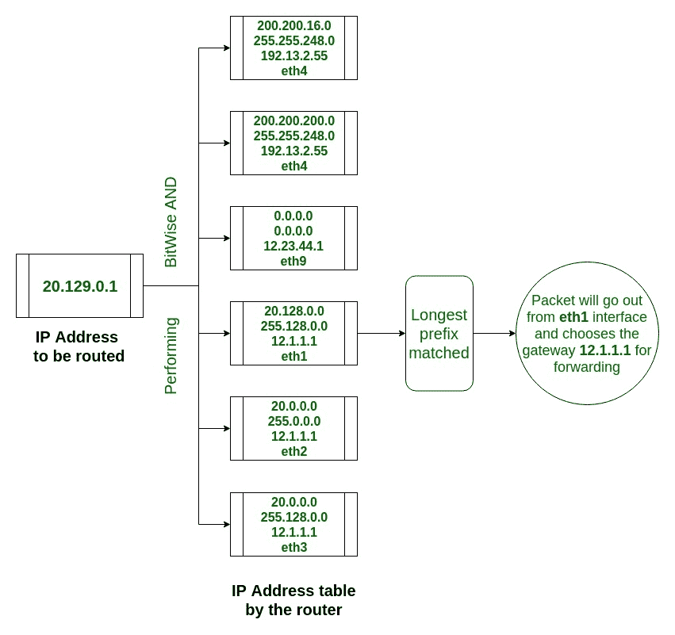

# IP 转发表查找程序

> 原文:[https://www . geesforgeks . org/program-for-IP-forwarding-table-lookup/](https://www.geeksforgeeks.org/program-for-ip-forwarding-table-lookup/)

在 Unix 操作系统中，有一个包含一定数量元组的路由表。这些元组由网络 IP、子网掩码、网关 IP 和接口名称组成。这些细节用于将数据包转发到其网络外部以连接到互联网。因此，本文给出了系统如何决定何时需要转发数据包的想法。

**示例:**

```
Input: 201.2.2.2
Output: 12.23.44.1 eth9
Here, there is no network IP entry in the routing table
which starts with "201". In this case it will 
choose default path(0.0.0.0, 0.0.0.0, 12.23.44.1, eth9). 
Still, it will perform bitwise AND operation with 
each entry and then chooses default path's interface 
and gateway to send packet outside. Default path means 
interface to which system is directly connected.

Input: 200.200.200.1
Output: 190.164.1.2 eth0
Here bitwise AND operation is performed 
with each entry of routing table and correspondent 
network's interface name and gateway IP is returned.
```

**如何转发** **数据包？**
借助一个小例子可以很容易理解这一点:

*   假设有一个 IP 地址为“**20.129.0.1**”的数据包，并且**路由表**包含以下条目:

<figure class="table">

| 网络的 IP 地址 | 子网掩码 | 网关的 IP 地址 | 接口名称 |
| --- | --- | --- | --- |
| 200.200.16.0 | 255.255.248.0 | 192.13.2.55 | eth4 |
| 200.200.200.0 | 255.255.248.0 | 192.13.2.55 | eth4 |
| 0.0.0.0 | 0.0.0.0 | 12.23.44.1 | eth9 |
| 20.128.0.0 | 255.128.0.0 | 12.1.1.1 | eth1 |
| 20.0.0.0 | 255.0.0.0 | 12.1.1.1 | eth2 |
| 20.0.0.0 | 255.128.0.0 | 12.1.1.1 | eth3 |

</figure>

*   因此，当数据包到达系统内核寻找网关和接口时，它将首先对每个条目的**子网掩码执行**位“与”**运算，以找到 [**最长前缀匹配**](https://www.geeksforgeeks.org/computer-networks-longest-prefix-matching-in-routers/) 。**
*   逐位与运算**的**结果**然后与网络的 IP 地址**进行比较。因此，它将返回网关的对应 IP 地址和接口名称，数据包可以通过它们发出。
*   **20.129.0.1 的二进制表示为 00010100.10000001.00000000.0000001**。然后，它对路由表中的每个条目执行带有子网掩码的逐位“与”运算。
*   在该表中，条目编号为 4(即 **20.128.0.0、255.128.0.0、12.1.1.1、eth1** ，这给出了该数据包的**最长前缀匹配**。因此**数据包将从** **eth1 接口发出，选择网关 12.1.1.1 进行转发。**



下面是使用[链表](https://www.geeksforgeeks.org/linked-list-set-1-introduction/)数据结构实现上述方法。它将 2 个文件作为输入，并在上面提到的另一个文件中返回输出。

### [输入文件和输出文件](https://drive.google.com/open?id=1aVLm47YigVRV1acfgrAOLFQqDp9DDWaZ)

*   文件“input.txt”代表数据包的 IP 地址。
*   文件“routing.txt”包含要匹配 IP 地址的路由表条目。
*   文件“output.txt”包含每个输入的输出。

**程序:**

## C

```
// C code to implement IP forwarding table lookup

#include <arpa/inet.h>
#include <netinet/in.h>
#include <stdio.h>
#include <stdlib.h>
#include <string.h>

#define M 15
#define N 150

// Declaration of structure of linked list
// to store ip address in each node
struct node {
    char* data;
    struct node* next;
} * head[15];

// This function fetch data from file
// and store them into different arrays
void storeData(FILE* fp,
               char buf[M][N],
               char net[M][N],
               char mask[M][N],
               char gateway[M][N],
               char port[M][N])
{

    char line[200];
    int c, i = 0, j, k = 0, m = 0;

    // Read data from the file line by line
    // and each line is stored in array separately.
    while (fgets(line, sizeof(line), fp)) {
        j = 0;
        for (int l = 0; l < strlen(line); l++) {
            buf[i][j] = line[l];
            j++;
        }
        i++;
    }

    // From each lines stored in buf,
    // network id, subnet mask, gateway
    // and port are extracted
    // and stored into individual arrays.
    for (i = 0; i < 15; i++) {
        k = 0;
        for (j = 0; buf[i][j] != ','; j++) {
            net[i][k] = buf[i][j];
            k++;
        }
        m = j + 2;
        k = 0;
        for (j = m; buf[i][j] != ','; j++) {
            mask[i][k] = buf[i][j];
            k++;
        }
        m = j + 2;
        k = 0;
        for (j = m; buf[i][j] != ','; j++) {
            gateway[i][k] = buf[i][j];
            k++;
        }
        m = j + 2;
        k = 0;
        for (j = m; buf[i][j] != '\0'; j++) {
            port[i][k] = buf[i][j];
            k++;
        }
    }
}

// Function to create routing table
// using arrays created by storeData() function
// using linked list data structure
void insert(char net[M][N], char mask[M][N],
            char gateway[M][N], char port[M][N],
            char buf[M][N])
{
    char *temp1, *temp2, *temp3, *temp4;
    struct node* new;

    for (int i = 0; i < M; i++) {

        // Initialize head of each
        // linked list with NULL.
        head[i] = NULL;
    }

    for (int i = 0; i < M; i++) {
        for (int j = 0; j < 4; j++) {

            // If head is null
            // then first create new node
            // and store network id into it.
            if (head[i] == NULL) {

                new = (struct node*)malloc(
                    sizeof(struct node));
                new->data = net[i];
                new->next = NULL;
                head[i] = new;
            }

            // If head is not null
            // and value of j is 1 then create new node
            // which is pointed by head and it
            // will contain subnet mask
            else if (j == 1) {

                new->next = (struct node*)malloc(
                    sizeof(struct node));
                new = new->next;
                new->data = mask[i];
                new->next = NULL;
            }

            // If head is not null and value of j is 2
            // then create new node
            // which is pointed by subnet mask
            // and it will contain gateway
            else if (j == 2) {

                new->next = (struct node*)malloc(
                    sizeof(struct node));
                new = new->next;
                new->data = gateway[i];
            }

            // If head is not null and value of j is 3
            // then create new node
            // which is pointed by gateway and
            // it will contain port
            else if (j == 3) {

                new->next = (struct node*)malloc(
                    sizeof(struct node));
                new = new->next;
                new->data = port[i];
            }
        }
    }

    // Perform sorting on the basis
    // of longest prefix of subnet mask
    for (int i = 0; i < M; i++) {
        for (int j = i; j < M; j++) {

            // Longest prefix has been compared
            // by using inet_addr() system call
            // which gives decimal value of an ip address.
            if (inet_addr(head[i]->next->data)
                < inet_addr(head[j]->next->data)) {

                struct node* temp = head[i];
                head[i] = head[j];
                head[j] = temp;
            }
        }
    }
}

// This function will search for gateway ip
// and port number in routing table
// through which packet has been sent
// to next node/destination
void search(FILE* fp1, FILE* fp2)
{

    char str[100];
    struct in_addr addr;
    unsigned int val;
    fprintf(fp2, "%c", ' ');

    // Read file 'input.txt' line by line
    // and perform bitwise AND between subnet mask
    // and input(destination) ip coming from file.
    while (fgets(str, sizeof(str), fp1)) {

        for (int i = 0; i < M; i++) {

            // Perform bitwise AND operation on result
            // (i.e. Decimal value of an ip address)
            // coming from inet_addr() system call
            val = inet_addr(str) & inet_addr(head[i]->next->data);
            addr.s_addr = val;
            char* str1 = inet_ntoa(addr);
            char* str2 = head[i]->data;
            int count = 0;

            // Compare the network id string with result
            // coming after performing AND operation
            // and if they are same then increment count.
            for (int i = 0; str1[i] != '\0'; i++) {

                if (str1[i] == str2[i]) {
                    count++;
                }
            }

            // If count is same as the string length
            // of network id then find gateway ip
            // and port number of that respective network id
            // and write it into 'output.txt' file.
            if (count == strlen(str1)) {

                struct node* ptr = head[i]->next;
                struct node* temp = ptr->next;
                while (temp != NULL) {

                    fprintf(fp2, "%s ", temp->data);
                    temp = temp->next;
                }
                break;
            }
        }
    }
}

// Driver code
int main(int argc, char* argv[])
{

    FILE *fin, *fout, *fp;
    char buf[M][N] = { { 0 } };
    char net[M][N] = { { 0 } };
    char mask[M][N] = { { 0 } };
    char gateway[M][N] = { { 0 } };
    char port[M][N] = { { 0 } };

    // if command line argument is less than 3
    // then it will show standard error.
    if (argc < 3) {

        fprintf(stderr, "File name:%s\n", argv[0]);
        return 1;
    }

    // If 3 arguments are given then input
    // and routing.txt files will be opened in read mode
    // while output.txt file is opened in write mode.
    else {

        fin = fopen(argv[1], "r");
        fout = fopen(argv[2], "w");
        fp = fopen(argv[3], "r");
    }

    // If any of the file is not present
    // then it will give an error.
    if (fp == NULL || fin == NULL || fout == NULL) {

        printf("Error");
        return 0;
    }

    // This function will read the data
    // of a file 'routing.txt' line by line
    // and store them into one array named 'buf',
    // after that the coma separated values in buf
    // are stored into their respective array.
    storeData(fp, buf, net, mask, gateway, port);

    // It will create routing table using linked list
    insert(net, mask, gateway, port, buf);

    // It will take input from input.txt files
    // which contains only destination ip address
    // and search about the route through which
    // packet has been sent in network
    // and output is stored in to an output.txt file
    search(fin, fout);

    printf("Forwarding table has been implemented successfully");
    printf("See the output in %s file\n", argv[2]);

    /*Closes all the files*/
    fclose(fin);
    fclose(fp);
    fclose(fout);

    return 0;
}
// This code is written by Pooja Patel
```