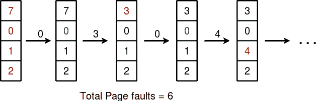

# 最近最少使用(LRU)页面替换算法程序

> 原文:[https://www . geesforgeks . org/program-for-最近最少使用-LRU-page-replacement-algorithm/](https://www.geeksforgeeks.org/program-for-least-recently-used-lru-page-replacement-algorithm/)

先决条件:[页面替换算法](https://www.geeksforgeeks.org/operating-system-page-replacement-algorithm/)
在使用分页进行内存管理的操作系统中，需要页面替换算法来决定新页面进入时需要替换哪个页面。每当一个新页面被引用并且不在内存中时，就会发生页面错误，操作系统会用新需要的页面替换一个现有页面。不同的页面替换算法建议不同的方法来决定替换哪个页面。所有算法的目标都是减少页面错误的数量。
在 **L** 东 **R** 最近 **U** sed (LRU)算法是一种贪婪算法，其中要替换的页面最近使用最少。这个想法是基于引用的局部性，最近使用最少的页面不太可能
假设页面引用字符串 7 0 1 2 0 3 0 4 2 3 0 3 2。最初我们有 4 页空位。
最初所有插槽都是空的，因此当 7 0 1 2 被分配给空插槽时— > **4 页故障**
0 已经是它们的 so — > **0 页故障。**
当 3 出现时，它将代替 7，因为它最近使用最少— > **1 页面错误**
0 已经在内存中，所以— > **0 页面错误**。
4 将取代 1 — > **1 页面错误**
现在为进一步的页面引用字符串— > **0 页面错误**，因为它们已经在内存中可用。



***给定内存容量(作为它可以容纳的页数)和一个表示要引用的页面的字符串，编写一个函数来查找页面错误的数量。***

```
Let capacity be the number of pages that
memory can hold.  Let set be the current
set of pages in memory.

1- Start traversing the pages.
 i) If set holds less pages than capacity.
   a) Insert page into the set one by one until 
      the size  of set reaches capacity or all
      page requests are processed.
   b) Simultaneously maintain the recent occurred
      index of each page in a map called indexes.
   c) Increment page fault
 ii) Else 
   If current page is present in set, do nothing.
   Else 
     a) Find the page in the set that was least 
     recently used. We find it using index array.
     We basically need to replace the page with
     minimum index.
     b) Replace the found page with current page.
     c) Increment page faults.
     d) Update index of current page.

2\. Return page faults.
```

下面是上述步骤的实现。

## C++

```
//C++ implementation of above algorithm
#include<bits/stdc++.h>
using namespace std;

// Function to find page faults using indexes
int pageFaults(int pages[], int n, int capacity)
{
    // To represent set of current pages. We use
    // an unordered_set so that we quickly check
    // if a page is present in set or not
    unordered_set<int> s;

    // To store least recently used indexes
    // of pages.
    unordered_map<int, int> indexes;

    // Start from initial page
    int page_faults = 0;
    for (int i=0; i<n; i++)
    {
        // Check if the set can hold more pages
        if (s.size() < capacity)
        {
            // Insert it into set if not present
            // already which represents page fault
            if (s.find(pages[i])==s.end())
            {
                s.insert(pages[i]);

                // increment page fault
                page_faults++;
            }

            // Store the recently used index of
            // each page
            indexes[pages[i]] = i;
        }

        // If the set is full then need to perform lru
        // i.e. remove the least recently used page
        // and insert the current page
        else
        {
            // Check if current page is not already
            // present in the set
            if (s.find(pages[i]) == s.end())
            {
                // Find the least recently used pages
                // that is present in the set
                int lru = INT_MAX, val;
                for (auto it=s.begin(); it!=s.end(); it++)
                {
                    if (indexes[*it] < lru)
                    {
                        lru = indexes[*it];
                        val = *it;
                    }
                }

                // Remove the indexes page
                s.erase(val);

                // insert the current page
                s.insert(pages[i]);

                // Increment page faults
                page_faults++;
            }

            // Update the current page index
            indexes[pages[i]] = i;
        }
    }

    return page_faults;
}

// Driver code
int main()
{
    int pages[] = {7, 0, 1, 2, 0, 3, 0, 4, 2, 3, 0, 3, 2};
    int n = sizeof(pages)/sizeof(pages[0]);
    int capacity = 4;
    cout << pageFaults(pages, n, capacity);
    return 0;
}
```

## Java 语言(一种计算机语言，尤用于创建网站)

```
// Java implementation of above algorithm

import java.util.HashMap;
import java.util.HashSet;
import java.util.Iterator;

class Test
{
    // Method to find page faults using indexes
    static int pageFaults(int pages[], int n, int capacity)
    {
        // To represent set of current pages. We use
        // an unordered_set so that we quickly check
        // if a page is present in set or not
        HashSet<Integer> s = new HashSet<>(capacity);

        // To store least recently used indexes
        // of pages.
        HashMap<Integer, Integer> indexes = new HashMap<>();

        // Start from initial page
        int page_faults = 0;
        for (int i=0; i<n; i++)
        {
            // Check if the set can hold more pages
            if (s.size() < capacity)
            {
                // Insert it into set if not present
                // already which represents page fault
                if (!s.contains(pages[i]))
                {
                    s.add(pages[i]);

                    // increment page fault
                    page_faults++;
                }

                // Store the recently used index of
                // each page
                indexes.put(pages[i], i);
            }

            // If the set is full then need to perform lru
            // i.e. remove the least recently used page
            // and insert the current page
            else
            {
                // Check if current page is not already
                // present in the set
                if (!s.contains(pages[i]))
                {
                    // Find the least recently used pages
                    // that is present in the set
                    int lru = Integer.MAX_VALUE, val=Integer.MIN_VALUE;

                    Iterator<Integer> itr = s.iterator();

                    while (itr.hasNext()) {
                        int temp = itr.next();
                        if (indexes.get(temp) < lru)
                        {
                            lru = indexes.get(temp);
                            val = temp;
                        }
                    }

                    // Remove the indexes page
                    s.remove(val);
                   //remove lru from hashmap
                   indexes.remove(val);
                    // insert the current page
                    s.add(pages[i]);

                    // Increment page faults
                    page_faults++;
                }

                // Update the current page index
                indexes.put(pages[i], i);
            }
        }

        return page_faults;
    }

    // Driver method
    public static void main(String args[])
    {
        int pages[] = {7, 0, 1, 2, 0, 3, 0, 4, 2, 3, 0, 3, 2};

        int capacity = 4;

        System.out.println(pageFaults(pages, pages.length, capacity));
    }
}
// This code is contributed by Gaurav Miglani
```

## C#

```
// C# implementation of above algorithm
using System;
using System.Collections.Generic;

class GFG
{
    // Method to find page faults
    // using indexes
    static int pageFaults(int []pages,
                   int n, int capacity)
    {
        // To represent set of current pages.
        // We use an unordered_set so that
        // we quickly check if a page is
        // present in set or not
        HashSet<int> s = new HashSet<int>(capacity);

        // To store least recently used indexes
        // of pages.
        Dictionary<int,
                   int> indexes = new Dictionary<int,
                                                 int>();

        // Start from initial page
        int page_faults = 0;
        for (int i = 0; i < n; i++)
        {
            // Check if the set can hold more pages
            if (s.Count < capacity)
            {
                // Insert it into set if not present
                // already which represents page fault
                if (!s.Contains(pages[i]))
                {
                    s.Add(pages[i]);

                    // increment page fault
                    page_faults++;
                }

                // Store the recently used index of
                // each page
                if(indexes.ContainsKey(pages[i]))
                    indexes[pages[i]] = i;
                else
                    indexes.Add(pages[i], i);
            }

            // If the set is full then need to
            // perform lru i.e. remove the least
            // recently used page and insert
            // the current page
            else
            {
                // Check if current page is not
                // already present in the set
                if (!s.Contains(pages[i]))
                {
                    // Find the least recently used pages
                    // that is present in the set
                    int lru = int.MaxValue, val = int.MinValue;

                    foreach (int itr in s)
                    {
                        int temp = itr;
                        if (indexes[temp] < lru)
                        {
                            lru = indexes[temp];
                            val = temp;
                        }
                    }

                    // Remove the indexes page
                    s.Remove(val);

                    //remove lru from hashmap
                    indexes.Remove(val);

                    // insert the current page
                    s.Add(pages[i]);

                    // Increment page faults
                    page_faults++;
                }

                // Update the current page index
                if(indexes.ContainsKey(pages[i]))
                    indexes[pages[i]] = i;
                else
                    indexes.Add(pages[i], i);
            }
        }
        return page_faults;
    }

    // Driver Code
    public static void Main(String []args)
    {
        int []pages = {7, 0, 1, 2, 0, 3,
                       0, 4, 2, 3, 0, 3, 2};

        int capacity = 4;

        Console.WriteLine(pageFaults(pages,
                          pages.Length, capacity));
    }
}

// This code is contributed by 29AjayKumar
```

## java 描述语言

```
<script>

// JavaScript implementation of above algorithm

// Method to find page faults using indexes
function pageFaults(pages,n,capacity)
{
    // To represent set of current pages. We use
        // an unordered_set so that we quickly check
        // if a page is present in set or not
        let s = new Set();

        // To store least recently used indexes
        // of pages.
        let indexes = new Map();

        // Start from initial page
        let page_faults = 0;
        for (let i=0; i<n; i++)
        {
            // Check if the set can hold more pages
            if (s.size < capacity)
            {
                // Insert it into set if not present
                // already which represents page fault
                if (!s.has(pages[i]))
                {
                    s.add(pages[i]);

                    // increment page fault
                    page_faults++;
                }

                // Store the recently used index of
                // each page
                indexes.set(pages[i], i);
            }

            // If the set is full then need to perform lru
            // i.e. remove the least recently used page
            // and insert the current page
            else
            {
                // Check if current page is not already
                // present in the set
                if (!s.has(pages[i]))
                {
                    // Find the least recently used pages
                    // that is present in the set
                    let lru = Number.MAX_VALUE, val=Number.MIN_VALUE;

                    for(let itr of s.values()) {
                        let temp = itr;
                        if (indexes[temp] < lru)
                        {
                            lru = indexes[temp];
                            val = temp;
                        }
                    }

                    // Remove the indexes page
                    s.delete(val);
                   //remove lru from hashmap
                   indexes.delete(val);
                    // insert the current page
                    s.add(pages[i]);

                    // Increment page faults
                    page_faults++;
                }

                // Update the current page index
                indexes.set(pages[i], i);
            }
        }

        return page_faults;
}

 // Driver method
let pages=[7, 0, 1, 2, 0, 3, 0, 4, 2, 3, 0, 3, 2];
let capacity = 4;
document.write(pageFaults(pages, pages.length, capacity));

// This code is contributed by rag2127

</script>
```

**输出:**

```
6
```

**另一种方法:**(不使用 HashMap)

## C++

```
// Online C++ compiler to run C++ program online
#include <iostream>
#include<bits/stdc++.h>
using namespace std;

int main()
{
  int capacity = 4;
  int arr[] = {7, 0, 1, 2, 0, 3, 0, 4, 2, 3, 0, 3, 2};

  deque<int> q(capacity);
  int count=0;
  int page_faults=0;
  deque<int>::iterator itr;
  q.clear();
  for(int i:arr)
  {

    // Insert it into set if not present
    // already which represents page fault
    itr = find(q.begin(),q.end(),i);
    if(!(itr != q.end()))
    {

      ++page_faults;

      // Check if the set can hold equal pages
      if(q.size() == capacity)
      {
        q.erase(q.begin());
        q.push_back(i);
      }
      else{
        q.push_back(i);

      }
    }
    else
    {
      // Remove the indexes page
      q.erase(itr);

      // insert the current page
      q.push_back(i);        
    }

  }
  cout<<page_faults;
}

// This code is contributed by Akshit Saxena
```

## Java 语言(一种计算机语言，尤用于创建网站)

```
// Java program for page replacement algorithms
import java.util.ArrayList;

public class LRU {

    // Driver method
    public static void main(String[] args) {
        int capacity = 4;
        int arr[] = {7, 0, 1, 2, 0, 3, 0, 4, 2, 3, 0, 3, 2};

        // To represent set of current pages.We use
        // an Arraylist
        ArrayList<Integer> s=new ArrayList<>(capacity);
        int count=0;
        int page_faults=0;
        for(int i:arr)
        {
            // Insert it into set if not present
            // already which represents page fault
            if(!s.contains(i))
            {

            // Check if the set can hold equal pages
            if(s.size()==capacity)
            {
                s.remove(0);
                s.add(capacity-1,i);
            }
            else
                s.add(count,i);
                // Increment page faults
                page_faults++;
                ++count;

            }
            else
            {
                // Remove the indexes page
                s.remove((Object)i);
                // insert the current page
                s.add(s.size(),i);        
            }

        }
        System.out.println(page_faults);
    }
}
```

## 蟒蛇 3

```
# Python3 program for page replacement algorithm

# Driver code
capacity = 4
processList = [ 7, 0, 1, 2, 0, 3, 0,
                4, 2, 3, 0, 3, 2]

# List of current pages in Main Memory
s = []

pageFaults = 0
# pageHits = 0

for i in processList:

    # If i is not present in currentPages list
    if i not in s:

        # Check if the list can hold equal pages
        if(len(s) == capacity):
            s.remove(s[0])
            s.append(i)

        else:
            s.append(i)

        # Increment Page faults
        pageFaults +=1

    # If page is already there in
    # currentPages i.e in Main
    else:

        # Remove previous index of current page
        s.remove(i)

        # Now append it, at last index
        s.append(i)

print("{}".format(pageFaults))

# This code is contributed by mahi_07
```

## C#

```
// C# program for page replacement algorithms
using System;
using System.Collections.Generic;

class LRU
{

    // Driver method
    public static void Main(String[] args)
    {
        int capacity = 4;
        int []arr = {7, 0, 1, 2, 0, 3, 0,
                     4, 2, 3, 0, 3, 2};

        // To represent set of current pages.
        // We use an Arraylist
        List<int> s = new List<int>(capacity);
        int count = 0;
        int page_faults = 0;
        foreach(int i in arr)
        {
            // Insert it into set if not present
            // already which represents page fault
            if(!s.Contains(i))
            {

            // Check if the set can hold equal pages
            if(s.Count == capacity)
            {
                s.RemoveAt(0);
                s.Insert(capacity - 1, i);
            }
            else
                s.Insert(count, i);

                // Increment page faults
                page_faults++;
                ++count;
            }
            else
            {
                // Remove the indexes page
                s.Remove(i);

                // insert the current page
                s.Insert(s.Count, i);        
            }
        }
        Console.WriteLine(page_faults);
    }
}

// This code is contributed by Rajput-Ji
```

**输出:**

```
6
```

注:我们还可以找到页面点击量。只需要保持一个单独的计数。
如果当前页面已经在内存中，则必须算作页面命中。
我们将在下一集讨论其他页面替换算法。
本文由 [**萨哈布拉**](https://www.facebook.com/sahil.chhabra.965) 供稿。如果你喜欢 GeeksforGeeks 并想投稿，你也可以使用[write.geeksforgeeks.org](http://www.write.geeksforgeeks.org)写一篇文章或者把你的文章邮寄到 review-team@geeksforgeeks.org。看到你的文章出现在极客博客主页上，帮助其他极客。
如果发现有不正确的地方，或者想分享更多关于上述话题的信息，请写评论。