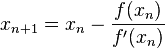
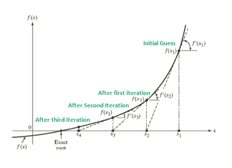

# 牛顿拉夫森法程序

> 原文:[https://www . geesforgeks . org/program-for-Newton-raph son-method/](https://www.geeksforgeeks.org/program-for-newton-raphson-method/)

给定浮点数 x 上的函数 f(x)和对根的初始猜测，求函数在区间上的根。这里 f(x)代表代数或超越方程。
为简单起见，我们假设函数的导数也作为输入提供。
**例:**

```
Input: A function of x (for example x3 – x2 + 2),
       derivative function of x (3x2 – 2x for above example)
       and an initial guess x0 = -20
Output: The value of root is : -1.00
        OR any other value close to root.
```

下面我们讨论了在集合 1 和集合 2 中求根的方法
[集合 1:等分法](https://www.geeksforgeeks.org/solution-of-algebraic-and-transcendental-equations-set-1-the-bisection-method/)
[集合 2:假位置法](https://www.geeksforgeeks.org/solution-algebraic-transcendental-equations-set-2-method-false-position/)
**与上面两种方法的比较:**

1.  在以前的方法中，我们有一个间隔。这里我们需要一个根的初始猜测值。
2.  前面两种方法保证收敛，牛顿拉夫森在某些情况下可能不收敛。
3.  牛顿拉夫森法要求导数。有些功能可能很难
    无法区分。
4.  对于许多问题，牛顿-拉夫森方法比上述两种方法收敛得更快。
5.  此外，它可以识别重复的根，因为它没有明确地寻找 f(x)符号的变化

**公式:**
从初猜 x <sub>1</sub> 开始，牛顿拉夫森法用下面的公式求 x 的下一个值，即 x <sub>n+1</sub> 从前一个值 x <sub>n</sub> 开始。



**牛顿拉夫森法的优点:**

*   求解非线性方程是最好的方法。
*   它还可以用来求解非线性方程组、非线性微分方程和非线性积分方程。
*   收敛阶是二次的，即二阶的，这使得这种方法比其他方法更快。
*   在计算机上实现非常容易。

**牛顿拉夫森法的缺点:**

*   如果函数 f(x)的导数不简单，这个方法就变得复杂了。
*   这种方法需要对其近似值的选择给予极大而敏感的关注。
*   在每次迭代中，我们必须为某个 x 计算两个量 f(x)和 f'(x)。

**算法:**
输入:初始 x，func(x)，derivefunc(x)
输出:Func()
的根

1.  计算给定初始 x 的 func(x)和 derivefunc(x)的值
2.  计算 h: h = func(x) / derivFunc(x)
3.  而 h 大于允许误差ε
    1.  h = func(x) / derivFunc(x)
    2.  x = x–h

下面是上述算法的实现。

## C++

```
// C++ program for implementation of Newton Raphson Method for
// solving equations
#include<bits/stdc++.h>
#define EPSILON 0.001
using namespace std;

// An example function whose solution is determined using
// Bisection Method. The function is x^3 - x^2  + 2
double func(double x)
{
    return x*x*x - x*x + 2;
}

// Derivative of the above function which is 3*x^x - 2*x
double derivFunc(double x)
{
    return 3*x*x - 2*x;
}

// Function to find the root
void newtonRaphson(double x)
{
    double h = func(x) / derivFunc(x);
    while (abs(h) >= EPSILON)
    {
        h = func(x)/derivFunc(x);

        // x(i+1) = x(i) - f(x) / f'(x) 
        x = x - h;
    }

    cout << "The value of the root is : " << x;
}

// Driver program to test above
int main()
{
    double x0 = -20; // Initial values assumed
    newtonRaphson(x0);
    return 0;
}
```

## Java 语言(一种计算机语言，尤用于创建网站)

```
// Java program for implementation of
// Newton Raphson Method for solving
// equations
class GFG {

    static final double EPSILON = 0.001;

    // An example function whose solution
    // is determined using Bisection Method.
    // The function is x^3 - x^2 + 2
    static double func(double x)
    {
        return x * x * x - x * x + 2;
    }

    // Derivative of the above function
    // which is 3*x^x - 2*x
    static double derivFunc(double x)
    {
        return 3 * x * x - 2 * x;
    }

    // Function to find the root
    static void newtonRaphson(double x)
    {
        double h = func(x) / derivFunc(x);
        while (Math.abs(h) >= EPSILON)
        {
            h = func(x) / derivFunc(x);

            // x(i+1) = x(i) - f(x) / f'(x)
            x = x - h;
        }

        System.out.print("The value of the"
                + " root is : "
                + Math.round(x * 100.0) / 100.0);
    }

    // Driver code
    public static void main (String[] args)
    {

        // Initial values assumed
        double x0 = -20;
        newtonRaphson(x0);
    }
}

// This code is contributed by Anant Agarwal.
```

## 蟒蛇 3

```
# Python3 code for implementation of Newton
# Raphson Method for solving equations

# An example function whose solution
# is determined using Bisection Method.
# The function is x^3 - x^2 + 2
def func( x ):
    return x * x * x - x * x + 2

# Derivative of the above function
# which is 3*x^x - 2*x
def derivFunc( x ):
    return 3 * x * x - 2 * x

# Function to find the root
def newtonRaphson( x ):
    h = func(x) / derivFunc(x)
    while abs(h) >= 0.0001:
        h = func(x)/derivFunc(x)

        # x(i+1) = x(i) - f(x) / f'(x)
        x = x - h

    print("The value of the root is : ",
                             "%.4f"% x)

# Driver program to test above
x0 = -20 # Initial values assumed
newtonRaphson(x0)

# This code is contributed by "Sharad_Bhardwaj"
```

## C#

```
// C# program for implementation of
// Newton Raphson Method for solving
// equations
using System;
class GFG {

    static double EPSILON = 0.001;

    // An example function whose solution
    // is determined using Bisection Method.
    // The function is x^3 - x^2 + 2
    static double func(double x)
    {
        return x * x * x - x * x + 2;
    }

    // Derivative of the above function
    // which is 3*x^x - 2*x
    static double derivFunc(double x)
    {
        return 3 * x * x - 2 * x;
    }

    // Function to find the root
    static void newtonRaphson(double x)
    {
        double h = func(x) / derivFunc(x);
        while (Math.Abs(h) >= EPSILON)
        {
            h = func(x) / derivFunc(x);

            // x(i+1) = x(i) - f(x) / f'(x)
            x = x - h;
        }

        Console.Write("The value of the"
                    + " root is : "
                    + Math.Round(x * 100.0) / 100.0);
    }

    // Driver code
    public static void Main ()
    {

        // Initial values assumed
        double x0 = -20;
        newtonRaphson(x0);
    }
}

// This code is contributed by nitin mittal
```

## 服务器端编程语言（Professional Hypertext Preprocessor 的缩写）

```
<?php
// PHP program for implementation
// of Newton Raphson Method for
// solving equations
$EPSILON = 0.001;

// An example function whose
// solution is determined
// using Bisection Method.
// The function is x^3 - x^2 + 2
function func($x)
{
    return $x * $x * $x -
           $x * $x + 2;
}

// Derivative of the above
// function which is 3*x^x - 2*x
function derivFunc($x)
{
    return 3 * $x *
               $x - 2 * $x;
}

// Function to
// find the root
function newtonRaphson($x)
{
    global $EPSILON;
    $h = func($x) / derivFunc($x);
    while (abs($h) >= $EPSILON)
    {
        $h = func($x) / derivFunc($x);

        // x(i+1) = x(i) -
        // f(x) / f'(x)
        $x = $x - $h;
    }

    echo "The value of the ".
           "root is : " , $x;
}

// Driver Code
$x0 = -20; // Initial values assumed
newtonRaphson($x0);

// This code is contributed by ajit
?>
```

## java 描述语言

```
<script>

// JavaScript program for implementation of
// Newton Raphson Method for solving
// equations

    let EPSILON = 0.001;

    // An example function whose solution
    // is determined using Bisection Method.
    // The function is x^3 - x^2 + 2
    function func(x)
    {
        return x * x * x - x * x + 2;
    }

    // Derivative of the above function
    // which is 3*x^x - 2*x
    function derivFunc(x)
    {
        return 3 * x * x - 2 * x;
    }

    // Function to find the root
    function newtonRaphson(x)
    {
        let h = func(x) / derivFunc(x);
        while (Math.abs(h) >= EPSILON)
        {
            h = func(x) / derivFunc(x);

            // x(i+1) = x(i) - f(x) / f'(x)
            x = x - h;
        }

        document.write("The value of the"
                + " root is : "
                + Math.round(x * 100.0) / 100.0);
    }

// Driver program

        // Initial values assumed
        let x0 = -20;
        newtonRaphson(x0);

// This code is contributed by susmitakundugoaldanga.
</script>
```

**输出:**

```
The value of root is : -1.00 
```

**这是如何工作的？**
想法是在点 x 处画一条与 f(x)相切的线 <sub>1</sub> 。切线与 x 轴相交的点应该是比 x <sub>1</sub> 更好的根估计。称此点为 x <sub>2</sub> 。计算 f(x <sub>2</sub> ，在 x <sub>2</sub> 处画一条切线。



我们知道从(x <sub>1</sub> ，f(x <sub>1</sub> )到(x <sub>2</sub> ，0)的直线斜率是 f’(x<sub>1</sub>)，其中 f’代表 f 的导数

```
f'(x1) = (0 - f(x1)) / (x2 - x1) 

f'(x1) *  (x2 - x1) =  - f(x1)

x2 =  x1 - f(x1) / f'(x1) 

By finding this point 'x2', we move closer towards the root.
We have to keep on repeating the above step till we get really close to 
the root or we find it.

In general, 
xn+1 =  xn - f(xn) / f'(xn) 
```

**使用泰勒级数的替代解释:**

```
Let x1 be the initial guess. 

We can write x2 as below:
  xn+1  = xn + h ------- (1)
Here h would be a small value that can be positive or negative.

According to Taylor's Series, 
ƒ(x) that is infinitely differentiable can be written as below
f(xn+1) = f(xn  + h) 
       = f(xn) + h*f'(xn) + ((h*h)/2!)*(f''(xn)) + ...

Since we are looking for root of function, f(xn+1) = 0

f(xn) + h*f'(xn) + ((h*h)/2!)*(f''(xn)) + ... = 0

Now since h is small, h*h would be very small. 
So if we ignore higher order terms, we get

f(xn) + h*f'(xn) = 0

Substituting this value of h = xn+1 - xn from equation (1) we get, 
f(xn) + (xn+1  - xn)*f'(xn) = 0

xn+1 =  xn - f(xn) / f'(xn)  
```

**备注:**

1.  我们一般用这种方法来改善二等分法或假位置法的结果。
2.  [平方根的巴比伦方法](https://www.geeksforgeeks.org/square-root-of-a-perfect-square/)是从牛顿-拉夫森方法中推导出来的。

**参考文献:**
[s . s .萨斯特里的数值分析入门方法](http://www.flipkart.com/introductory-methods-numerical-analysis-english-5th/p/itmdwu92fzutjczw?pid=9788120345928&affid=sandeepgfg)
[https://en.wikipedia.org/wiki/Newton's_method](https://en.wikipedia.org/wiki/Newton's_method)
[http://www . CAE . tntech . edu/Members/ren fro/me 2000/讲座/2004-09-07 _ 讲义. pdf/at_download/file](http://www.cae.tntech.edu/Members/renfro/me2000/lectures/2004-09-07_handouts.pdf/at_download/file)
本文由 **Abhiraj Smit** 供稿。如果您发现任何不正确的地方，请写评论，或者您想分享更多关于上面讨论的主题的信息