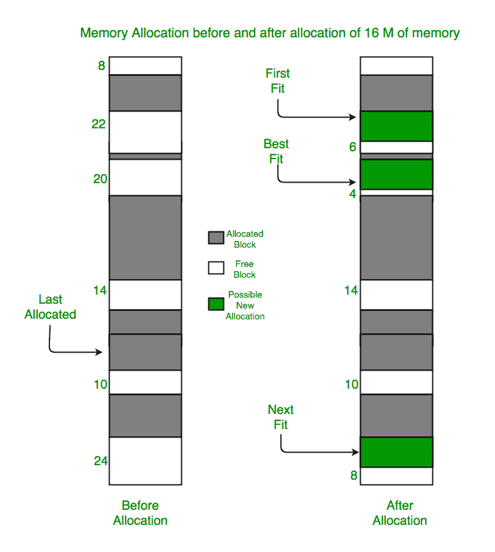

# 内存管理中下次拟合算法的程序

> 原文:[https://www . geeksforgeeks . org/program-for-next-fit-algorithm-in-memory-management/](https://www.geeksforgeeks.org/program-for-next-fit-algorithm-in-memory-management/)

先决条件:[分区分配方法](https://www.geeksforgeeks.org/partition-allocation-methods-in-memory-management/)
**下一个适合什么？**
下一款飞度是[【第一款飞度】](https://www.geeksforgeeks.org/program-first-fit-algorithm-memory-management/)的修改版。它从第一个适合找到空闲分区开始，但下次调用时，它会从停止的地方开始搜索，而不是从开始。这个策略使用了一个流动指针。指针沿着内存链移动，以搜索下一个匹配。这有助于避免总是从自由区块链的头部(开始)使用内存。
**它相比初装有什么优势？**

*   First fit 是一种直接而快速的算法，但倾向于将大部分自由部分切割成小块，因此，需要大部分内存块的进程将不会得到任何东西，即使所有小块的总和大于它所需要的，这就是所谓的外部碎片问题。
*   第一个 fit 的另一个问题是，它倾向于在内存的开始分配内存部分，这可能会导致在开始时有更多的内部碎片。Next fit 试图解决这个问题，它不是从内存开始，而是从上次结束的地方开始搜索零件的空闲部分。
*   下一次拟合是一种非常快速的搜索算法，也比第一次拟合和最佳拟合内存管理算法相对更快。

```
Example:
Input :  blockSize[] = {5, 10, 20};
     processSize[] = {10, 20, 30};
Output:
Process No.     Process Size    Block no.
 1              10              2
 2              20              3
 3              30              Not Allocated
```

**算法:**

1.  输入内存块的数量及其大小，并将所有块初始化为空闲。
2.  输入进程的数量及其大小。
3.  从挑选每个进程开始，并检查它是否可以分配给当前块，如果可以，则为它分配所需的内存，并检查下一个进程，但从我们离开的块开始，而不是从开始。
4.  如果当前块大小较小，则继续检查其他块。



## C++

```
// C/C++ program for next fit
// memory management algorithm
#include <bits/stdc++.h>
using namespace std;

// Function to allocate memory to blocks as per Next fit
// algorithm
void NextFit(int blockSize[], int m, int processSize[], int n)
{
    // Stores block id of the block allocated to a
    // process
    int allocation[n], j = 0;

    // Initially no block is assigned to any process
    memset(allocation, -1, sizeof(allocation));

    // pick each process and find suitable blocks
    // according to its size ad assign to it
    for (int i = 0; i < n; i++) {

        // Do not start from beginning
        while (j < m) {

            if (blockSize[j] >= processSize[i]) {

                // allocate block j to p[i] process
                allocation[i] = j;

                // Reduce available memory in this block.
                blockSize[j] -= processSize[i];

                break;
            }

            // mod m will help in traversing the blocks from
            // starting block after we reach the end.
            j = (j + 1) % m;
        }
    }

    cout << "\nProcess No.\tProcess Size\tBlock no.\n";
    for (int i = 0; i < n; i++) {
        cout << " " << i + 1 << "\t\t" << processSize[i]
             << "\t\t";
        if (allocation[i] != -1)
            cout << allocation[i] + 1;
        else
            cout << "Not Allocated";
        cout << endl;
    }
}

// Driver program
int main()
{
    int blockSize[] = { 5, 10, 20 };
    int processSize[] = { 10, 20, 5 };
    int m = sizeof(blockSize) / sizeof(blockSize[0]);
    int n = sizeof(processSize) / sizeof(processSize[0]);

    NextFit(blockSize, m, processSize, n);

    return 0;
}
```

## Java 语言(一种计算机语言，尤用于创建网站)

```
// Java program for next fit
// memory management algorithm
import java.util.Arrays;

public class GFG {

// Function to allocate memory to blocks as per Next fit
// algorithm
    static void NextFit(int blockSize[], int m, int processSize[], int n) {
        // Stores block id of the block allocated to a
        // process
        int allocation[] = new int[n], j = 0;

        // Initially no block is assigned to any process
        Arrays.fill(allocation, -1);

        // pick each process and find suitable blocks
        // according to its size ad assign to it
        for (int i = 0; i < n; i++) {

            // Do not start from beginning
            int count =0;
            while (j < m) {
                count++;    //makes sure that for every process we traverse through entire array maximum once only.This avoids the problem of going into infinite loop if memory is not available
                if (blockSize[j] >= processSize[i]) {

                    // allocate block j to p[i] process
                    allocation[i] = j;

                    // Reduce available memory in this block.
                    blockSize[j] -= processSize[i];

                    break;
                }

                // mod m will help in traversing the blocks from
                // starting block after we reach the end.
                j = (j + 1) % m;
            }
        }

        System.out.print("\nProcess No.\tProcess Size\tBlock no.\n");
        for (int i = 0; i < n; i++) {
            System.out.print( i + 1 + "\t\t" + processSize[i]
                    + "\t\t");
            if (allocation[i] != -1) {
                System.out.print(allocation[i] + 1);
            } else {
                System.out.print("Not Allocated");
            }
            System.out.println("");
        }
    }

// Driver program
    static public void main(String[] args) {
        int blockSize[] = {5, 10, 20};
        int processSize[] = {10, 20, 5};
        int m = blockSize.length;
        int n = processSize.length;
        NextFit(blockSize, m, processSize, n);
    }
}

// This code is contributed by Rajput-Ji
```

## 蟒蛇 3

```
# Python3 program for next fit
# memory management algorithm

# Function to allocate memory to
# blocks as per Next fit algorithm
def NextFit(blockSize, m, processSize, n):

    # Stores block id of the block
    # allocated to a process

    # Initially no block is assigned
    # to any process
    allocation = [-1] * n
    j = 0

    # pick each process and find suitable blocks
    # according to its size ad assign to it
    for i in range(n):

        # Do not start from beginning
        while j < m:

            if blockSize[j] >= processSize[i]:

                # allocate block j to p[i] process
                allocation[i] = j

                # Reduce available memory in this block.
                blockSize[j] -= processSize[i]

                break

            # mod m will help in traversing the
            # blocks from starting block after
            # we reach the end.
            j = (j + 1) % m

    print("Process No. Process Size Block no.")
    for i in range(n):
        print(i + 1, "         ", processSize[i],
                                    end = "     ")
        if allocation[i] != -1:
            print(allocation[i] + 1)
        else:
            print("Not Allocated")

# Driver Code
if __name__ == '__main__':
    blockSize = [5, 10, 20]
    processSize = [10, 20, 5]
    m = len(blockSize)
    n = len(processSize)

    NextFit(blockSize, m, processSize, n)

# This code is contributed by PranchalK
```

## C#

```
// C# program for next fit
// memory management algorithm
using System;
using System.Linq;
public class GFG {

// Function to allocate memory to blocks as per Next fit
// algorithm
    static void NextFit(int []blockSize, int m,
                            int []processSize, int n) {
        // Stores block id of the block allocated to a
        // process
        int []allocation = new int[n];
        int j = 0;

        // Initially no block is assigned to any process
        Enumerable.Repeat(-1, n).ToArray();

        // pick each process and find suitable blocks
        // according to its size ad assign to it
        for (int i = 0; i < n; i++) {

            // Do not start from beginning
            while (j < m) {

                if (blockSize[j] >= processSize[i]) {

                    // allocate block j to p[i] process
                    allocation[i] = j;

                    // Reduce available memory in this block.
                    blockSize[j] -= processSize[i];

                    break;
                }

                // mod m will help in traversing the blocks from
                // starting block after we reach the end.
                j = (j + 1) % m;
            }
        }

        Console.Write("\nProcess No.\tProcess Size\tBlock no.\n");
        for (int i = 0; i < n; i++) {
            Console.Write( i + 1 + "\t\t" + processSize[i]
                    + "\t\t");
            if (allocation[i] != -1) {
                Console.Write(allocation[i] + 1);
            } else {
                Console.Write("Not Allocated");
            }
            Console.WriteLine("");
        }
    }

// Driver program
    static public void Main() {
        int []blockSize = {5, 10, 20};
        int []processSize = {10, 20, 5};
        int m = blockSize.Length;
        int n = processSize.Length;
        NextFit(blockSize, m, processSize, n);
    }
}

/*This code is contributed by Rajput-Ji*/
```

## 服务器端编程语言（Professional Hypertext Preprocessor 的缩写）

```
<?php
// PHP program for next fit
// memory management algorithm

// Function to allocate memory to blocks as per Next fit
// algorithm
function NextFit($blockSize, $m, $processSize, $n)
{
    // Stores block id of the block allocated to a
    // process
    $allocation = array_fill(0, $n, -1);
    $j = 0;

    // Initially no block is assigned to any process above

    // pick each process and find suitable blocks
    // according to its size ad assign to it
    for ($i = 0; $i < $n; $i++)
    {

        // Do not start from beginning
        while ($j < $m)
        {

            if ($blockSize[$j] >= $processSize[$i])
            {

                // allocate block j to p[i] process
                $allocation[$i] = $j;

                // Reduce available memory in this block.
                $blockSize[$j] -= $processSize[$i];

                break;
            }

            // mod m will help in traversing the blocks from
            // starting block after we reach the end.
            $j = ($j + 1) % $m;
        }
    }

    echo "\nProcess No.\tProcess Size\tBlock no.\n";
    for ($i = 0; $i < $n; $i++)
    {
        echo " ".($i + 1)."\t\t".$processSize[$i]."\t\t";
        if ($allocation[$i] != -1)
            echo ($allocation[$i] + 1);
        else
            echo "Not Allocated";
        echo "\n";
    }
}

    // Driver program
    $blockSize = array( 5, 10, 20 );
    $processSize = array( 10, 20, 5 );
    $m = count($blockSize);
    $n = count($processSize);

    NextFit($blockSize, $m, $processSize, $n);

// This code is contributed by mits
?>
```

## java 描述语言

```
<script>

// JavaScript program for next fit
// memory management algorithm

// Function to allocate memory to blocks as per Next fit
// algorithm
    function NextFit(blockSize, m, processSize, n) {
        // Stores block id of the block allocated to a
        // process
        let allocation = Array.from({length: n}, (_, i) => -1), j = 0;

        // pick each process and find suitable blocks
        // according to its size ad assign to it
        for (let i = 0; i < n; i++) {

            // Do not start from beginning
            while (j < m) {

                if (blockSize[j] >= processSize[i]) {

                    // allocate block j to p[i] process
                    allocation[i] = j;

                    // Reduce available memory in this block.
                    blockSize[j] -= processSize[i];

                    break;
                }

                // mod m will help in traversing the blocks from
                // starting block after we reach the end.
                j = (j + 1) % m;
            }
        }

        document.write("\nProcess No. Process Size. Block no." + "<br/>");
        for (let i = 0; i < n; i++) {
            document.write( i + 1 + Array(20).fill('\xa0').join('') + processSize[i]
                    + Array(20).fill('\xa0').join(''));
            if (allocation[i] != -1) {
                document.write(allocation[i] + 1);
            } else {
                document.write("Not Allocated");
            }
           document.write("<br/>");
        }
    }

// Driver Code

        let blockSize = [5, 10, 20];
        let processSize = [10, 20, 5];
        let m = blockSize.length;
        let n = processSize.length;
        NextFit(blockSize, m, processSize, n);

// This code is contributed by susmitakundugoaldanga.
</script>
```

**Output:** 

```
Process No.    Process Size    Block no.
 1               10              2
 2               20              3
 3               5               1
```

本文由**阿卡什·古普塔**供稿。如果你喜欢 GeeksforGeeks 并想投稿，你也可以使用[write.geeksforgeeks.org](https://write.geeksforgeeks.org)写一篇文章或者把你的文章邮寄到 review-team@geeksforgeeks.org。看到你的文章出现在极客博客主页上，帮助其他极客。
如果你发现任何不正确的地方，或者你想分享更多关于上面讨论的话题的信息，请写评论。