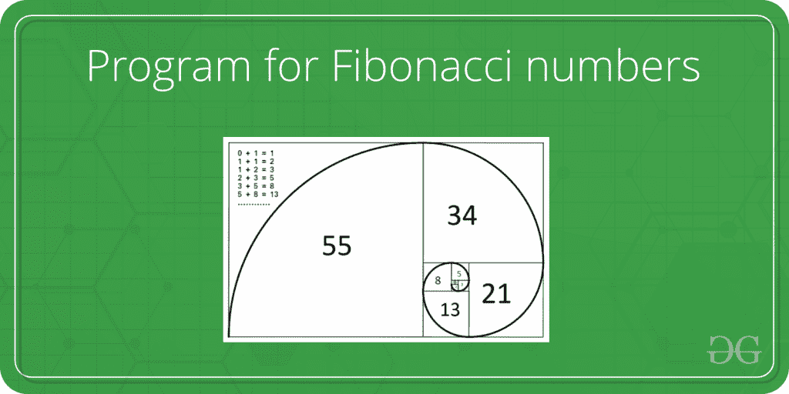

# 斐波那契数程序

> 原文:[https://www . geesforgeks . org/program-for-n-Fibonacci-number/](https://www.geeksforgeeks.org/program-for-nth-fibonacci-number/)

斐波那契数列是下列整数序列中的数字。
0，1，1，2，3，5，8，13，21，34，55，89，144，…..

在数学术语中，斐波那契数列 Fn 由递归关系定义

```
Fn = Fn-1 + Fn-2
```

带有种子值

```
F0 = 0 and F1 = 1.
```



给定一个数字 n，打印第 n 个斐波那契数。

**示例:**

```
Input  : n = 2
Output : 1

Input  : n = 9
Output : 34
```

写一个函数 *int fib(int n)* 返回 F <sub>n</sub> 。例如，如果 *n* = 0，那么 *fib()* 应该返回 0。如果 n = 1，那么它应该返回 1。n > 1 应返回 F <sub>n-1</sub> + F <sub>n-2</sub>

```
For n = 9
Output:34
```

下面是得到第 n 个斐波那契数的不同方法。

**方法 1(使用递归)**
一种简单的方法，即直接递归实现上面给出的数学递归关系。

## C++

```
//Fibonacci Series using Recursion
#include<bits/stdc++.h>
using namespace std;

int fib(int n)
{
    if (n <= 1)
        return n;
    return fib(n-1) + fib(n-2);
}

int main ()
{
    int n = 9;
    cout << fib(n);
    getchar();
    return 0;
}

// This code is contributed
// by Akanksha Rai
```

## C

```
//Fibonacci Series using Recursion
#include<stdio.h>
int fib(int n)
{
   if (n <= 1)
      return n;
   return fib(n-1) + fib(n-2);
}

int main ()
{
  int n = 9;
  printf("%d", fib(n));
  getchar();
  return 0;
}
```

## Java 语言(一种计算机语言，尤用于创建网站)

```
//Fibonacci Series using Recursion
class fibonacci
{
    static int fib(int n)
    {
    if (n <= 1)
       return n;
    return fib(n-1) + fib(n-2);
    }

    public static void main (String args[])
    {
    int n = 9;
    System.out.println(fib(n));
    }
}
/* This code is contributed by Rajat Mishra */
```

## 蟒蛇 3

```
# Function for nth Fibonacci number

def fib(n,st,en):
    if n-1==0:
      return en
    if n>0:

     temp_st=en

     en=st+en
     return fib(n-1,temp_st,en)

if __name__ == "__main__":
    print(fib(9,0,1))

#This code is contributed by Bhawna Priya
```

## C#

```
// C# program for Fibonacci Series
// using Recursion
using System;

public class GFG
{
    public static int Fib(int n)
    {
        if (n <= 1)
        {
            return n;
        }
        else
        {
            return Fib(n - 1) + Fib(n - 2);
        }
    }

    // driver code
    public static void Main(string[] args)
    {
        int n = 9;
        Console.Write(Fib(n));
    }
}

// This code is contributed by Sam007
```

## 服务器端编程语言（Professional Hypertext Preprocessor 的缩写）

```
<?php
// Fibonacci Series
// using Recursion

// function returns
// the Fibonacci number
function fib($n)
{
    if ($n <= 1)
        return $n;
    return fib($n - 1) +
           fib($n - 2);
}

// Driver Code
$n = 9;
echo fib($n);

// This code is contributed by aj_36
?>
```

## java 描述语言

```
<script>
//Fibonacci Series using Recursion
    let n = 9;

    // function returns the Fibonacci number
    function fib(n) {
    if (n <= 1)
        return n;
    return fib(n-1) + fib(n-2);
}

    //function call
    document.write(fib(n));
//This code is contributed by Surbhi Tyagi
</script>
```

**Output**

```
34
```

***时间复杂度:*** T(n) = T(n)这是线性的。

如果原始递归树被实现，那么这将是树，但是现在 n 次调用递归函数

递归的原始树

```
                          fib(5)   
                     /                \
               fib(4)                fib(3)   
             /        \              /       \ 
         fib(3)      fib(2)         fib(2)   fib(1)
        /    \       /    \        /      \
  fib(2)   fib(1)  fib(1) fib(0) fib(1) fib(0)
  /     \
fib(1) fib(0)
```

上面代码的递归优化树

纤维(5)

纤维(4)

纤维(3)

纤维(2)

纤维(1)

*额外空间:* O(n)如果我们考虑函数调用栈的大小，否则为 O(1)。

**方法 2(使用动态规划)**
我们可以通过存储到目前为止计算的斐波那契数来避免方法 1 中重复的工作。

## C++

```
// C++ program for Fibonacci Series 
// using Dynamic Programming
#include<bits/stdc++.h>
using namespace std;

class GFG{

public:
int fib(int n)
{

    // Declare an array to store
    // Fibonacci numbers.
    // 1 extra to handle
    // case, n = 0
    int f[n + 2];
    int i;

    // 0th and 1st number of the
    // series are 0 and 1
    f[0] = 0;
    f[1] = 1;

    for(i = 2; i <= n; i++)
    {

       //Add the previous 2 numbers
       // in the series and store it
       f[i] = f[i - 1] + f[i - 2];
    }
    return f[n];
    }
};

// Driver code
int main ()
{
    GFG g;
    int n = 9;

    cout << g.fib(n);
    return 0;
}

// This code is contributed by SoumikMondal
```

## C

```
//Fibonacci Series using Dynamic Programming
#include<stdio.h>

int fib(int n)
{
  /* Declare an array to store Fibonacci numbers. */
  int f[n+2];   // 1 extra to handle case, n = 0
  int i;

  /* 0th and 1st number of the series are 0 and 1*/
  f[0] = 0;
  f[1] = 1;

  for (i = 2; i <= n; i++)
  {
      /* Add the previous 2 numbers in the series
         and store it */
      f[i] = f[i-1] + f[i-2];
  }

  return f[n];
}

int main ()
{
  int n = 9;
  printf("%d", fib(n));
  getchar();
  return 0;
}
```

## Java 语言(一种计算机语言，尤用于创建网站)

```
// Fibonacci Series using Dynamic Programming
class fibonacci
{
   static int fib(int n)
    {
    /* Declare an array to store Fibonacci numbers. */
    int f[] = new int[n+2]; // 1 extra to handle case, n = 0
    int i;

    /* 0th and 1st number of the series are 0 and 1*/
    f[0] = 0;
    f[1] = 1;

    for (i = 2; i <= n; i++)
    {
       /* Add the previous 2 numbers in the series
         and store it */
        f[i] = f[i-1] + f[i-2];
    }

    return f[n];
    }

    public static void main (String args[])
    {
        int n = 9;
        System.out.println(fib(n));
    }
}
/* This code is contributed by Rajat Mishra */
```

## 蟒蛇 3

```
# Fibonacci Series using Dynamic Programming
def fibonacci(n):

    # Taking 1st two fibonacci numbers as 0 and 1
    f = [0, 1]

    for i in range(2, n+1):
        f.append(f[i-1] + f[i-2])
    return f[n]

print(fibonacci(9))
```

## C#

```
// C# program for Fibonacci Series
// using Dynamic Programming
using System;
class fibonacci {

static int fib(int n)
    {

        // Declare an array to
        // store Fibonacci numbers.
        // 1 extra to handle
        // case, n = 0
        int []f = new int[n + 2];
        int i;

        /* 0th and 1st number of the
           series are 0 and 1 */
        f[0] = 0;
        f[1] = 1;

        for (i = 2; i <= n; i++)
        {
            /* Add the previous 2 numbers
               in the series and store it */
            f[i] = f[i - 1] + f[i - 2];
        }

        return f[n];
    }

    // Driver Code
    public static void Main ()
    {
        int n = 9;
        Console.WriteLine(fib(n));
    }
}

// This code is contributed by anuj_67.
```

## 服务器端编程语言（Professional Hypertext Preprocessor 的缩写）

```
<?php
//Fibonacci Series using Dynamic
// Programming

function fib( $n)
{

    /* Declare an array to store
    Fibonacci numbers. */

    // 1 extra to handle case,
    // n = 0
    $f = array();
    $i;

    /* 0th and 1st number of the
    series are 0 and 1*/
    $f[0] = 0;
    $f[1] = 1;

    for ($i = 2; $i <= $n; $i++)
    {

        /* Add the previous 2
        numbers in the series
        and store it */
        $f[$i] = $f[$i-1] + $f[$i-2];
    }

    return $f[$n];
}

$n = 9;
echo fib($n);

// This code is contributed by
// anuj_67.
?>
```

## java 描述语言

```
<script>

// Fibonacci Series using Dynamic Programming

    function  fib(n)
    {
        /* Declare an array to store Fibonacci numbers. */
        let f = new Array(n+2); // 1 extra to handle case, n = 0
        let i;
        /* 0th and 1st number of the series are 0 and 1*/
        f[0] = 0;
        f[1] = 1;
        for (i = 2; i <= n; i++)
        {
            /* Add the previous 2 numbers in the series
            and store it */
            f[i] = f[i-1] + f[i-2];
        }
        return f[n];
    }
    let n=9;
    document.write(fib(n));

    // This code is contributed by avanitrachhadiya2155

</script>
```

**Output**

```
34
```