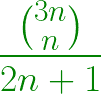
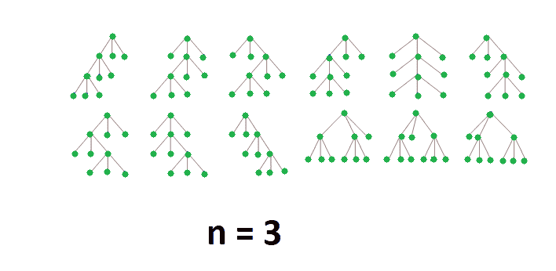
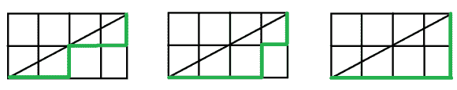

# 第 n 次呼叫的程序–加泰罗尼亚号码

> 原文:[https://www . geesforgeks . org/program-for-n-fuss-Catalan-number/](https://www.geeksforgeeks.org/program-for-nth-fuss-catalan-number/)

**Fuss–加泰罗尼亚数字**是 [**加泰罗尼亚数字**](https://www.geeksforgeeks.org/program-nth-catalan-number/) 的推广，它使用*三胞胎而不是配对*。

福什-加泰罗尼亚数字可以用一系列公式表示:



前几个大惊小怪的加泰罗尼亚数字是

> 1, 1, 3, 12, 55, 273, 1428, 7752, 43263, 246675………..
> 分别为 n = 0，1，2，3，…

**福斯-加泰罗尼亚号码的应用:**

1.  **统计在 2n+1 个数字中放置括号的方法，一次三个。**
    **例如:**有 3 种方法可以将{1，2，3，4，5}作为三元组进行括号:
    {{1，2，3}，4，5}，{1，{2，3，4}，5}，{1，2，{3，4，5}}

2.  计算具有 n 个内部节点的完整三元树的数量。



2.  通过 2n 乘 n 的网格计算长度为 3n 的路径数量，该网格不在主对角线上方交叉
    **示例:**从(0，0)到(4，2)有 3 条路径不在对角线上方交叉:



2.  还有更多。更多应用请参考[本链接](https://www.robertdickau.com/fusscatalan.html)

**实施 Fuss-Catalan 编号:**

## C++

```
// C++ program for nth Fuss–Catalan Number

#include <iostream>
using namespace std;

// Returns value of Binomial Coefficient C(n, k)
unsigned long int binomialCoeff(unsigned int n,
                                unsigned int k)
{
    unsigned long int res = 1;

    // Since C(n, k) = C(n, n-k)
    if (k > n - k)
        k = n - k;

    // Calculate value of
    //[n*(n-1)*---*(n-k+1)] / [k*(k-1)*---*1]
    for (int i = 0; i < k; ++i) {
        res *= (n - i);
        res /= (i + 1);
    }

    return res;
}

// A Binomial coefficient based function
// to find nth Fuss–Catalan number in O(n) time
unsigned long int Fuss_catalan(unsigned int n)
{
    // Calculate value of 3nCn
    unsigned long int c = binomialCoeff(3 * n, n);

    // return 3nCn/(2n+1)
    return c / (2 * n + 1);
}

// Driver code
int main()
{
    for (int i = 0; i < 10; i++)
        cout << Fuss_catalan(i) << " ";
    return 0;
}
```

## Java 语言(一种计算机语言，尤用于创建网站)

```
// Java program for nth Fuss-Catalan Number
class GFG
{

// Returns value of Binomial Coefficient C(n, k)
static int binomialCoeff(int n, int k)
{
    int res = 1;

    // Since C(n, k) = C(n, n-k)
    if (k > n - k)
        k = n - k;

    // Calculate value of
    //[n*(n-1)*---*(n-k+1)] / [k*(k-1)*---*1]
    for (int i = 0; i < k; ++i)
    {
        res *= (n - i);
        res /= (i + 1);
    }
    return res;
}

// A Binomial coefficient based function
// to find nth Fuss-Catalan number in O(n) time
static int Fuss_catalan(int n)
{
    // Calculate value of 3nCn
    int c = binomialCoeff(3 * n, n);

    // return 3nCn/(2n+1)
    return c / (2 * n + 1);
}

// Driver code
public static void main(String []args)
{
    for (int i = 0; i < 10; i++)
        System.out.print(Fuss_catalan(i) + " ");
}
}

// This code is contributed by 29AjayKumar
```

## 蟒蛇 3

```
# Python3 program for nth Fuss–Catalan Number

# Returns value of Binomial Coefficient C(n, k)
def binomialCoeff(n, k) :

    res = 1;

    # Since C(n, k) = C(n, n-k)
    if (k > n - k) :
        k = n - k;

    # Calculate value of
    # [n*(n-1)*---*(n-k+1)] / [k*(k-1)*---*1]
    for i in range(k) :

        res *= (n - i);
        res //= (i + 1);

    return res;

# A Binomial coefficient based function
# to find nth Fuss–Catalan number in O(n) time
def Fuss_catalan(n) :

    # Calculate value of 3nCn
    c = binomialCoeff(3 * n, n);

    # return 3nCn/(2n+1)
    return c // (2 * n + 1);

# Driver code
if __name__ == "__main__" :

    for i in range(10) :
        print(Fuss_catalan(i), end = " ");

# This code is contributed by AnkitRai01
```

## C#

```
// C# program for nth Fuss-Catalan Number
using System;

class GFG
{

// Returns value of Binomial Coefficient C(n, k)
static int binomialCoeff(int n, int k)
{
    int res = 1;

    // Since C(n, k) = C(n, n-k)
    if (k > n - k)
        k = n - k;

    // Calculate value of
    //[n*(n-1)*---*(n-k+1)] / [k*(k-1)*---*1]
    for (int i = 0; i < k; ++i)
    {
        res *= (n - i);
        res /= (i + 1);
    }
    return res;
}

// A Binomial coefficient based function
// to find nth Fuss-Catalan number in O(n) time
static int Fuss_catalan(int n)
{
    // Calculate value of 3nCn
    int c = binomialCoeff(3 * n, n);

    // return 3nCn/(2n+1)
    return c / (2 * n + 1);
}

// Driver code
public static void Main(String []args)
{
    for (int i = 0; i < 10; i++)
        Console.Write(Fuss_catalan(i) + " ");
}
}

// This code is contributed by PrinciRaj1992
```

## java 描述语言

```
<script>

// Javascript program for nth Fuss–Catalan Number

// Returns value of Binomial Coefficient C(n, k)
function binomialCoeff(n, k)
{
    var res = 1;

    // Since C(n, k) = C(n, n-k)
    if (k > n - k)
        k = n - k;

    // Calculate value of
    //[n*(n-1)*---*(n-k+1)] / [k*(k-1)*---*1]
    for (var i = 0; i < k; ++i) {
        res *= (n - i);
        res = parseInt(res / (i + 1));
    }

    return res;
}

// A Binomial coefficient based function
// to find nth Fuss–Catalan number in O(n) time
function Fuss_catalan(n)
{
    // Calculate value of 3nCn
    var c = binomialCoeff(3 * n, n);

    // return 3nCn/(2n+1)
    return parseInt(c / (2 * n + 1));
}

// Driver code
for (var i = 0; i < 10; i++)
    document.write(Fuss_catalan(i)+ " ");

</script>
```

**Output:** 

```
1 1 3 12 55 273 1428 7752 43263 246675
```

**时间复杂度:** O(n)