# 皮卡德迭代法程序|计算数学

> 原文:[https://www . geeksforgeeks . org/program-for-picards-iterative-method-computational-mathematics/](https://www.geeksforgeeks.org/program-for-picards-iterative-method-computational-mathematics/)

皮卡德的方法是一种迭代方法，主要用于逼近微分方程的解。

这种近似求解微分方程的方法是逐次逼近法；也就是说，这是一种迭代方法，在这种方法中，数值结果越来越精确，使用的次数越来越多。

皮卡德迭代法给出了微分方程解的一系列近似值 Y1(x)，Y2(x)，…Yk(x)，从而从一个或多个先前的近似值中获得第 n 个近似值。

皮卡德迭代级数相对容易实现，通过这种数值分析得到的解一般为**幂级数**。

**皮卡德迭代法公式:**

[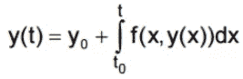](https://media.geeksforgeeks.org/wp-content/uploads/20190618203246/Picard-iteration-formula.png)

皮卡德迭代公式。

**涉及的步骤:**

*   第一步:在微分方程的右边代入一个 y 的近似值(首先取为常数):
    dy/dx= f(x，y)。
*   第二步:将方程与 x 积分，以 x 表示 y，作为第二近似值，将给定的数值代入其中，结果四舍五入到指定的小数位数或有效数字。
*   第三步:迭代过程继续进行，直到两个连续的数值解在舍入到所需的小数位数时相同。

**皮卡德的迭代示例:**
假设:
[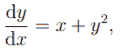](https://media.geeksforgeeks.org/wp-content/uploads/20190621183238/picard_1.png) 
且 **y = 0** 当 **x = 0** 时，确定 **y** 的值当 **x = 0.3** 时，修正到小数点后四位。

**解:**
我们可以如下进行:
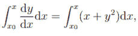其中 x0 = 0。因此:
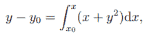其中 y0 = 0。也就是:
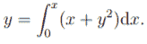

*   **First Iteration:**
    We do not know y in terms of x yet, so we replace y by the constant value y0 in the function to be integrated.

    因此，在 x = 0.3 时，第一次迭代的结果由下式给出:
    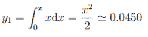

*   **Second Iteration:**
    Now, we use:
    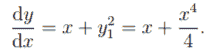

    因此，
    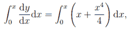即给出:
    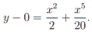

    因此，第二次迭代的结果由 x=0.3 时的
    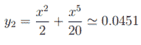给出。

*   **Third Iteration:**
    Now we use:
    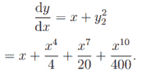

    因此，
    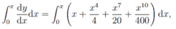即给出:
    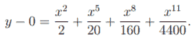

    因此，第三次迭代的结果由 x = 0.3 时的
    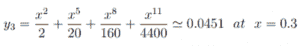给出。

*   因此， **y = 0.0451** ，最多修正四位小数，在 **x = 0.3** 。

**皮卡德迭代法程序:**

```
// C program for Picard's iterative method

#include <math.h>
#include <stdio.h>

// required macros defined below:
#define Y1(x) (1 + (x) + pow(x, 2) / 2)
#define Y2(x) (1 + (x) + pow(x, 2) / 2 + pow(x, 3) / 3 + pow(x, 4) / 8)
#define Y3(x) (1 + (x) + pow(x, 2) / 2 + pow(x, 3) / 3 + pow(x, 4) / 8 + pow(x, 5) / 15 + pow(x, 6) / 48)

int main()
{
    double start_value = 0, end_value = 3,
           allowed_error = 0.4, temp;
    double y1[30], y2[30], y3[30];
    int count;

    for (temp = start_value, count = 0;
         temp <= end_value;
         temp = temp + allowed_error, count++) {

        y1[count] = Y1(temp);
        y2[count] = Y2(temp);
        y3[count] = Y3(temp);
    }

    printf("\nX\n");
    for (temp = start_value;
         temp <= end_value;
         temp = temp + allowed_error) {

        // considering all values
        // upto 4 decimal places.
        printf("%.4lf ", temp);
    }

    printf("\n\nY(1)\n");
    for (temp = start_value, count = 0;
         temp <= end_value;
         temp = temp + allowed_error, count++) {

        printf("%.4lf ", y1[count]);
    }

    printf("\n\nY(2)\n");
    for (temp = start_value, count = 0;
         temp <= end_value;
         temp = temp + allowed_error, count++) {

        printf("%.4lf ", y2[count]);
    }

    printf("\n\nY(3)\n");
    for (temp = start_value, count = 0;
         temp <= end_value;
         temp = temp + allowed_error, count++) {

        printf("%.4lf ", y3[count]);
    }
    return 0;
}
```

**Output:**

```
X
0.0000 0.4000 0.8000 1.2000 1.6000 2.0000 2.4000 2.8000 

Y(1)
1.0000 1.4800 2.1200 2.9200 3.8800 5.0000 6.2800 7.7200 

Y(2)
1.0000 1.5045 2.3419 3.7552 6.0645 9.6667 15.0352 22.7205 

Y(3)
1.0000 1.5053 2.3692 3.9833 7.1131 13.1333 24.3249 44.2335

```