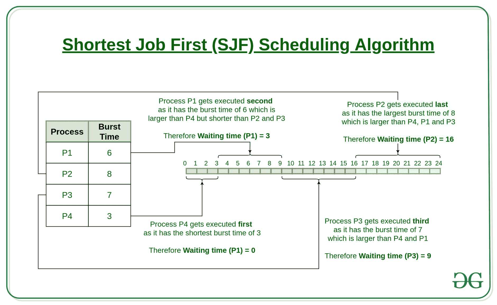

# 最短作业优先(或 SJF) CPU 调度程序|设置 1(非抢先)

> 原文:[https://www . geesforgeks . org/program-for-short-job-first-or-sjf-CPU-scheduling-set-1-非抢占式/](https://www.geeksforgeeks.org/program-for-shortest-job-first-or-sjf-cpu-scheduling-set-1-non-preemptive/)

最短作业优先(SJF)或最短作业其次，是一种调度策略，它选择具有最小执行时间的等待进程来执行下一个任务。SJN 是一个非抢先算法。

*   最短作业优先具有在所有调度算法中具有最小平均等待时间的优点。
*   这是一个贪婪算法。
*   如果持续出现更短的进程，可能会导致饥饿。这个问题可以用老化的概念来解决。
*   这实际上是不可行的，因为操作系统可能不知道突发时间，因此可能不会对它们进行排序。虽然不可能预测执行时间，但是可以使用几种方法来估计作业的执行时间，例如以前执行时间的加权平均值。SJF 可以用在专门的环境中，那里有准确的运行时间估计。

**算法:**

1.  根据到达时间对所有流程进行排序。

2.  然后选择到达时间和突发时间最短的进程。

3.  进程完成后，创建一个进程池，直到前一个进程完成，并从具有最小突发时间的池中选择该进程。



**如何用程序计算 SJF 的以下时间？**

1.  完成时间:流程完成执行的时间。
2.  周转时间:完成时间和到达时间之间的时间差。周转时间=完成时间-到达时间
3.  等待时间:周转时间和突发时间之间的时间差。
    等待时间=周转时间–突发时间

***在这个帖子中，我们假设到达时间为 0，所以掉头和完成时间相同。***

## C++

```
// C++ program to implement Shortest Job first with Arrival
// Time
#include <iostream>
using namespace std;
int mat[10][6];

void swap(int* a, int* b)
{
    int temp = *a;
    *a = *b;
    *b = temp;
}

void arrangeArrival(int num, int mat[][6])
{
    for (int i = 0; i < num; i++) {
        for (int j = 0; j < num - i - 1; j++) {
            if (mat[j][1] > mat[j + 1][1]) {
                for (int k = 0; k < 5; k++) {
                    swap(mat[j][k], mat[j + 1][k]);
                }
            }
        }
    }
}

void completionTime(int num, int mat[][6])
{
    int temp, val;
    mat[0][3] = mat[0][1] + mat[0][2];
    mat[0][5] = mat[0][3] - mat[0][1];
    mat[0][4] = mat[0][5] - mat[0][2];

    for (int i = 1; i < num; i++) {
        temp = mat[i - 1][3];
        int low = mat[i][2];
        for (int j = i; j < num; j++) {
            if (temp >= mat[j][1] && low >= mat[j][2]) {
                low = mat[j][2];
                val = j;
            }
        }
        mat[val][3] = temp + mat[val][2];
        mat[val][5] = mat[val][3] - mat[val][1];
        mat[val][4] = mat[val][5] - mat[val][2];
        for (int k = 0; k < 6; k++) {
            swap(mat[val][k], mat[i][k]);
        }
    }
}

int main()
{
    int num, temp;

    cout << "Enter number of Process: ";
    cin >> num;

    cout << "...Enter the process ID...\n";
    for (int i = 0; i < num; i++) {
        cout << "...Process " << i + 1 << "...\n";
        cout << "Enter Process Id: ";
        cin >> mat[i][0];
        cout << "Enter Arrival Time: ";
        cin >> mat[i][1];
        cout << "Enter Burst Time: ";
        cin >> mat[i][2];
    }

    cout << "Before Arrange...\n";
    cout << "Process ID\tArrival Time\tBurst Time\n";
    for (int i = 0; i < num; i++) {
        cout << mat[i][0] << "\t\t" << mat[i][1] << "\t\t"
             << mat[i][2] << "\n";
    }

    arrangeArrival(num, mat);
    completionTime(num, mat);
    cout << "Final Result...\n";
    cout << "Process ID\tArrival Time\tBurst Time\tWaiting "
            "Time\tTurnaround Time\n";
    for (int i = 0; i < num; i++) {
        cout << mat[i][0] << "\t\t" << mat[i][1] << "\t\t"
             << mat[i][2] << "\t\t" << mat[i][4] << "\t\t"
             << mat[i][5] << "\n";
    }
}
```

## Java 语言(一种计算机语言，尤用于创建网站)

```
// Java program to implement Shortest Job first with Arrival
// Time
import java.util.*;

class GFG {

    static int[][] mat = new int[10][6];

    static void arrangeArrival(int num, int[][] mat)
    {
        for (int i = 0; i < num; i++) {
            for (int j = 0; j < num - i - 1; j++) {
                if (mat[j][1] > mat[j + 1][1]) {
                    for (int k = 0; k < 5; k++) {
                        int temp = mat[j][k];
                        mat[j][k] = mat[j + 1][k];
                        mat[j + 1][k] = temp;
                    }
                }
            }
        }
    }

    static void completionTime(int num, int[][] mat)
    {
        int temp, val = -1;
        mat[0][3] = mat[0][1] + mat[0][2];
        mat[0][5] = mat[0][3] - mat[0][1];
        mat[0][4] = mat[0][5] - mat[0][2];

        for (int i = 1; i < num; i++) {
            temp = mat[i - 1][3];
            int low = mat[i][2];
            for (int j = i; j < num; j++) {
                if (temp >= mat[j][1] && low >= mat[j][2]) {
                    low = mat[j][2];
                    val = j;
                }
            }
            mat[val][3] = temp + mat[val][2];
            mat[val][5] = mat[val][3] - mat[val][1];
            mat[val][4] = mat[val][5] - mat[val][2];
            for (int k = 0; k < 6; k++) {
                int tem = mat[val][k];
                mat[val][k] = mat[i][k];
                mat[i][k] = tem;
            }
        }
    }

    // Driver Code
    public static void main(String[] args)
    {
        int num;

        Scanner sc = new Scanner(System.in);

        System.out.println("Enter number of Process: ");
        num = sc.nextInt();

        System.out.println("...Enter the process ID...");
        for (int i = 0; i < num; i++) {
            System.out.println("...Process " + (i + 1)
                               + "...");
            System.out.println("Enter Process Id: ");
            mat[i][0] = sc.nextInt();
            System.out.println("Enter Arrival Time: ");
            mat[i][1] = sc.nextInt();
            System.out.println("Enter Burst Time: ");
            mat[i][2] = sc.nextInt();
        }

        System.out.println("Before Arrange...");
        System.out.println(
            "Process ID\tArrival Time\tBurst Time");
        for (int i = 0; i < num; i++) {
            System.out.printf("%d\t\t%d\t\t%d\n", mat[i][0],
                              mat[i][1], mat[i][2]);
        }

        arrangeArrival(num, mat);
        completionTime(num, mat);
        System.out.println("Final Result...");
        System.out.println(
            "Process ID\tArrival Time\tBurst"
            + " Time\tWaiting Time\tTurnaround Time");
        for (int i = 0; i < num; i++) {
            System.out.printf(
                "%d\t\t%d\t\t%d\t\t%d\t\t%d\n", mat[i][0],
                mat[i][1], mat[i][2], mat[i][4], mat[i][5]);
        }
        sc.close();
    }
}

// This code is contributed by
// sanjeev2552
```

## C#

```
// C# program to implement Shortest Job first with Arrival
// Time

using System;

public class GFG {

    static int[, ] mat = new int[10, 6];

    static void arrangeArrival(int num, int[, ] mat)
    {
        for (int i = 0; i < num; i++) {
            for (int j = 0; j < num - i - 1; j++) {
                if (mat[j, 1] > mat[j + 1, 1]) {
                    for (int k = 0; k < 5; k++) {
                        int temp = mat[j, k];
                        mat[j, k] = mat[j + 1, k];
                        mat[j + 1, k] = temp;
                    }
                }
            }
        }
    }

    static void completionTime(int num, int[, ] mat)
    {
        int temp, val = -1;
        mat[0, 3] = mat[0, 1] + mat[0, 2];
        mat[0, 5] = mat[0, 3] - mat[0, 1];
        mat[0, 4] = mat[0, 5] - mat[0, 2];

        for (int i = 1; i < num; i++) {
            temp = mat[i - 1, 3];
            int low = mat[i, 2];
            for (int j = i; j < num; j++) {
                if (temp >= mat[j, 1] && low >= mat[j, 2]) {
                    low = mat[j, 2];
                    val = j;
                }
            }
            mat[val, 3] = temp + mat[val, 2];
            mat[val, 5] = mat[val, 3] - mat[val, 1];
            mat[val, 4] = mat[val, 5] - mat[val, 2];
            for (int k = 0; k < 6; k++) {
                int tem = mat[val, k];
                mat[val, k] = mat[i, k];
                mat[i, k] = tem;
            }
        }
    }

    // Driver Code
    static public void Main()
    {

        int num;

        Console.WriteLine("Enter number of Process: ");
        num = Convert.ToInt32(Console.ReadLine());

        Console.WriteLine("...Enter the process ID...");
        for (int i = 0; i < num; i++) {
            Console.WriteLine("...Process " + (i + 1)
                              + "...");
            Console.WriteLine("Enter Process Id: ");
            mat[i, 0] = Convert.ToInt32(Console.ReadLine());
            Console.WriteLine("Enter Arrival Time: ");
            mat[i, 1] = Convert.ToInt32(Console.ReadLine());
            Console.WriteLine("Enter Burst Time: ");
            mat[i, 2] = Convert.ToInt32(Console.ReadLine());
        }

        Console.WriteLine("Before Arrange...");
        Console.WriteLine(
            "Process ID\tArrival Time\tBurst Time");
        for (int i = 0; i < num; i++) {
            Console.WriteLine(mat[i, 0] + "\t\t" + mat[i, 1]
                              + "\t\t" + mat[i, 2]);
        }

        arrangeArrival(num, mat);
        completionTime(num, mat);
        Console.WriteLine("Final Result...");
        Console.WriteLine(
            "Process ID\tArrival Time\tBurst"
            + " Time\tWaiting Time\tTurnaround Time");
        for (int i = 0; i < num; i++) {
            Console.WriteLine(mat[i, 0] + "\t\t" + mat[i, 1]
                              + "\t\t" + mat[i, 2] + "\t\t"
                              + mat[i, 4] + "\t\t"
                              + mat[i, 5]);
        }
    }
}

// This code is contributed by
// Dharanendra L V.
```

## 蟒蛇 3

```
def arrangeArrival(n, array):
    for i in range(0, n):
        for j in range(i, n-i-1):
            if array[1][j] > array[1][j+1]:
                for k in range(0, n):
                    array[k][j], array[k][j+1] = array[k][j+1], array[k][j]

def CompletionTime(n, array):
    value = 0
    array[3][0] = array[1][0] + array[2][0]
    array[5][0] = array[3][0] - array[1][0]
    array[4][0] = array[5][0] - array[2][0]
    for i in range(1, n):
        temp = array[3][i-1]
        mini = array[2][i]
        for j in range(i, n):
            if temp >= array[1][j] and mini >= array[2][j]:
                mini = array[2][j]
                value = j
        array[3][value] = temp + array[2][value]
        array[5][value] = array[3][value] - array[1][value]
        array[4][value] = array[5][value] - array[2][value]
        for k in range(0, 6):
            array[k][value], array[k][i] = array[k][i], array[k][value]

if __name__ == '__main__':
    n = 4
    arr = [[int(i) for i in range(1, n+1)], [2, 0, 4, 5],
           [3, 4, 2, 4], [0]*n, [0]*n, [0]*n]
    arrangeArrival(n, arr)
    CompletionTime(n, arr)
    print("Process  Arrival  Burst  Completion  \tWaiting  \tTurnaround ")
    waitingtime = 0
    turaroundtime = 0
    for i in range(0, n):
        print(arr[0][i], "\t\t", arr[1][i], "\t\t", arr[2][i],
              "\t\t", arr[3][i], "\t\t", arr[4][i], "\t\t\t", arr[5][i])
        waitingtime += arr[4][i]
        turaroundtime += arr[5][i]
    print("Average waiting time is ", (waitingtime/n))
    print("Average Turnaround Time is  ", (turaroundtime/n))

 # contributed by etcharla revanth rao
```

**Output**

```
Enter number of Process: ...Enter the process ID...
Before Arrange...
Process ID    Arrival Time    Burst Time
Final Result...
Process ID    Arrival Time    Burst Time    Waiting Time    Turnaround Time
```

输出:

```
Process ID      Arrival Time    Burst Time
1               2               3
2               0               4
3               4               2
4               5               4
Final Result...
Process ID      Arrival Time    Burst Time      Waiting Time    Turnaround Time
2               0               4               0               4
3               4               2               0               2
1               2               3               4               7
4               5               4               4               8
```

在第二集我们将讨论 SJF 的抢先版，即最短剩余时间优先
本文由**马赫什·库马尔(詹迪 NCE)**供稿。如果你喜欢 GeeksforGeeks 并想投稿，你也可以使用[write.geeksforgeeks.org](https://write.geeksforgeeks.org)写一篇文章或者把你的文章邮寄到 review-team@geeksforgeeks.org。看到你的文章出现在极客博客主页上，帮助其他极客。
如果发现有不正确的地方，或者想分享更多关于上述话题的信息，请写评论。