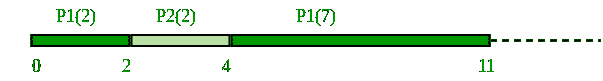

# 最短作业优先(SJF)计划|第 2 集(抢先)

> 原文:[https://www . geesforgeks . org/program-for-short-job-first-sjf-scheduling-set-2-preemptive/](https://www.geeksforgeeks.org/program-for-shortest-job-first-sjf-scheduling-set-2-preemptive/)

在之前的帖子中，我们已经讨论过 SJF 的[第 1 集](https://www.geeksforgeeks.org/program-shortest-job-first-sjf-scheduling-set-1-non-preemptive/)即非抢先。在这篇文章中，我们将讨论被称为最短剩余时间优先(SRTF)的抢先版 SJF。

### 最短剩余时间优先(SRTF)计划

在最短剩余时间优先(SRTF)调度算法中，选择剩余时间最少的进程来执行。由于当前正在执行的进程是根据定义剩余时间最短的进程，并且由于该时间应该只随着执行的进行而减少，因此进程将一直运行，直到它们完成或者添加了需要更少时间的新进程。

### 最短剩余时间优先(抢先 SJF):示例

<figure class="table">

| 过程 | 持续时间 | 命令 | 到达时间 |
| --- | --- | --- | --- |
| 第一亲代 | nine | one | Zero |
| P2 | Two | Two | Two |



> **P1 等待时间:4-2 = 2**
> **P2 等待时间:0**
> **平均等待时间(AWT): (0 + 2) / 2 = 1**

**优势:**
1-短流程处理非常快。
2-系统也只需要很少的开销，因为它只在流程完成或添加新流程时做出决定。
3-当添加新进程时，算法只需要将当前执行的进程与新进程进行比较，忽略当前等待执行的所有其他进程。
**劣势:**
1-与最短作业优先一样，它有可能导致进程饥饿。
2-如果持续增加短流程，长流程可能会无限期推迟。
来源:[维基](https://en.wikipedia.org/wiki/Shortest_remaining_time)

**执行:**

```
1- Traverse until all process gets completely
   executed.
   a) Find process with minimum remaining time at
     every single time lap.
   b) Reduce its time by 1.
   c) Check if its remaining time becomes 0 
   d) Increment the counter of process completion.
   e) Completion time of current process = 
     current_time +1;
   e) Calculate waiting time for each completed 
     process.
   wt[i]= Completion time - arrival_time-burst_time
   f)Increment time lap by one.
2- Find turnaround time (waiting_time+burst_time).
```

## C++

```
// C++ program to implement Shortest Remaining Time First
// Shortest Remaining Time First (SRTF)

#include <bits/stdc++.h>
using namespace std;

struct Process {
    int pid; // Process ID
    int bt; // Burst Time
    int art; // Arrival Time
};

// Function to find the waiting time for all
// processes
void findWaitingTime(Process proc[], int n,
                                int wt[])
{
    int rt[n];

    // Copy the burst time into rt[]
    for (int i = 0; i < n; i++)
        rt[i] = proc[i].bt;

    int complete = 0, t = 0, minm = INT_MAX;
    int shortest = 0, finish_time;
    bool check = false;

    // Process until all processes gets
    // completed
    while (complete != n) {

        // Find process with minimum
        // remaining time among the
        // processes that arrives till the
        // current time`
        for (int j = 0; j < n; j++) {
            if ((proc[j].art <= t) &&
            (rt[j] < minm) && rt[j] > 0) {
                minm = rt[j];
                shortest = j;
                check = true;
            }
        }

        if (check == false) {
            t++;
            continue;
        }

        // Reduce remaining time by one
        rt[shortest]--;

        // Update minimum
        minm = rt[shortest];
        if (minm == 0)
            minm = INT_MAX;

        // If a process gets completely
        // executed
        if (rt[shortest] == 0) {

            // Increment complete
            complete++;
            check = false;

            // Find finish time of current
            // process
            finish_time = t + 1;

            // Calculate waiting time
            wt[shortest] = finish_time -
                        proc[shortest].bt -
                        proc[shortest].art;

            if (wt[shortest] < 0)
                wt[shortest] = 0;
        }
        // Increment time
        t++;
    }
}

// Function to calculate turn around time
void findTurnAroundTime(Process proc[], int n,
                        int wt[], int tat[])
{
    // calculating turnaround time by adding
    // bt[i] + wt[i]
    for (int i = 0; i < n; i++)
        tat[i] = proc[i].bt + wt[i];
}

// Function to calculate average time
void findavgTime(Process proc[], int n)
{
    int wt[n], tat[n], total_wt = 0,
                    total_tat = 0;

    // Function to find waiting time of all
    // processes
    findWaitingTime(proc, n, wt);

    // Function to find turn around time for
    // all processes
    findTurnAroundTime(proc, n, wt, tat);

    // Display processes along with all
    // details
    cout << "Processes "
        << " Burst time "
        << " Waiting time "
        << " Turn around time\n";

    // Calculate total waiting time and
    // total turnaround time
    for (int i = 0; i < n; i++) {
        total_wt = total_wt + wt[i];
        total_tat = total_tat + tat[i];
        cout << " " << proc[i].pid << "\t\t"
            << proc[i].bt << "\t\t " << wt[i]
            << "\t\t " << tat[i] << endl;
    }

    cout << "\nAverage waiting time = "
        << (float)total_wt / (float)n;
    cout << "\nAverage turn around time = "
        << (float)total_tat / (float)n;
}

// Driver code
int main()
{
    Process proc[] = { { 1, 6, 1 }, { 2, 8, 1 },
                    { 3, 7, 2 }, { 4, 3, 3 } };
    int n = sizeof(proc) / sizeof(proc[0]);

    findavgTime(proc, n);
    return 0;
}
```

## Java 语言(一种计算机语言，尤用于创建网站)

```
// Java program to implement Shortest Remaining Time First
// Shortest Remaining Time First (SRTF)

class Process
{
    int pid; // Process ID
    int bt; // Burst Time
    int art; // Arrival Time

    public Process(int pid, int bt, int art)
    {
        this.pid = pid;
        this.bt = bt;
        this.art = art;
    }
}

public class GFG
{
    // Method to find the waiting time for all
    // processes
    static void findWaitingTime(Process proc[], int n,
                                     int wt[])
    {
        int rt[] = new int[n];

        // Copy the burst time into rt[]
        for (int i = 0; i < n; i++)
            rt[i] = proc[i].bt;

        int complete = 0, t = 0, minm = Integer.MAX_VALUE;
        int shortest = 0, finish_time;
        boolean check = false;

        // Process until all processes gets
        // completed
        while (complete != n) {

            // Find process with minimum
            // remaining time among the
            // processes that arrives till the
            // current time`
            for (int j = 0; j < n; j++)
            {
                if ((proc[j].art <= t) &&
                  (rt[j] < minm) && rt[j] > 0) {
                    minm = rt[j];
                    shortest = j;
                    check = true;
                }
            }

            if (check == false) {
                t++;
                continue;
            }

            // Reduce remaining time by one
            rt[shortest]--;

            // Update minimum
            minm = rt[shortest];
            if (minm == 0)
                minm = Integer.MAX_VALUE;

            // If a process gets completely
            // executed
            if (rt[shortest] == 0) {

                // Increment complete
                complete++;
                check = false;

                // Find finish time of current
                // process
                finish_time = t + 1;

                // Calculate waiting time
                wt[shortest] = finish_time -
                             proc[shortest].bt -
                             proc[shortest].art;

                if (wt[shortest] < 0)
                    wt[shortest] = 0;
            }
            // Increment time
            t++;
        }
    }

    // Method to calculate turn around time
    static void findTurnAroundTime(Process proc[], int n,
                            int wt[], int tat[])
    {
        // calculating turnaround time by adding
        // bt[i] + wt[i]
        for (int i = 0; i < n; i++)
            tat[i] = proc[i].bt + wt[i];
    }

    // Method to calculate average time
    static void findavgTime(Process proc[], int n)
    {
        int wt[] = new int[n], tat[] = new int[n];
        int  total_wt = 0, total_tat = 0;

        // Function to find waiting time of all
        // processes
        findWaitingTime(proc, n, wt);

        // Function to find turn around time for
        // all processes
        findTurnAroundTime(proc, n, wt, tat);

        // Display processes along with all
        // details
        System.out.println("Processes " +
                           " Burst time " +
                           " Waiting time " +
                           " Turn around time");

        // Calculate total waiting time and
        // total turnaround time
        for (int i = 0; i < n; i++) {
            total_wt = total_wt + wt[i];
            total_tat = total_tat + tat[i];
            System.out.println(" " + proc[i].pid + "\t\t"
                             + proc[i].bt + "\t\t " + wt[i]
                             + "\t\t" + tat[i]);
        }

        System.out.println("Average waiting time = " +
                          (float)total_wt / (float)n);
        System.out.println("Average turn around time = " +
                           (float)total_tat / (float)n);
    }

    // Driver Method
    public static void main(String[] args)
    {
         Process proc[] = { new Process(1, 6, 1),
                            new Process(2, 8, 1),
                            new Process(3, 7, 2),
                            new Process(4, 3, 3)};

         findavgTime(proc, proc.length);
    }
}
```

## 蟒蛇 3

```
# Python3 program to implement Shortest Remaining Time First
# Shortest Remaining Time First (SRTF)

# Function to find the waiting time
# for all processes
def findWaitingTime(processes, n, wt):
    rt = [0] * n

    # Copy the burst time into rt[]
    for i in range(n):
        rt[i] = processes[i][1]
    complete = 0
    t = 0
    minm = 999999999
    short = 0
    check = False

    # Process until all processes gets
    # completed
    while (complete != n):

        # Find process with minimum remaining
        # time among the processes that
        # arrives till the current time`
        for j in range(n):
            if ((processes[j][2] <= t) and
                (rt[j] < minm) and rt[j] > 0):
                minm = rt[j]
                short = j
                check = True
        if (check == False):
            t += 1
            continue

        # Reduce remaining time by one
        rt[short] -= 1

        # Update minimum
        minm = rt[short]
        if (minm == 0):
            minm = 999999999

        # If a process gets completely
        # executed
        if (rt[short] == 0):

            # Increment complete
            complete += 1
            check = False

            # Find finish time of current
            # process
            fint = t + 1

            # Calculate waiting time
            wt[short] = (fint - proc[short][1] -   
                                proc[short][2])

            if (wt[short] < 0):
                wt[short] = 0

        # Increment time
        t += 1

# Function to calculate turn around time
def findTurnAroundTime(processes, n, wt, tat):

    # Calculating turnaround time
    for i in range(n):
        tat[i] = processes[i][1] + wt[i]

# Function to calculate average waiting
# and turn-around times.
def findavgTime(processes, n):
    wt = [0] * n
    tat = [0] * n

    # Function to find waiting time
    # of all processes
    findWaitingTime(processes, n, wt)

    # Function to find turn around time
    # for all processes
    findTurnAroundTime(processes, n, wt, tat)

    # Display processes along with all details
    print("Processes    Burst Time     Waiting",
                    "Time     Turn-Around Time")
    total_wt = 0
    total_tat = 0
    for i in range(n):

        total_wt = total_wt + wt[i]
        total_tat = total_tat + tat[i]
        print(" ", processes[i][0], "\t\t",
                   processes[i][1], "\t\t",
                   wt[i], "\t\t", tat[i])

    print("\nAverage waiting time = %.5f "%(total_wt /n) )
    print("Average turn around time = ", total_tat / n)

# Driver code
if __name__ =="__main__":

    # Process id's
    proc = [[1, 6, 1], [2, 8, 1],
            [3, 7, 2], [4, 3, 3]]
    n = 4
    findavgTime(proc, n)

# This code is contributed
# Shubham Singh(SHUBHAMSINGH10)
```

## C#

```
// C# program to implement Shortest Remaining Time First
// Shortest Remaining Time First (SRTF)

using System;

public class Process
{
    public int pid; // Process ID
    public int bt; // Burst Time
    public int art; // Arrival Time

    public Process(int pid, int bt, int art)
    {
        this.pid = pid;
        this.bt = bt;
        this.art = art;
    }
}

public class GFG
{
    // Method to find the waiting
    // time for all processes
    static void findWaitingTime(Process []proc, int n,
                                    int []wt)
    {
        int []rt = new int[n];

        // Copy the burst time into rt[]
        for (int i = 0; i < n; i++)
            rt[i] = proc[i].bt;

        int complete = 0, t = 0, minm = int.MaxValue;
        int shortest = 0, finish_time;
        bool check = false;

        // Process until all processes gets
        // completed
        while (complete != n)
        {

            // Find process with minimum
            // remaining time among the
            // processes that arrives till the
            // current time`
            for (int j = 0; j < n; j++)
            {
                if ((proc[j].art <= t) &&
                (rt[j] < minm) && rt[j] > 0)
                {
                    minm = rt[j];
                    shortest = j;
                    check = true;
                }
            }

            if (check == false)
            {
                t++;
                continue;
            }

            // Reduce remaining time by one
            rt[shortest]--;

            // Update minimum
            minm = rt[shortest];
            if (minm == 0)
                minm = int.MaxValue;

            // If a process gets completely
            // executed
            if (rt[shortest] == 0)
            {

                // Increment complete
                complete++;
                check = false;

                // Find finish time of current
                // process
                finish_time = t + 1;

                // Calculate waiting time
                wt[shortest] = finish_time -
                            proc[shortest].bt -
                            proc[shortest].art;

                if (wt[shortest] < 0)
                    wt[shortest] = 0;
            }
            // Increment time
            t++;
        }
    }

    // Method to calculate turn around time
    static void findTurnAroundTime(Process []proc, int n,
                            int []wt, int []tat)
    {
        // calculating turnaround time by adding
        // bt[i] + wt[i]
        for (int i = 0; i < n; i++)
            tat[i] = proc[i].bt + wt[i];
    }

    // Method to calculate average time
    static void findavgTime(Process []proc, int n)
    {
        int []wt = new int[n];int []tat = new int[n];
        int total_wt = 0, total_tat = 0;

        // Function to find waiting time of all
        // processes
        findWaitingTime(proc, n, wt);

        // Function to find turn around time for
        // all processes
        findTurnAroundTime(proc, n, wt, tat);

        // Display processes along with all
        // details
        Console.WriteLine("Processes " +
                        " Burst time " +
                        " Waiting time " +
                        " Turn around time");

        // Calculate total waiting time and
        // total turnaround time
        for (int i = 0; i < n; i++)
        {
            total_wt = total_wt + wt[i];
            total_tat = total_tat + tat[i];
            Console.WriteLine(" " + proc[i].pid + "\t\t"
                            + proc[i].bt + "\t\t " + wt[i]
                            + "\t\t" + tat[i]);
        }

        Console.WriteLine("Average waiting time = " +
                        (float)total_wt / (float)n);
        Console.WriteLine("Average turn around time = " +
                        (float)total_tat / (float)n);
    }

    // Driver Method
    public static void Main(String[] args)
    {
        Process []proc = { new Process(1, 6, 1),
                            new Process(2, 8, 1),
                            new Process(3, 7, 2),
                            new Process(4, 3, 3)};

        findavgTime(proc, proc.Length);
    }
}

// This code has been contributed by 29AjayKumar
```

## java 描述语言

```
<script>
// Javascript program to implement
// Shortest Remaining Time First
// Shortest Remaining Time First (SRTF)

class Process
{
    constructor(pid,bt,art)
    {
        this.pid = pid;    // Process ID
        this.bt = bt;    // Burst Time
        this.art = art;    // Arrival Time
    }
}

// Method to find the waiting time for all
    // processes
function findWaitingTime( proc,n,wt)
{
    let rt = new Array(n);

        // Copy the burst time into rt[]
        for (let i = 0; i < n; i++)
            rt[i] = proc[i].bt;

        let complete = 0, t = 0, minm = Number.MAX_VALUE;
        let shortest = 0, finish_time;
        let check = false;

        // Process until all processes gets
        // completed
        while (complete != n) {

            // Find process with minimum
            // remaining time among the
            // processes that arrives till the
            // current time`
            for (let j = 0; j < n; j++)
            {
                if ((proc[j].art <= t) &&
                  (rt[j] < minm) && rt[j] > 0) {
                    minm = rt[j];
                    shortest = j;
                    check = true;
                }
            }

            if (check == false) {
                t++;
                continue;
            }

            // Reduce remaining time by one
            rt[shortest]--;

            // Update minimum
            minm = rt[shortest];
            if (minm == 0)
                minm = Number.MAX_VALUE;

            // If a process gets completely
            // executed
            if (rt[shortest] == 0) {

                // Increment complete
                complete++;
                check = false;

                // Find finish time of current
                // process
                finish_time = t + 1;

                // Calculate waiting time
                wt[shortest] = finish_time -
                             proc[shortest].bt -
                             proc[shortest].art;

                if (wt[shortest] < 0)
                    wt[shortest] = 0;
            }
            // Increment time
            t++;
        }
}

// Method to calculate turn around time
function findTurnAroundTime(proc,n,wt,tat)
{
     // calculating turnaround time by adding
        // bt[i] + wt[i]
        for (let i = 0; i < n; i++)
            tat[i] = proc[i].bt + wt[i];
}

// Method to calculate average time
function findavgTime(proc,n)
{
    let wt = new Array(n), tat = new Array(n);
        let  total_wt = 0, total_tat = 0;

        // Function to find waiting time of all
        // processes
        findWaitingTime(proc, n, wt);

        // Function to find turn around time for
        // all processes
        findTurnAroundTime(proc, n, wt, tat);

        // Display processes along with all
        // details
        document.write("Processes " +
                           " Burst time " +
                           " Waiting time " +
                           " Turn around time<br>");

        // Calculate total waiting time and
        // total turnaround time
        for (let i = 0; i < n; i++) {
            total_wt = total_wt + wt[i];
            total_tat = total_tat + tat[i];
            document.write(" " + proc[i].pid +
            "      "
            + proc[i].bt + "    " + wt[i]
            + "    " + tat[i]+"<br>");
        }

        document.write("Average waiting time = " +
                          total_wt / n+"<br>");
        document.write("Average turn around time = " +
                           total_tat / n+"<br>");
}

// Driver Method
let proc=[new Process(1, 6, 1),
                            new Process(2, 8, 1),
                            new Process(3, 7, 2),
                            new Process(4, 3, 3)];
findavgTime(proc, proc.length);

// This code is contributed by rag2127

</script>
```

**输出:**

```
Processes  Burst time  Waiting time  Turn around time
 1        6         3        9
 2        8         16        24
 3        7         8        15
 4        3         0        3
Average waiting time = 6.75
Average turn around time = 12.75
```

本文由 [**萨哈布拉**](https://www.facebook.com/sahil.chhabra.965) 供稿。如果你喜欢 GeeksforGeeks 并想投稿，你也可以使用[write.geeksforgeeks.org](https://write.geeksforgeeks.org)写一篇文章或者把你的文章邮寄到 review-team@geeksforgeeks.org。看到你的文章出现在极客博客主页上，帮助其他极客。
如果发现有不正确的地方，或者想分享更多关于上述话题的信息，请写评论。

</figure>