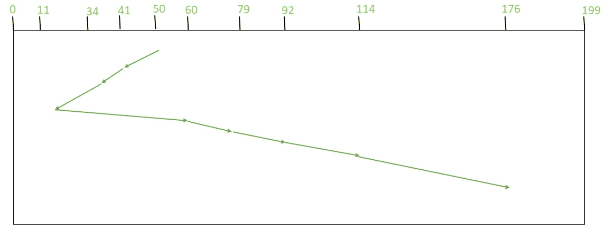

# SSTF 磁盘调度算法程序

> 原文:[https://www . geesforgeks . org/program-for-sstf-disk-scheduling-algorithm/](https://www.geeksforgeeks.org/program-for-sstf-disk-scheduling-algorithm/)

先决条件–[磁盘调度算法](https://www.geeksforgeeks.org/disk-scheduling-algorithms/)
给定一组磁盘磁道号和初始磁头位置，我们的任务是找到访问所有请求磁道的寻道操作总数，如果**最短寻道时间优先(SSTF)** 是使用的磁盘调度算法。

**最短寻道时间优先(SSTF)–**
基本思想是最接近当前磁盘磁头位置的磁道应该首先被维护，以便*最小化寻道操作*。

**最短寻道时间优先的优势(SSTF)–**

1.  性能优于 FCFS 调度算法。
2.  它提供了更好的吞吐量。
3.  该算法用于吞吐量更为重要的批处理系统。
4.  它具有较少的平均响应和等待时间。

**最短寻道时间优先的缺点(SSTF)–**

1.  对于某些请求来说，饥饿是可能的，因为它倾向于容易到达的请求，而忽略了遥远的进程。
2.  他们缺乏可预测性，因为响应时间差异很大。
3.  转换方向会减慢速度。

**算法–**

1.  Let Request 数组表示存储已请求的磁道索引的数组。“head”是磁盘磁头的位置。
2.  求请求数组中所有磁道距磁头的正距离。
3.  从请求的阵列中找到一个尚未被访问/服务且与磁头距离最小的磁道。
4.  用此距离增加总寻道计数。
5.  当前维修的履带位置现在成为新的头部位置。
6.  转至步骤 2，直到请求阵列中的所有磁道都没有得到服务。

**示例–**
请求序列= {176，79，34，60，92，11，41，114}
初始头部位置= 50

下图显示了使用 SSTF 服务请求的磁道的顺序。



因此，总寻道计数计算如下:

```
= (50-41)+(41-34)+(34-11)+(60-11)+(79-60)+(92-79)+(114-92)+(176-114)
= 204 
```

**也可以直接计算为:(50-11)+(176-11)**
**实现–**
实现 SSTF 如下。请注意，我们已经创建了一个包含 2 个成员的节点类。“距离”用于存储磁头和磁道位置之间的距离。“已访问”是一个布尔变量，它告诉磁道以前是否被磁盘磁头访问/服务过。

## C++

```
// C++ program for implementation of
// SSTF disk scheduling
#include <bits/stdc++.h>
using namespace std;

// Calculates difference of each 
// track number with the head position
void calculatedifference(int request[], int head,
                         int diff[][2], int n)
{
    for(int i = 0; i < n; i++)
    {
        diff[i][0] = abs(head - request[i]);
    }
}

// Find unaccessed track which is
// at minimum distance from head
int findMIN(int diff[][2], int n)
{
    int index = -1;
    int minimum = 1e9;

    for(int i = 0; i < n; i++)
    {
        if (!diff[i][1] && minimum > diff[i][0])
        {
            minimum = diff[i][0];
            index = i;
        }
    }
    return index;
}

void shortestSeekTimeFirst(int request[],
                           int head, int n)
{
    if (n == 0)
    {
        return;
    }

    // Create array of objects of class node   
    int diff[n][2] = { { 0, 0 } };

    // Count total number of seek operation  
    int seekcount = 0;

    // Stores sequence in which disk access is done
    int seeksequence[n + 1] = {0};

    for(int i = 0; i < n; i++)
    {
        seeksequence[i] = head;
        calculatedifference(request, head, diff, n);
        int index = findMIN(diff, n);
        diff[index][1] = 1;

        // Increase the total count
        seekcount += diff[index][0];

        // Accessed track is now new head
        head = request[index];
    }
    seeksequence[n] = head;

    cout << "Total number of seek operations = "
         << seekcount << endl;
    cout << "Seek sequence is : " << "\n";

    // Print the sequence
    for(int i = 0; i <= n; i++)
    {
        cout << seeksequence[i] << "\n";
    }
}

// Driver code
int main()
{
    int n = 8;
    int proc[n] = { 176, 79, 34, 60, 92, 11, 41, 114 };

    shortestSeekTimeFirst(proc, 50, n);

    return 0;
}

// This code is contributed by manish19je0495
```

## Java 语言(一种计算机语言，尤用于创建网站)

```
// Java program for implementation of
// SSTF disk scheduling
class node {

    // represent difference between
    // head position and track number
    int distance = 0;

    // true if track has been accessed
    boolean accessed = false;
}

public class SSTF {

    // Calculates difference of each
    // track number with the head position
    public static void calculateDifference(int queue[],
                                        int head, node diff[])

    {
        for (int i = 0; i < diff.length; i++)
            diff[i].distance = Math.abs(queue[i] - head);
    }

    // find unaccessed track
    // which is at minimum distance from head
    public static int findMin(node diff[])
    {
        int index = -1, minimum = Integer.MAX_VALUE;

        for (int i = 0; i < diff.length; i++) {
            if (!diff[i].accessed && minimum > diff[i].distance) {

                minimum = diff[i].distance;
                index = i;
            }
        }
        return index;
    }

    public static void shortestSeekTimeFirst(int request[],
                                                     int head)

    {
        if (request.length == 0)
            return;

        // create array of objects of class node   
        node diff[] = new node[request.length];

        // initialize array
        for (int i = 0; i < diff.length; i++)

            diff[i] = new node();

        // count total number of seek operation   
        int seek_count = 0;

        // stores sequence in which disk access is done
        int[] seek_sequence = new int[request.length + 1];

        for (int i = 0; i < request.length; i++) {

            seek_sequence[i] = head;
            calculateDifference(request, head, diff);

            int index = findMin(diff);

            diff[index].accessed = true;

            // increase the total count
            seek_count += diff[index].distance;

            // accessed track is now new head
            head = request[index];
        }

        // for last accessed track
        seek_sequence[seek_sequence.length - 1] = head;

        System.out.println("Total number of seek operations = "
                                                     + seek_count);

        System.out.println("Seek Sequence is");

        // print the sequence
        for (int i = 0; i < seek_sequence.length; i++)
            System.out.println(seek_sequence[i]);
    }

    public static void main(String[] args)
    {
        // request array
        int arr[] = { 176, 79, 34, 60, 92, 11, 41, 114 };
        shortestSeekTimeFirst(arr, 50);
    }
}
```

## 蟒蛇 3

```
# Python3 program for implementation of
# SSTF disk scheduling

# Calculates difference of each
# track number with the head position
def calculateDifference(queue, head, diff):
    for i in range(len(diff)):
        diff[i][0] = abs(queue[i] - head)

# find unaccessed track which is
# at minimum distance from head
def findMin(diff):

    index = -1
    minimum = 999999999

    for i in range(len(diff)):
        if (not diff[i][1] and
                minimum > diff[i][0]):
            minimum = diff[i][0]
            index = i
    return index

def shortestSeekTimeFirst(request, head):            
        if (len(request) == 0):
            return

        l = len(request)
        diff = [0] * l

        # initialize array
        for i in range(l):
            diff[i] = [0, 0]

        # count total number of seek operation    
        seek_count = 0

        # stores sequence in which disk
        # access is done
        seek_sequence = [0] * (l + 1)

        for i in range(l):
            seek_sequence[i] = head
            calculateDifference(request, head, diff)
            index = findMin(diff)

            diff[index][1] = True

            # increase the total count
            seek_count += diff[index][0]

            # accessed track is now new head
            head = request[index]

        # for last accessed track
        seek_sequence[len(seek_sequence) - 1] = head

        print("Total number of seek operations =",
                                       seek_count)

        print("Seek Sequence is")

        # print the sequence
        for i in range(l + 1):
            print(seek_sequence[i])

# Driver code
if __name__ =="__main__":

    # request array
    proc = [176, 79, 34, 60,
            92, 11, 41, 114]
    shortestSeekTimeFirst(proc, 50)

# This code is contributed by
# Shubham Singh(SHUBHAMSINGH10)
```

## C#

```
// C# program for implementation of
// SSTF disk scheduling
using System;

public class node
{

    // represent difference between
    // head position and track number
    public int distance = 0;

    // true if track has been accessed
    public Boolean accessed = false;
}

public class SSTF
{

    // Calculates difference of each
    // track number with the head position
    public static void calculateDifference(int []queue,
                                        int head, node []diff)

    {
        for (int i = 0; i < diff.Length; i++)
            diff[i].distance = Math.Abs(queue[i] - head);
    }

    // find unaccessed track
    // which is at minimum distance from head
    public static int findMin(node []diff)
    {
        int index = -1, minimum = int.MaxValue;

        for (int i = 0; i < diff.Length; i++)
        {
            if (!diff[i].accessed && minimum > diff[i].distance)
            {

                minimum = diff[i].distance;
                index = i;
            }
        }
        return index;
    }

    public static void shortestSeekTimeFirst(int []request,
                                                    int head)
    {
        if (request.Length == 0)
            return;

        // create array of objects of class node
        node []diff = new node[request.Length];

        // initialize array
        for (int i = 0; i < diff.Length; i++)

            diff[i] = new node();

        // count total number of seek operation
        int seek_count = 0;

        // stores sequence in which disk access is done
        int[] seek_sequence = new int[request.Length + 1];

        for (int i = 0; i < request.Length; i++)
        {

            seek_sequence[i] = head;
            calculateDifference(request, head, diff);

            int index = findMin(diff);

            diff[index].accessed = true;

            // increase the total count
            seek_count += diff[index].distance;

            // accessed track is now new head
            head = request[index];
        }

        // for last accessed track
        seek_sequence[seek_sequence.Length - 1] = head;

        Console.WriteLine("Total number of seek operations = "
                                                    + seek_count);

        Console.WriteLine("Seek Sequence is");

        // print the sequence
        for (int i = 0; i < seek_sequence.Length; i++)
            Console.WriteLine(seek_sequence[i]);
    }

    // Driver code
    public static void Main(String[] args)
    {
        // request array
        int []arr = { 176, 79, 34, 60, 92, 11, 41, 114 };
        shortestSeekTimeFirst(arr, 50);
    }
}

// This code contributed by Rajput-Ji
```

**输出:**

```
Total number of seek operations = 204
Seek Sequence is
50
41
34
11
60
79
92
114
176 
```

**时间复杂度:**o(n^2)
T3】辅助空间: O(N)