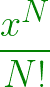

# 直到第 n 项的 cosh(x)级数和的程序

> 原文:[https://www . geesforgeks . org/program-for-sum-of-coshx-series-up-n-term/](https://www.geeksforgeeks.org/program-for-sum-of-coshx-series-upto-nth-term/)

给定两个数字 **x** 和 **N** ，任务是从系列到 **N** 项找到 **cosh(x)** 的值。
cosh(x)的展开式如下:

> **cosh(x) = 1 + x <sup>2</sup> /2！+ x <sup>4</sup> /4！+………**

**例:**

```
Input: x = 1, N = 5
Output: 1.54308035714

Input: x = 1, N = 10
Output: 1.54308063497
```

**方法:**
使用阶乘函数和循环可以轻松实现上述系列。
该系列的第 n 个术语是:



以下是上述方法的实现:

## C++

```
// C++ program for
// the sum of cosh(x) series

#include <bits/stdc++.h>
using namespace std;

// function to return the factorial of a number
int fact(int n)
{

    int i = 1, fac = 1;
    for (i = 1; i <= n; i++)
        fac = fac * i;

    return fac;
}

// function to return the sum of the series
double log_Expansion(double x, int n)
{

    double sum = 0;
    int i = 0;

    for (i = 0; i < n; i++) {

        sum = sum
              + pow(x, 2 * i)
                    / fact(2 * i);
    }

    return sum;
}

// Driver code
int main()
{
    double x = 1;
    int n = 10;
    cout << setprecision(12)
         << log_Expansion(x, n)
         << endl;

    return 0;
}
```

## Java 语言(一种计算机语言，尤用于创建网站)

```
// Java program for the sum of
// cosh(x) series
import java.util.*;

class GFG
{

// function to return the factorial of a number
static int fact(int n)
{
    int i = 1, fac = 1;
    for (i = 1; i <= n; i++)
        fac = fac * i;

    return fac;
}

// function to return the sum of the series
static double log_Expansion(double x, int n)
{
    double sum = 0;
    int i = 0;

    for (i = 0; i < n; i++)
    {
        sum = sum + Math.pow(x, 2 * i) /
                           fact(2 * i);
    }

    return sum;
}

// Driver code
public static void main(String[] args)
{
    double x = 1;
    int n = 10;
    System.out.println(log_Expansion(x, n));
}
}

// This code is contributed by 29AjayKumar
```

## 蟒蛇 3

```
# Python3 program for the Sum of cosh(x) series

# function to return the factorial of a number
def fact(n):

    i, fac = 1, 1
    for i in range(1, n + 1):
        fac = fac * i

    return fac

# function to return the Sum of the series
def log_Expansion(x, n):

    Sum = 0
    i = 0

    for i in range(n):

        Sum = Sum + pow(x, 2 * i) / fact(2 * i)

    return Sum

# Driver code
x = 1
n = 10
print(log_Expansion(x, n))

# This code is contributed by Mohit Kumar
```

## C#

```
// C# program for the sum of
// cosh(x) series
using System;

class GFG
{

// function to return the
// factorial of a number
static int fact(int n)
{
    int i = 1, fac = 1;
    for (i = 1; i <= n; i++)
        fac = fac * i;

    return fac;
}

// function to return the sum of the series
static double log_Expansion(double x, int n)
{
    double sum = 0;
    int i = 0;

    for (i = 0; i < n; i++)
    {
        sum = sum + Math.Pow(x, 2 * i) /
                        fact(2 * i);
    }

    return sum;
}

// Driver code
public static void Main(String[] args)
{
    double x = 1;
    int n = 10;
    Console.WriteLine(log_Expansion(x, n));
}
}

// This code is contributed by PrinciRaj1992
```

## java 描述语言

```
<script>

// Javascript program for the sum of
// cosh(x) series

    // function to return the factorial of a number
    function fact( n) {
        let i = 1, fac = 1;
        for (i = 1; i <= n; i++)
            fac = fac * i;

        return fac;
    }

    // function to return the sum of the series
    function log_Expansion( x , n) {
        let sum = 0;
        let i = 0;

        for (i = 0; i < n; i++) {
            sum = sum + Math.pow(x, 2 * i) / fact(2*i);
        }

        return sum;
    }

    // Driver code

        let x = 1;
        let n = 10;
        document.write(log_Expansion(x, n).toFixed(11));

// This code is contributed by shikhasingrajput

</script>
```

**Output:** 

```
1.54308063497
```