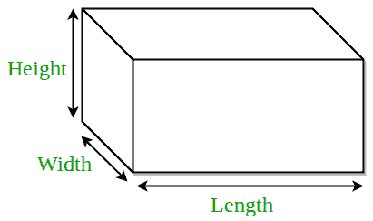

# 长方体体积和表面积程序

> 原文:[https://www . geesforgeks . org/体积和表面积长方体程序/](https://www.geeksforgeeks.org/program-for-volume-and-surface-area-of-cuboid/)

长方体是在三维平面上表示的三维盒状图形。长方体有 6 个直角形面。每个面与另一个面成 90 度角。长方体的三个面在同一个顶点相交。由于它由 6 个矩形面组成，所以它有不同尺寸的长、宽和高。



**例:**

```
Input : 2 3 4
Output : Area = 24
         Total Surface Area = 52 

Input : 5 6 12
Output : Area = 360
         Total Surface Area = 324
```

**公式:**

```
Area = l*w*h
Total Surface Area = 2*l*w + 2*w*h + 2*l*h
where l, h, w are length, height and width of
cuboid respectively.
```

## C++

```
// CPP program to find volume and
// total surface area of cuboid
#include <bits/stdc++.h>
using namespace std;

// utility function
double areaCuboid(double l, double h, double w)
{
    return (l * h * w);
}

double surfaceAreaCuboid(double l, double h, double w)
{
    return (2 * l * w + 2 * w * h + 2 * l * h);
}

// driver function
int main()
{
    double l = 1;
    double h = 5;
    double w = 7;
    cout << "Area = " << areaCuboid(l, h, w) << endl;
    cout << "Total Surface Area = "
         << surfaceAreaCuboid(l, h, w);
    return 0;
}
```

## Java 语言(一种计算机语言，尤用于创建网站)

```
// Java program to find volume and
// total surface area of cuboid

class GFG
{
    // utility function
    static double areaCuboid(double l, double h,
                                           double w)
    {
        return (l * h * w);
    }

    static double surfaceAreaCuboid(double l, double h,
                                                double w)
    {
        return (2 * l * w + 2 * w * h + 2 * l * h);
    }

    // Driver code
    public static void main (String[] args)
    {
        double l = 1;
        double h = 5;
        double w = 7;
        System.out.println("Area = " + areaCuboid(l, h, w));
        System.out.println("Total Surface Area = "
                            + surfaceAreaCuboid(l, h, w));
    }
}
// This code is contributed By Anant Agarwal.
```

## 蟒蛇 3

```
# Python3 code to find volume and
# total surface area of cuboid

# utility function
def volumeCuboid( l , h , w ):
    return (l * h * w)

def surfaceAreaCuboid( l , h , w ):
    return (2 * l * w + 2 * w * h + 2 * l * h)

# driver function
l = 1
h = 5
w = 7
print("Volume =" , volumeCuboid(l, h, w))
print("Total Surface Area =", surfaceAreaCuboid(l, h, w))

#This code is contributed by "Sharad_Bhardwaj".
```

## C#

```
// C# program to find volume and
// total surface area of cuboid
using System;

class GFG {

    // utility function
    static double areaCuboid(double l, double h,
                            double w)
    {
        return (l * h * w);
    }

    static double surfaceAreaCuboid(double l, double h,
                                    double w)
    {
        return (2 * l * w + 2 * w * h + 2 * l * h);
    }

    // Driver code
    public static void Main()
    {
        double l = 1;
        double h = 5;
        double w = 7;

        Console.WriteLine("Area = " + areaCuboid(l, h, w));
        Console.WriteLine("Total Surface Area = "
                        + surfaceAreaCuboid(l, h, w));
    }
}

// This code is contributed By vt_m.
```

## 服务器端编程语言（Professional Hypertext Preprocessor 的缩写）

```
<?php
// PHP program to find volume and
// total surface area of cuboid

// utility function
function areaCuboid($l, $h, $w)
{
    return ($l * $h * $w);
}

function surfaceAreaCuboid($l, $h, $w)
{
    return (2 * $l * $w + 2 * $w *
                $h + 2 * $l * $h);
}

// Driver Code
$l = 1;
$h = 5;
$w = 7;
echo "Area = " ,
     areaCuboid($l, $h, $w) , "\n";
echo "Total Surface Area = ",
      surfaceAreaCuboid($l, $h, $w);

// This code is contributed by ajit
?>
```

## java 描述语言

```
<script>
// javascript program to find volume and
// total surface area of cuboid

// Utility function
function areaCuboid( l,  h,  w)
{
    return (l * h * w);
}

function surfaceAreaCuboid( l,  h,  w)
{
    return (2 * l * w + 2 * w * h + 2 * l * h);
}

// Driver function

    let l = 1;
    let h = 5;
    let w = 7;
   document.write( "Area = " + areaCuboid(l, h, w) +"<br/>");
   document.write("Total Surface Area = "
         + surfaceAreaCuboid(l, h, w)+"<br/>");

// This code is contributed by todaysgaurav
</script>
```

**输出:**

```
Area = 35
Total Surface Area = 94
```

本文由**萨洛尼·古普塔**供稿。如果你喜欢 GeeksforGeeks 并想投稿，你也可以使用[contribute.geeksforgeeks.org](http://www.contribute.geeksforgeeks.org)写一篇文章或者把你的文章邮寄到 contribute@geeksforgeeks.org。看到你的文章出现在极客博客主页上，帮助其他极客。
如果你发现任何不正确的地方，或者你想分享更多关于上面讨论的话题的信息，请写评论。