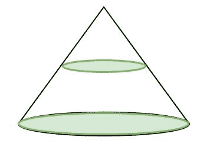
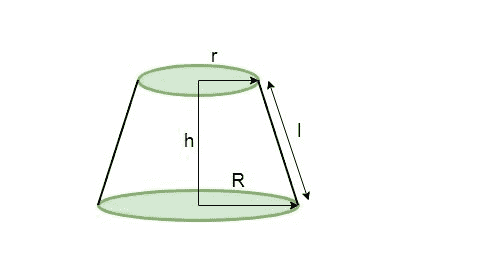

# 圆台体积和表面积程序

> 原文:[https://www . geeksforgeeks . org/体积和表面积圆台程序/](https://www.geeksforgeeks.org/program-for-volume-and-surface-area-of-frustum-of-cone/)

给定锥台的倾斜高度、高度和半径，我们必须计算锥台的体积和表面积。

**平截头体**
在几何学中，平截头体是位于一个或两个平行平面之间的实体(通常是圆锥或金字塔)的一部分。
如果我们用一个平行于其底部的平面切割一个直角圆锥，那么这个平面和底部之间的那部分实体就称为圆台。

下面给出的是一个右圆锥。


被平行于其底部的平面切割后的右圆锥产生如下平截头体:


，其在半径 R
的底部具有圆形基部，圆形上部具有半径 r
高度 h
和倾斜高度 l

*   **圆台体积:**

    ```
    Volume (V) = 1/3 * pi * h(r<sup>2</sup> + R<sup>2</sup> + r*R)

    where
    r = radius of smaller circle
    R = radius of bigger circle (or radius of base of the cone)
    h = height of the frustum

    ```

*   **圆台曲面面积:**

    ```
    Curved Surface Area (CSA) = pi * l(R + r)

    where
    r = radius of smaller circle
    R = radius of bigger circle
    l = slant height of the frustum

    ```

*   **TotalSurface Area of frustum of cone:**

    ```
    Total Surface Area (TSA) = pi * l(R + r) + pi(R<sup>2</sup> + r<sup>2</sup>)

    where
    r = radius of smaller circle
    R = radius of bigger circle
    l = slant height of frustum

    ```

    示例:

    ```
    Input : Radius of smaller circle = 3
            Radius of bigger circle = 8
            Height of frustum = 12
            Slant height of frustum = 13
    Output :
    Volume Of Frustum of Cone : 1218.937
    Curved Surface Area Of Frustum of Cone : 449.24738
    Total Surface Area Of Frustum of Cone : 678.58344

    Input : Radius of smaller circle = 7
            Radius of bigger circle = 10
            Height of frustum = 4
            Slant height of frustum = 5

    Output :
    Volume Of Frustum of Cone : 917.34436
    Curved Surface Area Of Frustum of Cone : 267.03516
    Total Surface Area Of Frustum of Cone : 735.1321

    ```

    ## C++

    ```
    // CPP program to calculate Volume and
    // Surface area of frustum of cone
    #include <iostream>
    using namespace std;

    float pi = 3.14159;

    // Function to calculate Volume of frustum of cone
    float volume(float r, float R, float h)
    {
        return (float(1) / float(3)) * pi * h *
                        (r * r + R * R + r * R);
    }

    // Function to calculate Curved Surface area of
    // frustum of cone
    float curved_surface_area(float r, float R, float l)
    {
        return pi * l * (R + r);
    }

    // Function to calculate Total Surface area of 
    // frustum of cone
    float total_surface_area(float r, float R, float l, 
                                               float h)
    {
        return pi * l * (R + r) + pi * (r * r + R * R);
    }

    // Driver function
    int main()
    {
        float small_radius = 3;
        float big_radius = 8;
        float slant_height = 13;
        float height = 12;

        // Printing value of volume and surface area
        cout << "Volume Of Frustum of Cone : "
             << volume(small_radius, big_radius, height) 
             << endl;

        cout << "Curved Surface Area Of Frustum of Cone : "
             << curved_surface_area(small_radius, big_radius, 
                                     slant_height) << endl;

        cout << "Total Surface Area Of Frustum of Cone : "
             << total_surface_area(small_radius, big_radius, 
                                     slant_height, height);
        return 0;
    }
    ```

    ## Java 语言(一种计算机语言，尤用于创建网站)

    ```
    // Java program to calculate Volume and Surface area
    // of frustum of cone

    public class demo {

        static float pi = 3.14159f;

        // Function to calculate Volume of frustum of cone
        public static float volume(float r, float R, float h)
        {
            return (float)1 / 3 * pi * h * (r * r + R * R +
                                                    r * R);
        }

        // Function to calculate Curved Surface area of
        // frustum of cone
        public static float curved_surface_area(float r, 
                                       float R, float l)
        {
            return pi * l * (R + r);
        }

        // Function to calculate Total Surface area of 
        // frustum of cone
        public static float total_surface_area(float r, 
                             float R, float l, float h)
        {
            return pi * l * (R + r) + pi * (r * r + R * R);
        }

        // Driver function
        public static void main(String args[])
        {
            float small_radius = 3;
            float big_radius = 8;
            float slant_height = 13;
            float height = 12;

        // Printing value of volume and surface area
            System.out.print("Volume Of Frustum of Cone : ");
            System.out.println(volume(small_radius, 
                                big_radius, height));

            System.out.print("Curved Surface Area Of" + 
                                " Frustum of Cone : ");
            System.out.println(curved_surface_area(small_radius,
                                      big_radius, slant_height));
            System.out.print("Total Surface Area Of" + 
                    " Frustum of Cone : ");

            System.out.println(total_surface_area(small_radius, 
                            big_radius, slant_height, height));
        }
    }
    ```

    ## 蟒蛇 3

    ```
    # Python3 code to calculate 
    # Volume and Surface area of
    # frustum of cone
    import math

    pi = math.pi

    # Function to calculate Volume
    # of frustum of cone
    def volume( r , R , h ):
        return 1 /3 * pi * h * (r 
                * r + R * R + r * R)

    # Function to calculate Curved 
    # Surface area of frustum of cone
    def curved_surface_area( r , R , l ):
        return pi * l * (R + r)

    # Function to calculate Total  
    # Surface area of frustum of cone
    def total_surface_area( r , R , l , h ):
        return pi * l * (R + r) + pi * (r
                                * r + R * R)

    # Driver Code
    small_radius = 3
    big_radius = 8
    slant_height = 13
    height = 12

    # Printing value of volume 
    # and surface area
    print("Volume Of Frustum of Cone : "
                                    ,end='')
    print(volume(small_radius, big_radius,
                                    height))

    print("Curved Surface Area Of Frustum"+
                        " of Cone : ",end='')
    print(curved_surface_area(small_radius,
                    big_radius,slant_height))

    print("Total Surface Area Of Frustum"+
                        " of Cone : ",end='')
    print(total_surface_area(small_radius, 
            big_radius,slant_height, height))

    # This code is contributed by "Sharad_Bhardwaj".
    ```

    ## C#

    ```
    // C# program to calculate Volume and 
    // Surface area of frustum of cone
    using System;

    public class demo {

        static float pi = 3.14159f;

        // Function to calculate 
        // Volume of frustum of cone
        public static float volume(float r, float R, float h)
        {
            return (float)1 / 3 * pi * h * (r * r + R * 
                                            R + r * R);
        }

        // Function to calculate Curved
        // Surface area of frustum of cone
        public static float curved_surface_area(float r, 
                                    float R, float l)
        {
            return pi * l * (R + r);
        }

        // Function to calculate Total
        // Surface area of frustum of cone
        public static float total_surface_area(float r, float R, 
                                               float l, float h)
        {
            return pi * l * (R + r) + pi *
                        (r * r + R * R);
        }

        // Driver function
        public static void Main()
        {
            float small_radius = 3;
            float big_radius = 8;
            float slant_height = 13;
            float height = 12;

        // Printing value of volume 
        // and surface area
        Console.Write("Volume Of Frustum of Cone : ");

        Console.WriteLine(volume(small_radius, 
                        big_radius, height));

        Console.Write("Curved Surface Area Of" + 
                         " Frustum of Cone : ");

        Console.WriteLine(curved_surface_area(small_radius,
                                big_radius, slant_height));

        Console.Write("Total Surface Area Of" + 
                        " Frustum of Cone : ");

        Console.WriteLine(total_surface_area(small_radius, 
                        big_radius, slant_height, height));
        }
    }

    // This article is contributed by vt_m
    ```

    ## 服务器端编程语言（Professional Hypertext Preprocessor 的缩写）

    ```
    <?php
    // PHP program to calculate Volume and
    // Surface area of frustum of cone

    // Function to calculate 
    // Volume of frustum of cone
    function volume($r, $R, $h)
    {
        $pi = 3.14159;
        return (1 / (3)) * $pi * $h *
               ($r * $r + $R * $R + $r * $R);
    }

    // Function to calculate Curved 
    // Surface area of frustum of cone
    function curved_surface_area($r, $R, $l)
    {
        $pi = 3.14159;
        return $pi * $l * ($R + $r);
    }

    // Function to calculate Total Surface 
    // area of  frustum of cone
    function total_surface_area( $r, $R, $l, $h)
    {
        $pi = 3.14159;
        return ($pi * $l * ($R + $r) + 
                $pi * ($r * $r + $R * $R));
    }

        // Driver Code
        $small_radius = 3;
        $big_radius = 8;
        $slant_height = 13;
        $height = 12;

        // Printing value of volume 
        // and surface area
        echo("Volume Of Frustum of Cone : ");
        echo(volume($small_radius, 
                    $big_radius, 
                    $height)); 
        echo("\n");

        echo("Curved Surface Area Of Frustum of Cone : ");
        echo (curved_surface_area($small_radius, 
                                  $big_radius ,
                                  $slant_height));
        echo("\n");

        echo("Total Surface Area Of Frustum of Cone : ");
        echo(total_surface_area($small_radius, 
                                $big_radius, 
                                $slant_height, 
                                $height));

    // This code is contributed by vt_m
    ?>
    ```

    输出:

    ```
    Volume Of Frustum of Cone : 1218.937
    Curved Surface Area Of Frustum of Cone : 449.24738
    Total Surface Area Of Frustum of Cone : 678.58344

    ```