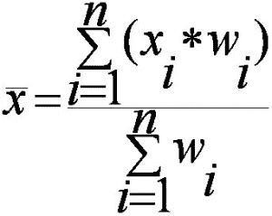

# 自然数加权平均值程序。

> 原文:[https://www . geesforgeks . org/自然数字加权平均值程序/](https://www.geeksforgeeks.org/program-for-weighted-mean-of-natural-numbers/)

给定一个自然数数组和另一个具有相应权重的数组。然后我们要计算加权平均值。



其中 x (bar)称为加权平均值，x[i]为数组元素，W[i]为数组 x[i]元素的权重。

**示例–**

```
Input : 
X[] = {1, 2, 3, 4, 5, 6, 7, 8, 9, 10}
W[] = {1, 2, 3, 4, 5, 6, 7, 8, 9, 10} 
weighted mean 
= (W[0] * X[0] + W[1] * X[1] + W[2] * X[2] + . . . +
   W[n-1] * X[n-1]) / (W[0] + W[1] + W[2] + . . . + W[n-1])
= (1 * 1 + 2 * 2 + 3 * 3 + . . . + 10 * 10) /
  (1 + 2 + 3 + . . . + 10)
= 385 / 55 = 7
Output : 7

Input : 
X[] = {3, 4, 5, 6, 7}
W[] = {4, 5, 6, 7, 8}
weighted mean 
= (W[0] * X[0] + W[1] * X[1] + W[2] * X[2] + . . . +
   W[n-1] * X[n-1]) / (W[0] + W[1] + W[2] + . . . + W[n-1])
= (3 * 4 + 4 * 5 + 5 * 6 + 6 * 7 + 7 * 8) / 
  (4 + 5 + 6 + 7 + 8)
= 160 / 30 = 5.33333
Output : 5.33333
```

求解加权平均值的一种简单方法。

## C++

```
// Program to find weighted mean of
// natural numbers.
#include<bits/stdc++.h>
using namespace std;

// Function to calculate weighted mean.
float weightedMean(int X[], int W[], int n)
{
    int sum = 0, numWeight = 0;

    for (int i = 0; i < n; i++)
    {
        numWeight = numWeight + X[i] * W[i];
        sum = sum + W[i];
    }

    return (float)numWeight / sum;
}

// Driver program to test the function.
int main()
{
    // Take num array and corresponding weight 
    // array and initialize it.
    int X[] = {1, 2, 3, 4, 5, 6, 7, 8, 9, 10};
    int W[] = {1, 2, 3, 4, 5, 6, 7, 8, 9, 10};

    // Calculate the size of array.
    int n = sizeof(X)/sizeof(X[0]);
    int m = sizeof(W)/sizeof(W[0]);

    // Check the size of both array is equal or not.
    if (n == m)
        cout << weightedMean(X, W, n);
    else
        cout << "-1";
    return 0;
}
```

## Java 语言(一种计算机语言，尤用于创建网站)

```
// JAVA Program to find weighted mean
// of natural numbers.

class GFG {

    // Function to calculate weighted mean.
    static float weightedMean(int X[], int W[],
                                        int n)
    {
        int sum = 0, numWeight = 0;

        for (int i = 0; i < n; i++)
        {
            numWeight = numWeight + X[i] * W[i];
            sum = sum + W[i];
        }

        return (float)(numWeight) / sum;
    }

    // Driver program to test the function.
    public static void main(String args[])
    {
        // Take num array and corresponding
        // weight array and initialize it.
        int X[] = {1, 2, 3, 4, 5, 6, 7, 8, 9, 10};
        int W[] = {1, 2, 3, 4, 5, 6, 7, 8, 9, 10};

        // Calculate the size of array.
        int n = X.length;
        int m = W.length;

        // Check the size of both array is
        // equal or not.
        if (n == m)
            System.out.println(weightedMean(X, W, n));
        else
            System.out.println("-1" );

    }
}

/*This code is contributed by Nikita Tiwari.*/
```

## 计算机编程语言

```
# Python Program to find weighted mean of
# natural numbers.

# Function to calculate weighted mean.
def weightedMean(X,W,n) :
    sum = 0
    numWeight = 0
    i = 0
    while  i < n :

        numWeight = numWeight + X[i] * W[i]
        sum = sum + W[i]
        i = i + 1

    return (float)(numWeight / sum)

# Driver program to test the function.

# Take num array and corresponding weight 
# array and initialize it.
X = [1, 2, 3, 4, 5, 6, 7, 8, 9, 10]
W = [1, 2, 3, 4, 5, 6, 7, 8, 9, 10]

# Calculate the size of array.
n = len(X)
m = len(W)

# Check the size of both array is equal or not.
if (n == m) :
    print weightedMean(X, W, n)
else :
    print "-1"

# This coe is contributed by Nikita Tiwari.
```

## C#

```
// C# Program to find weighted mean
// of natural numbers.
using System;

class GFG {

    // Function to calculate weighted mean.
    static float weightedMean(int []X, int []W,
                                        int n)
    {
        int sum = 0, numWeight = 0;

        for (int i = 0; i < n; i++)
        {
            numWeight = numWeight + X[i] * W[i];
            sum = sum + W[i];
        }

        return (float)(numWeight) / sum;
    }

    // Driver program to test the function.
    public static void Main()
    {

        // Take num array and corresponding
        // weight array and initialize it.
        int []X = {1, 2, 3, 4, 5, 6, 7, 8, 9, 10};
        int []W = {1, 2, 3, 4, 5, 6, 7, 8, 9, 10};

        // Calculate the size of array.
        int n = X.Length;
        int m = W.Length;

        // Check the size of both array is
        // equal or not.
        if (n == m)
            Console.WriteLine(weightedMean(X, W, n));
        else
            Console.WriteLine("-1" );
    }
}

// This code is contributed by vt_m.
```

## 服务器端编程语言（Professional Hypertext Preprocessor 的缩写）

```
<?php
// Program to find weighted mean of
// natural numbers.

// Function to calculate
// weighted mean.
function weightedMean($X, $W, $n)
{
    $sum = 0; $numWeight = 0;

    for ($i = 0; $i < $n; $i++)
    {
        $numWeight = $numWeight +
                     $X[$i] * $W[$i];
        $sum = $sum + $W[$i];
    }

    return (float)($numWeight / $sum);
}

// Driver Code

// Take num array and corresponding weight
// array and initialize it.
$X = array(1, 2, 3, 4, 5, 6, 7, 8, 9, 10);
$W = array(1, 2, 3, 4, 5, 6, 7, 8, 9, 10);

// Calculate the size of array.
$n = sizeof($X);
$m = sizeof($W);

// Check the size of both
// array is equal or not.
if ($n == $m)
    echo(weightedMean($X, $W, $n));
else
    echo("-1");

// This code is contributed by Ajit.
?>
```

## java 描述语言

```
<script>

// Javascript program to find weighted mean
// of natural numbers.

// Function to calculate weighted mean.
function weightedMean(X, W, n)
{
    let sum = 0, numWeight = 0;

    for(let i = 0; i < n; i++)
    {
        numWeight = numWeight + X[i] * W[i];
        sum = sum + W[i];
    }

    return (numWeight) / sum;
}

// Driver code

// Take num array and corresponding
// weight array and initialize it.
let X = [ 1, 2, 3, 4, 5, 6, 7, 8, 9, 10 ];
let W = [ 1, 2, 3, 4, 5, 6, 7, 8, 9, 10 ];

// Calculate the size of array.
let n = X.length;
let m = W.length;

// Check the size of both array is
// equal or not.
if (n == m)
    document.write(weightedMean(X, W, n));
else
    document.write("-1" );

// This code is contributed by susmitakundugoaldanga

</script>
```

**输出–**

```
7
```

**第二种方法–**计算前 n 个自然数的加权平均值。这是计算前 n 个自然数加权平均值的公式。在这个方法中，我们给出了前 n 个自然数，它们的权重也是自然数。然后我们生成公式

```
Weighted Mean 
= (W[0] * X[0] + W[1] * X[1] + W[2] * X[2] + . . . +
      W[n-1] * X[n-1]) / (W[0] + W[1] + W[2] + . . . + W[n-1])
= (1 * 1 + 2 * 2 + 3 * 3 + . . . + n * n) / (1 + 2 + 3 + . . . + n)
= (n * (n + 1) * (2 * n + 1) / 6) / (n * (n + 1) / 2)

Weighted Mean = (2 * n + 1) / 3

Example: Weighted mean of first 10 natural numbers 
n = 10
Weighted mean 
= (2 * 10 + 1) / 3 = 21 / 3 = 7 
```

## C++

```
// Program to find weighted mean of first
// n natural numbers using formula.
#include<bits/stdc++.h>
using namespace std;

// Returns weighted mean assuming for numbers
// {1, 2, ..n} and weights {1, 2, .. n}
int weightedMean(int n)
{
    return (2 * n + 1)/3;
}

// Driver program to test the function.
int main()
{
    int n = 10;
    cout << weightedMean(n);
    return 0;
}
```

## Java 语言(一种计算机语言，尤用于创建网站)

```
// Program to find weighted mean of first
// n natural numbers using formula.
import java.io.*;

public class GFG {

    // Returns weighted mean assuming for numbers
    // {1, 2, ..n} and weights {1, 2, .. n}
    static int weightedMean(int n)
    {
        return (2 * n + 1)/3;
    }

    // Driver program to test the function.

    static public void main (String[] args)
    {
        int n = 10;

        System.out.println(weightedMean(n));

    }
}

// This code is contributed by vt_m.
```

## 蟒蛇 3

```
# Program to find weighted mean of first
# n natural numbers using formula.

# Returns weighted mean assuming for numbers
# 1, 2, ..n and weights 1, 2, .. n
def weightedMean(n):

    return (2 * n + 1) / 3

# Driver program to test the function.
n = 10
print(int(weightedMean(n)))
# This code is contributed by smita
```

## C#

```
// Program to find weighted mean of first
// n natural numbers using formula.
using System;

public class GFG {

    // Returns weighted mean assuming for numbers
    // {1, 2, ..n} and weights {1, 2, .. n}
    static int weightedMean(int n)
    {
        return (2 * n + 1) / 3;
    }

    // Driver program to test the function.

    static public void Main ()
    {
        int n = 10;

        Console.WriteLine(weightedMean(n));
    }
}

// This code is contributed by vt_m.
```

## 服务器端编程语言（Professional Hypertext Preprocessor 的缩写）

```
<?php
// Program to find weighted mean of first
// n natural numbers using formula.

// Returns weighted mean
// assuming for numbers
// {1, 2, ..n} and
// weights {1, 2, .. n}
function weightedMean($n)
{
    return (2 * $n + 1) / 3;
}

// Driver Code
$n = 10;
echo(weightedMean($n));

// This code is contributed by Ajit.
?>
```

## java 描述语言

```
<script>
    // Program to find weighted mean of first
    // n natural numbers using formula.

    // Returns weighted mean assuming for numbers
    // {1, 2, ..n} and weights {1, 2, .. n}
    function weightedMean(n)
    {
        return parseInt((2 * n + 1) / 3, 10);
    }

    let n = 10;

      document.write(weightedMean(n));

</script>
```

**输出–**

```
7
```

本文由 [**达曼德拉·库马尔**](https://auth.geeksforgeeks.org/profile.php?user=dharammnnit) 供稿。如果你喜欢 GeeksforGeeks 并想投稿，你也可以使用[contribute.geeksforgeeks.org](http://www.contribute.geeksforgeeks.org)写一篇文章或者把你的文章邮寄到 contribute@geeksforgeeks.org。看到你的文章出现在极客博客主页上，帮助其他极客。
如果发现有不正确的地方，或者想分享更多关于上述话题的信息，请写评论。