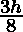
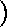

# 执行辛普森 3/8 规则的程序

> 原文:[https://www . geesforgeks . org/program-implement-Simpsons-38-rule/](https://www.geeksforgeeks.org/program-implement-simpsons-38-rule/)

写一个程序来实现辛普森的 3/8 法则。
辛普森一家的 3/8 法则是由托马斯·辛普森提出的。该方法用于执行数值积分。这种方法一般用于定积分的数值逼近。这里，抛物线用于逼近曲线的每个部分。
**辛普森的 3/8 公式:**
T5】=【特克斯】([/特克斯]F(a) + 3F 【特克斯】\ frac { 2a+b } { 3 })[/特克斯]+ 3F 【特克斯】\ frac { a+2b } { 3 })[/特克斯]+ F(b) 
这里，
h 是 h =(b–a)/n 给出的区间大小
n 是

```
Input : lower_limit = 1, upper_limit = 10, 
        interval_limit = 10
Output : integration_result = 0.687927

Input : lower_limit = 1, upper_limit = 5, 
        interval_limit = 3
Output : integration_result = 0.605835
```

## C++

```
// CPP program to implement Simpson's rule
#include<iostream>
using namespace std;

// Given function to be integrated
float func( float x)
{
    return (1 / ( 1 + x * x ));
}

// Function to perform calculations
float calculate(float lower_limit, float upper_limit,
                int interval_limit )
{
    float value;
    float interval_size = (upper_limit - lower_limit)
                          / interval_limit;
    float sum = func(lower_limit) + func(upper_limit);

    // Calculates value till integral limit
    for (int i = 1 ; i < interval_limit ; i++)
    {
        if (i % 3 == 0)
            sum = sum + 2 * func(lower_limit + i * interval_size);
        else
            sum = sum + 3 * func(lower_limit + i * interval_size);
    }
    return ( 3 * interval_size / 8 ) * sum ;
}

// Driver Code
int main()
{
    int interval_limit = 10;
    float lower_limit = 1;
    float upper_limit = 10;
    float integral_res = calculate(lower_limit, upper_limit,
                                   interval_limit);

    cout << integral_res;
    return 0;
}
```

## Java 语言(一种计算机语言，尤用于创建网站)

```
// Java Code to implement Simpson's rule
import java.util.*;

class GFG {

    // Given function to be integrated
    static float func( float x)
    {
        return (1 / ( 1 + x * x ));
    }

    // Function to perform calculations
    static float calculate(float lower_limit,
                           float upper_limit, int interval_limit )
    {
        float value;
        float interval_size = (upper_limit - lower_limit)
                               / interval_limit;

        float sum = func(lower_limit) + func(upper_limit);

        // Calculates value till integral limit
        for (int i = 1 ; i < interval_limit ; i++)
        {
            if (i % 3 == 0)
                sum = sum + 2 * func(lower_limit
                                     + i * interval_size);
            else
                sum = sum + 3 * func(lower_limit + i
                                     * interval_size);
        }
        return ( 3 * interval_size / 8 ) * sum ;
    }

    // Driver program to test above function
    public static void main(String[] args)
    {
        int interval_limit = 10;
        float lower_limit = 1;
        float upper_limit = 10;
        float integral_res = calculate(lower_limit, upper_limit,
                                       interval_limit);

        System.out.println(integral_res);
        }
    }

// This article is contributed by Arnav Kr. Mandal.
```

## 蟒蛇 3

```
# Python3 code to implement
# Simpson's rule

# Given function to be
# integrated
def func(x):

    return (float(1) / ( 1 + x * x ))

# Function to perform calculations
def calculate(lower_limit, upper_limit, interval_limit ):

    interval_size = (float(upper_limit - lower_limit) / interval_limit)
    sum = func(lower_limit) + func(upper_limit);

    # Calculates value till integral limit
    for i in range(1, interval_limit ):
        if (i % 3 == 0):
            sum = sum + 2 * func(lower_limit + i * interval_size)
        else:
            sum = sum + 3 * func(lower_limit + i * interval_size)

    return ((float( 3 * interval_size) / 8 ) * sum )

# driver function
interval_limit = 10
lower_limit = 1
upper_limit = 10

integral_res = calculate(lower_limit, upper_limit, interval_limit)

# rounding the final answer to 6 decimal places
print (round(integral_res, 6))

# This code is contributed by Saloni.
```

## C#

```
// C# Code to implement Simpson's rule
using System;

class GFG {

    // Given function to be integrated
    static float func( float x)
    {
        return (1 / ( 1 + x * x ));
    }

    // Function to perform calculations
    static float calculate(float lower_limit,
                        float upper_limit, int interval_limit )
    {
        //float value;
        float interval_size = (upper_limit - lower_limit)
                            / interval_limit;

        float sum = func(lower_limit) + func(upper_limit);

        // Calculates value till integral limit
        for (int i = 1 ; i < interval_limit ; i++)
        {
            if (i % 3 == 0)
                sum = sum + 2 * func(lower_limit
                                    + i * interval_size);
            else
                sum = sum + 3 * func(lower_limit + i
                                    * interval_size);
        }
        return ( 3 * interval_size / 8 ) * sum ;
    }

    // Driver program to test above function
    public static void Main()
    {
        int interval_limit = 10;
        float lower_limit = 1;
        float upper_limit = 10;
        float integral_res = calculate(lower_limit, upper_limit,
                                    interval_limit);

        Console.WriteLine(integral_res);
        }
    }

// This code is contributed by Vt_m.
```

## 服务器端编程语言（Professional Hypertext Preprocessor 的缩写）

```
<?php
// PHP program to implement
// Simpson's rule

// Given function to be integrated
function func( $x)
{
    return (1 / ( 1 + $x * $x ));
}

// Function to perform calculations
function calculate($lower_limit, $upper_limit,
                   $interval_limit)
{
    $interval_size = ($upper_limit -
                      $lower_limit) /
                      $interval_limit;
    $sum = func($lower_limit) +
           func($upper_limit);

    // Calculates value till
    // integral limit
    for ($i = 1 ; $i < $interval_limit ; $i++)
    {
        if ($i % 3 == 0)
            $sum = $sum + 2 * func($lower_limit +
                                   $i * $interval_size);
        else
            $sum = $sum + 3 * func($lower_limit +
                                   $i * $interval_size);
    }
    return ( 3 * $interval_size / 8 ) * $sum ;
}

// Driver Code
$interval_limit = 10;
$lower_limit = 1;
$upper_limit = 10;
$integral_res = calculate($lower_limit, $upper_limit,
                          $interval_limit);

echo $integral_res;

// This code is contributed by mits.
?>
```

## java 描述语言

```
<script>

// javascript program to implement Simpson's rule

// Given function to be integrated
    function func(x)
    {
        return (1 / ( 1 + x * x ));
    }

    // Function to perform calculations
    function calculate(lower_limit,
                           upper_limit, interval_limit )
    {
        let value;
        let interval_size = (upper_limit - lower_limit)
                               / interval_limit;

        let sum = func(lower_limit) + func(upper_limit);

        // Calculates value till integral limit
        for (let i = 1 ; i < interval_limit ; i++)
        {
            if (i % 3 == 0)
                sum = sum + 2 * func(lower_limit
                                     + i * interval_size);
            else
                sum = sum + 3 * func(lower_limit + i
                                     * interval_size);
        }
        return ( 3 * interval_size / 8 ) * sum ;
    }

// Driver Function
         let interval_limit = 10;
        let lower_limit = 1;
        let upper_limit = 10;
        let integral_res = calculate(lower_limit, upper_limit,
                                       interval_limit);

        document.write(integral_res);

    // This code is contributed by susmitakundugoaldanga.
</script>
```

**输出:**

```
0.687927
```