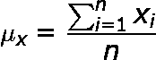
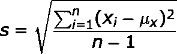
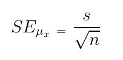

# 实现平均值标准误差的程序

> 原文:[https://www . geesforgeks . org/program-implement-standard-error-mean/](https://www.geeksforgeeks.org/program-implement-standard-error-mean/)

**平均值的标准误差(SEM)** 用于从总体平均值估计样本平均离差。标准误差和样本均值一起用于估计均值的近似置信区间。它也被称为平均值或测量值的标准误差，通常用 SE、SEM 或 S <sub>E</sub> 表示。

示例:

```
Input : arr[] = {78.53, 79.62, 80.25, 81.05, 83.21, 83.46}
Output : 0.8063

Input : arr[] = {5, 5.5, 4.9, 4.85, 5.25, 5.05, 6.0}
Output : 0.1546

```

**样指**


**样本标准差**


**估算平均值的标准误差**


解释:

> 给定一个数组 arr[] = {78.53，79.62，80.25，81.05，83.21，83.46}
> ，任务是找到均值的标准误差。
> 均值=(78.53+79.62+80.25+81.05+83.21+83.46)/6
> = 486.12/6
> = 81.02
> 样本标准差= sqrt((78.53–81.02)<sup>2</sup>+(79.62-81.02)<sup>2</sup>+。。。
> +(83.46–81.02)<sup>2</sup>/(6–1)
> = sqrt(19.5036/5)
> = 1.97502
> 平均值的标准误差= 1.97502 / sqrt(6)
> = 0.8063

## C++

```
// C++ Program to implement 
// standard error of mean.
#include <bits/stdc++.h>
using namespace std;

// Function to find sample mean.
float mean(float arr[], int n)
{   
    // loop to calculate 
    // sum of array elements.
    float sum = 0;
    for (int i = 0; i < n; i++)
        sum = sum + arr[i];

    return sum / n;
}

// Function to calculate sample
// standard deviation.
float SSD(float arr[], int n)
{
    float sum = 0;    
    for (int i = 0; i < n; i++)
        sum = sum + (arr[i] - mean(arr, n))
                    * (arr[i] - mean(arr, n));

    return sqrt(sum / (n - 1));
}

// Function to calculate sample error.
float sampleError(float arr[], int n)
{    
    // Formula to find sample error.
    return SSD(arr, n) / sqrt(n);
}

// Driver function
int main()
{
    float arr[] = { 78.53, 79.62, 80.25,
                    81.05, 83.21, 83.46 };
    int n = sizeof(arr) / sizeof(arr[0]);
    cout << sampleError(arr, n);    
    return 0;
}
```

## Java 语言(一种计算机语言，尤用于创建网站)

```
// Java Program to implement
// standard error of mean.

class GFG {

    // Function to find sample mean.
    static float mean(float arr[], int n)
    {
        // loop to calculate
        // sum of array elements.
        float sum = 0;
        for (int i = 0; i < n; i++)
            sum = sum + arr[i];

        return sum / n;
    }

    // Function to calculate sample
    // standard deviation.
    static float SSD(float arr[], int n)
    {
        float sum = 0;
        for (int i = 0; i < n; i++)
            sum = sum + (arr[i] - mean(arr, n)) 
                  * (arr[i] - mean(arr, n));

        return (float)Math.sqrt(sum / (n - 1));
    }

    // Function to calculate sample error.
    static float sampleError(float arr[], int n)
    {
        // Formula to find sample error.
        return SSD(arr, n) / (float)Math.sqrt(n);
    }

    // Driver function
    public static void main(String[] args)
    {
        float arr[] = { 78.53f, 79.62f, 80.25f, 
                       81.05f, 83.21f, 83.46f };
        int n = arr.length;
        System.out.println(sampleError(arr, n));
    }
}

// This code is contributed 
// by  prerna saini
```

## 蟒蛇 3

```
# Python 3 Program to implement 
# standard error of mean.
import math

# Function to find sample mean.
def mean(arr, n) :

    # loop to calculate 
    # sum of array elements.
    sm = 0
    for i in range(0,n) :
        sm = sm + arr[i]

    return sm / n

# Function to calculate sample
# standard deviation.
def SSD(arr, n) :
    sm = 0
    for i in range(0,n) :
        sm = sm + (arr[i] - mean(arr, n)) * (arr[i] - mean(arr, n))

    return (math.sqrt(sm / (n - 1)))

# Function to calculate sample error.
def sampleError(arr, n) :

    # Formula to find sample error.
    return SSD(arr, n) / (math.sqrt(n))

# Driver function
arr = [ 78.53, 79.62, 80.25, 81.05, 83.21, 83.46]
n = len(arr)
print(sampleError(arr, n))

# This code is contributed
# by Nikita Tiwari.
```

## C#

```
// C# Program to implement
// standard error of mean.
using System;

class GFG {

    // Function to find sample mean.
    static float mean(float []arr, int n)
    {

        // loop to calculate
        // sum of array elements.
        float sum = 0;
        for (int i = 0; i < n; i++)
            sum = sum + arr[i];

        return sum / n;
    }

    // Function to calculate sample
    // standard deviation.
    static float SSD(float []arr, int n)
    {
        float sum = 0;
        for (int i = 0; i < n; i++)
            sum = sum + (arr[i] - mean(arr, n)) 
                      * (arr[i] - mean(arr, n));

        return (float)Math.Sqrt(sum / (n - 1));
    }

    // Function to calculate sample error.
    static float sampleError(float []arr, int n)
    {

        // Formula to find sample error.
        return SSD(arr, n) / (float)Math.Sqrt(n);
    }

    // Driver code
    public static void Main()
    {
        float []arr = {78.53f, 79.62f, 80.25f, 
                       81.05f, 83.21f, 83.46f};
        int n = arr.Length;
        Console.Write(sampleError(arr, n));
    }
}

// This code is contributed by Nitin Mittal.
```

## 服务器端编程语言（Professional Hypertext Preprocessor 的缩写）

```
<?php
// PHP Program to implement 
// standard error of mean.

// Function to find sample mean.
function mean($arr,$n)
{ 

    // loop to calculate 
    // sum of array elements.
    $sum = 0;
    for ($i = 0; $i < $n; $i++)
        $sum = $sum + $arr[$i];

    return $sum / $n;
}

// Function to calculate sample
// standard deviation.
function SSD($arr, $n)
{
    $sum = 0; 
    for ($i = 0; $i < $n; $i++)
        $sum = $sum + ($arr[$i] - 
               mean($arr, $n)) * 
               ($arr[$i] - 
               mean($arr, $n));

    return sqrt($sum / ($n - 1));
}

// Function to calculate
// sample error.
function sampleError($arr, $n)
{ 

    // Formula to find sample error.
    return SSD($arr, $n) / sqrt($n);
}

// Driver Code
{
    $arr = array(78.53, 79.62, 80.25,
                 81.05, 83.21, 83.46 );
    $n = sizeof($arr) / sizeof($arr[0]);
    echo sampleError($arr, $n); 
    return 0;
}

// This code is contributed by nitin mittal.
?>
```

Output:

```
0.8063

```