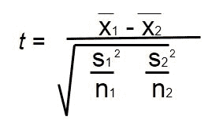

# 实施 t 检验的程序

> 原文:[https://www.geeksforgeeks.org/program-implement-t-test/](https://www.geeksforgeeks.org/program-implement-t-test/)

T 检验(也称为学生 T 检验)比较两个平均值(平均值)，并判断它们是否彼此不同。t 检验也显示了差异有多显著。换句话说，它让你知道这些差异是否可能是偶然发生的。t 检验可以用公式计算:



其中，
**x̄ <sub>1</sub>** 为第一数据集
**x̄<sub>2</sub>T9】为第二数据集
t11】s<sub>1</sub>t14】2t16】为第一数据集
t18】s<sub>2</sub>t21】2t23】为第二数据集
T25 的标准差**

**示例:**

```
Input : arr1[] = {10, 20, 30, 40, 50}
        arr2[] = {1, 29, 46, 78, 99}
Output : -1.09789

Input : arr1[] = {5, 20, 40, 80, 100, 120}
        arr2[] = {1, 29, 46, 78, 99}
Output : 0.399518
```

**说明:**
在例 1 中，x̄ <sub>1</sub> = 30，x̄ <sub>2</sub> = 50.6，s<sub>1</sub>T9】2= 15.8114，s<sub>1</sub>t13】2= 38.8626
使用公式，t-test = -1.09789

下面是 t-test 的实现。

## C++

```
// CPP Program to implement t-test.
#include <bits/stdc++.h>
using namespace std;

// Function to find mean.
float Mean(float arr[], int n)
{
    float sum = 0;
    for (int i = 0; i < n; i++)
        sum = sum + arr[i];
    return sum / n;
}

// Function to find standard
// deviation of given array.
float standardDeviation(float arr[], int n)
{
    float sum = 0;
    for (int i = 0; i < n; i++)
        sum = sum + (arr[i] - Mean(arr, n)) *
                    (arr[i] - Mean(arr, n));

    return sqrt(sum / (n - 1));
}

// Function to find t-test of
// two set of statistical data.
float tTest(float arr1[], int n,
            float arr2[], int m)
{
    float mean1 = Mean(arr1, n);
    float mean2 = Mean(arr2, m);
    float sd1 = standardDeviation(arr1, n);
    float sd2 = standardDeviation(arr2, m);

    // Formula to find t-test
    // of two set of data.
    float t_test = (mean1 - mean2) / sqrt((sd1 * sd1)
                              / n + (sd2 * sd2) / m);
    return t_test;
}

// Driver function.
int main()
{
    float arr1[] = { 10, 20, 30, 40, 50 };

    // Calculate size of first array.
    int n = sizeof(arr1) / sizeof(arr1[0]);
    float arr2[] = { 1, 29, 46, 78, 99 };

    // Calculate size of second array.
    int m = sizeof(arr2) / sizeof(arr2[0]);

    // Function call.
    cout << tTest(arr1, n, arr2, m);

    return 0;
}
```

## Java 语言(一种计算机语言，尤用于创建网站)

```
// Java Program to implement t-test.
import java.util.*;
import java.io.*;

class GFG
{
    // Function to find mean.
    static float Mean(float arr[], int n)
    {
        float sum = 0;
        for (int i = 0; i < n; i++)
            sum = sum + arr[i];
        return sum / n;
    }

    // Function to find standard
    // deviation of given array.
    static float standardDeviation(float arr[], int n)
    {
        float sum = 0;
        for (int i = 0; i < n; i++)
            sum = sum + (arr[i] - Mean(arr, n))
                  * (arr[i] - Mean(arr, n));

        return (float)Math.sqrt(sum / (n - 1));
    }

    // Function to find t-test of
    // two set of statistical data.
    static float tTest(float arr1[], int n,
                        float arr2[], int m)
    {
        float mean1 = Mean(arr1, n);
        float mean2 = Mean(arr2, m);
        float sd1 = standardDeviation(arr1, n);
        float sd2 = standardDeviation(arr2, m);

        // Formula to find t-test
        // of two set of data.
        float t_test = (mean1 - mean2) /
                       (float)Math.sqrt((sd1 * sd1) /
                       n + (sd2 * sd2) / m);
        return t_test;
    }

    // Driver code
    public static void main(String args[])
    {
         float arr1[] = { 10, 20, 30, 40, 50 };

        // Calculate size of first array.
        int n = arr1.length;
        float arr2[] = { 1, 29, 46, 78, 99 };

        // Calculate size of second array.
        int m = arr2.length;

        // Function call.
        System.out.print(tTest(arr1, n, arr2, m));
    }
}

// This code is contributed by Sahil_Bansall
```

## 蟒蛇 3

```
# Python 3 Program to implement t-test.
from math import sqrt

# Function to find mean.
def Mean(arr, n):
    sum = 0
    for i in range(0, n, 1):
        sum = sum + arr[i]
    return sum / n

# Function to find standard
# deviation of given array.
def standardDeviation(arr, n):
    sum = 0
    for i in range(0, n, 1):
        sum = (sum + (arr[i] - Mean(arr, n)) *
                     (arr[i] - Mean(arr, n)))

    return sqrt(sum / (n - 1))

# Function to find t-test of
# two set of statistical data.
def tTest(arr1, n, arr2, m):
    mean1 = Mean(arr1, n)
    mean2 = Mean(arr2, m)
    sd1 = standardDeviation(arr1, n)
    sd2 = standardDeviation(arr2, m)

    # Formula to find t-test
    # of two set of data.
    t_test = (mean1 - mean2) / sqrt((sd1 * sd1) / n +
                                    (sd2 * sd2) / m)
    return t_test

# Driver Code
if __name__ == '__main__':
    arr1 = [10, 20, 30, 40, 50]

    # Calculate size of first array.
    n = len(arr1)
    arr2 = [1, 29, 46, 78, 99]

    # Calculate size of second array.
    m = len(arr2)

    # Function call.
    print('{0:.6}'.format(tTest(arr1, n, arr2, m)))

# This code is contributed by
# Surendra_Gangwar
```

## C#

```
// C# Program to implement t-test.
using System;

class GFG {

    // Function to find mean.
    static float Mean(float[] arr, int n)
    {
        float sum = 0;
        for (int i = 0; i < n; i++)
            sum = sum + arr[i];
        return sum / n;
    }

    // Function to find standard
    // deviation of given array.
    static float standardDeviation(float[] arr, int n)
    {
        float sum = 0;
        for (int i = 0; i < n; i++)
            sum = sum + (arr[i] - Mean(arr, n)) *
                        (arr[i] - Mean(arr, n));

        return (float)Math.Sqrt(sum / (n - 1));
    }

    // Function to find t-test of
    // two set of statistical data.
    static float tTest(float[] arr1, int n,
                       float[] arr2, int m)
    {
        float mean1 = Mean(arr1, n);
        float mean2 = Mean(arr2, m);
        float sd1 = standardDeviation(arr1, n);
        float sd2 = standardDeviation(arr2, m);

        // Formula to find t-test
        // of two set of data.
        float t_test = (mean1 - mean2) /
                       (float)Math.Sqrt((sd1 * sd1) /
                       n + (sd2 * sd2) / m);
        return t_test;
    }

    // Driver code
    static public void Main ()
    {
        float[] arr1 = {10, 20, 30, 40, 50};

        // Calculate size of first array
        int n = arr1.Length;
        float[] arr2 = { 1, 29, 46, 78, 99 };

        // Calculate size of second array
        int m = arr2.Length;

        // Function calling
        Console.Write(tTest(arr1, n, arr2, m));
    }
}

// This code is contributed by Ajit.
```

## 服务器端编程语言（Professional Hypertext Preprocessor 的缩写）

```
<?php
// PHP Program to implement t-test.

// Function to find mean.
function Mean($arr, $n)
{
    $sum = 0;
    for ($i = 0; $i < $n; $i++)
        $sum = $sum + $arr[$i];
    return $sum / $n;
}

// Function to find standard
// deviation of given array.
function standardDeviation($arr,$n)
{
    $sum = 0;
    for ($i = 0; $i < $n; $i++)
        $sum = $sum + ($arr[$i] - Mean($arr, $n)) *
                      ($arr[$i] - Mean($arr, $n));

    return sqrt($sum / ($n - 1));
}

// Function to find t-test of
// two set of statistical data.
function tTest($arr1, $n,
               $arr2, $m)
{
    $mean1 = Mean($arr1, $n);
    $mean2 = Mean($arr2, $m);
    $sd1 = standardDeviation($arr1, $n);
    $sd2 = standardDeviation($arr2, $m);

    // Formula to find t-test
    // of two set of data.
    $t_test = ($mean1 - $mean2) /
               sqrt(($sd1 * $sd1) /
               $n + ($sd2 * $sd2) / $m);
    return $t_test;
}

// Driver Code
{
    $arr1 = array(10, 20, 30, 40, 50);

    // Calculate size of first array.
    $n = sizeof($arr1) / sizeof($arr1[0]);

    $arr2 = array( 1, 29, 46, 78, 99 );

    // Calculate size of second array.
    $m = sizeof($arr2) / sizeof($arr2[0]);

    // Function call.
    echo tTest($arr1, $n, $arr2, $m);

    return 0;
}

// This code is contributed by nitin mittal.
?>
```

## java 描述语言

```
<script>

// Javascript program to implement t-test.

// Function to find mean.
function Mean(arr, n)
{
    let sum = 0;
    for(let i = 0; i < n; i++)
        sum = sum + arr[i];

    return sum / n;
}

// Function to find standard
// deviation of given array.
function standardDeviation(arr, n)
{
    let sum = 0;
    for(let i = 0; i < n; i++)
        sum = sum + (arr[i] - Mean(arr, n)) *
                    (arr[i] - Mean(arr, n));

    return Math.sqrt(sum / (n - 1));
}

// Function to find t-test of
// two set of statistical data.
function tTest(arr1, n, arr2, m)
{
    let mean1 = Mean(arr1, n);
    let mean2 = Mean(arr2, m);
    let sd1 = standardDeviation(arr1, n);
    let sd2 = standardDeviation(arr2, m);

    // Formula to find t-test
    // of two set of data.
    let t_test = (mean1 - mean2) /
         Math.sqrt((sd1 * sd1) /
               n + (sd2 * sd2) / m);
    return t_test.toFixed(5);
}

// Driver code
let arr1 = [ 10, 20, 30, 40, 50 ];

// Calculate size of first array
let n = arr1.length;
let arr2 = [ 1, 29, 46, 78, 99 ];

// Calculate size of second array
let m = arr2.length;

// Function calling
document.write(tTest(arr1, n, arr2, m));

// This code is contributed by decode2207

</script>
```

**输出:**

```
-1.09789
```