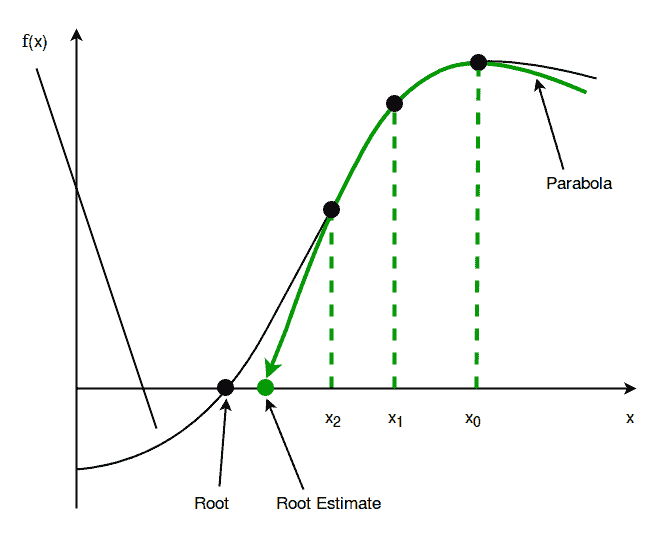
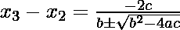

# 穆勒方法程序

> 原文:[https://www.geeksforgeeks.org/program-muller-method/](https://www.geeksforgeeks.org/program-muller-method/)

给定浮点数 x 上的函数 f(x)和函数根的三个不同的初始猜测，求函数的根。这里，f(x)可以是代数函数或超越函数。
**例:**

```
Input : A function f(x) = x + 2x + 10x - 20 

        and three initial guesses - 0, 1 and 2 .

Output : The value of the root is 1.3688 or 

         any other value within permittable deviation 

         from the root.         
Input : A function f(x) = x - 5x + 2 

        and three initial guesses - 0, 1 and 2 .

Output :The value of the root is 0.4021 or 

        any other value within permittable deviation 

        from the root. 
```

**穆勒法**

穆勒方法是一种求根算法，用于求 f(x)=0 形式的方程的根。它是由大卫·穆勒在 1956 年发现的。
从根的三个初始假设开始，然后通过这三个点构造一个抛物线，取 x 轴与抛物线的交点作为下一个近似。这个过程一直持续到找到具有所需精确度的根为止。

**为什么要学习穆勒方法？**

穆勒法，与二等分法、雷格拉-法尔西法、割线法、牛顿-拉夫森法并列为求根法之一。但是，它比这些方法有一些优势，如下所示–

1.  在穆勒方法中，收敛速度，即我们在每一步离根有多近，约为 1.84，而割线方法为 1.62，线性方法，即 Regula-falsi 方法和二等分方法均为 1。所以，**穆勒法比二分法、雷古拉-法尔西法和割线法更快。**
2.  虽然，它比牛顿-拉夫逊法慢，后者的收敛速度为 2，但它克服了牛顿-拉夫逊法最大的缺点之一，即每一步都要计算导数。

由此可见，穆勒方法是计算函数根的有效方法。

**算法及其工作**

1.  假设函数的任意三个不同的初始根，让它为 x <sub>0</sub> ，x <sub>1</sub> 和 x <sub>2</sub> 。

2.  现在，通过这些点的函数 f(x)的值画一个二次多项式，即抛物线–x<sub>0</sub>，x <sub>1</sub> 和 x <sub>2</sub> 。
    通过这些点的抛物线方程 p(x)如下-
    p(x)= c+b(x–x)+a(x–x)，其中 a、b、c 为常数。



2.  画出抛物线后，再求出这个抛物线与 x 轴的交点，我们说 x <sub>3</sub> 。

3.  **求抛物线与 x 轴的交点，即 x <sub>3</sub> :**
    *   求 p(x)的根 x ，其中 p(x)= c+b(x–x)+a(x–x)，使得 p(x)= c+b(x–x)+a(x–x)= 0，将二次公式应用于 p(x)。既然会有两个根，但我们要取那个更接近 x 的。为了避免由于减去附近的相等数字而导致的舍入误差，请使用以下等式:
        
        现在，由于 p(x)的根必须更接近 x ，因此我们必须从上述等式的两个可能值中取分母更大的值。
    *   要求上式的 a、b、c，把 x 放在 p(x)中作为 x 、x 和 x ，让这些值为 p(x )、p(x )和 p(x )，如下:-
        p(x)= c+b(x–x)+a(x–x)= f(x)。
        p(x)= c+b(x–x)+a(x–x)= f(x)。
        p(x)= c+b(x–x)+a(x–x)= c = f(x)。

    *   因此，我们有三个方程和三个变量——a，b，c。在求解它们以找出这些变量的值之后，我们得到以下 a，b 和 c 的值-

```
c = p(x) = f(x) .

b = (d*(h) - d*(h) ) / ( hh * (h - h)) .

a = (d*(h) - d*(h)) / ( hh * (h - h)).
```

*   其中，
    d= p(x)–p(x)= f(x)–f(x)
    d= p(x)–p(x)= f(x)–f(x)
    h= x–x
    h= x–xt29
*   现在，将这些值放入 x–x的表达式中，得到 x 。
    这就是 p(x) = x 的根是如何得到的。

1.  如果 x 在允许误差内非常接近 x ，则 x 成为 f(x)的根，否则，继续重复寻找下一个 x 的过程，将前一个 x 、x 和 x 作为新的 x 、x 和 x 。

## C++

```
// C++ Program to find root of a function, f(x)
#include<bits/stdc++.h>
using namespace std;

const int MAX_ITERATIONS = 10000;

// Function to calculate f(x)
float f(float x)
{
    // Taking f(x) = x ^ 3 + 2x ^ 2 + 10x - 20
    return 1*pow(x, 3) + 2*x*x + 10*x - 20;
}

void Muller(float a, float b, float c)
{
    int i;
    float res;

    for (i = 0;;++i)
    {
        // Calculating various constants required
        // to calculate x3
        float f1 = f(a);
        float f2 = f(b);
        float f3 = f(c);
        float d1 = f1 - f3;
        float d2 = f2 - f3;
        float h1 = a - c;
        float h2 = b - c;
        float a0 = f3;
        float a1 = (((d2*pow(h1, 2)) - (d1*pow(h2, 2)))
                    / ((h1*h2) * (h1-h2)));
        float a2 = (((d1*h2) - (d2*h1))/((h1*h2) * (h1-h2)));
        float x = ((-2*a0) / (a1 + abs(sqrt(a1*a1-4*a0*a2))));
        float y = ((-2*a0) / (a1-abs(sqrt(a1*a1-4*a0*a2))));

        // Taking the root which is closer to x2
        if (x >= y)
            res = x + c;
        else
            res = y + c;

        // checking for resemblance of x3 with x2 till
        // two decimal places
        float m = res*100;
        float n = c*100;
        m = floor(m);
        n = floor(n);
        if (m == n)
            break;
        a = b;
        b = c;
        c = res;
        if (i > MAX_ITERATIONS)
        {
            cout << "Root cannot be found using"
                 << " Muller's method";
            break;
        }
    }
    if (i <= MAX_ITERATIONS)
         cout << "The value of the root is " << res;
}

// Driver main function
int main()
{
    float a = 0, b = 1, c = 2;
    Muller(a, b, c);
    return 0;
}
```

## Java 语言(一种计算机语言，尤用于创建网站)

```
// Java Program to find root of a function, f(x)
import java.io.*;
import static java.lang.Math.*;

class Muller
{
    static final int MAX_ITERATIONS = 10000;

    // function to calculate f(x)
    static double f(double x)
    {
        // Taking f(x) = x ^ 3 + 2x ^ 2 + 10x - 20
        return 1*pow(x, 3) + 2*x*x + 10*x - 20;
    }

    static void Muller(double a, double b, double c)
    {
        int i;
        double res;

        for (i = 0;; ++i)
        {
            // Calculating various constants required
            // to calculate x3
            double f1 = f(a);
            double f2 = f(b);
            double f3 = f(c);
            double d1 = f1 - f3;
            double d2 = f2 - f3;
            double h1 = a - c;
            double h2 = b - c;
            double a0 = f3;
            double a1 = (((d2*pow(h1, 2)) - (d1*pow(h2, 2)))
                        / ((h1*h2) * (h1-h2)));
            double a2 = (((d1*h2) - (d2*h1))/((h1*h2) * (h1-h2)));
            double x = ((-2*a0)/(a1 + abs(sqrt(a1*a1-4*a0*a2))));
            double y = ((-2*a0)/(a1-abs(sqrt(a1*a1-4*a0*a2))));

            // Taking the root which is closer to x2
            if (x >= y)
                res = x + c;
            else
                res = y + c;

            // checking for resemblance of x3 with x2 till
            // two decimal places
            double m = res*100;
            double n = c*100;
            m = floor(m);
            n = floor(n);
            if (m == n)
                break;
            a = b;
            b = c;
            c = res;
            if (i > MAX_ITERATIONS)
            {
                System.out.println("Root cannot be found using" +
                                   " Muller's method");
                break;
            }
        }
        if (i <= MAX_ITERATIONS)
            System.out.println("The value of the root is " + res);
    }

    // Driver main function
    public static void main(String args[])
    {
        double a = 0, b = 1, c = 2;
        Muller(a, b, c);
    }
}
```

## 蟒蛇 3

```
# Python3 Program to find root of
# a function, f(x)
import math;

MAX_ITERATIONS = 10000;

# Function to calculate f(x)
def f(x):

    # Taking f(x) = x ^ 3 + 2x ^ 2 + 10x - 20
    return (1 * pow(x, 3) + 2 * x * x +
                           10 * x - 20);

def Muller(a, b, c):

    res = 0;
    i = 0;

    while (True):

        # Calculating various constants
        # required to calculate x3
        f1 = f(a); f2 = f(b); f3 = f(c);
        d1 = f1 - f3;
        d2 = f2 - f3;
        h1 = a - c;
        h2 = b - c;
        a0 = f3;
        a1 = (((d2 * pow(h1, 2)) -
               (d1 * pow(h2, 2))) /
              ((h1 * h2) * (h1 - h2)));
        a2 = (((d1 * h2) - (d2 * h1)) /
              ((h1 * h2) * (h1 - h2)));
        x = ((-2 * a0) / (a1 +
             abs(math.sqrt(a1 * a1 - 4 * a0 * a2))));
        y = ((-2 * a0) / (a1 -
            abs(math.sqrt(a1 * a1 - 4 * a0 * a2))));

        # Taking the root which is
        # closer to x2
        if (x >= y):
            res = x + c;
        else:
            res = y + c;

        # checking for resemblance of x3
        # with x2 till two decimal places
        m = res * 100;
        n = c * 100;
        m = math.floor(m);
        n = math.floor(n);
        if (m == n):
            break;
        a = b;
        b = c;
        c = res;
        if (i > MAX_ITERATIONS):
            print("Root cannot be found using",
                            "Muller's method");
            break;
        i += 1;
    if (i <= MAX_ITERATIONS):
        print("The value of the root is",
                          round(res, 4));

# Driver Code
a = 0;
b = 1;
c = 2;
Muller(a, b, c);

# This code is contributed by mits
```

## C#

```
// C# Program to find root of a function, f(x)
using System;

class Muller1
{
    static int MAX_ITERATIONS = 10000;

    // function to calculate f(x)
    static double f(double x)
    {
        // Taking f(x) = x ^ 3 + 2x ^ 2 + 10x - 20
        return 1*Math.Pow(x, 3) + 2*x*x + 10*x - 20;
    }

    static void Muller(double a, double b, double c)
    {
        int i;
        double res;

        for (i = 0;; ++i)
        {
            // Calculating various constants required
            // to calculate x3
            double f1 = f(a);
            double f2 = f(b);
            double f3 = f(c);
            double d1 = f1 - f3;
            double d2 = f2 - f3;
            double h1 = a - c;
            double h2 = b - c;
            double a0 = f3;
            double a1 = (((d2*Math.Pow(h1, 2)) - (d1*Math.Pow(h2, 2)))
                        / ((h1*h2) * (h1-h2)));
            double a2 = (((d1*h2) - (d2*h1))/((h1*h2) * (h1-h2)));
            double x = ((-2*a0)/(a1 + Math.Abs(Math.Sqrt(a1*a1-4*a0*a2))));
            double y = ((-2*a0)/(a1-Math.Abs(Math.Sqrt(a1*a1-4*a0*a2))));

            // Taking the root which is closer to x2
            if (x >= y)
                res = x + c;
            else
                res = y + c;

            // checking for resemblance of x3 with x2 till
            // two decimal places
            double m = res*100;
            double n = c*100;
            m = Math.Floor(m);
            n = Math.Floor(n);
            if (m == n)
                break;
            a = b;
            b = c;
            c = res;
            if (i > MAX_ITERATIONS)
            {
                Console.WriteLine("Root cannot be found using" +
                                " Muller's method");
                break;
            }
        }
        if (i <= MAX_ITERATIONS)
            Console.WriteLine("The value of the root is " + Math.Round(res,4));
    }

    // Driver main function
    static void Main()
    {
        double a = 0, b = 1, c = 2;
        Muller(a, b, c);
    }
}
// this code is contributed by mits
```

## 服务器端编程语言（Professional Hypertext Preprocessor 的缩写）

```
<?php
// PHP Program to find root of a function, f(x)

$MAX_ITERATIONS = 10000;

// Function to calculate f(x)
function f($x)
{
    // Taking f(x) = x ^ 3 + 2x ^ 2 + 10x - 20
    return 1*pow($x, 3) + 2*$x*$x + 10*$x - 20;
}

function Muller($a, $b, $c)
{
    global $MAX_ITERATIONS;
    $res=0;

    for ($i = 0;;++$i)
    {
        // Calculating various constants required
        // to calculate x3
        $f1 = f($a);
        $f2 = f($b);
        $f3 = f($c);
        $d1 = $f1 - $f3;
        $d2 = $f2 - $f3;
        $h1 = $a - $c;
        $h2 = $b - $c;
        $a0 = $f3;
        $a1 = ((($d2*pow($h1, 2)) - ($d1*pow($h2, 2)))
                    / (($h1*$h2) * ($h1-$h2)));
        $a2 = ((($d1*$h2) - ($d2*$h1))/(($h1*$h2) * ($h1-$h2)));
        $x = ((-2*$a0) / ($a1 + abs(sqrt($a1*$a1-4*$a0*$a2))));
        $y = ((-2*$a0) / ($a1-abs(sqrt($a1*$a1-4*$a0*$a2))));

        // Taking the root which is closer to x2
        if ($x >= $y)
            $res = $x + $c;
        else
            $res = $y + $c;

        // checking for resemblance of x3 with x2 till
        // two decimal places
        $m = $res*100;
        $n = $c*100;
        $m = floor($m);
        $n = floor($n);
        if ($m == $n)
            break;
        $a = $b;
        $b = $c;
        $c = $res;
        if ($i > $MAX_ITERATIONS)
        {
            echo"Root cannot be found using Muller's method";
            break;
        }
    }
    if ($i <= $MAX_ITERATIONS)
        echo "The value of the root is ".round($res,4);
}

// Driver main function

    $a = 0;
    $b = 1;
    $c = 2;
    Muller($a, $b, $c);

// This code is contributed by mits
?>
```

## java 描述语言

```
<script>
// JavaScript Program to find root of a function, f(x)

const MAX_ITERATIONS = 10000;

// Function to calculate f(x)
function f(x)
{
    // Taking f(x) = x ^ 3 + 2x ^ 2 + 10x - 20
    return 1*Math.pow(x, 3) + 2*x*x + 10*x - 20;
}

function Muller(a, b, c)
{
    let i;
    let res;

    for (i = 0;;++i)
    {
        // Calculating various constants required
        // to calculate x3
        let f1 = f(a);
        let f2 = f(b);
        let f3 = f(c);
        let d1 = f1 - f3;
        let d2 = f2 - f3;
        let h1 = a - c;
        let h2 = b - c;
        let a0 = f3;
        let a1 = (((d2*Math.pow(h1, 2)) - (d1*Math.pow(h2, 2)))
                    / ((h1*h2) * (h1-h2)));
        let a2 = (((d1*h2) - (d2*h1))/((h1*h2) * (h1-h2)));
        let x = ((-2*a0) / (a1 + Math.abs(Math.sqrt(a1*a1-4*a0*a2))));
        let y = ((-2*a0) / (a1-Math.abs(Math.sqrt(a1*a1-4*a0*a2))));

        // Taking the root which is closer to x2
        if (x >= y)
            res = x + c;
        else
            res = y + c;

        // checking for resemblance of x3 with x2 till
        // two decimal places
        let m = res*100;
        let n = c*100;
        m = Math.floor(m);
        n = Math.floor(n);
        if (m == n)
            break;
        a = b;
        b = c;
        c = res;
        if (i > MAX_ITERATIONS)
        {
            document.write("Root cannot be found using"
                + " Muller's method");
            break;
        }
    }
    if (i <= MAX_ITERATIONS)
        document.write("The value of the root is " + res.toFixed(4));
}

// Driver main function
    let a = 0, b = 1, c = 2;
    Muller(a, b, c);

// This code is contributed by Surbhi Tyagi.
</script>
```

**输出:**

```
The value of the root is 1.3688
```

**优势**T2】

*   可以找到想象的根。
*   不需要找衍生品。

**劣势**T2】

*   长时间用手做，出错的空间更大。
*   可以找到无关的根源。

**参考-**

1.  高等工程数学。

本文由**姆里根德拉·辛格**供稿。如果你喜欢 GeeksforGeeks 并想投稿，你也可以使用[contribute.geeksforgeeks.org](http://www.contribute.geeksforgeeks.org)写一篇文章或者把你的文章邮寄到 contribute@geeksforgeeks.org。看到你的文章出现在极客博客主页上，帮助其他极客。
如果你发现任何不正确的地方，或者你想分享更多关于上面讨论的话题的信息，请写评论。