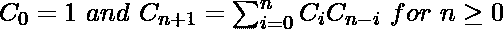
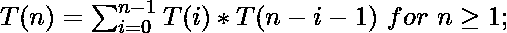
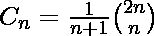
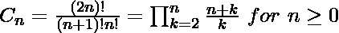

# 第 n 个加泰罗尼亚数字的程序

> 原文:[https://www.geeksforgeeks.org/program-nth-catalan-number/](https://www.geeksforgeeks.org/program-nth-catalan-number/)

加泰罗尼亚数字是一个自然数序列，它出现在许多有趣的计数问题中，比如下面的问题。

1.  计算包含正确匹配的 n 对括号的表达式的数量。对于 n = 3，可能的表达式是((()))，(())，()()，(())()，(()))。
2.  用 n 个键计算可能的二分搜索法树的数量(见[本](https://www.geeksforgeeks.org/g-fact-18/))
3.  计算有 n+1 片叶子的完全二叉树的数量(如果每个顶点有两个子树或者没有子树，则有根二叉树是完全的)。
4.  给定一个数 n，返回在一个有 2×n 个点的圆上画 n 个弦的方法数，这样就不会有 2 个弦相交。

更多应用见[本](https://www.geeksforgeeks.org/applications-of-catalan-numbers/)。
n = 0，1，2，3，…的前几个加泰罗尼亚数字是 **1，1，2，5，14，42，132，429，1430，4862，…**

**递归解**
加泰罗尼亚数字满足以下递归公式。



下面是上述递归公式的实现。

## C++

```
#include <iostream>
using namespace std;

// A recursive function to find nth catalan number
unsigned long int catalan(unsigned int n)
{
    // Base case
    if (n <= 1)
        return 1;

    // catalan(n) is sum of
    // catalan(i)*catalan(n-i-1)
    unsigned long int res = 0;
    for (int i = 0; i < n; i++)
        res += catalan(i)
            * catalan(n - i - 1);

    return res;
}

// Driver code
int main()
{
    for (int i = 0; i < 10; i++)
        cout << catalan(i) << " ";
    return 0;
}
```

## Java 语言(一种计算机语言，尤用于创建网站)

```
class CatalnNumber {

    // A recursive function to find nth catalan number

    int catalan(int n)
    {
        int res = 0;

        // Base case
        if (n <= 1)
        {
            return 1;
        }
        for (int i = 0; i < n; i++)
        {
            res += catalan(i)
                * catalan(n - i - 1);
        }
        return res;
    }

    // Driver Code
    public static void main(String[] args)
    {
        CatalnNumber cn = new CatalnNumber();
        for (int i = 0; i < 10; i++)
        {
            System.out.print(cn.catalan(i) + " ");
        }
    }
}
```

## 计算机编程语言

```
# A recursive function to
# find nth catalan number
def catalan(n):
    # Base Case
    if n <= 1:
        return 1

    # Catalan(n) is the sum
    # of catalan(i)*catalan(n-i-1)
    res = 0
    for i in range(n):
        res += catalan(i) * catalan(n-i-1)

    return res

# Driver Code
for i in range(10):
    print catalan(i),
# This code is contributed by
# Nikhil Kumar Singh (nickzuck_007)
```

## C#

```
// A recursive C# program to find
// nth catalan number
using System;

class GFG {

    // A recursive function to find
    // nth catalan number
    static int catalan(int n)
    {
        int res = 0;

        // Base case
        if (n <= 1)
        {
            return 1;
        }
        for (int i = 0; i < n; i++)
        {
            res += catalan(i)
                * catalan(n - i - 1);
        }
        return res;
    }

    // Driver Code
    public static void Main()
    {
        for (int i = 0; i < 10; i++)
            Console.Write(catalan(i) + " ");
    }
}

// This code is contributed by
// nitin mittal.
```

## 服务器端编程语言（Professional Hypertext Preprocessor 的缩写）

```
<?php
// PHP Program for nth
// Catalan Number

// A recursive function to
// find nth catalan number
function catalan($n)
{

    // Base case
    if ($n <= 1)
        return 1;

    // catalan(n) is sum of
    // catalan(i)*catalan(n-i-1)
    $res = 0;
    for($i = 0; $i < $n; $i++)
        $res += catalan($i) *
                catalan($n - $i - 1);

    return $res;
}

// Driver Code
for ($i = 0; $i < 10; $i++)
    echo catalan($i), " ";

// This code is contributed aj_36
?>
```

## java 描述语言

```
<script>

// Javascript Program for nth
// Catalan Number

// A recursive function to
// find nth catalan number
function catalan(n)
{

    // Base case
    if (n <= 1)
        return 1;

    // catalan(n) is sum of
    // catalan(i)*catalan(n-i-1)
    let res = 0;
    for(let i = 0; i < n; i++)
        res += catalan(i) *
                catalan(n - i - 1);

    return res;
}

// Driver Code
for (let i = 0; i < 10; i++)
    document.write(catalan(i) + " ");

// This code is contributed _saurabh_jaiswal

</script>
```

**Output**

```
1 1 2 5 14 42 132 429 1430 4862 
```

**上述实现的时间复杂度**相当于第 n 个加泰罗尼亚数字。



第 n 个加泰罗尼亚数字的值是指数的，这使得时间复杂度是指数的。

**动态规划解决方案**:我们可以观察到上面的递归实现做了很多重复的工作(我们通过绘制递归树也可以做到这一点)。由于有重叠的子问题，我们可以对此使用动态规划。下面是一个基于动态编程的实现。

## C++

```
#include <iostream>
using namespace std;

// A dynamic programming based function to find nth
// Catalan number
unsigned long int catalanDP(unsigned int n)
{
    // Table to store results of subproblems
    unsigned long int catalan[n + 1];

    // Initialize first two values in table
    catalan[0] = catalan[1] = 1;

    // Fill entries in catalan[] using recursive formula
    for (int i = 2; i <= n; i++) {
        catalan[i] = 0;
        for (int j = 0; j < i; j++)
            catalan[i] += catalan[j] * catalan[i - j - 1];
    }

    // Return last entry
    return catalan[n];
}

// Driver code
int main()
{
    for (int i = 0; i < 10; i++)
        cout << catalanDP(i) << " ";
    return 0;
}
```

## Java 语言(一种计算机语言，尤用于创建网站)

```
class GFG {

    // A dynamic programming based function to find nth
    // Catalan number
    static int catalanDP(int n)
    {
        // Table to store results of subproblems
        int catalan[] = new int[n + 2];

        // Initialize first two values in table
        catalan[0] = 1;
        catalan[1] = 1;

        // Fill entries in catalan[]
        // using recursive formula
        for (int i = 2; i <= n; i++) {
            catalan[i] = 0;
            for (int j = 0; j < i; j++) {
                catalan[i]
                    += catalan[j] * catalan[i - j - 1];
            }
        }

        // Return last entry
        return catalan[n];
    }

    // Driver code
    public static void main(String[] args)
    {
        for (int i = 0; i < 10; i++) {
            System.out.print(catalanDP(i) + " ");
        }
    }
}
// This code contributed by Rajput-Ji
```

## 蟒蛇 3

```
# A dynamic programming based function to find nth
# Catalan number

def catalan(n):
    if (n == 0 or n == 1):
        return 1

    # Table to store results of subproblems
    catalan =[0]*(n+1)

    # Initialize first two values in table
    catalan[0] = 1
    catalan[1] = 1

    # Fill entries in catalan[]
    # using recursive formula
    for i in range(2, n + 1):
        for j in range(i):
            catalan[i] += catalan[j]* catalan[i-j-1]

    # Return last entry
    return catalan[n]

# Driver code
for i in range(10):
    print(catalan(i), end=" ")
# This code is contributed by Ediga_manisha
```

## C#

```
using System;

class GFG {

    // A dynamic programming based
    // function to find nth
    // Catalan number
    static uint catalanDP(uint n)
    {
        // Table to store results of subproblems
        uint[] catalan = new uint[n + 2];

        // Initialize first two values in table
        catalan[0] = catalan[1] = 1;

        // Fill entries in catalan[]
        // using recursive formula
        for (uint i = 2; i <= n; i++) {
            catalan[i] = 0;
            for (uint j = 0; j < i; j++)
                catalan[i]
                    += catalan[j] * catalan[i - j - 1];
        }

        // Return last entry
        return catalan[n];
    }

    // Driver code
    static void Main()
    {
        for (uint i = 0; i < 10; i++)
            Console.Write(catalanDP(i) + " ");
    }
}

// This code is contributed by Chandan_jnu
```

## 服务器端编程语言（Professional Hypertext Preprocessor 的缩写）

```
<?php
// PHP program for nth Catalan Number

// A dynamic programming based function
// to find nth Catalan number
function catalanDP( $n)
{

    // Table to store results
    // of subproblems
    $catalan= array();

    // Initialize first two
    // values in table
    $catalan[0] = $catalan[1] = 1;

    // Fill entries in catalan[]
    // using recursive formula
    for ($i = 2; $i <= $n; $i++)
    {
        $catalan[$i] = 0;
        for ( $j = 0; $j < $i; $j++)
            $catalan[$i] += $catalan[$j] *
                   $catalan[$i - $j - 1];
    }

    // Return last entry
    return $catalan[$n];
}

    // Driver Code
    for ($i = 0; $i < 10; $i++)
        echo catalanDP($i) , " ";

// This code is contributed anuj_67.
?>
```

## java 描述语言

```
<script>
// Javascript program for nth Catalan Number

// A dynamic programming based function
// to find nth Catalan number
function catalanDP(n)
{

    // Table to store results
    // of subproblems
    let catalan= [];

    // Initialize first two
    // values in table
    catalan[0] = catalan[1] = 1;

    // Fill entries in catalan[]
    // using recursive formula
    for (let i = 2; i <= n; i++)
    {
        catalan[i] = 0;
        for (let j = 0; j < i; j++)
            catalan[i] += catalan[j] *
                   catalan[i - j - 1];
    }

    // Return last entry
    return catalan[n];
}

    // Driver Code
    for (let i = 0; i < 10; i++)
        document.write(catalanDP(i) + " ");

// This code is contributed _saurabh_jaiswal
</script>
```

**Output**

```
1 1 2 5 14 42 132 429 1430 4862 
```

**时间复杂度:**上述实现的时间复杂度为 O(n <sup>2</sup>

**利用二项式系数**
我们还可以用下面的公式求出 O(n)时间内的第 n 个加泰罗尼亚数。



我们讨论了一种 [O(n)的方法来求二项式系数 nCr](https://www.geeksforgeeks.org/space-and-time-efficient-binomial-coefficient/) 。

## C++

```
// C++ program for nth Catalan Number
#include <iostream>
using namespace std;

// Returns value of Binomial Coefficient C(n, k)
unsigned long int binomialCoeff(unsigned int n,
                                unsigned int k)
{
    unsigned long int res = 1;

    // Since C(n, k) = C(n, n-k)
    if (k > n - k)
        k = n - k;

    // Calculate value of [n*(n-1)*---*(n-k+1)] /
    // [k*(k-1)*---*1]
    for (int i = 0; i < k; ++i) {
        res *= (n - i);
        res /= (i + 1);
    }

    return res;
}

// A Binomial coefficient based function to find nth catalan
// number in O(n) time
unsigned long int catalan(unsigned int n)
{
    // Calculate value of 2nCn
    unsigned long int c = binomialCoeff(2 * n, n);

    // return 2nCn/(n+1)
    return c / (n + 1);
}

// Driver code
int main()
{
    for (int i = 0; i < 10; i++)
        cout << catalan(i) << " ";
    return 0;
}
```

## Java 语言(一种计算机语言，尤用于创建网站)

```
// Java program for nth Catalan Number

class GFG {

    // Returns value of Binomial Coefficient C(n, k)
    static long binomialCoeff(int n, int k)
    {
        long res = 1;

        // Since C(n, k) = C(n, n-k)
        if (k > n - k) {
            k = n - k;
        }

        // Calculate value of [n*(n-1)*---*(n-k+1)] /
        // [k*(k-1)*---*1]
        for (int i = 0; i < k; ++i) {
            res *= (n - i);
            res /= (i + 1);
        }

        return res;
    }

    // A Binomial coefficient based function
    //  to find nth catalan number in O(n) time
    static long catalan(int n)
    {
        // Calculate value of 2nCn
        long c = binomialCoeff(2 * n, n);

        // return 2nCn/(n+1)
        return c / (n + 1);
    }

    // Driver code
    public static void main(String[] args)
    {
        for (int i = 0; i < 10; i++) {
            System.out.print(catalan(i) + " ");
        }
    }
}
```

## 蟒蛇 3

```
# Python program for nth Catalan Number
# Returns value of Binomial Coefficient C(n, k)

def binomialCoefficient(n, k):

    # since C(n, k) = C(n, n - k)
    if (k > n - k):
        k = n - k

    # initialize result
    res = 1

    # Calculate value of [n * (n-1) *---* (n-k + 1)]
    # / [k * (k-1) *----* 1]
    for i in range(k):
        res = res * (n - i)
        res = res / (i + 1)
    return res

# A Binomial coefficient based function to
# find nth catalan number in O(n) time

def catalan(n):
    c = binomialCoefficient(2*n, n)
    return c/(n + 1)

# Driver Code
for i in range(10):
    print(catalan(i), end=" ")

# This code is contributed by Aditi Sharma
```

## C#

```
// C# program for nth Catalan Number
using System;
class GFG {

    // Returns value of Binomial Coefficient C(n, k)
    static long binomialCoeff(int n, int k)
    {
        long res = 1;

        // Since C(n, k) = C(n, n-k)
        if (k > n - k) {
            k = n - k;
        }

        // Calculate value of [n*(n-1)*---*(n-k+1)] /
        // [k*(k-1)*---*1]
        for (int i = 0; i < k; ++i) {
            res *= (n - i);
            res /= (i + 1);
        }

        return res;
    }

    // A Binomial coefficient based function to find nth
    // catalan number in O(n) time
    static long catalan(int n)
    {
        // Calculate value of 2nCn
        long c = binomialCoeff(2 * n, n);

        // return 2nCn/(n+1)
        return c / (n + 1);
    }

    // Driver code
    public static void Main()
    {
        for (int i = 0; i < 10; i++) {
            Console.Write(catalan(i) + " ");
        }
    }
}

// This code is contributed
// by Akanksha Rai
```

## 服务器端编程语言（Professional Hypertext Preprocessor 的缩写）

```
<?php
// PHP program for nth Catalan Number

// Returns value of Binomial
// Coefficient C(n, k)
function binomialCoeff($n, $k)
{
    $res = 1;

    // Since C(n, k) = C(n, n-k)
    if ($k > $n - $k)
        $k = $n - $k;

    // Calculate value of [n*(n-1)*---*(n-k+1)] /
    //                    [k*(k-1)*---*1]
    for ($i = 0; $i < $k; ++$i)
    {
        $res *= ($n - $i);
        $res = floor($res / ($i + 1));
    }

    return $res;
}

// A Binomial coefficient based function
// to find nth catalan number in O(n) time
function catalan($n)
{
    // Calculate value of 2nCn
    $c = binomialCoeff(2 * ($n), $n);

    // return 2nCn/(n+1)
    return floor($c / ($n + 1));
}

// Driver code
for ($i = 0; $i < 10; $i++)
echo catalan($i), " " ;

// This code is contributed by Ryuga
?>
```

## java 描述语言

```
<script>
// Javascript program for nth Catalan Number

// Returns value of Binomial
// Coefficient C(n, k)
function binomialCoeff(n, k)
{
    let res = 1;

    // Since C(n, k) = C(n, n-k)
    if (k > n - k)
        k = n - k;

    // Calculate value of [n*(n-1)*---*(n-k+1)] /
    //                    [k*(k-1)*---*1]
    for (let i = 0; i < k; ++i)
    {
        res *= (n - i);
        res = Math.floor(res / (i + 1));
    }

    return res;
}

// A Binomial coefficient based function
// to find nth catalan number in O(n) time
function catalan(n)
{

    // Calculate value of 2nCn
    c = binomialCoeff(2 * (n), n);

    // return 2nCn/(n+1)
    return Math.floor(c / (n + 1));
}

// Driver code
for (let i = 0; i < 10; i++)
document.write(catalan(i) + " " );

// This code is contributed by _saurabh_jaiswal
</script>
```

**Output**

```
1 1 2 5 14 42 132 429 1430 4862 
```

**时间复杂度:**上述实现的时间复杂度为 O(n)。
我们也可以用下面的公式求出 O(n)时间内的第 n 个加泰罗尼亚数。



**使用多精度库:**在该方法中，我们使用了 boost 多精度库，其使用背后的动机只是为了在找到大的加泰罗尼亚数的同时具有精度，以及使用 for 循环计算加泰罗尼亚数的通用技术。

> **例如:** N = 5
> 
> 最初设置 cat_=1，然后打印 cat_，
> 
> 然后，从 i = 1 迭代到 i < 5
> 
> 对于 I = 1；cat _ = cat _ *(4 * 1-2)= 1 * 2 = 2
> cat _ = cat _/(I+1)= 2/2 = 1
> 
> 对于 I = 2；cat _ = cat _ *(4 * 2-2)= 1 * 6 = 6
> cat _ = cat _/(I+1)= 6/3 = 2
> 
> 对于 I = 3:-cat _ = cat _ *(4 * 3-2)= 2 * 10 = 20
> cat _ = cat _/(I+1)= 20/4 = 5
> 
> 对于 I = 4:-cat _ = cat _ *(4 * 4-2)= 5 * 14 = 70
> cat _ = cat _/(I+1)= 70/5 = 14**T2】**

**伪代码:**

```
a) initially set cat_=1 and print it
b) run a for loop i=1 to i<=n
            cat_ *= (4*i-2)
            cat_ /= (i+1)
            print cat_
c) end loop and exit        
```

## C++

```
#include <bits/stdc++.h>
#include <boost/multiprecision/cpp_int.hpp>
using boost::multiprecision::cpp_int;
using namespace std;

// Function to print the number
void catalan(int n)
{
    cpp_int cat_ = 1;

    // For the first number
    cout << cat_ << " "; // C(0)

    // Iterate till N
    for (cpp_int i = 1; i <=n; i++)
    {
        // Calculate the number
        // and print it
        cat_ *= (4 * i - 2);
        cat_ /= (i + 1);
        cout << cat_ << " ";
    }
}

// Driver code
int main()
{
    int n = 5;

    // Function call
    catalan(n);
    return 0;
}
```

## Java 语言(一种计算机语言，尤用于创建网站)

```
import java.util.*;
class GFG
{

// Function to print the number
static void catalan(int n)
{
    int cat_ = 1;

    // For the first number
    System.out.print(cat_+" "); // C(0)

    // Iterate till N
    for (int i = 1; i < n; i++)
    {
        // Calculate the number
        // and print it
        cat_ *= (4 * i - 2);
        cat_ /= (i + 1);
        System.out.print(cat_+" ");
    }
}

// Driver code
public static void main(String args[])
{
    int n = 5;

    // Function call
    catalan(n);
}
}

// This code is contributed by Debojyoti Mandal
```

## 蟒蛇 3

```
# Function to print the number
def catalan(n):

    cat_ = 1

    # For the first number
    print(cat_, " ", end = '')# C(0)

    # Iterate till N
    for i in range(1, n):

        # Calculate the number
        # and print it
        cat_ *= (4 * i - 2);
        cat_ //= (i + 1);
        print(cat_, " ", end = '')

# Driver code
n = 5

# Function call
catalan(n)

# This code is contributed by rohan07
```

## C#

```
using System;

public class GFG {

    // Function to print the number
    static void catalan(int n) {
        int cat_ = 1;

        // For the first number
        Console.Write(cat_ + " "); // C(0)

        // Iterate till N
        for (int i = 1; i < n; i++) {
            // Calculate the number
            // and print it
            cat_ *= (4 * i - 2);
            cat_ /= (i + 1);
            Console.Write(cat_ + " ");
        }
    }

    // Driver code
    public static void Main(String []args) {
        int n = 5;

        // Function call
        catalan(n);
    }
}

// This code is contributed by Rajput-Ji
```

## java 描述语言

```
<script>

// Function to print the number
function catalan(n)
{
    let cat_ = 1;

    // For the first number
    document.write(cat_ + " "); // C(0)

    // Iterate till N
    for (let i = 1; i < n; i++)
    {
        // Calculate the number
        // and print it
        cat_ *= (4 * i - 2);
        cat_ /= (i + 1);
        document.write(cat_ + " ");
    }
}

// Driver code
    let n = 5;

    // Function call
    catalan(n);

//This code is contributed by Mayank Tyagi
</script>
```

**Output**

```
1 1 2 5 14 
```

**时间复杂度:**O(n)
T3】辅助空间: O(1)

**在 java 中使用 BigInteger 的另一个解决方案:**

*   即使在 java 中使用 long，也不可能找到 N>80 的加泰罗尼亚数字的值，所以我们使用 BigInteger
*   这里，我们使用上述二项式系数法找到解决方案

## Java 语言(一种计算机语言，尤用于创建网站)

```
import java.io.*;
import java.util.*;
import java.math.*;

class GFG
{
    public static BigInteger findCatalan(int n)
    {
        // using BigInteger to calculate large factorials
        BigInteger b = new BigInteger("1");

        // calculating n!
        for (int i = 1; i <= n; i++) {
            b = b.multiply(BigInteger.valueOf(i));
        }

        // calculating n! * n!
        b = b.multiply(b);

        BigInteger d = new BigInteger("1");

        // calculating (2n)!
        for (int i = 1; i <= 2 * n; i++) {
            d = d.multiply(BigInteger.valueOf(i));
        }

        // calculating (2n)! / (n! * n!)
        BigInteger ans = d.divide(b);

        // calculating (2n)! / ((n! * n!) * (n+1))
        ans = ans.divide(BigInteger.valueOf(n + 1));
        return ans;
    }

    // Driver Code
    public static void main(String[] args)
    {
        int n = 5;
        System.out.println(findCatalan(n));
    }
}
// Contributed by Rohit Oberoi
```

**Output**

```
42
```

**参考文献:**
[【http://en.wikipedia.org/wiki/Catalan_number】](http://en.wikipedia.org/wiki/Catalan_number)
如发现有不正确的地方，请写评论，或者想分享以上讨论话题的更多信息