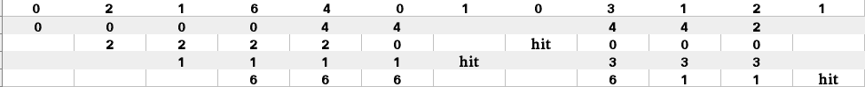

# 页面替换算法程序|集合 2(先进先出)

> 原文:[https://www . geesforgeks . org/program-page-replacement-algorithms-set-2-FIFO/](https://www.geeksforgeeks.org/program-page-replacement-algorithms-set-2-fifo/)

先决条件:[页面替换算法](https://www.geeksforgeeks.org/operating-system-page-replacement-algorithm/)

在使用分页进行内存管理的操作系统中，需要页面替换算法来决定新页面进入时需要替换哪个页面。每当一个新页面被引用并且不在内存中时，就会发生页面错误，操作系统会用新需要的页面替换一个现有页面。不同的页面替换算法建议不同的方法来决定替换哪个页面。所有算法的目标都是减少页面错误的数量。

**先进先出(FIFO)页面替换算法–**
这是最简单的页面替换算法。在这种算法中，操作系统跟踪队列中内存的所有页面，最旧的页面在队列的前面。当一个页面需要被替换时，队列前面的页面被选择删除。

**例-1。**考虑页面引用字符串 1、3、0、3、5、6 和 3 个页面槽。

最初，所有插槽都是空的，因此当 1、3、0 出现时，它们被分配给空插槽—> 3 **页面错误。**
当 3 来临时，它已经在内存中了所以——>0 页面错误。
然后是 5，它在内存中不可用，所以它会替换最旧的页槽，即 1。— > 1 **页面错误。**
最后 6 来了，它在内存中也不可用，所以它取代了最旧的页槽，即 3 — > 1 **页故障。**

所以总页面错误数= **5** 。

**例-2。**考虑以下引用字符串:0，2，1，6，4，0，1，0，3，1，2，1。

使用先进先出页面替换算法–


因此，页面错误总数= 9。

给定内存容量(可以容纳的页数)和一个表示要引用的页面的字符串，编写一个函数来查找页面错误的数量。

**实现–**让容量成为内存可以容纳的页数。让 set 成为内存中的当前页面集。

```
1- Start traversing the pages.
 i) If set holds less pages than capacity.
   a) Insert page into the set one by one until 
      the size  of set reaches capacity or all
      page requests are processed.
   b) Simultaneously maintain the pages in the
      queue to perform FIFO.
   c) Increment page fault
 ii) Else 
   If current page is present in set, do nothing.
   Else 
     a) Remove the first page from the queue
        as it was the first to be entered in
        the memory
     b) Replace the first page in the queue with 
        the current page in the string.
     c) Store current page in the queue.
     d) Increment page faults.

2\. Return page faults.

```

## C++

```
// C++ implementation of FIFO page replacement
// in Operating Systems.
#include<bits/stdc++.h>
using namespace std;

// Function to find page faults using FIFO
int pageFaults(int pages[], int n, int capacity)
{
    // To represent set of current pages. We use
    // an unordered_set so that we quickly check
    // if a page is present in set or not
    unordered_set<int> s;

    // To store the pages in FIFO manner
    queue<int> indexes;

    // Start from initial page
    int page_faults = 0;
    for (int i=0; i<n; i++)
    {
        // Check if the set can hold more pages
        if (s.size() < capacity)
        {
            // Insert it into set if not present
            // already which represents page fault
            if (s.find(pages[i])==s.end())
            {
                // Insert the current page into the set
                s.insert(pages[i]);

                // increment page fault
                page_faults++;

                // Push the current page into the queue
                indexes.push(pages[i]);
            }
        }

        // If the set is full then need to perform FIFO
        // i.e. remove the first page of the queue from
        // set and queue both and insert the current page
        else
        {
            // Check if current page is not already
            // present in the set
            if (s.find(pages[i]) == s.end())
            {
                // Store the first page in the 
                // queue to be used to find and
                // erase the page from the set
                int val = indexes.front();

                // Pop the first page from the queue
                indexes.pop();

                // Remove the indexes page from the set
                s.erase(val);

                // insert the current page in the set
                s.insert(pages[i]);

                // push the current page into
                // the queue
                indexes.push(pages[i]);

                // Increment page faults
                page_faults++;
            }
        }
    }

    return page_faults;
}

// Driver code
int main()
{
    int pages[] = {7, 0, 1, 2, 0, 3, 0, 4,
                   2, 3, 0, 3, 2};
    int n = sizeof(pages)/sizeof(pages[0]);
    int capacity = 4;
    cout << pageFaults(pages, n, capacity);
    return 0;
}
```

## Java 语言(一种计算机语言，尤用于创建网站)

```
// Java implementation of FIFO page replacement
// in Operating Systems.

import java.util.HashSet;
import java.util.LinkedList;
import java.util.Queue;

class Test
{
    // Method to find page faults using FIFO
    static int pageFaults(int pages[], int n, int capacity)
    {
        // To represent set of current pages. We use
        // an unordered_set so that we quickly check
        // if a page is present in set or not
        HashSet<Integer> s = new HashSet<>(capacity);

        // To store the pages in FIFO manner
        Queue<Integer> indexes = new LinkedList<>() ;

        // Start from initial page
        int page_faults = 0;
        for (int i=0; i<n; i++)
        {
            // Check if the set can hold more pages
            if (s.size() < capacity)
            {
                // Insert it into set if not present
                // already which represents page fault
                if (!s.contains(pages[i]))
                {
                    s.add(pages[i]);

                    // increment page fault
                    page_faults++;

                    // Push the current page into the queue
                    indexes.add(pages[i]);
                }
            }

            // If the set is full then need to perform FIFO
            // i.e. remove the first page of the queue from
            // set and queue both and insert the current page
            else
            {
                // Check if current page is not already
                // present in the set
                if (!s.contains(pages[i]))
                {
                    //Pop the first page from the queue
                    int val = indexes.peek();

                    indexes.poll();

                    // Remove the indexes page
                    s.remove(val);

                    // insert the current page
                    s.add(pages[i]);

                    // push the current page into
                    // the queue
                    indexes.add(pages[i]);

                    // Increment page faults
                    page_faults++;
                }
            }
        }

        return page_faults;
    }

    // Driver method
    public static void main(String args[])
    {
        int pages[] = {7, 0, 1, 2, 0, 3, 0, 4,
                        2, 3, 0, 3, 2};

        int capacity = 4;
        System.out.println(pageFaults(pages, pages.length, capacity));
    }
}
// This code is contributed by Gaurav Miglani
```

## 蟒蛇 3

```
# Python3 implementation of FIFO page
# replacement in Operating Systems.
from queue import Queue 

# Function to find page faults using FIFO 
def pageFaults(pages, n, capacity):

    # To represent set of current pages. 
    # We use an unordered_set so that we
    # quickly check if a page is present
    # in set or not 
    s = set() 

    # To store the pages in FIFO manner 
    indexes = Queue() 

    # Start from initial page 
    page_faults = 0
    for i in range(n):

        # Check if the set can hold 
        # more pages 
        if (len(s) < capacity):

            # Insert it into set if not present 
            # already which represents page fault 
            if (pages[i] not in s):
                s.add(pages[i]) 

                # increment page fault 
                page_faults += 1

                # Push the current page into
                # the queue 
                indexes.put(pages[i])

        # If the set is full then need to perform FIFO 
        # i.e. remove the first page of the queue from 
        # set and queue both and insert the current page 
        else:

            # Check if current page is not 
            # already present in the set 
            if (pages[i] not in s):

                # Pop the first page from the queue 
                val = indexes.queue[0] 

                indexes.get() 

                # Remove the indexes page 
                s.remove(val) 

                # insert the current page 
                s.add(pages[i]) 

                # push the current page into 
                # the queue 
                indexes.put(pages[i]) 

                # Increment page faults 
                page_faults += 1

    return page_faults

# Driver code 
if __name__ == '__main__':
    pages = [7, 0, 1, 2, 0, 3, 0, 
                4, 2, 3, 0, 3, 2] 
    n = len(pages) 
    capacity = 4
    print(pageFaults(pages, n, capacity))

# This code is contributed by PranchalK
```

## C#

```
// C# implementation of FIFO page replacement 
// in Operating Systems. 
using System;
using System.Collections;
using System.Collections.Generic; 

class Test 
{ 
    // Method to find page faults using FIFO 
    static int pageFaults(int []pages, int n, int capacity) 
    { 
        // To represent set of current pages. We use 
        // an unordered_set so that we quickly check 
        // if a page is present in set or not 
        HashSet<int> s = new HashSet<int>(capacity); 

        // To store the pages in FIFO manner 
        Queue indexes = new Queue() ; 

        // Start from initial page 
        int page_faults = 0; 
        for (int i = 0; i < n; i++) 
        { 
            // Check if the set can hold more pages 
            if (s.Count < capacity) 
            { 
                // Insert it into set if not present 
                // already which represents page fault 
                if (!s.Contains(pages[i])) 
                { 
                    s.Add(pages[i]); 

                    // increment page fault 
                    page_faults++; 

                    // Push the current page into the queue 
                    indexes.Enqueue(pages[i]); 
                } 
            } 

            // If the set is full then need to perform FIFO 
            // i.e. Remove the first page of the queue from 
            // set and queue both and insert the current page 
            else
            { 
                // Check if current page is not already 
                // present in the set 
                if (!s.Contains(pages[i])) 
                { 
                    //Pop the first page from the queue 
                    int val = (int)indexes.Peek(); 

                    indexes.Dequeue(); 

                    // Remove the indexes page 
                    s.Remove(val); 

                    // insert the current page 
                    s.Add(pages[i]); 

                    // push the current page into 
                    // the queue 
                    indexes.Enqueue(pages[i]); 

                    // Increment page faults 
                    page_faults++; 
                } 
            } 
        } 

        return page_faults; 
    } 

    // Driver method 
    public static void Main(String []args) 
    { 
        int []pages = {7, 0, 1, 2, 0, 3, 0, 4, 
                        2, 3, 0, 3, 2}; 

        int capacity = 4; 
        Console.Write(pageFaults(pages, pages.Length, capacity)); 
    } 
} 

// This code is contributed by Arnab Kundu
```

**输出:**

```
7

```

**注–**我们还可以找到页面点击量。只需要保持一个单独的计数。如果当前页面已经在内存中，那么这必须算作页面命中。

**Belady 的异常–**
Belady 的异常证明了在使用先进先出(FIFO)页面替换算法的同时增加页面帧数时，有可能出现更多的页面错误。例如，如果我们考虑引用字符串 3、2、1、0、3、2、4、3、2、1、0、4 和 3 个槽，我们总共得到 9 个页面错误，但是如果我们将槽增加到 4 个，我们得到 10 个页面错误。

本文由 **[萨哈布拉](https://www.facebook.com/sahil.chhabra.965)** 供稿。如果你喜欢 GeeksforGeeks 并想投稿，你也可以使用[contribute.geeksforgeeks.org](http://www.contribute.geeksforgeeks.org)写一篇文章或者把你的文章邮寄到 contribute@geeksforgeeks.org。看到你的文章出现在极客博客主页上，帮助其他极客。

如果你发现任何不正确的地方，或者你想分享更多关于上面讨论的话题的信息，请写评论。